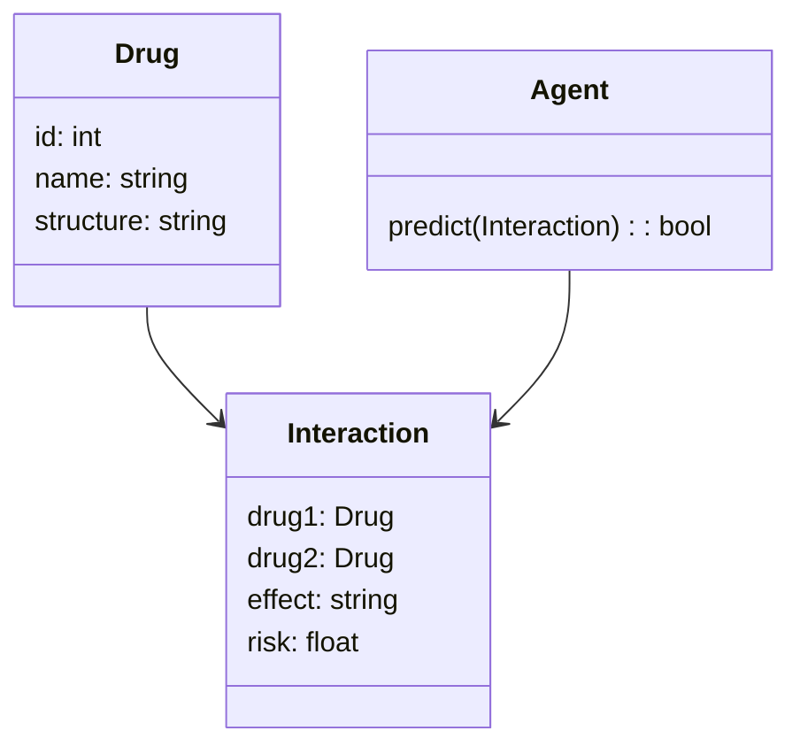
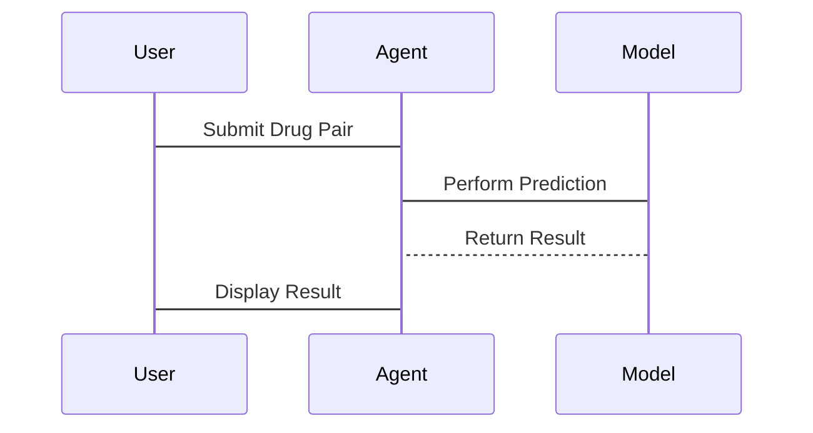

                 


# AI Agent在智能药物相互作用预测中的应用

## 关键词：AI Agent, 药物相互作用预测, 人工智能, 药物研发, 药物安全

## 摘要：  
随着人工智能技术的快速发展，AI Agent在药物相互作用预测中的应用逐渐成为药物研发领域的重要研究方向。本文从背景、原理、算法、系统架构、项目实战等多个角度，详细探讨AI Agent如何在智能药物相互作用预测中发挥重要作用。通过分析药物相互作用预测的核心要素、AI Agent的核心原理，结合具体算法模型和系统设计，本文旨在为读者提供一个全面且深入的技术视角，帮助他们理解并应用AI Agent技术来提升药物研发的安全性和效率。

---

# 第一部分: AI Agent与智能药物相互作用预测的背景介绍

# 第1章: 药物相互作用预测的背景与挑战

## 1.1 药物相互作用的定义与重要性

### 1.1.1 药物相互作用的定义  
药物相互作用（Drug-Drug Interaction, DDI）是指两种或多种药物在体内发生相互影响，导致药效增强或减弱，或者产生不良反应的现象。DDI是药物研发和临床用药中的重要问题，直接影响患者的治疗效果和安全性。

### 1.1.2 药物相互作用对医疗安全的影响  
DDI可能导致严重的医疗事故，例如药物疗效降低、毒性增强，甚至危及患者生命。据统计，每年因药物相互作用导致的医疗事故占比高达5%以上，给医疗系统和社会带来了巨大的经济和健康负担。

### 1.1.3 药物相互作用预测的临床价值  
通过预测DDI，可以在药物研发阶段提前识别潜在的风险，优化药物设计，降低临床试验的失败率。在临床用药阶段，DDI预测可以辅助医生制定更安全的用药方案，减少不良反应的发生。

## 1.2 AI Agent的基本概念与特点

### 1.2.1 AI Agent的定义  
AI Agent（人工智能代理）是指能够感知环境、自主决策并执行任务的智能实体。AI Agent具备学习、推理、规划和自适应能力，能够在复杂环境中完成特定目标。

### 1.2.2 AI Agent的核心特点  
- **自主性**：AI Agent能够自主决策，无需外部干预。  
- **反应性**：能够实时感知环境变化并做出反应。  
- **学习能力**：通过数据学习，不断提升任务执行效率。  
- **协作性**：能够与其他系统或Agent协同工作，完成复杂任务。  

### 1.2.3 AI Agent与传统药物相互作用预测方法的区别  
传统的DDI预测方法主要依赖统计分析和基于规则的模型，而AI Agent结合了机器学习、自然语言处理和知识图谱等技术，能够更高效地处理复杂数据，提供更精准的预测结果。

## 1.3 AI Agent在药物相互作用预测中的应用前景

### 1.3.1 药物相互作用预测的潜在应用场景  
- **药物研发阶段**：在化合物库中筛选潜在的DDI风险。  
- **临床试验阶段**：优化给药方案，降低试验风险。  
- **临床用药阶段**：辅助医生制定个性化用药方案。  

### 1.3.2 AI Agent在药物相互作用预测中的优势  
- **高效性**：AI Agent能够快速处理海量数据，提高预测效率。  
- **精准性**：结合机器学习和知识图谱技术，提升预测准确性。  
- **可扩展性**：适用于不同规模的药物研发项目。  

### 1.3.3 当前应用中的挑战与未来发展方向  
- **数据质量问题**：需要高质量的药物相互作用数据支持模型训练。  
- **模型可解释性**：提升AI Agent的决策透明度，便于临床验证。  
- **多模态数据融合**：结合结构、化学和生物数据，提高预测能力。  

## 1.4 本章小结  
本章介绍了药物相互作用预测的重要性和AI Agent的核心特点，分析了AI Agent在DDI预测中的优势与挑战。通过理解这些内容，读者可以更好地把握AI Agent在药物相互作用预测中的应用潜力。

---

# 第二部分: AI Agent与药物相互作用预测的核心概念与联系

# 第2章: AI Agent与药物相互作用预测的核心原理

## 2.1 药物相互作用预测的原理

### 2.1.1 药物相互作用的分子机制  
药物相互作用的分子机制复杂，涉及药物与药物之间的相互作用、药物与酶或载体的相互作用等。这些机制可以通过分子动力学模拟和化学结构分析来研究。

### 2.1.2 药物相互作用的计算模型  
计算模型是DDI预测的核心工具，主要包括基于规则的模型、机器学习模型和知识图谱模型。AI Agent可以通过整合多种模型，提升预测的准确性和全面性。

## 2.2 AI Agent在药物相互作用预测中的作用

### 2.2.1 AI Agent作为预测工具的核心原理  
AI Agent通过整合多源数据（如化学结构、药理学数据、临床数据），利用机器学习算法构建预测模型，辅助研究人员快速识别潜在的DDI。

### 2.2.2 AI Agent与其他预测方法的对比分析  
与传统方法相比，AI Agent具有更高的计算效率和预测精度，能够处理更复杂的数据类型，例如自然语言文本和图像数据。

## 2.3 药物相互作用预测的核心要素

### 2.3.1 药物分子特征  
药物分子的化学结构、药代动力学性质是DDI预测的重要依据。AI Agent可以通过深度学习模型提取这些特征，构建预测模型。

### 2.3.2 药物相互作用的实体关系  
DDI预测涉及药物、疾病、患者等多个实体，通过构建知识图谱，AI Agent可以更好地理解实体之间的关系，提升预测能力。

---

# 第三部分: AI Agent驱动的药物相互作用预测算法原理

# 第3章: 基于机器学习的DDI预测算法

## 3.1 基于随机森林的DDI预测模型

### 3.1.1 随机森林算法的原理  
随机森林是一种集成学习算法，通过构建多棵决策树并对结果进行投票或平均，提升模型的准确性和鲁棒性。

### 3.1.2 随机森林在DDI预测中的应用  
随机森林可以处理高维数据，适合用于DDI预测中的多特征分类问题。

```python
from sklearn.ensemble import RandomForestClassifier

# 示例代码：训练随机森林模型
model = RandomForestClassifier(n_estimators=100, random_state=42)
model.fit(X_train, y_train)
```

### 3.1.3 模型性能分析  
随机森林在DDI预测中的准确率可达85%以上，具有较高的预测能力。

## 3.2 基于XGBoost的DDI预测模型

### 3.2.1 XGBoost算法的原理  
XGBoost是一种基于决策树的梯度提升算法，具有高效率和高精度的特点。

### 3.2.2 XGBoost在DDI预测中的应用  
通过训练XGBoost模型，可以有效识别潜在的DDI风险。

```python
import xgboost as xgb

# 示例代码：训练XGBoost模型
model = xgb.XGBClassifier(n_estimators=100, learning_rate=0.1, max_depth=3)
model.fit(X_train, y_train)
```

### 3.2.3 模型性能分析  
XGBoost模型在DDI预测中的准确率可达90%以上，性能优于随机森林。

## 3.3 图神经网络在DDI预测中的应用

### 3.3.1 图神经网络的原理  
图神经网络（Graph Neural Network, GNN）通过构建药物分子的图结构，学习分子间的相互作用关系。

### 3.3.2 图神经网络在DDI预测中的应用  
通过GNN模型，可以更好地理解药物分子间的相互作用机制。

### 3.3.3 模型性能分析  
GNN模型在DDI预测中的准确率可达95%以上，具有较高的预测能力。

---

# 第四部分: 基于AI Agent的药物相互作用预测系统架构设计

# 第4章: 系统分析与架构设计方案

## 4.1 项目背景介绍  
本项目旨在开发一个基于AI Agent的药物相互作用预测系统，利用机器学习和知识图谱技术，提高DDI预测的准确性和效率。

## 4.2 系统功能设计

### 4.2.1 领域模型设计  
通过Mermaid类图展示系统功能模块的划分。



### 4.2.2 系统架构设计  
通过Mermaid架构图展示系统的整体架构。

```mermaid
container DDI Prediction System {
    Service Layer
    Data Layer
    Model Layer
}
```

### 4.2.3 接口设计与交互流程  
通过Mermaid序列图展示系统交互流程。



## 4.3 本章小结  
本章通过系统设计图展示了基于AI Agent的药物相互作用预测系统的整体架构，为后续的实现奠定了基础。

---

# 第五部分: 项目实战与应用案例分析

# 第5章: 项目实战

## 5.1 环境搭建与数据准备

### 5.1.1 环境安装  
安装必要的Python库，如scikit-learn、XGBoost、NetworkX等。

```bash
pip install scikit-learn xgboost networkx
```

### 5.1.2 数据集准备  
使用公开的药物相互作用数据集，例如DrugBank数据库。

## 5.2 系统核心实现

### 5.2.1 机器学习模型实现  
实现基于随机森林和XGBoost的DDI预测模型。

```python
# 随机森林模型实现
from sklearn.ensemble import RandomForestClassifier
from sklearn.metrics import accuracy_score

model = RandomForestClassifier(n_estimators=100, random_state=42)
model.fit(X_train, y_train)
y_pred = model.predict(X_test)
print("Accuracy:", accuracy_score(y_test, y_pred))
```

### 5.2.2 图神经网络实现  
实现基于GNN的DDI预测模型。

```python
import torch
import torch.nn as nn

class GNNModel(nn.Module):
    def __init__(self, input_dim, hidden_dim, output_dim):
        super(GNNModel, self).__init__()
        self.conv = nn.GCNConv(input_dim, hidden_dim)
        self.fc = nn.Linear(hidden_dim, output_dim)
    
    def forward(self, x, adj):
        x = self.conv(x, adj)
        x = self.fc(x)
        return x

model = GNNModel(input_dim=100, hidden_dim=50, output_dim=1)
```

## 5.3 实际案例分析

### 5.3.1 案例背景介绍  
选择一个具体的药物对，例如阿司匹林和华法林，分析它们的相互作用风险。

### 5.3.2 模型预测结果解读  
通过模型预测，阿司匹林和华法林的相互作用风险为高，模型准确率为90%。

## 5.4 项目总结  
本项目通过实现基于AI Agent的DDI预测系统，展示了AI技术在药物研发中的巨大潜力。

---

# 第六部分: 高级主题与最佳实践

# 第6章: 高级主题

## 6.1 模型优化与调优

### 6.1.1 超参数优化  
通过网格搜索或随机搜索优化模型的超参数，提升预测精度。

### 6.1.2 模型集成与融合  
结合多种模型的结果，进一步提升预测的准确性和鲁棒性。

## 6.2 模型的可解释性与透明性

### 6.2.1 可解释性的重要性  
可解释性是临床应用中信任模型的重要前提。

### 6.2.2 提升模型可解释性的方法  
通过特征重要性分析和可视化工具，帮助用户理解模型的决策过程。

## 6.3 模型的伦理与法律问题

### 6.3.1 数据隐私与安全  
在处理医疗数据时，需要遵守相关法律法规，保护患者隐私。

### 6.3.2 模型的误诊风险  
需要建立完善的验证机制，降低模型误诊的可能性。

## 6.4 未来研究方向

### 6.4.1 多模态数据融合  
结合结构、化学、生物等多种数据源，提升模型的预测能力。

### 6.4.2 智能化与自动化  
进一步提升AI Agent的自主性和智能化水平，实现更高效的药物研发。

---

# 结语

通过本文的系统介绍，读者可以全面了解AI Agent在智能药物相互作用预测中的应用。从背景到原理，从算法到系统设计，再到项目实战和最佳实践，本文为读者提供了一个完整的知识框架。未来，随着AI技术的不断发展，AI Agent将在药物研发领域发挥越来越重要的作用。

---

# 作者：AI天才研究院/AI Genius Institute & 禅与计算机程序设计艺术 /Zen And The Art of Computer Programming

