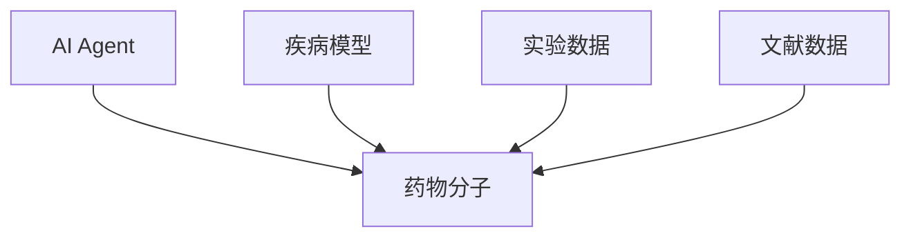
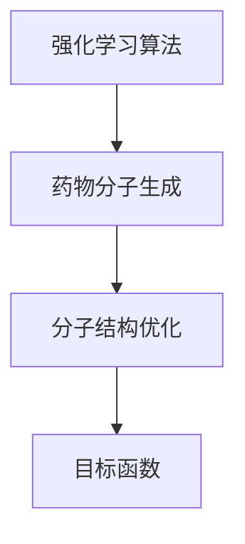
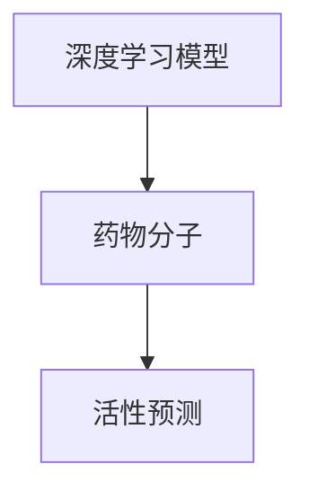
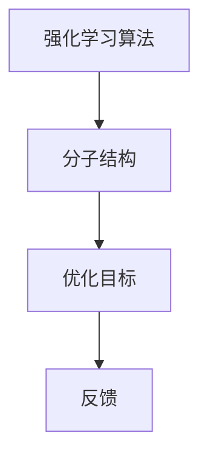

                 

# AI Agent在智能药物研发中的角色

> 关键词：AI Agent, 智能药物研发, 人工智能, 药物发现, 临床试验

> 摘要：本文探讨AI Agent在智能药物研发中的角色，分析其在药物发现、优化和临床试验中的应用，阐述其算法原理和系统架构设计，并通过实际案例展示其在加速药物研发进程中的潜力。

---

## 第1章: AI Agent的基本概念与药物研发背景

### 1.1 AI Agent的定义与核心概念

AI Agent（人工智能代理）是一种能够感知环境、自主决策并执行任务的智能体。它具备以下核心特征：
- **自主性**：能够在没有外部干预的情况下运行。
- **反应性**：能够实时感知环境并做出反应。
- **目标导向**：以特定目标为导向，优化决策过程。
- **学习能力**：通过数据和经验不断优化自身的算法。

AI Agent与传统AI的区别在于其具备更强的自主决策能力和目标导向性。

### 1.2 药物研发的基本流程

药物研发通常分为三大阶段：
1. **药物发现**：寻找潜在的药物分子并验证其活性。
2. **药物优化**：优化药物分子的药代动力学和药效学特性。
3. **临床试验**：通过临床试验验证药物的安全性和有效性。

传统药物研发面临周期长、成本高、成功率低的痛点。AI Agent的应用为解决这些问题提供了新的可能性。

### 1.3 AI Agent在药物研发中的角色定位

AI Agent在药物研发中的主要应用场景包括：
- **分子设计**：通过AI生成潜在药物分子并优化其结构。
- **药物筛选**：利用AI快速筛选候选药物并预测其活性。
- **临床试验设计**：优化临床试验方案并预测试验结果。

---

## 第2章: AI Agent的核心概念与原理

### 2.1 AI Agent的核心概念

AI Agent在药物研发中的核心概念包括：
- **知识表示与推理**：通过知识图谱表示药物分子、疾病模型等信息，并利用推理技术推导潜在药物。
- **多目标优化**：在药物研发中，通常需要同时优化多个目标（如药效、毒性等），AI Agent能够通过强化学习实现多目标优化。
- **强化学习与决策**：AI Agent通过强化学习在药物研发中做出最优决策。

### 2.2 AI Agent的算法原理

AI Agent的算法原理主要包括：
- **基于强化学习的AI Agent**：通过与环境交互，学习最优策略以实现目标。
- **基于知识图谱的推理机制**：利用知识图谱进行推理，推导潜在药物分子。
- **多模态数据融合技术**：整合药物分子、实验数据和文献数据等多种数据源，提升AI Agent的决策能力。

### 2.3 AI Agent在药物研发中的实体关系图

---

## 第3章: AI Agent在药物发现中的应用

### 3.1 基于AI Agent的分子设计

#### 3.1.1 药物分子生成的算法流程

药物分子生成的算法流程如下：
1. **输入目标**：输入药物研发的目标（如治疗某种疾病）。
2. **生成分子**：通过生成模型生成潜在药物分子。
3. **优化分子**：通过强化学习优化分子结构以提高药效。

#### 3.1.2 基于强化学习的分子生成模型

基于强化学习的分子生成模型通过与环境交互，学习生成最优分子结构。其算法流程如下：

#### 3.1.3 分子生成的案例分析

以治疗癌症为例，AI Agent通过生成模型生成多种潜在抗癌药物分子，并通过优化算法选择最优分子进行实验验证。

### 3.2 基于AI Agent的药物筛选

#### 3.2.1 药物筛选的基本原理

药物筛选的基本原理是通过实验或计算方法评估候选药物分子的活性。AI Agent能够通过虚拟筛选技术快速筛选出潜在药物分子。

#### 3.2.2 基于深度学习的虚拟筛选

基于深度学习的虚拟筛选技术通过训练深度学习模型，预测候选药物分子的活性。其算法流程如下：

#### 3.2.3 实验数据与AI Agent的结合

AI Agent能够整合实验数据和文献数据，提升药物筛选的准确性和效率。

---

## 第4章: AI Agent在药物优化中的应用

### 4.1 基于AI Agent的结构优化

#### 4.1.1 分子优化的目标与挑战

分子优化的目标是优化药物分子的药代动力学和药效学特性。其挑战在于需要平衡多个目标，如药效、毒性和稳定性。

#### 4.1.2 基于强化学习的分子优化算法

基于强化学习的分子优化算法通过与环境交互，学习最优分子结构。其算法流程如下：

#### 4.1.3 实验验证与反馈机制

AI Agent通过实验验证优化后的分子结构，并根据实验结果调整优化策略。

### 4.2 基于AI Agent的药代动力学预测

#### 4.2.1 药代动力学的基本概念

药代动力学是研究药物在体内的吸收、分布、代谢和排泄过程的科学。

#### 4.2.2 基于AI的药代动力学模型

基于AI的药代动力学模型通过训练深度学习模型，预测药物分子的药代动力学特性。

#### 4.2.3 模型的优化与验证

AI Agent通过不断优化模型参数并验证模型预测结果，提升药代动力学预测的准确性。

---

## 第5章: AI Agent在临床试验中的应用

### 5.1 基于AI Agent的患者招募

#### 5.1.1 临床试验患者招募的挑战

临床试验患者招募的挑战包括患者匹配困难、招募周期长、招募成本高等。

#### 5.1.2 基于AI的患者匹配算法

基于AI的患者匹配算法通过分析患者数据，匹配符合临床试验条件的患者。

#### 5.1.3 实际案例分析

以治疗罕见病为例，AI Agent能够快速匹配符合临床试验条件的患者，缩短试验周期。

### 5.2 基于AI Agent的试验设计优化

#### 5.2.1 临床试验设计的基本原理

临床试验设计的基本原理是通过科学设计试验方案，验证药物的安全性和有效性。

#### 5.2.2 基于AI的试验设计优化算法

基于AI的试验设计优化算法通过训练深度学习模型，优化试验方案。

#### 5.2.3 案例分析

以肿瘤免疫治疗为例，AI Agent能够优化临床试验方案，提高试验的成功率。

---

## 第6章: AI Agent在药物研发中的优化作用

### 6.1 药物研发流程的优化

AI Agent能够优化药物研发的各个流程，包括分子设计、药物筛选、临床试验等。

### 6.2 AI Agent在药物研发中的协同作用

AI Agent能够与传统药物研发方法协同工作，提升研发效率和成功率。

### 6.3 实际案例分析

以治疗糖尿病为例，AI Agent能够优化药物研发流程，缩短研发周期并降低成本。

---

## 第7章: 未来展望与挑战

### 7.1 未来发展趋势

AI Agent在药物研发中的应用前景广阔，包括更智能的分子设计、更精准的患者匹配和更高效的临床试验设计。

### 7.2 当前面临的挑战

当前AI Agent在药物研发中的应用面临数据隐私、模型可解释性和法规合规等挑战。

### 7.3 应对挑战的策略

为应对挑战，需要加强数据隐私保护、提高模型可解释性并推动法规创新。

---

## 作者：AI天才研究院/AI Genius Institute & 禅与计算机程序设计艺术 /Zen And The Art of Computer Programming

---

### 小结

通过本文的探讨，我们了解了AI Agent在智能药物研发中的重要角色，包括其在药物发现、优化和临床试验中的应用。AI Agent通过优化药物研发流程，提升研发效率和成功率，为人类健康事业带来了新的可能性。尽管面临一些挑战，但通过技术创新和法规创新，AI Agent在药物研发中的应用前景广阔。

