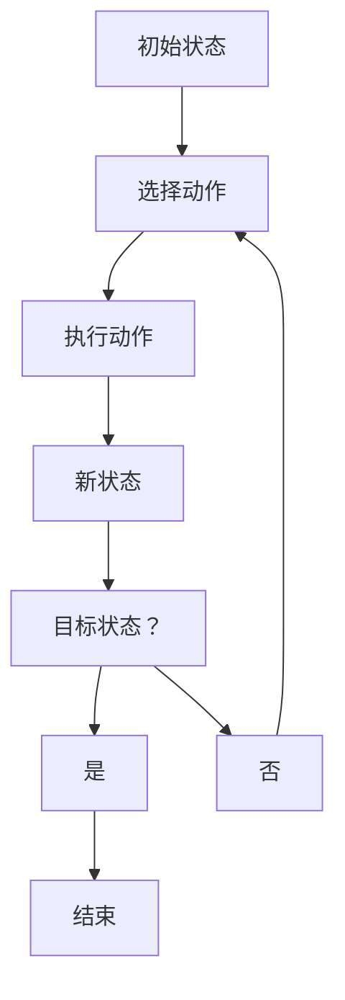
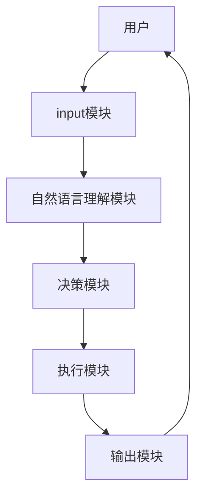

                 


# AI Agent在智能虚拟助理中的角色

## 关键词：AI Agent, 智能虚拟助手, 人工智能, 自然语言处理, 强化学习, 系统架构设计

## 摘要：  
本文深入探讨了AI Agent在智能虚拟助理中的角色及其技术实现。通过分析AI Agent的核心概念、算法原理、系统架构及项目实战，结合具体的案例和图表，全面阐述了AI Agent如何赋能智能虚拟助手，帮助用户理解其在现代人机交互中的重要性与应用价值。

---

# 第1章: AI Agent 的背景与概念

## 1.1 AI Agent 的基本概念与背景

### 1.1.1 什么是 AI Agent
AI Agent（人工智能代理）是指能够感知环境、自主决策并执行任务的智能实体。它通过接收输入信息、分析问题、制定解决方案并执行操作，以实现特定目标。

### 1.1.2 AI Agent 的核心特点
- **自主性**：能够独立决策和执行任务。
- **反应性**：能够实时感知环境并做出反应。
- **目标导向**：所有行为都围绕实现特定目标展开。
- **学习能力**：通过数据和经验不断优化自身性能。

### 1.1.3 AI Agent 的分类与应用场景
AI Agent 可以分为以下几类：
1. **简单反射型 Agent**：基于预定义规则进行反应。
2. **基于模型的反射型 Agent**：通过内部模型分析环境并做出决策。
3. **目标驱动型 Agent**：根据目标选择最优行动方案。
4. **效用驱动型 Agent**：通过最大化效用函数来优化决策。

应用场景包括智能客服、智能家居控制、自动驾驶等。

### 1.1.4 AI Agent 的发展背景
随着人工智能和自然语言处理技术的快速发展，AI Agent 已成为智能虚拟助手的核心技术。通过结合深度学习、强化学习和自然语言理解，AI Agent 能够更高效地处理复杂任务。

## 1.2 AI Agent 在智能虚拟助手中的角色

### 1.2.1 AI Agent 的功能定位
在智能虚拟助手中，AI Agent 作为核心引擎，负责处理用户输入、理解意图、生成响应并执行任务。

### 1.2.2 AI Agent 与智能虚拟助手的关系
智能虚拟助手是一个人机交互界面，而 AI Agent 是其背后的智能决策引擎。AI Agent 通过解析用户需求，驱动助手完成任务。

### 1.2.3 AI Agent 的核心任务与目标
AI Agent 的主要任务包括：
1. **理解用户需求**：通过自然语言处理技术解析用户意图。
2. **制定行动计划**：根据需求生成合理的执行方案。
3. **执行任务**：调用相关服务或功能完成任务。
4. **学习与优化**：通过反馈不断优化自身的决策能力。

---

# 第2章: AI Agent 的核心概念与原理

## 2.1 AI Agent 的核心概念与联系

### 2.1.1 AI Agent 的核心概念
- **知识库**：存储任务相关的数据、规则和经验。
- **行为策略**：定义在不同情境下的行为规范。
- **环境模型**：描述 AI Agent 所处环境的结构和动态。

### 2.1.2 AI Agent 的核心要素对比表
| 核心要素     | 描述                       |
|--------------|----------------------------|
| 知识库       | 存储任务相关的数据和规则   |
| 行为策略     | 定义在不同情境下的行为规范 |
| 环境模型     | 描述环境的结构和动态       |

### 2.1.3 AI Agent 的 ER 实体关系图
```mermaid
erd
actor(AI Agent)
actor(环境)
actor(知识库)
AI Agent --> 知识库
AI Agent --> 环境
环境 --> 知识库
```

## 2.2 AI Agent 的核心原理

### 2.2.1 AI Agent 的感知与理解
AI Agent 通过传感器或输入接口感知环境，并利用自然语言处理技术理解用户需求。

### 2.2.2 AI Agent 的决策与规划
基于感知信息和知识库，AI Agent 使用算法生成最优行动方案。

### 2.2.3 AI Agent 的执行与反馈
AI Agent 执行决策并根据反馈结果优化自身性能。

---

# 第3章: AI Agent 的算法原理

## 3.1 AI Agent 的核心算法

### 3.1.1 状态空间搜索算法


### 3.1.2 强化学习算法
强化学习是一种通过试错机制优化决策的算法。其数学模型如下：
$$ R = r_1 + r_2 + \dots + r_n $$
其中，\( R \) 是总奖励，\( r_i \) 是每一步的奖励。

### 3.1.3 自然语言处理算法
自然语言处理（NLP）用于理解用户输入的文本。常用算法包括词袋模型（Bag of Words）和词嵌入（Word Embedding）。

---

# 第4章: AI Agent 的系统架构与设计

## 4.1 智能虚拟助手的系统架构

### 4.1.1 系统功能设计
智能虚拟助手的系统架构包括以下几个模块：
1. **用户输入模块**：接收用户的语音或文本输入。
2. **自然语言理解模块**：解析用户意图。
3. **决策模块**：生成响应并调用相关服务。
4. **执行模块**：完成任务并返回结果。

### 4.1.2 系统架构设计


---

# 第5章: AI Agent 的项目实战

## 5.1 智能助手开发实战

### 5.1.1 环境安装与配置
安装必要的开发工具和库：
```bash
pip install python
pip install numpy
pip install tensorflow
pip install transformers
```

### 5.1.2 核心代码实现
以下是一个简单的 AI Agent 实现示例：
```python
class AI_Agent:
    def __init__(self):
        self.knowledge_base = {}

    def perceive(self, input):
        # 解析输入并返回意图
        return intent

    def decide(self, intent):
        # 根据意图生成响应
        return response

    def execute(self, response):
        # 执行响应并返回结果
        return result

    def learn(self, feedback):
        # 更新知识库
        pass
```

### 5.1.3 案例分析与解读
通过具体案例分析 AI Agent 在智能助手中的实际应用，例如：
- 处理用户的语音指令。
- 根据意图调用天气 API 获取天气信息。
- 根据反馈优化响应策略。

---

# 第6章: 总结与展望

## 6.1 本章小结
本文详细探讨了 AI Agent 在智能虚拟助手中的角色，从背景、概念、算法到系统架构和项目实战，全面分析了其技术实现和应用价值。

## 6.2 未来展望
随着 AI 技术的不断进步，AI Agent 在智能虚拟助手中的应用将更加广泛和智能。未来的研究方向包括更高效的自然语言理解、更智能的决策算法以及更强大的学习能力。

---

# 作者：AI天才研究院/AI Genius Institute & 禅与计算机程序设计艺术 /Zen And The Art of Computer Programming

