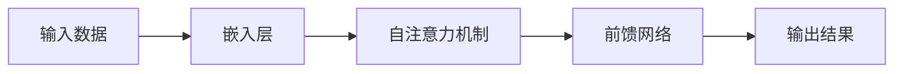
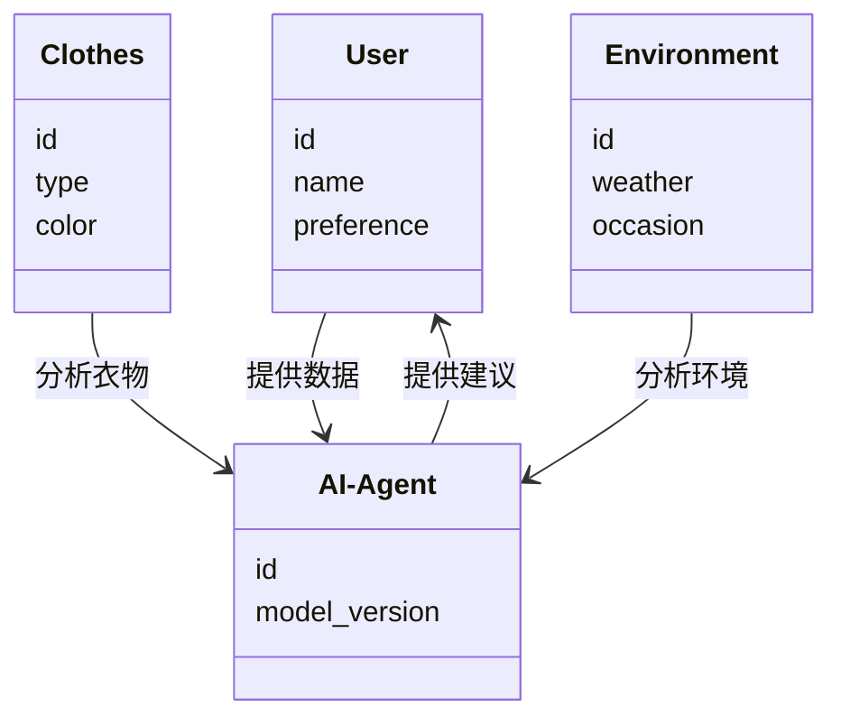
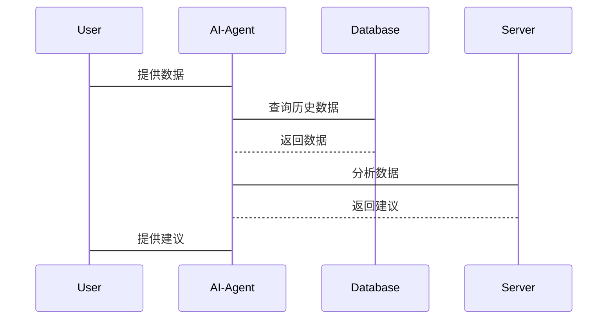

                 


# AI Agent在智能衣架中的穿搭灵感生成器

> 关键词：AI Agent, 智能衣架, 穿搭灵感, 时尚科技, 系统架构, 算法原理

> 摘要：本文探讨了AI Agent在智能衣架中的应用，特别是在穿搭灵感生成方面的创新。通过分析AI Agent的算法原理、系统架构和实际应用场景，本文展示了如何通过技术手段提升用户的穿衣体验，实现智能化、个性化的穿搭建议。

---

# 第一部分: 背景介绍与问题背景

## 第1章: 背景介绍与问题背景

### 1.1 问题背景与目标

#### 1.1.1 从传统衣架到智能衣架的演进

传统的衣架只是一个简单的挂钩，用于悬挂衣物。然而，随着科技的发展，智能衣架的概念逐渐兴起。智能衣架通过集成传感器、通信模块和AI技术，能够实时感知衣物的状态（如温度、湿度、光照等）并提供智能化的管理和服务。这种演变不仅提升了衣物的存储和管理效率，还为用户提供了更个性化的服务。

#### 1.1.2 穿搭灵感生成的需求与痛点

在快节奏的现代生活中，用户每天面临穿衣搭配的选择，尤其是在工作日，选择合适的衣物搭配往往需要花费大量时间。此外，不同场合（如正式会议、休闲约会、户外运动等）对穿搭的要求也不同。传统衣架无法提供这方面的帮助，用户需要一种能够根据个人喜好、身材特点、天气情况等生成个性化穿搭建议的工具。AI Agent的引入，为智能衣架提供了这一功能的可能性。

#### 1.1.3 AI Agent在时尚穿搭中的应用潜力

AI Agent（人工智能代理）是一种能够感知环境、理解用户需求并主动提供解决方案的智能系统。在时尚领域，AI Agent可以通过分析用户的穿衣习惯、偏好、身材特点以及当前的天气、场合等信息，生成个性化的穿搭建议。这种技术的应用不仅提升了用户体验，还为智能衣架带来了更大的市场潜力。

### 1.2 问题描述与目标设定

#### 1.2.1 智能衣架的核心功能与目标

智能衣架的核心功能包括：

1. **衣物管理**：通过传感器和通信模块，实时监测衣物的状态，提醒用户更换或清洗。
2. **穿搭建议**：通过AI Agent分析用户的穿衣习惯和偏好，提供个性化的穿搭建议。
3. **信息推送**：根据天气、场合等因素，主动推送适合的穿搭方案。

目标是通过技术创新，提升用户的穿衣体验，使其更高效、更个性化。

#### 1.2.2 用户需求分析与场景描述

用户需求可以分为以下几类：

1. **普通用户**：希望快速获得适合当前场合的穿搭建议。
2. **时尚爱好者**：希望得到专业的搭配建议，提升穿衣品味。
3. **忙碌人士**：希望节省时间，快速选择合适的衣物。

场景包括日常生活、工作场合、休闲娱乐等。

#### 1.2.3 穿搭灵感生成的边界与外延

穿搭灵感生成的核心是AI Agent，但其外延还包括数据采集、用户反馈、系统优化等多个方面。例如，系统需要采集用户的穿衣数据、天气数据、场合信息等，并根据这些数据不断优化算法模型，提升建议的准确性。

### 1.3 核心概念与问题解决

#### 1.3.1 AI Agent在智能衣架中的角色与功能

AI Agent在智能衣架中主要扮演“智能助手”的角色，负责：

1. **数据采集**：收集用户的穿衣数据、环境数据等。
2. **数据分析**：通过机器学习算法分析数据，理解用户的偏好和需求。
3. **建议生成**：根据分析结果，生成个性化的穿搭建议。
4. **交互反馈**：与用户互动，实时调整建议以满足需求。

#### 1.3.2 智能衣架与传统衣架的对比分析

传统衣架与智能衣架的主要区别在于功能和智能化程度。传统衣架仅用于悬挂衣物，而智能衣架则具备数据采集、智能分析和主动服务的功能。

#### 1.3.3 穿搭灵感生成的实现路径

实现路径包括：

1. **数据采集**：通过传感器、摄像头等设备采集衣物信息和环境数据。
2. **数据分析**：利用机器学习算法分析数据，提取用户的穿衣偏好和需求。
3. **建议生成**：基于分析结果，生成个性化的穿搭建议，并通过用户友好的界面展示。

---

# 第二部分: 核心概念与联系

## 第2章: 核心概念与联系

### 2.1 AI Agent与智能衣架的关系

#### 2.1.1 AI Agent在智能衣架中的角色与功能

AI Agent在智能衣架中主要负责数据处理和智能建议生成。它通过分析用户的穿衣数据、环境数据等，提供个性化的穿搭建议。

#### 2.1.2 智能衣架与传统衣架的对比分析

智能衣架在功能上远超传统衣架，具备智能化的数据处理和主动服务功能。

#### 2.1.3 穿搭灵感生成的核心要素

穿搭灵感生成的核心要素包括：

1. **用户数据**：用户的穿衣习惯、身材特点、颜色偏好等。
2. **环境数据**：天气、场合、时间等。
3. **AI算法**：用于数据分析和建议生成的算法模型。

### 2.2 核心概念的属性特征对比

#### 2.2.1 AI Agent的属性特征分析

| 属性 | 描述 |
|------|------|
| 智能性 | 能够感知环境并主动提供解决方案 |
| 学习能力 | 通过数据不断优化算法模型 |
| 交互性 | 与用户进行实时交互，提供反馈 |

#### 2.2.2 智能衣架的功能特征分析

| 功能 | 描述 |
|------|------|
| 数据采集 | 采集衣物状态、用户行为等数据 |
| 智能分析 | 通过AI算法生成穿搭建议 |
| 交互反馈 | 与用户进行实时互动，提供反馈 |

#### 2.2.3 穿搭灵感生成的特征对比

| 特征 | AI Agent | 智能衣架 |
|------|----------|----------|
| 数据源 | 用户数据、环境数据 | 衣物数据、用户行为 |
| 核心功能 | 分析数据、生成建议 | 悬挂衣物、提供服务 |

### 2.3 ER实体关系图

```mermaid
erDiagram
    user {
        id INT
        name VARCHAR
        preference JSON
        feedback TEXT
    }
    clothes {
        id INT
        type VARCHAR
        color VARCHAR
        size VARCHAR
    }
    environment {
        id INT
        weather VARCHAR
        occasion VARCHAR
        time TIME
    }
    ai_agent {
        id INT
        model_version VARCHAR
        algorithm TEXT
    }
    user --> ai_agent : 提供数据
    clothes --> ai_agent : 分析衣物
    environment --> ai_agent : 分析环境
    ai_agent --> user : 提供建议
```

---

# 第三部分: 算法原理与数学模型

## 第3章: 算法原理与数学模型

### 3.1 AI Agent的算法原理

#### 3.1.1 基于Transformer的生成模型



#### 3.1.2 穿搭灵感生成的算法流程

1. **数据预处理**：清洗和标准化用户数据。
2. **模型训练**：使用Transformer模型训练生成模型。
3. **建议生成**：根据输入数据生成穿搭建议。

#### 3.1.3 算法的优化与改进

1. **数据增强**：增加数据多样性。
2. **模型调优**：优化超参数，提升生成效果。

### 3.2 数学模型与公式

#### 3.2.1 生成模型的数学表达式

$$ P(x_{i}) = \text{softmax}(QK^T) $$

其中，$Q$ 和 $K$ 是查询和键的表示。

#### 3.2.2 损失函数的定义与优化

损失函数定义为：

$$ \mathcal{L} = -\sum_{i=1}^{n} \text{log}(P(x_i|x_{<i})) $$

优化目标是通过反向传播算法最小化损失函数。

---

# 第四部分: 系统分析与架构设计方案

## 第4章: 系统分析与架构设计方案

### 4.1 问题场景介绍

用户使用智能衣架时，系统需要实时分析数据并生成穿搭建议。

### 4.2 项目介绍

智能衣架系统包括数据采集、处理、分析和展示模块。

### 4.3 系统功能设计

#### 4.3.1 领域模型类图



#### 4.3.2 系统架构设计


### 4.4 接口设计与交互流程图



---

# 第五部分: 项目实战

## 第5章: 项目实战

### 5.1 环境安装

安装Python和相关库，如TensorFlow、Keras等。

### 5.2 核心代码实现

```python
def generate_outfit(user_data, environment_data):
    # 数据预处理
    processed_data = preprocess(user_data, environment_data)
    # 模型推理
    model = load_model('outfit_generator.h5')
    prediction = model.predict(processed_data)
    # 生成建议
    return generate_suggestion(prediction)
```

### 5.3 案例分析与详细讲解

案例：用户A在晴天需要参加一个重要会议。

1. **数据采集**：用户A的穿衣习惯、身材特点、会议场合等。
2. **模型分析**：生成适合的西装搭配建议。
3. **交互反馈**：用户确认建议，系统记录反馈以优化模型。

---

# 第六部分: 最佳实践

## 第6章: 最佳实践

### 6.1 小结

AI Agent在智能衣架中的应用为用户提供了个性化的穿搭建议，提升了穿衣体验。

### 6.2 注意事项

1. **数据隐私**：确保用户数据的安全性。
2. **模型优化**：持续优化算法，提升生成效果。
3. **用户体验**：注重交互设计，提升用户满意度。

### 6.3 拓展阅读

推荐阅读相关领域的书籍和论文，深入理解AI在时尚科技中的应用。

---

# 结语

AI Agent在智能衣架中的应用展示了科技与时尚的结合，为用户提供了更智能化、个性化的服务。未来，随着技术的不断发展，智能衣架将变得更加智能，为用户带来更优质的生活体验。

---

# 作者：AI天才研究院 & 禅与计算机程序设计艺术

---

