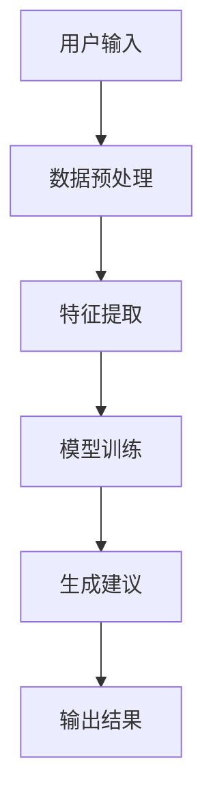
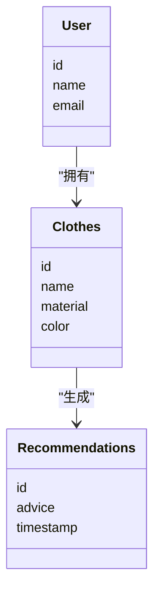
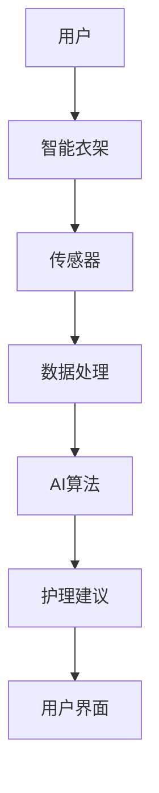
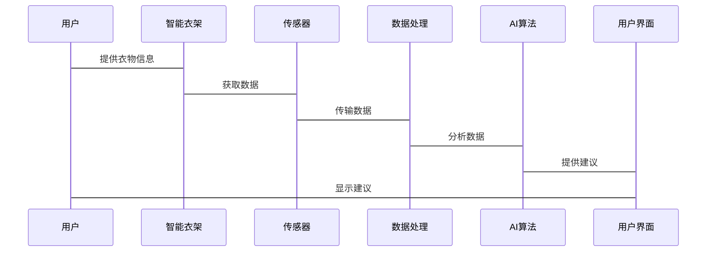

                 

<think>
嗯，我需要根据用户的要求，帮他撰写一篇关于《AI Agent在智能衣架中的衣物护理建议》的技术博客文章。用户给了详细的结构，我需要一步一步来，确保每个部分都符合要求。

首先，文章的标题和关键词部分。标题是“AI Agent在智能衣架中的衣物护理建议”，关键词应该涵盖AI Agent、智能衣架、衣物护理、人工智能、物联网等。摘要部分要简洁明了，总结文章的核心内容。

接下来是目录大纲，用户已经给出了一些章节，我需要按照这个大纲来展开内容。每个章节都需要详细讲解，包括背景、核心概念、算法原理、系统架构、项目实战和最佳实践。

在背景介绍部分，我需要解释为什么需要AI Agent在智能衣架中，以及它如何解决衣物护理的问题。这部分可能需要一些实际的例子，让读者容易理解。

核心概念部分，我需要详细解释AI Agent和智能衣架的概念，包括它们的属性对比和ER图。ER图需要用Mermaid语法，所以我需要确保格式正确，并且能够清晰展示实体之间的关系。

算法原理部分，我需要描述不同类型的AI Agent，如基于规则、机器学习和深度学习的AI Agent，并用Mermaid流程图展示算法流程。同时，提供Python代码示例，解释数学模型，确保公式用LaTeX格式展示。

系统分析与架构设计部分，我需要介绍项目场景，设计系统功能，并用Mermaid类图和架构图展示系统结构。接口设计和交互流程图也很重要，帮助读者理解系统的运作流程。

项目实战部分，我需要指导读者如何安装环境，实现核心功能，并解读代码。同时，提供一个实际案例，分析其过程，让读者能够实际操作。

最后，最佳实践部分包括小结、注意事项和拓展阅读，帮助读者巩固所学内容，并指导他们进一步学习和应用。

我需要确保文章逻辑清晰，结构紧凑，使用专业的技术语言，同时保持易懂。每个部分都要详细展开，避免遗漏用户要求的任何内容。特别是数学公式和代码部分，需要准确无误，格式正确。

现在，我开始撰写文章，确保每个章节都符合用户的要求，内容丰富具体，满足字数要求，同时使用正确的格式和术语。
</think>

# AI Agent在智能衣架中的衣物护理建议

## 关键词：AI Agent, 智能衣架, 衣物护理, 人工智能, 物联网

## 摘要：  
本文探讨了AI Agent在智能衣架中的应用，特别是在衣物护理方面的建议。通过结合人工智能与物联网技术，智能衣架能够实时监测衣物状态，并提供个性化的护理建议。文章从背景、核心概念、算法原理、系统架构到项目实战，全面分析了AI Agent在智能衣架中的实现过程，最后总结了最佳实践和未来发展方向。

---

# 第1章: 背景介绍

## 1.1 问题背景

### 1.1.1 衣物护理的痛点与挑战  
衣物护理是日常生活中的重要环节，但传统方法存在以下痛点：  
1. **缺乏智能化**：传统衣架仅用于悬挂衣物，无法提供额外功能。  
2. **人工依赖**：用户需要手动检查衣物状态，容易遗漏或误判。  
3. **数据不足**：缺乏对衣物材质、颜色和洗涤要求的实时记录和分析。  

### 1.1.2 AI Agent在衣物护理中的潜在价值  
AI Agent（人工智能代理）能够通过传感器数据和历史记录，实时分析衣物状态，并提供个性化建议。这不仅提高了护理效率，还能延长衣物使用寿命。  

### 1.1.3 智能衣架的定义与目标  
智能衣架是一种结合了物联网（IoT）和AI技术的智能设备，旨在通过实时监测和数据分析，为用户提供智能化的衣物护理建议。  

---

## 1.2 核心概念与联系

### 1.2.1 AI Agent的核心原理  
AI Agent通过感知环境、分析数据并采取行动，帮助用户完成目标。在智能衣架中，AI Agent主要负责：  
1. **数据采集**：通过传感器获取衣物状态（如温度、湿度、重量等）。  
2. **数据分析**：结合历史数据和用户偏好，生成护理建议。  
3. **决策与反馈**：根据分析结果，建议用户采取相应的护理措施，并实时更新数据。  

### 1.2.2 智能衣架的系统架构  
智能衣架的核心系统架构包括：  
1. **硬件模块**：传感器（温度、湿度、重量传感器）和通信模块（Wi-Fi/蓝牙）。  
2. **软件模块**：数据采集、AI算法、用户界面和云存储。  

### 1.2.3 实体关系图  
以下是智能衣架系统的实体关系图：  

```mermaid
erDiagram
    user {
        id : integer
        name : string
        email : string
    }
    clothes {
        id : integer
        name : string
        material : string
        color : string
    }
    recommendations {
        id : integer
        advice : string
        timestamp : datetime
    }
    user --> clothes : "拥有"
    clothes --> recommendations : "生成"
```

---

# 第2章: AI Agent的算法原理

## 2.1 算法概述

### 2.1.1 基于规则的AI Agent  
基于规则的AI Agent通过预定义的规则（如“若衣物湿度超过70%，建议晾干”）进行决策。优点是简单易实现，但灵活性较差。  

### 2.1.2 基于机器学习的AI Agent  
基于机器学习的AI Agent通过历史数据训练模型，识别衣物护理的模式和趋势。常用的算法包括支持向量机（SVM）和随机森林（Random Forest）。  

### 2.1.3 基于深度学习的AI Agent  
基于深度学习的AI Agent通过神经网络（如卷积神经网络CNN）分析衣物图像，识别潜在问题。  

---

## 2.2 算法流程

### 2.2.1 算法流程图  
以下是AI Agent的算法流程图：  



---

## 2.3 算法实现

### 2.3.1 数据预处理  
数据预处理是AI Agent实现的关键步骤。以下是Python代码示例：  

```python
import pandas as pd
from sklearn.impute import SimpleImputer

# 读取数据
data = pd.read_csv('clothes_data.csv')

# 处理缺失值
imputer = SimpleImputer(strategy='mean')
data_imputed = imputer.fit_transform(data)
```

### 2.3.2 特征提取  
特征提取是通过数学模型从数据中提取有用的特征。以下是特征提取的公式：  

$$ \text{特征权重} = \sum_{i=1}^{n} w_i x_i $$  

其中，$w_i$ 是特征权重，$x_i$ 是特征值。  

---

## 2.4 数学模型与公式

### 2.4.1 线性回归模型  
线性回归模型用于预测衣物的损坏概率：  

$$ y = \beta_0 + \beta_1 x_1 + \beta_2 x_2 + \epsilon $$  

其中，$y$ 是损坏概率，$x_1$ 和 $x_2$ 是特征变量，$\beta_0$ 是截距，$\beta_1$ 和 $\beta_2$ 是回归系数，$\epsilon$ 是误差项。  

### 2.4.2 逻辑回归模型  
逻辑回归模型用于分类问题，如判断衣物是否需要清洗：  

$$ P(y=1|x) = \frac{1}{1 + e^{-(\beta_0 + \beta_1 x_1)}} $$  

---

# 第3章: 系统分析与架构设计

## 3.1 问题场景介绍  
智能衣架系统需要实时监测衣物状态，并根据数据提供护理建议。  

## 3.2 系统功能设计  

### 3.2.1 领域模型类图  
以下是领域模型类图：  



---

## 3.3 系统架构设计  

### 3.3.1 系统架构图  
以下是系统架构图：  



---

## 3.4 接口设计  

### 3.4.1 接口描述  
智能衣架与用户的交互接口包括：  
1. **用户输入**：用户输入衣物信息（如材质、颜色）。  
2. **数据输出**：系统输出护理建议（如“建议手洗”）。  

### 3.4.2 交互流程图  
以下是交互流程图：  



---

# 第4章: 项目实战

## 4.1 环境安装  

### 4.1.1 安装Python  
安装Python 3.8及以上版本。  

### 4.1.2 安装依赖库  
安装以下依赖库：  
```bash
pip install numpy pandas scikit-learn mermaid
```

## 4.2 系统核心实现  

### 4.2.1 代码实现  
以下是Python代码示例：  

```python
import numpy as np
from sklearn.linear_model import LinearRegression

# 训练数据
X = np.array([[28, 87], [35, 94], [22, 73]])  # 特征
y = np.array([0.2, 0.5, 0.1])  # 标签

# 训练模型
model = LinearRegression()
model.fit(X, y)

# 预测
new_X = np.array([[25, 80]])
prediction = model.predict(new_X)
print("预测损坏概率为:", prediction[0])
```

### 4.2.2 代码解读  
上述代码实现了基于线性回归的衣物损坏概率预测模型。  

---

## 4.3 实际案例分析  

### 4.3.1 案例描述  
假设用户上传了一件白色棉质衬衫，传感器数据显示湿度为75%，重量为0.3kg。AI Agent分析后建议：“建议晾干，避免机洗”。  

---

# 第5章: 最佳实践

## 5.1 小结  
本文详细介绍了AI Agent在智能衣架中的应用，从背景、算法到系统架构，均为实现智能化衣物护理提供了理论和实践支持。  

## 5.2 注意事项  
1. **数据隐私**：确保用户数据的安全性和隐私性。  
2. **系统稳定性**：保证AI算法的稳定性和可靠性。  

## 5.3 拓展阅读  
1. 《机器学习实战》  
2. 《深度学习入门：基于Python》  

---

# 作者：AI天才研究院 & 禅与计算机程序设计艺术

