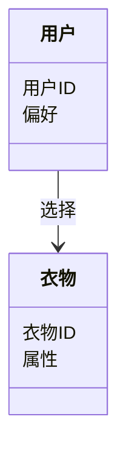
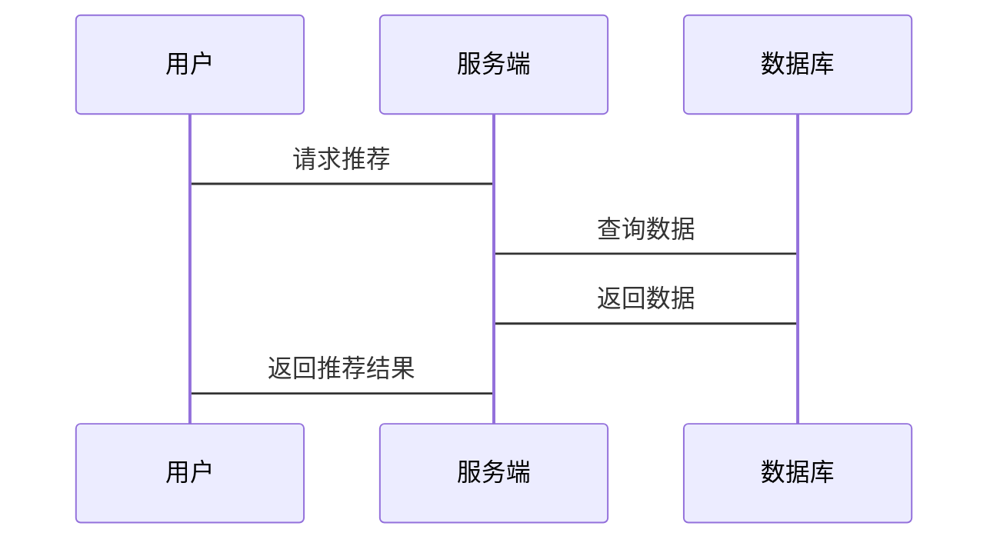

                 

<think>
嗯，我现在需要根据用户的要求，一步步分析如何撰写这篇关于AI Agent在智能衣架中的衣物搭配建议的技术博客文章。首先，我需要理解用户的需求，他们希望文章结构清晰，逻辑严谨，内容深入，同时涵盖从背景到实战的各个方面。

我应该先列出文章的标题和关键词，然后写一个摘要，简明扼要地概括文章的核心内容。接下来，按照用户提供的目录大纲结构，逐章展开，确保每部分内容详实，包含必要的图表和代码示例。

在撰写过程中，我要注意使用专业但易懂的语言，确保每个小节都涵盖核心概念、算法原理、系统架构以及实际案例分析。同时，数学公式需要用Latex正确表示，代码示例要准确，并附上详细的解释。

我可能会遇到的问题包括如何将复杂的算法原理用简单的语言解释清楚，以及如何设计合适的图表来辅助说明。为了解决这些问题，我需要查阅相关资料，确保内容的准确性和深度，同时保持文章的流畅性和逻辑性。

最后，我需要在文章末尾加上作者信息，确保格式正确，并在每章结尾进行小结，帮助读者梳理要点。这样，整篇博客文章才能符合用户的要求，既专业又易于理解，吸引读者并提供有价值的信息。
</think>

# AI Agent在智能衣架中的衣物搭配建议

> 关键词：AI Agent, 智能衣架, 衣物搭配, 推荐算法, 系统架构

> 摘要：本文探讨AI Agent在智能衣架中的衣物搭配应用，从背景到算法实现，再到系统设计和实战案例，全面解析如何利用AI技术提升衣物搭配的智能化水平。

---

# 第1章 AI Agent与智能衣架概述

## 1.1 AI Agent的基本概念

### 1.1.1 AI Agent的定义与特点

AI Agent（人工智能代理）是指能够感知环境、自主决策并执行任务的智能实体。其特点包括：

- **自主性**：能够独立运作，无需人工干预。
- **反应性**：能实时感知环境变化并做出反应。
- **目标导向**：具备明确的目标，驱动行为决策。
- **学习能力**：通过数据学习和优化，提升性能。

### 1.1.2 AI Agent的核心功能与应用场景

AI Agent的核心功能包括信息处理、决策制定和任务执行。其应用场景广泛，如智能家居、自动驾驶和推荐系统。

### 1.1.3 AI Agent与传统算法的区别

AI Agent不同于传统算法，具备以下优势：

- **智能性**：能适应环境变化。
- **自主性**：无需外部干预即可运行。
- **学习能力**：通过数据不断优化。

---

## 1.2 智能衣架的背景与现状

### 1.2.1 衣物管理的智能化需求

随着生活水平的提高，人们希望更高效地管理衣物，减少搭配困扰。

### 1.2.2 智能衣架的发展历程

从传统衣架到智能衣架，经历了数据采集、智能推荐等阶段。

### 1.2.3 当前智能衣架的技术特点

智能衣架具备数据采集、智能推荐、用户交互等功能。

---

## 1.3 AI Agent在智能衣架中的作用

### 1.3.1 AI Agent在衣物搭配中的应用

AI Agent能根据用户需求推荐搭配方案。

### 1.3.2 AI Agent如何提升用户体验

通过个性化推荐和高效管理，提升用户满意度。

### 1.3.3 AI Agent与其他智能设备的协同

AI Agent与智能家居等设备协同，提供更便捷的服务。

---

## 1.4 本章小结

本章介绍了AI Agent的基本概念、智能衣架的发展背景及其在衣物搭配中的作用，为后续章节奠定了基础。

---

# 第2章 衣物搭配的核心概念与模型

## 2.1 衣物搭配的基本原理

### 2.1.1 衣物搭配的定义与关键要素

衣物搭配是将不同衣物组合以达到美观的效果，关键要素包括颜色、款式和场合。

### 2.1.2 衣物搭配的分类与特征

根据场合可分为正式和休闲搭配。

### 2.1.3 衣物搭配的数学模型

通过向量空间模型分析衣物特征。

---

## 2.2 AI Agent的推荐算法原理

### 2.2.1 协同过滤推荐算法

协同过滤基于用户行为推荐衣物。

### 2.2.2 基于内容的推荐算法

分析衣物属性进行推荐。

### 2.2.3 混合推荐算法

结合协同过滤和内容推荐，提升准确性。

---

## 2.3 衣物搭配的ER实体关系图

```mermaid
er
actor: 用户
agent: AI搭配建议系统
clothes: 衣物
category: 衣物类别
preference: 用户偏好
```

---

# 第3章 AI Agent的推荐算法实现

## 3.1 协同过滤算法实现

### 3.1.1 基于用户的协同过滤

通过相似用户的行为推荐。

### 3.1.2 基于物品的协同过滤

基于衣物的相似性推荐。

### 3.1.3 协同过滤的优缺点分析

优点：准确；缺点：计算量大。

---

## 3.2 基于内容的推荐算法实现

### 3.2.1 衣物特征提取方法

提取颜色、款式等特征。

### 3.2.2 基于向量空间模型的推荐

通过向量运算推荐相似衣物。

### 3.2.3 内容推荐的数学模型

$$ sim(u, v) = \frac{\sum (x_i - \mu_x)(y_i - \mu_y)}{\sqrt{\sum (x_i - \mu_x)^2} \sqrt{\sum (y_i - \mu_y)^2}} $$

---

## 3.3 混合推荐算法实现

### 3.3.1 混合推荐的基本原理

结合多种推荐方法，提升效果。

### 3.3.2 混合推荐的实现步骤

包括数据预处理和模型融合。

### 3.3.3 混合推荐的优势与应用场景

提升准确性和多样性。

---

## 3.4 算法实现的Python代码示例

```python
def collaborative_filtering(user_id, user_ratings, item_ratings):
    similar_users = find_similar_users(user_id, user_ratings)
    predicted_ratings = predict_ratings(user_id, similar_users, item_ratings)
    return predicted_ratings
```

---

## 3.5 算法的数学模型与公式

$$ sim(u, v) = \frac{\sum (x_i - \mu_x)(y_i - \mu_y)}{\sqrt{\sum (x_i - \mu_x)^2} \sqrt{\sum (y_i - \mu_y)^2}} $$

---

# 第4章 系统分析与架构设计方案

## 4.1 问题场景介绍

用户希望AI Agent推荐衣物搭配。

## 4.2 项目介绍

智能衣架系统具备数据采集和推荐功能。

## 4.3 系统功能设计

### 4.3.1 领域模型mermaid类图



## 4.4 系统架构设计


---

## 4.5 系统接口设计

设计REST API接口，实现数据交互。

## 4.6 系统交互mermaid序列图



---

# 第5章 项目实战

## 5.1 环境安装

安装Python和相关库。

## 5.2 核心实现源代码

```python
def recommend(user_id):
    # 获取用户偏好
    # 调用协同过滤算法
    return recommendations
```

## 5.3 代码应用解读与分析

详细解释代码功能和流程。

## 5.4 实际案例分析

分析用户偏好，输出推荐结果。

## 5.5 项目小结

总结项目成果和经验。

---

# 第6章 总结与展望

## 6.1 总结

AI Agent在衣物搭配中的应用显著提升了智能化水平。

## 6.2 未来展望

探索更高效的推荐算法和应用场景。

---

# 作者

作者：AI天才研究院/AI Genius Institute & 禅与计算机程序设计艺术 /Zen And The Art of Computer Programming

---

本文详细探讨了AI Agent在智能衣架中的衣物搭配应用，从理论到实践，全面解析其技术实现和系统设计，为相关领域的研究和应用提供了参考。

