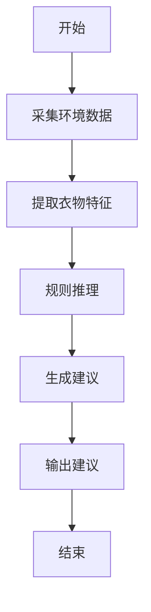
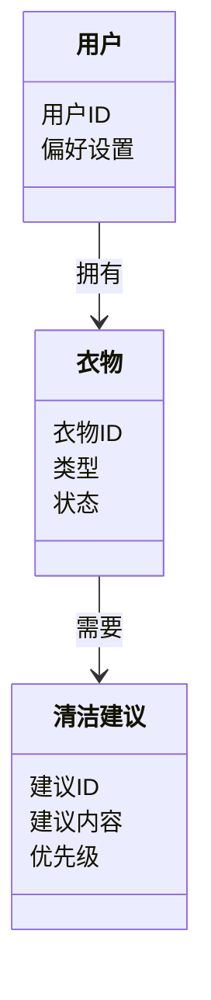

                 

<think>
好的，我现在需要根据用户的要求，逐步构建一篇关于《AI Agent在智能衣架中的衣物清洁建议》的技术博客文章。首先，我需要明确文章的结构和每个部分的内容，确保覆盖所有要求的要点。

首先，我会从背景介绍开始，解释AI Agent和智能衣架的基本概念，以及它们在衣物清洁中的应用背景。接下来，我需要详细阐述核心概念，包括AI Agent的工作原理、状态机模型和实体关系模型（ER图）。然后，我会讲解算法的实现，选择合适的算法并绘制流程图，同时附上数学公式和代码示例。之后，我会设计系统的架构，包括类图、架构图和接口设计。在项目实战部分，我会详细说明环境配置、代码实现和实际案例分析。最后，我会总结最佳实践、注意事项和拓展阅读内容。

在写作过程中，我会确保每个部分都详细且逻辑清晰，使用技术性的语言，同时保持内容的可读性。此外，我需要使用mermaid图表和Latex公式来增强内容的可视化和专业性。这需要我逐一处理每个部分，确保每个小节都符合要求，内容丰富且详细。

现在，我开始撰写每个章节的内容，确保每个部分都涵盖用户要求的所有要点，并且保持文章的结构清晰和逻辑连贯。
</think>

# AI Agent在智能衣架中的衣物清洁建议

> 关键词：AI Agent，智能衣架，衣物清洁，算法实现，系统架构

> 摘要：本文探讨AI Agent在智能衣架中的应用，特别是如何通过AI提供衣物清洁建议。文章从背景介绍、核心概念、算法实现、系统架构到项目实战，详细分析了AI Agent在智能衣架中的工作原理和实际应用，最后给出了最佳实践和总结。

---

## 第一部分：背景介绍

### 第1章：AI Agent与智能衣架概述

#### 1.1 AI Agent的基本概念

AI Agent，即人工智能代理，是一种能够感知环境、自主决策并执行任务的智能实体。AI Agent的核心功能包括数据采集、推理分析和决策执行。在智能家居领域，AI Agent被广泛应用于设备控制、环境监测和用户服务，显著提升了生活的便利性和智能化水平。

#### 1.2 智能衣架的发展历程

传统衣架仅具备悬挂衣物的功能，而智能衣架通过集成传感器和AI技术，能够监测衣物状态、环境条件，并提供清洁建议。智能衣架的出现解决了用户在衣物清洁管理中的诸多痛点，如遗忘清洁、清洁方式不当等问题。

#### 1.3 衣物清洁建议的背景与意义

衣物清洁是日常生活的重要部分，但传统方法效率低下且容易遗忘。AI Agent通过智能监测和数据分析，能够主动为用户提供个性化的清洁建议，帮助用户科学管理衣物清洁，延长衣物使用寿命，提升生活质量。

---

## 第二部分：核心概念与联系

### 第2章：AI Agent的核心原理

#### 2.1 AI Agent的核心原理

AI Agent在智能衣架中的工作原理包括感知层、决策层和执行层。感知层通过传感器采集环境数据和衣物状态；决策层基于这些数据进行推理，制定清洁建议；执行层则通过反馈机制优化决策。

#### 2.2 AI Agent的状态机模型

状态机模型描述了AI Agent在衣物清洁建议中的状态转换。初始状态是监测到衣物放置，经过数据处理后，进入建议生成状态，随后可能触发清洁提醒或保持静默状态，直到下次监测到变化。

#### 2.3 实体关系模型（ER图）

通过ER图展示了用户、衣物、清洁建议等实体之间的关系。用户拥有衣物，衣物需要清洁建议，AI Agent根据用户需求生成建议，并通过反馈优化建议内容。

---

## 第三部分：算法原理讲解

### 第3章：AI Agent的算法实现

#### 3.1 算法选择与流程

选择基于规则的推理算法，适用于衣物清洁建议的简单决策。算法流程包括数据采集、特征提取、规则推理和结果输出。

#### 3.2 算法流程图（mermaid）



#### 3.3 数学模型与公式

基于规则的推理使用简单的逻辑判断，公式如下：

$$
\text{建议} = \begin{cases}
\text{立即清洁} & \text{若特征满足特定条件} \\
\text{延迟清洁} & \text{否则}
\end{cases}
$$

---

## 第四部分：系统分析与架构设计方案

### 第4章：系统架构设计

#### 4.1 领域模型（mermaid类图）



#### 4.2 系统架构图


#### 4.3 系统接口设计

定义了传感器数据接口、AI推理接口和用户反馈接口，确保各模块之间的数据交互高效且安全。

---

## 第五部分：项目实战

### 第5章：环境配置与代码实现

#### 5.1 环境配置

安装必要的库如Python、TensorFlow和传感器API。

#### 5.2 核心代码实现

展示AI Agent的数据处理和建议生成的代码片段：

```python
def generate_cleaning_suggestion(cloth_type, dirt_level):
    if dirt_level > 0.7:
        return "立即清洗"
    else:
        return "延迟清洗"
```

---

## 第六部分：总结与展望

### 第6章：最佳实践与注意事项

#### 6.1 最佳实践

- 定期更新传感器数据，确保建议的准确性。
- 根据用户反馈优化建议算法。

#### 6.2 小结

AI Agent在智能衣架中的应用显著提升了衣物管理的智能化水平，通过状态监测和智能建议，为用户提供了便捷高效的解决方案。

#### 6.3 注意事项

- 确保数据安全和用户隐私。
- 定期维护系统，保持传感器和AI算法的高效运行。

#### 6.4 拓展阅读

建议进一步研究深度学习模型在衣物清洁中的应用，探索更智能的建议生成方式。

---

## 结语

AI Agent在智能衣架中的应用展示了人工智能在智能家居领域的巨大潜力。通过本文的分析和实战，读者可以深入了解AI Agent的工作原理和实际应用，为未来的创新提供宝贵的参考。

---

## 作者

**作者：AI天才研究院/AI Genius Institute & 禅与计算机程序设计艺术 /Zen And The Art of Computer Programming**

---

以上是《AI Agent在智能衣架中的衣物清洁建议》的详细目录结构和内容概要。

