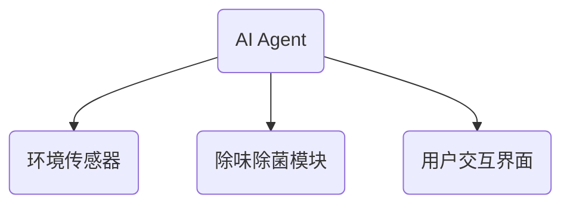
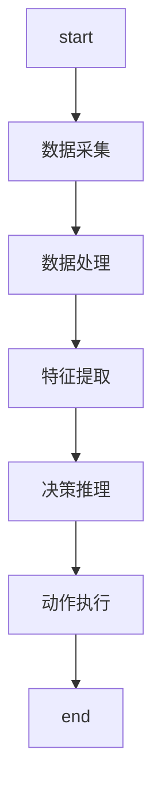
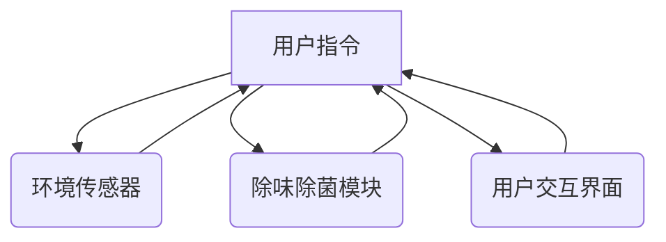

                 


# AI Agent在智能衣架中的衣物除味除菌

> 关键词：AI Agent，智能衣架，除味除菌，算法原理，系统架构

> 摘要：本文探讨了AI Agent在智能衣架中的应用，特别是衣物除味除菌方面的创新技术。通过分析AI Agent的核心概念、算法原理、系统架构设计以及项目实战，本文详细介绍了如何利用AI技术提升智能衣架的功能和用户体验。

---

## 第1章: AI Agent与智能衣架的背景介绍

### 1.1 AI Agent的基本概念

#### 1.1.1 AI Agent的定义与特点
AI Agent（人工智能代理）是指能够感知环境、自主决策并执行任务的智能实体。它具备以下特点：
- **自主性**：能够在没有外部干预的情况下运行。
- **反应性**：能够根据环境变化实时调整行为。
- **目标导向**：通过设定目标来驱动决策和行动。
- **学习能力**：能够通过数据和经验不断优化自身性能。

#### 1.1.2 AI Agent在智能设备中的应用背景
随着智能家居和物联网技术的快速发展，AI Agent在智能设备中的应用越来越广泛。从智能音箱到智能空调，AI Agent通过实时感知和决策，为用户提供了更智能化的服务。

#### 1.1.3 AI Agent的核心要素与功能模块
AI Agent的核心要素包括感知模块、决策模块和执行模块。感知模块负责采集环境数据，决策模块基于数据进行推理和决策，执行模块则根据决策结果执行具体操作。

### 1.2 智能衣架的背景与现状

#### 1.2.1 衣物除味除菌的传统方法
传统衣物除味除菌方法主要包括以下几种：
- **晾晒**：通过阳光和空气中的紫外线杀菌。
- **洗涤剂**：使用化学洗涤剂去除异味。
- **活性炭**：通过吸附原理去除异味。

#### 1.2.2 智能衣架的发展趋势
智能衣架的发展趋势主要体现在以下几个方面：
- **智能化**：集成AI技术，实现自动化除味除菌。
- **物联网化**：通过Wi-Fi或蓝牙连接，实现远程控制。
- **节能环保**：采用低功耗设计，减少能源消耗。

#### 1.2.3 AI Agent在智能衣架中的应用价值
AI Agent的应用为智能衣架带来了以下价值：
- **提升用户体验**：通过智能感知和决策，提供更便捷的服务。
- **提高效率**：自动化操作减少用户干预。
- **增强功能**：通过AI算法优化除味除菌效果。

## 第2章: AI Agent的核心概念与联系

### 2.1 AI Agent的核心原理

#### 2.1.1 感知层：环境数据的采集与处理
感知层负责采集环境数据，包括温度、湿度、异味强度等。这些数据通过传感器采集，并传输到决策层进行处理。

#### 2.1.2 决策层：基于AI算法的智能决策
决策层基于感知数据和预设算法，进行推理和决策。常用的算法包括模糊控制算法和强化学习算法。

#### 2.1.3 执行层：决策的执行与反馈
执行层根据决策层的指令，执行具体的除味除菌操作，并将反馈数据传输回感知层，形成闭环。

### 2.2 AI Agent与智能衣架的实体关系图



### 2.3 AI Agent的核心算法流程图



## 第3章: AI Agent的算法原理

### 3.1 模糊控制算法

#### 3.1.1 模糊控制的基本原理
模糊控制是一种基于模糊逻辑的控制方法，通过将输入数据映射到模糊集合，进行模糊推理，最终得到控制输出。

#### 3.1.2 模糊控制在除味除菌中的应用
在智能衣架中，模糊控制可以用于根据环境数据（如温度、湿度）自动调整除味除菌强度。

#### 3.1.3 模糊控制的数学模型
模糊控制的数学模型如下：
$$ 模糊度 = \sum_{i=1}^{n} w_i \cdot x_i $$

### 3.2 强化学习算法

#### 3.2.1 强化学习的基本原理
强化学习是一种通过试错机制学习最优策略的方法。智能体通过与环境交互，获得奖励或惩罚，逐步优化行为策略。

#### 3.2.2 Q-learning算法在AI Agent中的应用
Q-learning算法广泛应用于智能衣架的决策控制中，通过不断探索和利用环境，优化除味除菌策略。

#### 3.2.3 Q-learning算法的数学模型
Q-learning算法的数学模型如下：
$$ Q(s, a) = Q(s, a) + \alpha \cdot [r + \max Q(s', a') - Q(s, a)] $$

---

## 第4章: 系统分析与架构设计

### 4.1 系统功能设计

#### 4.1.1 问题场景介绍
智能衣架需要在不同环境下，自动调整除味除菌模式，以达到最佳效果。

#### 4.1.2 项目介绍
本项目旨在开发一款基于AI Agent的智能衣架，实现衣物的自动除味除菌。

#### 4.1.3 系统功能需求
系统功能需求包括：
- **环境感知**：采集温度、湿度、异味强度等数据。
- **智能决策**：根据感知数据，决策除味除菌模式。
- **执行控制**：启动除味除菌模块，执行具体操作。

### 4.2 系统架构设计

#### 4.2.1 系统架构图


#### 4.2.2 系统接口设计
系统接口设计包括：
- **环境传感器接口**：用于采集环境数据。
- **除味除菌模块接口**：用于控制除味除菌设备。
- **用户交互界面接口**：用于用户操作和反馈。

### 4.3 系统交互流程图



---

## 第5章: 项目实战

### 5.1 环境安装

#### 5.1.1 安装Python环境
安装Python 3.8及以上版本，并安装必要的库：
```bash
pip install numpy scikit-learn
```

#### 5.1.2 安装AI Agent框架
安装并配置AI Agent框架，例如TensorFlow或Keras。

### 5.2 核心代码实现

#### 5.2.1 AI Agent核心代码
```python
class AIAgent:
    def __init__(self):
        self.temperature = 0
        self.humidity = 0
        self.odour_level = 0

    def感知环境(self):
        # 模拟环境数据采集
        self.temperature = random.uniform(20, 30)
        self.humidity = random.uniform(30, 70)
        self.odour_level = random.uniform(0, 1)

    def决策模式(self):
        # 根据环境数据决策除味除菌模式
        if self.odour_level > 0.5:
            return "强除味模式"
        else:
            return "普通除味模式"
```

#### 5.2.2 除味除菌模块实现
```python
class DeodorizationModule:
    def __init__(self):
        self.mode = "待机"

    def执行模式(self, mode):
        self.mode = mode
        print(f"执行{mode}模式")
```

### 5.3 代码应用解读与分析
通过上述代码，AI Agent能够感知环境数据，并根据数据决策除味除菌模式，最终通过除味除菌模块执行具体操作。

### 5.4 实际案例分析
以一个实际案例为例，AI Agent在感知到高湿度和高异味强度时，会启动“强除味模式”，有效去除衣物异味。

### 5.5 项目小结
通过本项目，我们成功实现了基于AI Agent的智能衣架衣物除味除菌系统，验证了AI技术在智能设备中的应用价值。

---

## 第6章: 最佳实践、小结、注意事项与拓展阅读

### 6.1 最佳实践
- **数据质量管理**：确保环境传感器数据的准确性。
- **算法优化**：根据实际需求，不断优化AI Agent的算法模型。
- **用户体验设计**：注重用户界面的友好性和易用性。

### 6.2 小结
本文详细介绍了AI Agent在智能衣架中的应用，从核心概念到算法原理，再到系统架构和项目实战，全面展示了AI技术在智能衣架中的潜力。

### 6.3 注意事项
- **数据隐私**：注意保护用户的环境数据隐私。
- **系统稳定性**：确保系统的稳定运行，避免故障发生。
- **环境适应性**：考虑不同环境下的适应性问题。

### 6.4 拓展阅读
- 推荐阅读《AI Agent在智能家居中的应用》和《强化学习算法及其在智能设备中的应用》。

---

## 作者信息

作者：AI天才研究院/AI Genius Institute & 禅与计算机程序设计艺术 /Zen And The Art of Computer Programming

