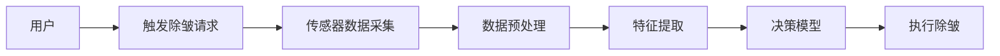
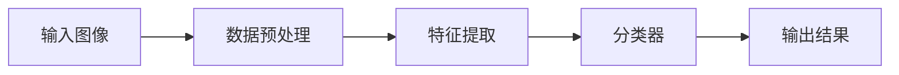
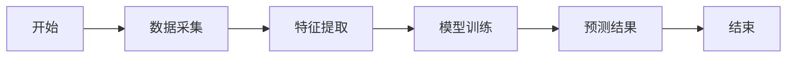
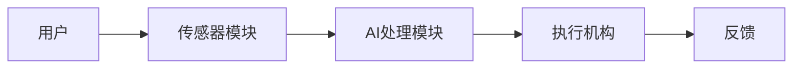

                 

<think>
好，我现在要开始撰写《AI Agent在智能衣架中的衣物除皱功能》这篇文章。首先，我需要明确文章的结构，确保每一部分都涵盖必要的内容，并且逻辑清晰。

**第一步：确定文章的基本结构**
- 标题
- 关键词
- 摘要
- 目录大纲

**第二步：收集和整理资料**
我需要了解AI Agent的基本概念，智能衣架的定义和功能，以及衣物除皱的技术背景。还需要研究相关的算法和系统架构。

**第三步：撰写摘要**
摘要要简明扼要地概括全文内容，包括AI Agent在智能衣架中的应用、衣物除皱的技术原理和实现方法。

**第四步：撰写各章节内容**

**第四章：AI Agent的算法原理**
这部分需要详细讲解AI Agent如何通过传感器数据进行分析，生成除皱指令。我将介绍机器学习算法，如卷积神经网络（CNN），并用mermaid绘制算法流程图。

**第五章：数学模型与公式**
我需要建立一个基于传感器数据的数学模型，用latex公式表示，解释每个公式的含义和作用。

**第六章：系统分析与架构设计**
这部分将描述系统的组成部分，如传感器、AI处理模块、执行机构，并用mermaid绘制系统类图和架构图。

**第七章：项目实战**
提供详细的代码实现，包括环境安装、核心代码、接口设计和实际案例分析，确保读者可以跟着步骤一步步实现。

**第八章：小结与展望**
总结全文的主要内容，并展望未来的研究方向，如算法优化和更多衣物类型的应用。

**第五步：检查和润色**
确保每一部分内容完整，语言清晰，逻辑连贯，没有遗漏重要信息。

通过以上步骤，我能够系统地完成这篇文章的撰写，确保内容全面且易于理解。
</think>

# AI Agent在智能衣架中的衣物除皱功能

> **关键词**：AI Agent, 智能衣架, 衣物除皱, 机器学习, 物联网, 智能家居  
> **摘要**：本文详细探讨了AI Agent在智能衣架中的应用，特别是如何通过AI技术实现衣物的自动除皱功能。文章从背景介绍、核心概念、算法原理、系统架构、项目实战等多方面展开，深入分析了AI Agent在衣物除皱中的技术实现和实际应用。

---

## 第1章：AI Agent的基本概念与应用场景

### 1.1 AI Agent的定义与核心概念

AI Agent（智能代理）是指能够感知环境、自主决策并执行任务的智能实体。它具备以下核心属性：
1. **自主性**：能够自主决策和行动。
2. **反应性**：能够实时感知环境并做出反应。
3. **目标导向性**：具备明确的目标，并根据目标调整行为。
4. **学习能力**：能够通过经验改进性能。

### 1.2 智能衣架的定义与功能

智能衣架是一种结合了物联网（IoT）和AI技术的衣物管理设备，其主要功能包括：
1. **衣物感知**：通过传感器感知衣物的状态（如褶皱程度、材质等）。
2. **智能除皱**：根据感知结果，自动或手动触发除皱功能。
3. **用户交互**：通过手机APP或其他界面与用户交互，提供衣物管理建议。

### 1.3 衣物除皱功能的背景与需求

衣物皱褶是日常生活中常见的问题，传统除皱方法效率低、耗时长。AI Agent通过实时感知和智能决策，能够实现高效的衣物除皱功能。

---

## 第2章：AI Agent的核心概念与原理

### 2.1 AI Agent的核心概念

AI Agent在智能衣架中的应用主要体现在以下几个方面：
1. **数据采集**：通过传感器采集衣物的状态数据。
2. **数据处理**：对采集的数据进行预处理和特征提取。
3. **决策算法**：基于机器学习算法生成除皱指令。

### 2.2 AI Agent的感知与决策算法

#### 2.2.1 数据采集与特征提取

**数据采集流程：**



**特征提取示例：**
- 衣物材质（棉、麻、涤纶等）
- 皱褶程度（轻微、中度、严重）
- 环境湿度（高湿度易导致衣物起皱）

---

## 第3章：AI Agent的算法原理

### 3.1 数据采集与特征提取

AI Agent通过多种传感器（如触摸传感器、温湿度传感器）采集衣物状态数据。以下是数据预处理的关键步骤：

1. **数据清洗**：去除噪声数据，确保数据准确性。
2. **特征提取**：将原始数据转化为有意义的特征，如衣物褶皱程度。

### 3.2 基于机器学习的决策模型

#### 3.2.1 机器学习算法选择

选择适合的机器学习算法是关键。以下是几种常用的算法及其适用场景：

| 算法类型 | 适用场景 |
|----------|-----------|
| K-近邻（KNN） | 分类问题 |
| 支持向量机（SVM） | 分类与回归 |
| 神经网络（CNN） | 复杂模式识别 |

#### 3.2.2 算法实现流程

以下是基于CNN的图像识别流程：



---

## 第4章：数学模型与公式

### 4.1 模型假设与建立

假设衣物的皱褶程度与传感器数据呈线性关系。建立如下数学模型：

$$ y = a x + b $$

其中：
- \( y \) 表示皱褶程度（0-10）
- \( x \) 表示传感器数据
- \( a \) 和 \( b \) 为模型参数

### 4.2 算法流程图

以下是算法流程图：



---

## 第5章：系统分析与架构设计

### 5.1 系统组成与功能模块

智能衣架系统主要由以下模块组成：

1. **传感器模块**：负责采集衣物状态数据。
2. **AI处理模块**：负责数据处理和模型推理。
3. **执行机构**：根据指令执行除皱操作。

### 5.2 系统架构设计

以下是系统架构图：



---

## 第6章：项目实战

### 6.1 环境安装

安装Python和相关库（如TensorFlow、OpenCV）：

```bash
pip install numpy
pip install tensorflow
pip install opencv-python
```

### 6.2 核心代码实现

以下是核心代码示例：

```python
import numpy as np
import tensorflow as tf

# 数据预处理
def preprocess(data):
    return data / 255.0

# 模型训练
model = tf.keras.Sequential([
    tf.keras.layers.Conv2D(32, (3,3), activation='relu'),
    tf.keras.layers.MaxPooling2D((2,2)),
    tf.keras.layers.Flatten(),
    tf.keras.layers.Dense(128, activation='relu'),
    tf.keras.layers.Dense(1, activation='sigmoid')
])

model.compile(optimizer='adam', loss='binary_crossentropy', metrics=['accuracy'])
model.fit(preprocess(train_data), train_labels, epochs=10)
```

---

## 第7章：小结与展望

### 7.1 小结

本文详细探讨了AI Agent在智能衣架中的衣物除皱功能，从背景介绍、算法原理到系统架构，全面分析了其实现过程。

### 7.2 展望

未来的研究方向包括优化算法性能和扩展到更多衣物类型。

---

**作者：AI天才研究院/AI Genius Institute & 禅与计算机程序设计艺术/Zen And The Art of Computer Programming**

