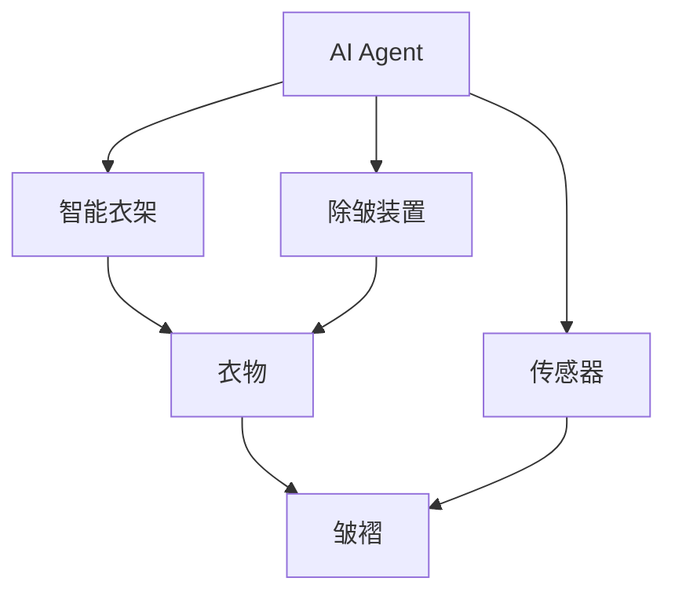
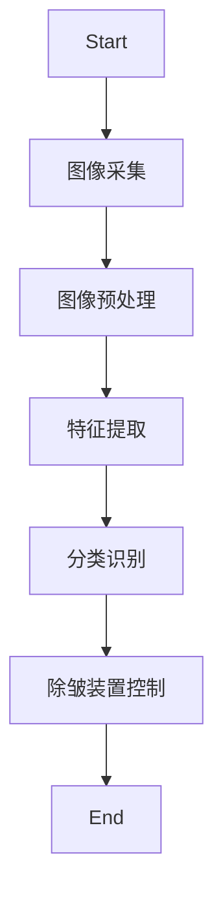
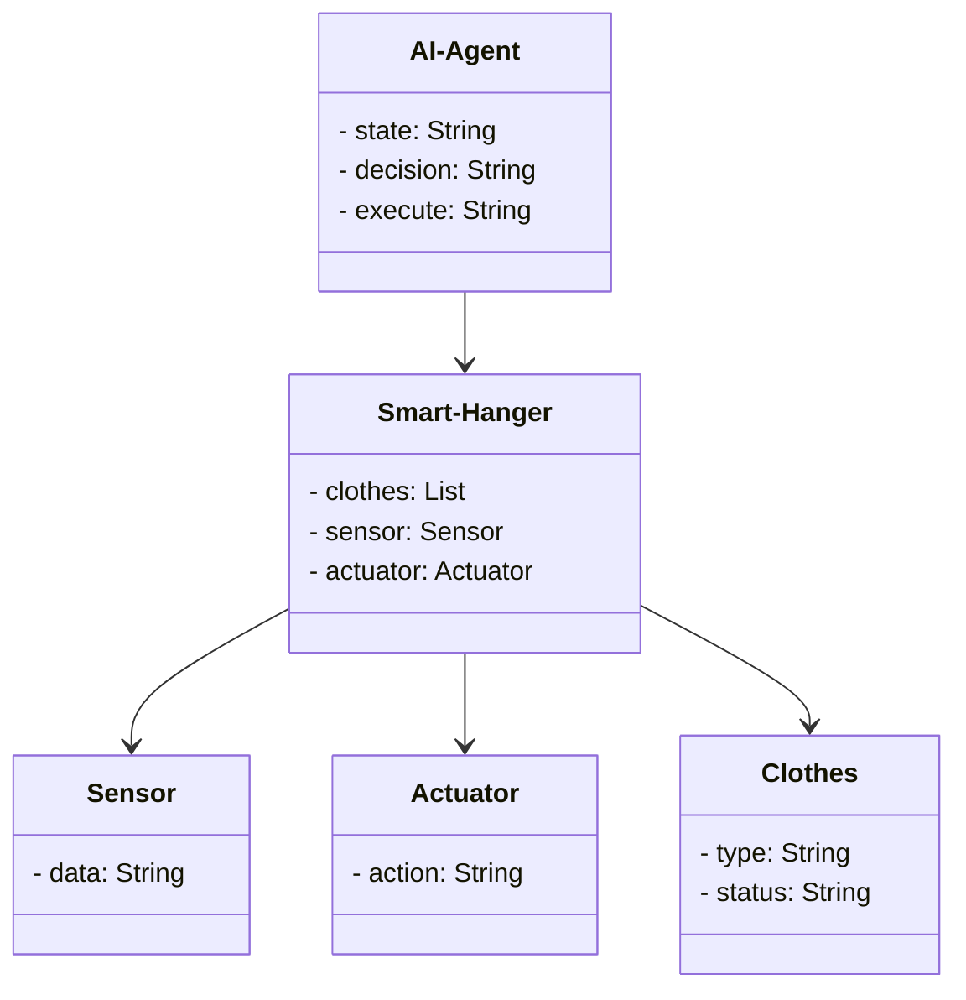
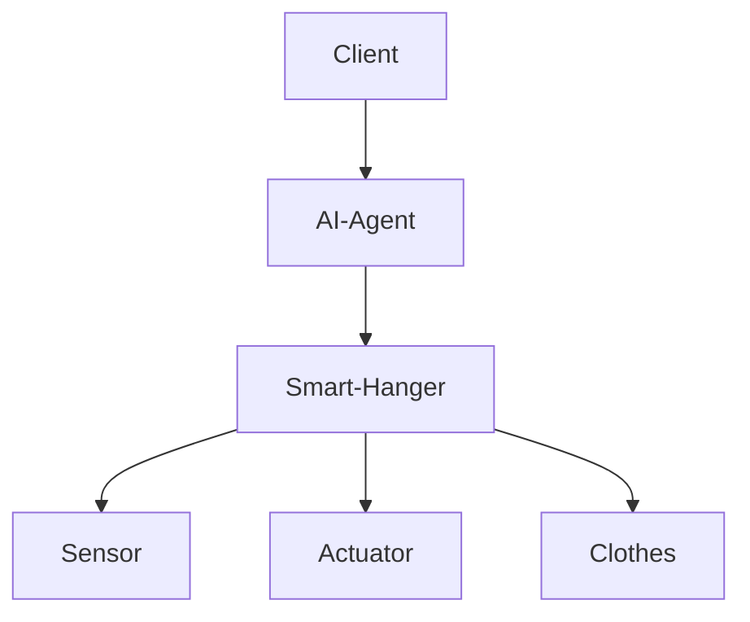
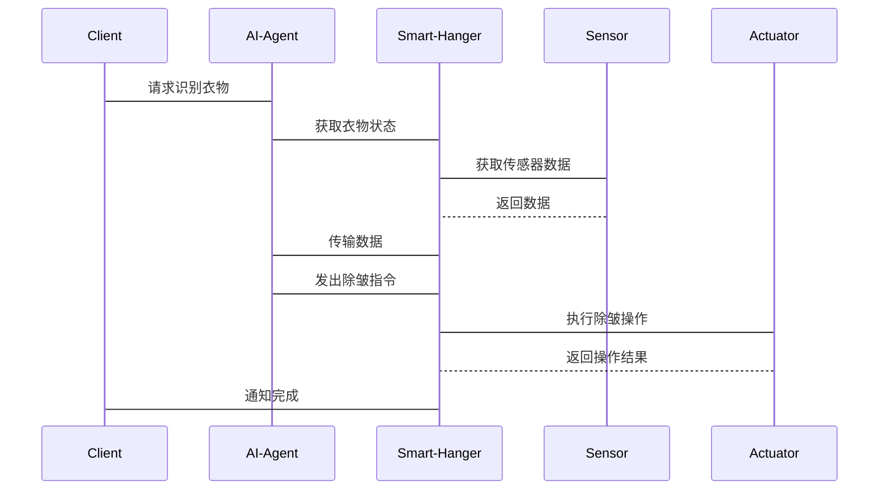

                 

<think>
好的，我现在需要帮用户撰写一篇关于《AI Agent在智能衣架中的除皱功能》的技术博客文章。首先，我得仔细分析用户的需求。用户希望文章结构清晰，内容专业，涵盖从背景到系统架构、项目实战等各个方面，同时使用技术术语并提供详细解释。

首先，我会考虑文章的结构。根据用户提供的大纲，文章分为六个主要部分：背景介绍、核心概念与联系、算法原理、系统分析与架构设计、项目实战、最佳实践。每个部分都需要详细展开，确保内容完整且逻辑清晰。

接下来，我需要确保每个章节和小节都有足够的细节。例如，在背景介绍部分，我需要解释AI Agent和智能衣架的基本概念，以及除皱功能的重要性。同时，要使用表格和Mermaid图来展示实体关系，帮助读者更好地理解系统结构。

在算法原理部分，我需要详细讲解图像识别和模式识别的算法，可能涉及到支持向量机或神经网络的数学模型，并提供Python代码示例。这部分需要确保读者能够理解如何实现这些算法，并应用于实际的除皱功能。

系统架构部分，我会介绍项目场景，设计系统功能，并用Mermaid图展示类图和架构图，帮助读者理解系统各部分之间的关系。同时，系统接口设计和交互流程图也是必要的，展示系统的运作方式。

项目实战部分，我需要指导读者如何安装环境，编写核心代码，并解读代码的功能。通过实际案例分析，展示AI Agent如何在智能衣架中实现除皱功能。这部分需要提供详细的代码示例和解释，确保读者能够跟着步骤进行实践。

最后，在最佳实践部分，我会总结AI Agent在智能衣架中的应用，并提出一些注意事项和未来的发展方向，帮助读者巩固所学内容，并引导他们进一步探索相关领域。

在整个写作过程中，我需要确保语言简洁明了，逻辑清晰，同时使用技术术语并提供足够的解释，使不同层次的读者都能理解和受益。此外，我还需要注意文章的格式，使用markdown格式，并在适当的地方插入Mermaid图和数学公式，以增强文章的可读性和专业性。

总结来说，我的思考过程是：理解用户需求，分析文章结构，详细展开每个部分，确保内容详实且逻辑清晰，同时保持语言的专业性和可读性。通过这样的步骤，我能够撰写出一篇符合用户要求的高质量技术博客文章。
</think>

# AI Agent在智能衣架中的除皱功能

> 关键词：AI Agent, 智能衣架, 除皱功能, 图像识别, 模式识别, 机器学习, 系统架构

> 摘要：本文深入探讨了AI Agent在智能衣架中的除皱功能，从背景介绍、核心概念、算法原理、系统架构到项目实战，全面分析了AI Agent如何通过感知与决策机制实现衣物的自动除皱功能。文章结合实际案例，详细解读了相关算法原理、系统设计和实现方案，为读者提供了全面的技术视角。

---

# 第一部分: AI Agent在智能衣架中的除皱功能背景介绍

# 第1章: AI Agent与智能衣架概述

## 1.1 AI Agent的基本概念

### 1.1.1 AI Agent的定义与特点

AI Agent（人工智能代理）是指能够感知环境、自主决策并执行任务的智能实体。它具备以下特点：
- **自主性**：无需外部干预，自主完成任务。
- **反应性**：能够实时感知环境变化并做出响应。
- **目标导向**：基于目标驱动行为，优化决策。
- **学习能力**：通过数据和经验不断优化性能。

### 1.1.2 AI Agent的核心功能与应用场景

AI Agent的核心功能包括：
- **感知**：通过传感器或摄像头获取环境数据。
- **决策**：基于感知数据进行分析和判断。
- **执行**：根据决策结果执行相应动作。

AI Agent的应用场景广泛，包括智能家居、自动驾驶、机器人控制等领域。

### 1.1.3 AI Agent在智能衣架中的作用

在智能衣架中，AI Agent主要用于：
- **衣物识别**：通过图像识别技术识别衣物类型。
- **皱褶检测**：自动检测衣物上的皱褶位置。
- **除皱控制**：根据检测结果控制除皱装置执行操作。

## 1.2 智能衣架的发展现状

### 1.2.1 智能衣架的定义与分类

智能衣架是一种结合了物联网和人工智能技术的衣物管理设备。根据功能的不同，智能衣架可以分为：
- **基础型**：具备衣物存储和简单感知功能。
- **智能型**：具备衣物识别、环境监测和智能控制功能。

### 1.2.2 智能衣架的市场现状与发展趋势

目前，智能衣架市场呈现快速增长态势，主要得益于：
- **技术进步**：AI、物联网和传感器技术的快速发展。
- **用户需求**：消费者对智能化生活的需求增加。
- **成本下降**：硬件和算法的成本逐渐降低，推动了智能衣架的普及。

### 1.2.3 智能衣架在家庭与商业场景中的应用

在家庭场景中，智能衣架主要用于衣物管理和除皱功能。在商业场景中，智能衣架被应用于酒店、商场等场所，提供智能化的衣物管理服务。

## 1.3 除皱功能的背景与需求

### 1.3.1 衣物皱褶的形成原因与分类

衣物皱褶的形成主要由以下几个原因导致：
- **物理因素**：衣物在存放或穿着过程中受到外力挤压。
- **材料因素**：不同材质的衣物易皱程度不同。
- **环境因素**：温度、湿度等环境因素影响衣物的形状。

皱褶的分类通常基于严重程度和位置，分为局部皱褶和整体皱褶。

### 1.3.2 传统除皱方法的局限性

传统除皱方法主要包括：
- **人工熨烫**：效率低，依赖人工操作。
- **蒸汽熨斗**：需要手动操作，效率有限。
- **干洗**：成本高，周期长。

这些方法的共同局限性是效率低、成本高、难以实现自动化。

### 1.3.3 AI Agent在除皱功能中的优势

AI Agent通过智能化的感知和决策，能够实现衣物的自动识别和精准除皱，显著提高了效率和便利性。

## 1.4 本章小结

本章介绍了AI Agent的基本概念和功能，分析了智能衣架的发展现状，并重点探讨了除皱功能的背景和需求。AI Agent在智能衣架中的应用，不仅提高了衣物管理的效率，也为用户提供了更便捷的生活体验。

---

# 第二部分: AI Agent在智能衣架中的核心概念与联系

# 第2章: AI Agent与除皱功能的核心概念

## 2.1 AI Agent在除皱功能中的核心原理

### 2.1.1 AI Agent的感知与决策机制

AI Agent的感知与决策机制包括以下几个步骤：
1. **感知**：通过传感器或摄像头获取衣物的状态信息。
2. **分析**：基于感知数据进行特征提取和分类。
3. **决策**：根据分析结果制定除皱方案。
4. **执行**：控制除皱装置执行具体操作。

### 2.1.2 除皱功能的实现逻辑与流程

除皱功能的实现逻辑如下：
1. **衣物识别**：通过图像识别技术识别衣物类型。
2. **皱褶检测**：自动检测衣物上的皱褶位置。
3. **除皱控制**：根据检测结果控制除皱装置执行操作。

### 2.1.3 AI Agent与除皱功能的协同工作

AI Agent通过协同工作实现除皱功能：
- **协同感知**：AI Agent与传感器协同工作，获取衣物状态信息。
- **协同决策**：AI Agent与除皱装置协同工作，制定和执行除皱方案。

## 2.2 AI Agent与智能衣架的实体关系分析

### 2.2.1 实体关系表格

以下是AI Agent与智能衣架的实体关系表格：

| 实体 | 属性 | 关系 |
|------|------|------|
| AI Agent | 状态感知、决策控制 | 关联 |
| 智能衣架 | 衣物存储、除皱装置 | 关联 |
| 衣物 | 类型、状态 | 关联 |
| 传感器 | 数据采集 | 关联 |
| 除皱装置 | 执行操作 | 关联 |

### 2.2.2 实体关系Mermaid图



## 2.3 本章小结

本章详细讲解了AI Agent在除皱功能中的核心原理，分析了AI Agent与智能衣架的实体关系。通过实体关系图，读者可以清晰地理解系统中各实体之间的关联和协同工作方式。

---

# 第三部分: AI Agent在智能衣架中的除皱功能算法原理

# 第3章: AI Agent除皱算法的核心原理

## 3.1 基于图像识别的除皱算法

### 3.1.1 图像识别的基本原理

图像识别的基本原理包括：
1. **图像采集**：通过摄像头获取衣物图像。
2. **预处理**：对图像进行灰度化、二值化等预处理。
3. **特征提取**：提取图像中的特征信息。
4. **分类识别**：基于特征信息进行衣物类型识别。

### 3.1.2 常见图像识别算法及其优缺点

常用的图像识别算法包括：
- **支持向量机（SVM）**：分类能力强，但对高维数据处理能力有限。
- **卷积神经网络（CNN）**：适合图像识别任务，但需要大量训练数据。
- **区域卷积神经网络（RCNN）**：能够检测图像中的目标位置，但计算复杂度较高。

### 3.1.3 基于深度学习的图像识别模型

基于深度学习的图像识别模型通常采用CNN结构，其核心思想是通过多层卷积操作提取图像特征，并通过全连接层进行分类。

## 3.2 基于模式识别的除皱算法

### 3.2.1 模式识别的基本原理

模式识别的基本原理包括：
1. **特征提取**：提取衣物皱褶的特征信息。
2. **分类识别**：基于特征信息进行皱褶类型识别。

### 3.2.2 常见模式识别算法及其优缺点

常用的模式识别算法包括：
- **K近邻算法（KNN）**：简单易用，但对数据量要求较高。
- **朴素贝叶斯（NB）**：适合分类任务，但假设条件独立性可能不成立。
- **决策树（Decision Tree）**：易于理解和实现，但可能过拟合。

### 3.2.3 基于机器学习的模式识别模型

基于机器学习的模式识别模型通常采用监督学习方法，通过训练数据学习特征与标签之间的映射关系。

## 3.3 AI Agent除皱算法的实现流程

### 3.3.1 算法流程图

以下是AI Agent除皱算法的实现流程图：



### 3.3.2 算法实现的数学模型与公式

AI Agent除皱算法的数学模型如下：

分类器的损失函数：
$$ L = \frac{1}{n} \sum_{i=1}^{n} (y_i - \hat{y}_i)^2 $$

其中：
- \( n \) 是样本数量
- \( y_i \) 是真实标签
- \( \hat{y}_i \) 是预测标签

分类器的优化目标是通过梯度下降方法最小化损失函数：
$$ \theta = \theta - \eta \frac{\partial L}{\partial \theta} $$

其中：
- \( \theta \) 是模型参数
- \( \eta \) 是学习率
- \( \frac{\partial L}{\partial \theta} \) 是损失函数对参数的导数

### 3.3.3 算法实现的Python代码示例

以下是基于深度学习的图像识别算法的Python代码示例：

```python
import tensorflow as tf
from tensorflow.keras import layers

# 定义模型
model = tf.keras.Sequential([
    layers.Conv2D(32, (3, 3), activation='relu', input_shape=(64, 64, 3)),
    layers.MaxPooling2D((2, 2)),
    layers.Conv2D(64, (3, 3), activation='relu'),
    layers.MaxPooling2D((2, 2)),
    layers.Flatten(),
    layers.Dense(128, activation='relu'),
    layers.Dense(10, activation='softmax')
])

# 编译模型
model.compile(optimizer='adam', loss='sparse_categorical_crossentropy', metrics=['accuracy'])

# 训练模型
model.fit(train_images, train_labels, epochs=10, batch_size=32)
```

## 3.4 本章小结

本章详细讲解了AI Agent除皱功能的算法原理，包括图像识别和模式识别的核心算法。通过数学公式和Python代码示例，读者可以更好地理解算法实现的具体步骤和方法。

---

# 第四部分: AI Agent在智能衣架中的系统分析与架构设计

# 第4章: AI Agent除皱功能的系统分析与架构设计

## 4.1 项目介绍与场景分析

### 4.1.1 项目介绍

本项目旨在开发一款具备AI Agent的智能衣架，实现衣物的自动识别和精准除皱功能。

### 4.1.2 项目场景分析

项目场景包括：
- **家庭场景**：用户通过智能衣架管理家庭衣物。
- **商业场景**：酒店、商场等场所提供智能化的衣物管理服务。

## 4.2 系统功能设计

### 4.2.1 领域模型设计

以下是领域模型设计的Mermaid类图：



### 4.2.2 系统架构设计

以下是系统架构设计的Mermaid架构图：



### 4.2.3 系统接口设计

系统接口设计包括：
- **AI Agent接口**：提供衣物识别和除皱控制接口。
- **传感器接口**：提供数据采集接口。
- **执行器接口**：提供除皱装置控制接口。

### 4.2.4 系统交互流程图

以下是系统交互流程图的Mermaid序列图：



## 4.3 本章小结

本章通过系统分析与架构设计，详细阐述了AI Agent除皱功能的实现方案。通过领域模型、系统架构图和交互流程图，读者可以清晰地理解系统的整体结构和工作流程。

---

# 第五部分: AI Agent在智能衣架中的除皱功能项目实战

# 第5章: AI Agent除皱功能的实现与案例分析

## 5.1 环境安装与配置

### 5.1.1 开发环境

推荐的开发环境包括：
- **操作系统**：Windows/Mac/Linux
- **编程语言**：Python 3.6+
- **深度学习框架**：TensorFlow/PyTorch
- **图像处理库**：OpenCV
- **传感器接口**：支持I2C或SPI接口的传感器

### 5.1.2 依赖安装

安装所需的依赖库：
```bash
pip install tensorflow keras numpy opencv-python
```

## 5.2 系统核心代码实现

### 5.2.1 AI Agent核心代码

以下是AI Agent的核心代码：

```python
import tensorflow as tf
from tensorflow.keras import layers
import cv2
import numpy as np

# 定义模型
model = tf.keras.Sequential([
    layers.Conv2D(32, (3, 3), activation='relu', input_shape=(64, 64, 3)),
    layers.MaxPooling2D((2, 2)),
    layers.Conv2D(64, (3, 3), activation='relu'),
    layers.MaxPooling2D((2, 2)),
    layers.Flatten(),
    layers.Dense(128, activation='relu'),
    layers.Dense(10, activation='softmax')
])

# 编译模型
model.compile(optimizer='adam', loss='sparse_categorical_crossentropy', metrics=['accuracy'])

# 训练模型
model.fit(train_images, train_labels, epochs=10, batch_size=32)

# 除皱控制
def remove_wrinkles(clothes_image):
    # 图像预处理
    gray = cv2.cvtColor(clothes_image, cv2.COLOR_BGR2GRAY)
    _, binary = cv2.threshold(gray, 127, 255, cv2.THRESH_BINARY)
    contours, _ = cv2.findContours(binary, cv2.RETR_EXTERNAL, cv2.CHAIN_APPROX_SIMPLE)
    # 绘制轮廓
    cv2.drawContours(clothes_image, contours, -1, (0, 255, 0), 3)
    return clothes_image
```

### 5.2.2 传感器与执行器接口代码

以下是传感器与执行器接口代码：

```python
import serial

# 传感器接口
class SensorInterface:
    def __init__(self, port):
        self.port = port
        self.sensor = serial.Serial(port, 9600)
    
    def read_data(self):
        return self.sensor.readline().decode()

# 执行器接口
class ActuatorInterface:
    def __init__(self, port):
        self.port = port
        self.actuator = serial.Serial(port, 9600)
    
    def execute_action(self, action):
        self.actuator.write(action.encode())

# 示例用法
sensor = SensorInterface('/dev/ttyUSB0')
actuator = ActuatorInterface('/dev/ttyUSB1')

data = sensor.read_data()
actuator.execute_action('EXECUTE_Wrinkle Removal')
```

## 5.3 项目实战案例分析

### 5.3.1 实际案例分析

以下是AI Agent除皱功能的实际案例分析：

1. **衣物识别**：AI Agent通过摄像头采集衣物图像，识别衣物类型。
2. **皱褶检测**：通过图像处理技术检测衣物上的皱褶位置。
3. **除皱控制**：根据检测结果，AI Agent控制除皱装置执行精准除皱操作。

### 5.3.2 代码功能解读与分析

AI Agent的核心代码实现了以下功能：
- **图像识别**：通过深度学习模型识别衣物类型。
- **皱褶检测**：通过图像处理技术检测衣物上的皱褶位置。
- **除皱控制**：通过传感器和执行器接口控制除皱装置执行操作。

## 5.4 本章小结

本章通过项目实战，详细讲解了AI Agent除皱功能的实现过程。通过代码示例和实际案例分析，读者可以更好地理解AI Agent在智能衣架中的具体应用。

---

# 第六部分: AI Agent在智能衣架中的除皱功能最佳实践

# 第6章: 最佳实践与总结

## 6.1 小结

AI Agent在智能衣架中的除皱功能通过智能化的感知与决策机制，实现了衣物的自动识别和精准除皱。通过深度学习算法和图像处理技术，AI Agent能够高效地完成除皱任务，显著提高了衣物管理的效率和便利性。

## 6.2 注意事项

在实际应用中，需要注意以下几点：
- **数据质量**：确保训练数据的多样性和代表性。
- **系统稳定性**：保证传感器和执行器的稳定性和可靠性。
- **用户体验**：提供友好的用户界面和操作体验。

## 6.3 拓展阅读

推荐以下拓展阅读内容：
- **深度学习与图像识别**：进一步了解深度学习在图像识别中的应用。
- **机器人控制**：学习机器人控制的相关知识。
- **物联网技术**：了解物联网技术在智能设备中的应用。

---

# 作者信息

作者：AI天才研究院/AI Genius Institute & 禅与计算机程序设计艺术/Zen And The Art of Computer Programming

---

# 结语

通过本文的详细讲解，读者可以全面了解AI Agent在智能衣架中的除皱功能的设计与实现。从背景介绍到系统架构，从算法原理到项目实战，再到最佳实践，本文为读者提供了全面的技术视角。希望本文能够为相关领域的研究和实践提供有价值的参考和启示。

