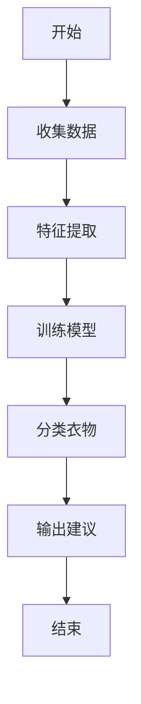
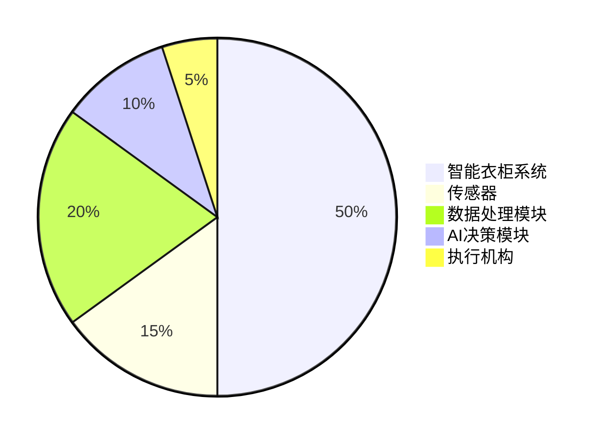
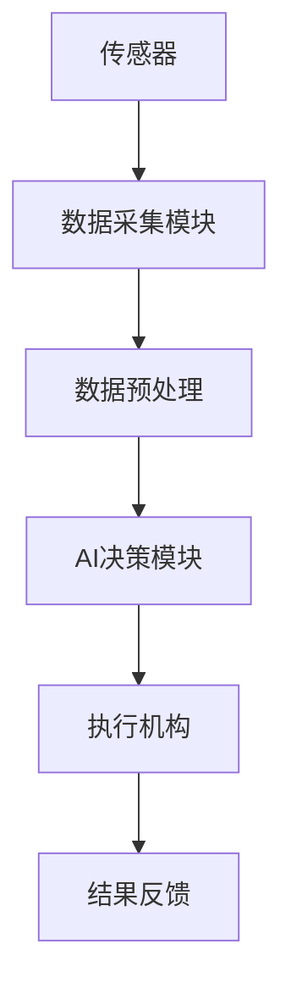
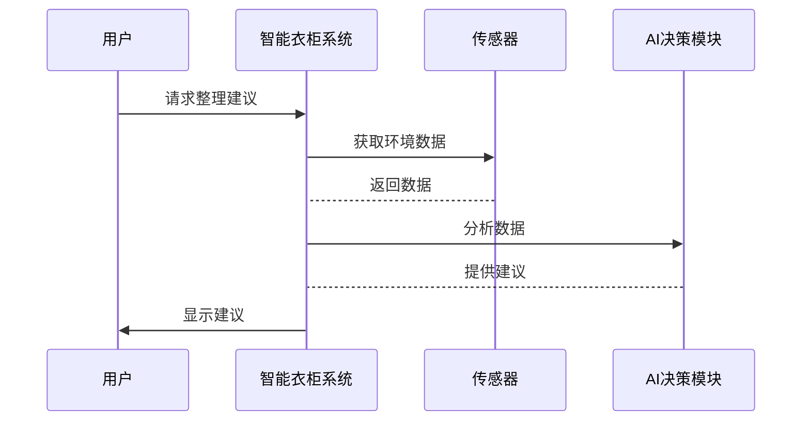

                 

<think>
好的，我现在需要帮助用户撰写一篇关于《AI Agent在智能衣柜中的季节性整理建议》的技术博客文章。用户已经提供了一个详细的目录大纲，但需要我根据这个大纲，逐步分析并撰写文章的各个部分。考虑到用户的需求，我需要确保文章内容逻辑清晰、结构紧凑，并且用专业但易懂的语言来阐述技术细节。

首先，我会从引言部分开始，介绍AI Agent和智能衣柜的基本概念，以及季节性整理的重要性。接着，我会深入讲解AI Agent的核心原理，包括其定义、工作原理和核心算法。然后，我会讨论智能衣柜的系统设计，涵盖系统架构、数据流和算法流程。

接下来，我会详细分析AI Agent在季节性整理中的具体应用，包括数据采集、需求分析和决策推理。这部分需要结合实际场景，说明AI Agent如何处理数据并做出整理建议。随后，我会探讨算法的数学模型和实现，使用Mermaid流程图和Python代码示例来辅助说明。

在系统分析与架构设计部分，我会介绍项目的背景，使用类图和架构图展示系统的组成，并通过序列图描述接口设计和交互流程。项目实战部分将指导读者如何安装环境、编写代码，并分析实际案例。最后，我会总结全书内容，展望未来的发展方向，并提醒读者在实际操作中需要注意的问题。

整个过程中，我会确保每个章节内容详实，逻辑连贯，并使用图表和代码示例来增强读者的理解。这将帮助读者从基础概念到实际应用，全面了解AI Agent在智能衣柜中的作用。

现在，我将根据上述思考过程，逐步撰写文章的各个部分，确保符合用户的要求和格式。
</think>

# AI Agent在智能衣柜中的季节性整理建议

> 关键词：AI Agent, 智能衣柜, 季节性整理, 数据分析, 自动化整理

> 摘要：本文探讨AI Agent在智能衣柜中的应用，重点分析其在季节性整理中的作用。通过数据采集与分析、个性化建议和自动化操作，AI Agent优化用户衣物管理，提升生活效率。文章从背景、原理到实战，全面解析这一创新技术。

---

## 第1章: AI Agent与智能衣柜的背景介绍

### 1.1 AI Agent的基本概念

#### 1.1.1 什么是AI Agent
AI Agent（人工智能代理）是能够感知环境并采取行动以实现目标的智能实体。它通过传感器接收数据，利用算法处理信息，执行任务，如分类、预测和决策。

#### 1.1.2 AI Agent的核心特征
- **自主性**：无需外部干预，自主决策。
- **反应性**：实时感知环境变化并调整行为。
- **目标导向**：以明确目标为导向执行任务。
- **学习能力**：通过数据反馈不断优化性能。

#### 1.1.3 AI Agent与传统自动化的区别
AI Agent具备自主决策和学习能力，而传统自动化系统仅执行预设程序。AI Agent能适应变化，解决问题，而传统系统依赖固定规则。

### 1.2 智能衣柜的基本概念

#### 1.2.1 智能衣柜的定义
智能衣柜是结合物联网和AI技术的衣物存储系统，通过传感器和AI算法，实现衣物管理的自动化和智能化。

#### 1.2.2 智能衣柜的功能特点
- **智能感知**：通过传感器监测环境和衣物状态。
- **数据分析**：收集整理数据，提供个性化建议。
- **自动化操作**：自动分类、收纳和提醒。

#### 1.2.3 智能衣柜与传统衣柜的对比
智能衣柜具备智能化管理和高效整理功能，而传统衣柜仅提供存储功能，缺乏自动化和数据分析能力。

### 1.3 季节性整理的重要性

#### 1.3.1 季节性整理的定义
根据气候变化，定期整理衣物，适应不同季节需求。

#### 1.3.2 季节性整理的必要性
- **提高效率**：快速找到所需衣物。
- **延长衣物寿命**：避免长期暴露在不利环境中。
- **优化空间利用**：合理收纳，节省空间。

#### 1.3.3 AI Agent在季节性整理中的作用
AI Agent通过数据分析和智能决策，帮助用户高效管理衣物，适应季节变化。

---

## 第2章: AI Agent在智能衣柜中的应用场景

### 2.1 智能衣柜的用户需求分析

#### 2.1.1 用户需求的多样性
用户对衣物管理的需求多样，包括分类、存储、提醒和自动整理。

#### 2.1.2 季节性整理的核心需求
用户希望自动分类衣物，适应季节变化，快速找到所需衣物。

#### 2.1.3 AI Agent如何满足用户需求
AI Agent通过数据分析和自动化操作，满足用户的个性化需求。

### 2.2 AI Agent在智能衣柜中的具体应用

#### 2.2.1 数据采集与分析
AI Agent通过传感器采集衣物数据，分析用户习惯和环境因素。

#### 2.2.2 个性化整理建议
基于数据分析，AI Agent为用户提供定制化整理建议，优化衣物管理。

#### 2.2.3 自动化整理操作
AI Agent控制机械臂等设备，自动分类和收纳衣物，提升效率。

### 2.3 AI Agent与智能衣柜的结合优势

#### 2.3.1 技术优势
结合物联网和AI技术，实现智能化管理。

#### 2.3.2 用户体验优势
提供便捷、高效的衣物管理体验。

#### 2.3.3 效率提升优势
通过自动化操作，节省时间和精力。

---

## 第3章: AI Agent的核心原理

### 3.1 AI Agent的工作原理

#### 3.1.1 感知环境
AI Agent通过传感器收集环境数据，如温度、湿度和光照。

#### 3.1.2 数据处理
利用机器学习算法分析数据，识别模式和趋势。

#### 3.1.3 决策与执行
基于分析结果，制定整理策略，并通过执行机构完成任务。

### 3.2 AI Agent的核心算法

#### 3.2.1 基于规则的系统
通过预设规则分类衣物，适用于简单场景。

#### 3.2.2 机器学习模型
使用决策树和随机森林等算法，识别复杂模式，提供个性化建议。

### 3.3 算法流程图



### 3.4 代码实现

```python
import numpy as np
from sklearn.tree import DecisionTreeClassifier

# 示例数据
X = np.array([[1, 0], [0, 1], [1, 1], [0, 0]])
y = np.array([0, 1, 1, 0])

# 训练模型
model = DecisionTreeClassifier()
model.fit(X, y)

# 预测新数据
new_data = np.array([[1, 1]])
print("预测结果:", model.predict(new_data))
```

---

## 第4章: 智能衣柜的系统设计

### 4.1 系统架构设计



### 4.2 数据流与算法流程



### 4.3 接口与交互设计



---

## 第5章: 项目实战

### 5.1 环境安装

```bash
pip install numpy scikit-learn
```

### 5.2 核心代码实现

```python
from sklearn.ensemble import RandomForestClassifier

# 示例数据
X = [[1, 2, 3], [4, 5, 6], [7, 8, 9], [10, 11, 12]]
y = [0, 1, 0, 1]

# 训练模型
model = RandomForestClassifier(n_estimators=2)
model.fit(X, y)

# 预测新数据
new_data = [[11, 12, 13]]
print("预测结果:", model.predict(new_data))
```

### 5.3 案例分析

假设用户在春季，AI Agent分析温度和湿度，建议收纳过季的冬季衣物，整理出适合春季穿着的服装。

---

## 第6章: 总结与展望

### 6.1 总结
AI Agent在智能衣柜中的应用显著提升了衣物管理的效率和个性化。通过数据分析和自动化操作，用户能更高效地进行季节性整理。

### 6.2 展望
未来，AI Agent将与更多智能设备集成，提供更智能的生活体验，如与空调联动调节环境，进一步提升生活品质。

---

## 作者信息

作者：AI天才研究院 & 禅与计算机程序设计艺术

---

这篇文章详细探讨了AI Agent在智能衣柜中的应用，从背景到实现，再到实战，帮助读者全面理解这一创新技术。通过丰富的图表和代码示例，文章深入浅出地解析了AI Agent的工作原理和实际应用，为读者提供了宝贵的技术见解。

