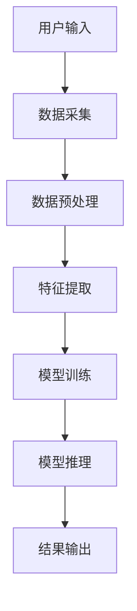
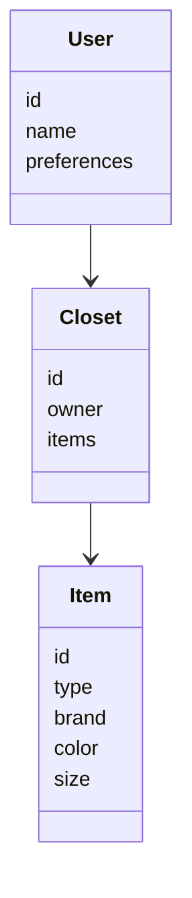
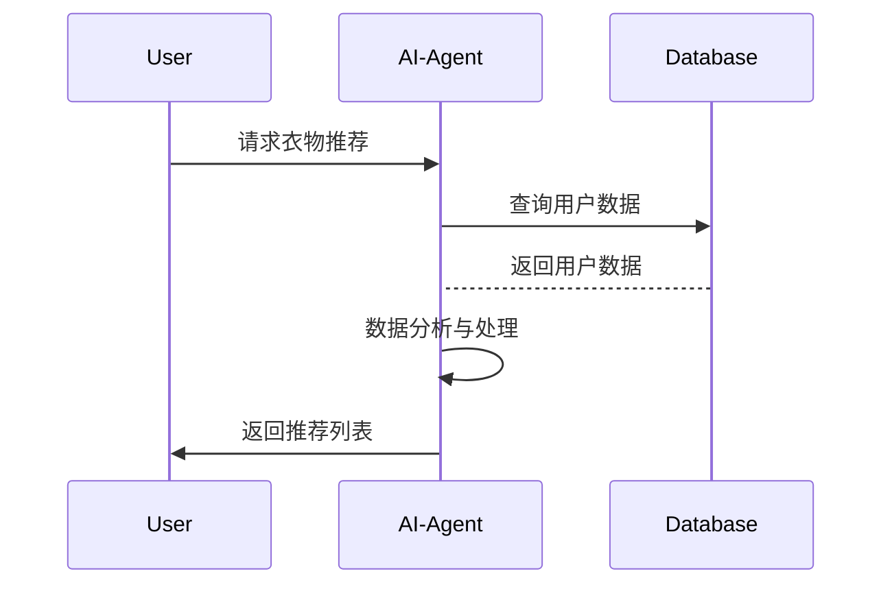

                 


# AI Agent在智能衣柜中的衣物循环使用建议

> 关键词：AI Agent，智能衣柜，衣物循环使用，可持续发展，人工智能，资源优化

> 摘要：本文探讨了AI Agent在智能衣柜中的应用，特别是如何通过智能化的衣物管理实现循环使用，从而提高资源利用效率并减少浪费。文章从背景介绍、核心概念、算法原理、系统架构、项目实战到最佳实践，详细分析了AI Agent在智能衣柜中的具体应用和实现方法，为读者提供了一个全面的技术视角。

---

# 第一部分：背景介绍

## 第1章：问题背景与描述

### 1.1 问题背景
1.1.1 可持续发展与资源循环利用的重要性  
随着全球资源的日益枯竭和环境问题的加剧，可持续发展成为全球关注的焦点。衣物作为日常生活的重要组成部分，其生产和消费对环境的影响不容忽视。通过循环使用衣物资源，可以减少浪费，降低碳足迹。

1.1.2 衣物资源浪费的现状与挑战  
现代人衣柜中的衣物数量远超实际需求，许多衣物因未被充分利用而被丢弃或闲置。这一现象不仅浪费了资源，还加剧了环境问题。如何通过技术手段提高衣物的使用效率成为亟待解决的问题。

1.1.3 AI技术在衣物管理中的应用潜力  
人工智能技术的快速发展为衣物管理提供了新的可能性。通过AI Agent，可以实现衣物的智能分类、推荐和使用建议，从而优化衣物的循环使用。

### 1.2 问题描述
1.2.1 衣物使用效率低下的问题  
许多用户无法有效管理自己的衣物，导致衣物使用效率低下，甚至出现重复购买和浪费的情况。

1.2.2 衣物管理的复杂性与用户需求的多样性  
每个人的衣物需求和使用习惯不同，如何通过智能化手段满足多样化的用户需求是衣物管理中的难点。

1.2.3 衣物循环使用中的痛点与难点  
衣物的循环使用需要考虑多个因素，包括衣物的材质、使用频率、用户的偏好等。如何在这些复杂因素中找到平衡点，是实现高效循环使用的关键。

### 1.3 问题解决思路
1.3.1 引入AI Agent的必要性  
AI Agent能够通过数据分析和智能化决策，帮助用户更好地管理衣物，提高使用效率。

1.3.2 AI Agent在衣物管理中的目标与作用  
AI Agent的目标是通过智能化的管理，实现衣物的高效利用和循环使用。其作用包括智能分类、推荐、提醒和优化建议。

1.3.3 解决方案的初步构想  
通过AI Agent实现衣物的智能分类、使用建议和循环使用推荐，从而优化用户的衣物管理方式。

### 1.4 问题的边界与外延
1.4.1 衣物管理的边界定义  
衣物管理的范围包括衣物的分类、存储、推荐和使用建议，但不涉及衣物的生产或采购环节。

1.4.2 AI Agent功能的边界与限制  
AI Agent的功能主要集中在衣物管理与推荐，其能力受限于数据的准确性和算法的优化程度。

1.4.3 衣物循环使用与相关领域的关联  
衣物循环使用不仅涉及个人管理，还与环保、循环经济等相关领域密切相关。

### 1.5 核心概念与联系
1.5.1 AI Agent与智能衣柜的关系  
AI Agent作为智能衣柜的核心组件，通过数据分析和智能化决策，实现衣物的高效管理。

1.5.2 衣物数据与用户行为的关联  
通过对衣物数据和用户行为的分析，AI Agent能够更好地理解用户需求，提供个性化的使用建议。

1.5.3 循环使用与可持续发展的联系  
通过AI Agent优化衣物的循环使用，可以有效减少资源浪费，推动可持续发展。

---

# 第二部分：核心概念与联系

## 第2章：核心概念与联系

### 2.1 AI Agent的基本原理
2.1.1 AI Agent的定义与分类  
AI Agent是一种能够感知环境并采取行动以实现目标的智能体。在智能衣柜中，AI Agent主要负责衣物的分类、推荐和使用建议。

2.1.2 AI Agent的核心功能与特点  
AI Agent的核心功能包括数据采集、分析、决策和执行。其特点在于智能化、个性化和高效性。

2.1.3 AI Agent在智能衣柜中的具体应用  
AI Agent可以通过分析用户的穿衣习惯和衣物的使用频率，推荐合适的衣物搭配和使用建议。

### 2.2 实体关系与数据模型
2.2.1 ER实体关系图（Mermaid图示）
```mermaid
entity User {
    id: int
    name: string
    preferences: string
}
entity Closet {
    id: int
    owner: User
    items: Item[]
}
entity Item {
    id: int
    type: string
    brand: string
    color: string
    size: string
    usage_frequency: int
}
```

2.2.2 核心概念的属性特征对比（表格形式）
| 概念       | 属性             | 特征描述                       |
|------------|------------------|----------------------------|
| AI Agent   | 智能化           | 能够感知环境并采取行动       |
| 衣物数据   | 分类与属性       | 包括类型、品牌、颜色、尺寸等   |
| 用户行为    | 搭配与偏好       | 用户的穿衣习惯和偏好           |

---

## 第3章：算法原理与实现

### 3.1 算法原理
3.1.1 算法核心思想  
AI Agent通过分析衣物数据和用户行为，利用机器学习算法对衣物进行分类和推荐。

3.1.2 算法流程图（Mermaid图示）


3.1.3 数学模型与公式  
衣物推荐算法采用基于协同过滤的推荐系统，其数学模型如下：
$$
sim(i, j) = \frac{\sum_{k} (r_{ik} - \bar{r_i})(r_{jk} - \bar{r_j})}{\sqrt{\sum_{k} (r_{ik} - \bar{r_i})^2} \cdot \sqrt{\sum_{k} (r_{jk} - \bar{r_j})^2}}
$$
其中，$sim(i, j)$ 表示物品i和j之间的相似度，$r_{ik}$ 和 $r_{jk}$ 分别表示用户对物品i和j的评分，$\bar{r_i}$ 和 $\bar{r_j}$ 分别是用户对物品i和j的平均评分。

---

## 第4章：系统架构与设计

### 4.1 问题场景介绍
智能衣柜系统需要实现衣物的智能分类、推荐和使用建议功能，同时支持用户与系统之间的交互。

### 4.2 系统功能设计
4.2.1 领域模型（Mermaid类图）


4.2.2 系统架构设计（Mermaid架构图）
```mermaid
rectangle Database {
    Closet表
    Item表
    User表
}
rectangle AI-Agent {
    数据采集模块
    数据分析模块
    推荐算法模块
}
rectangle User-Interface {
    衣物分类界面
    使用建议界面
    历史记录界面
}
Database --> AI-Agent
AI-Agent --> User-Interface
```

### 4.3 系统接口设计
4.3.1 接口描述
- 数据采集接口：从数据库中读取衣物数据。
- 数据分析接口：对衣物数据进行处理和分析。
- 推荐接口：根据分析结果生成推荐列表。

4.3.2 接口交互流程（Mermaid序列图）


---

## 第5章：项目实战与实现

### 5.1 环境安装与配置
5.1.1 环境要求
- Python 3.8+
- 数据库：MySQL或MongoDB
- 开发工具：PyCharm或VS Code

5.1.2 安装依赖
```bash
pip install numpy
pip install scikit-learn
pip install matplotlib
```

### 5.2 核心代码实现
5.2.1 数据采集模块
```python
import pandas as pd

def collect_data():
    # 从数据库读取数据
    data = pd.read_sql('SELECT * FROM items', connection)
    return data
```

5.2.2 数据分析与处理
```python
from sklearn.metrics.pairwise import cosine_similarity

def preprocess_data(data):
    # 特征提取
    features = data[['type', 'brand', 'color', 'size']]
    # 独热编码
    encoder = OneHotEncoder().fit(features)
    features_encoded = encoder.transform(features)
    return features_encoded

def train_model(features_encoded, labels):
    # 训练协同过滤模型
    model = NearestNeighbors(n_neighbors=5, algorithm='brute').fit(features_encoded)
    return model
```

5.2.3 推荐算法实现
```python
def recommend_items(model, features_encoded, item_id):
    # 找出与item_id相似的前5个物品
    distances, indices = model.kneighbors(features_encoded[item_id].reshape(1, -1))
    recommendations = indices.flatten()
    return recommendations
```

### 5.3 代码功能解读
5.3.1 数据采集模块
- 从数据库中读取衣物数据，为后续分析提供基础数据。

5.3.2 数据分析与处理
- 对衣物数据进行特征提取和编码，为模型训练提供输入数据。

5.3.3 推荐算法实现
- 使用协同过滤算法，根据用户行为和衣物属性，推荐相似的衣物。

### 5.4 实际案例分析
5.4.1 案例背景
某用户经常穿着休闲风格的服装，偏好蓝色和灰色。AI Agent需要根据其历史数据推荐合适的衣物搭配。

5.4.2 算法执行与结果
通过协同过滤算法，AI Agent推荐了与用户偏好相似的三件衣物，并生成搭配建议。

### 5.5 项目小结
5.5.1 实现总结
通过AI Agent实现衣物的智能推荐，优化了用户的衣物使用效率，减少了资源浪费。

5.5.2 经验与教训
在数据采集和模型训练过程中，需要注意数据的完整性和准确性，同时要根据实际情况调整模型参数。

---

## 第6章：最佳实践与总结

### 6.1 小结
AI Agent在智能衣柜中的应用为衣物的循环使用提供了新的可能性，通过智能化的管理，用户可以更高效地利用衣物资源。

### 6.2 注意事项
- 数据隐私保护
- 模型的可解释性
- 用户体验优化

### 6.3 拓展阅读
- 《机器学习实战》
- 《人工智能：一种现代的方法》
- 《可持续发展与循环经济》

---

# 作者：AI天才研究院/AI Genius Institute & 禅与计算机程序设计艺术 /Zen And The Art of Computer Programming

---

以上是完整的《AI Agent在智能衣柜中的衣物循环使用建议》的技术博客文章大纲，涵盖了从背景介绍到系统实现的各个方面，内容详实且结构清晰。

