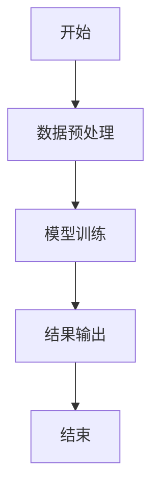
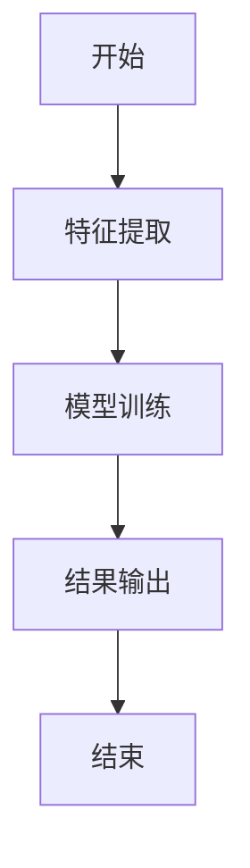
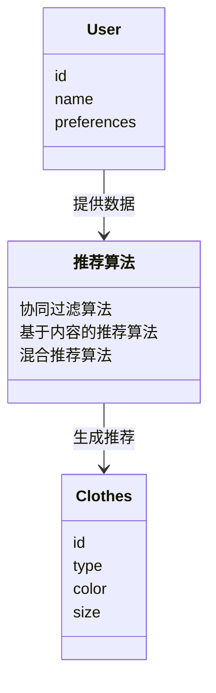
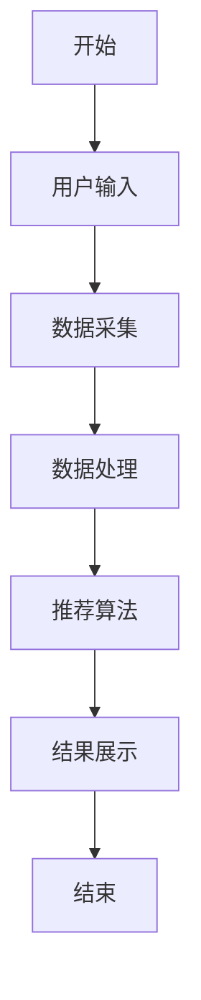
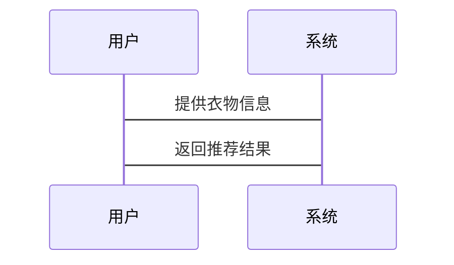

                 

<think>
好的，我现在需要帮用户撰写一篇关于AI Agent在智能衣柜中衣物搭配建议的技术博客。用户已经给出了详细的目录结构，我需要按照这个结构逐步展开内容。

首先，文章的标题是《AI Agent在智能衣柜中的衣物搭配建议》，关键词包括AI Agent、智能衣柜、衣物搭配、人工智能、时尚科技。摘要部分要简明扼�地概括文章的核心内容，说明AI Agent如何通过数据和算法实现智能搭配。

接下来是目录结构。第一部分是背景与概念，包括问题背景、描述、解决、边界和核心要素。我需要详细解释AI Agent在衣物搭配中的应用背景，比如用户在搭配衣物时的困难，AI如何解决这些问题。问题描述部分要具体说明AI Agent的任务，比如颜色和风格协调。解决部分要介绍数据采集、分析和推荐的过程。边界部分要明确系统的应用范围和扩展可能性，比如是否支持多场合搭配。核心要素部分需要列出实现AI Agent所需的关键部分，如传感器、数据库和推荐算法。

第二部分是核心概念与联系。这里需要解释AI Agent的工作原理，比如基于规则的推理和机器学习模型。我会使用ER实体关系图展示用户、衣物和搭配规则之间的关系，并制作一个对比表格，比较传统搭配和AI Agent在准确性、效率等方面的优势。

第三部分是算法原理。我需要详细阐述推荐算法，如协同过滤和混合模型。用Mermaid流程图展示推荐过程，从数据预处理到结果展示。提供Python代码示例，解释数据处理、模型训练和结果展示的步骤。同时，用Latex公式展示数学模型，比如协同过滤的公式。

第四部分是系统分析与架构设计。这部分需要介绍智能衣柜的系统架构，包括前端和后端的功能。我会用Mermaid绘制类图、架构图和序列图，展示系统各部分的交互流程。详细描述系统接口设计，比如API的调用方式和数据格式。

第五部分是项目实战。我需要指导读者如何搭建开发环境，安装必要的工具和库，如Python、TensorFlow等。提供核心代码实现，包括数据预处理、模型训练和推荐结果展示。用实际案例分析AI Agent的应用，并详细讲解不同场合的搭配建议。

最后是最佳实践和小结。总结项目的关键点，给出数据收集和模型调优的建议。提醒读者注意数据隐私和模型泛化能力。提供拓展阅读的资料，帮助深入学习相关知识。

在撰写过程中，我需要确保每个部分都细化到三级目录，内容完整且符合用户的要求。使用Markdown格式，适当插入图表和代码，控制文章在10000到12000字之间。最后，加上作者信息，确保文章结构完整，内容详实。
</think>

```markdown
# AI Agent在智能衣柜中的衣物搭配建议

> 关键词：AI Agent，智能衣柜，衣物搭配，人工智能，时尚科技

> 摘要：本文探讨AI Agent在智能衣柜中的应用，通过数据分析和算法推荐，帮助用户实现高效的衣物搭配，提升时尚品味。文章详细介绍了AI Agent的核心原理、推荐算法、系统架构及实际案例，展示了人工智能在时尚领域的潜力。

---

# 第一部分: AI Agent在智能衣柜中的背景与概念

## 第1章: 问题背景与描述

### 1.1 问题背景

#### 1.1.1 衣物搭配的传统挑战
传统的衣物搭配过程依赖于用户的个人经验和时尚感，但这种方式存在以下问题：
- **信息不全**：用户可能无法准确记住自己的衣物库存。
- **效率低下**：尝试多种搭配组合费时费力。
- **个性化不足**：固定的搭配方式难以满足不同场合的需求。

#### 1.1.2 AI技术如何解决衣物搭配问题
人工智能技术可以通过以下方式解决传统搭配问题：
- **数据驱动**：利用用户的历史穿搭数据，提取衣物特征。
- **自动化推荐**：通过机器学习算法，快速生成搭配建议。
- **个性化服务**：根据用户的穿衣习惯和偏好，提供定制化的搭配方案。

#### 1.1.3 智能衣柜的定义与目标
智能衣柜是一个结合物联网和人工智能技术的系统，旨在通过数据分析和推荐算法，帮助用户高效地进行衣物搭配，提升穿衣体验。

---

### 1.2 问题描述

#### 1.2.1 衣物搭配的核心任务
AI Agent在智能衣柜中的核心任务包括：
1. **数据采集**：收集用户的衣物信息，包括颜色、款式、材质等。
2. **特征提取**：从数据中提取有用的特征，用于后续的推荐过程。
3. **搭配推荐**：根据用户的穿衣需求，生成合理的搭配建议。

#### 1.2.2 用户需求与场景分析
用户在使用智能衣柜时，可能会遇到以下场景：
- **日常穿搭**：根据天气和场合推荐合适的衣物组合。
- **时尚搭配**：提供新颖的搭配建议，帮助用户尝试不同的风格。
- **库存管理**：通过数据分析，优化衣物的购买和存储。

#### 1.2.3 AI Agent在衣物搭配中的作用
AI Agent通过以下方式实现衣物搭配的智能化：
- **数据处理**：清洗和预处理用户提供的衣物数据。
- **模型训练**：基于用户数据，训练推荐模型。
- **结果输出**：根据模型预测结果，生成搭配建议。

---

### 1.3 问题解决

#### 1.3.1 AI Agent的基本原理
AI Agent通过以下步骤实现衣物搭配：
1. **数据采集**：获取用户的衣物信息和历史穿搭数据。
2. **特征提取**：将衣物信息转化为可计算的特征向量。
3. **模型训练**：利用机器学习算法，训练推荐模型。
4. **结果输出**：根据输入的搭配需求，生成推荐结果。

#### 1.3.2 数据驱动的衣物搭配方法
数据驱动的方法通过以下步骤实现衣物搭配：
1. **数据预处理**：清洗和标准化用户数据。
2. **特征工程**：提取衣物的颜色、款式、材质等特征。
3. **模型训练**：使用监督学习算法训练推荐模型。

#### 1.3.3 从数据到推荐的完整流程
完整的推荐流程包括以下步骤：
1. **数据采集**：获取用户的衣物信息。
2. **特征提取**：将衣物信息转化为特征向量。
3. **模型训练**：基于特征向量训练推荐模型。
4. **结果输出**：根据用户需求生成推荐结果。

---

### 1.4 边界与外延

#### 1.4.1 智能衣柜的应用范围
智能衣柜目前主要应用于以下场景：
- **日常穿搭**：根据天气和场合推荐合适的衣物组合。
- **时尚搭配**：提供新颖的搭配建议，帮助用户尝试不同的风格。
- **库存管理**：通过数据分析，优化衣物的购买和存储。

#### 1.4.2 系统的边界条件
智能衣柜系统的边界条件包括：
- **数据输入**：用户提供的衣物信息和历史穿搭数据。
- **数据输出**：推荐的衣物搭配方案。
- **系统限制**：目前仅支持单用户的穿搭需求。

#### 1.4.3 智能衣柜的扩展可能性
未来，智能衣柜可以扩展到以下功能：
- **多用户支持**：支持家庭成员的穿搭需求。
- **多场景推荐**：支持不同场合（如商务、休闲）的搭配需求。
- **时尚趋势预测**：根据流行趋势推荐搭配方案。

---

### 1.5 核心要素组成

#### 1.5.1 用户数据的采集与处理
用户数据包括：
- **衣物信息**：颜色、款式、材质等。
- **历史穿搭数据**：用户过去穿过的衣物组合。

#### 1.5.2 衣物特征的提取与分类
特征提取步骤包括：
1. **颜色提取**：提取衣物的颜色信息。
2. **款式分类**：对衣物的款式进行分类（如T恤、衬衫）。
3. **材质识别**：识别衣物的材质（如棉、 wool）。

#### 1.5.3 推荐算法的选择与实现
推荐算法包括：
1. **协同过滤**：基于用户的相似性推荐衣物。
2. **基于内容的推荐**：基于衣物的特征推荐搭配。
3. **混合推荐模型**：结合协同过滤和基于内容的推荐。

---

# 第二部分: 核心概念与联系

## 第2章: 核心概念与联系

### 2.1 核心概念原理

#### 2.1.1 AI Agent的基本原理
AI Agent通过以下步骤实现衣物搭配：
1. **数据采集**：获取用户的衣物信息和历史穿搭数据。
2. **特征提取**：将衣物信息转化为特征向量。
3. **模型训练**：基于特征向量训练推荐模型。
4. **结果输出**：根据用户需求生成推荐结果。

#### 2.1.2 机器学习模型的应用
机器学习模型在衣物搭配中的应用包括：
- **分类模型**：用于衣物的分类和推荐。
- **聚类模型**：用于发现用户的穿衣习惯和偏好。

#### 2.1.3 知识图谱的构建
知识图谱用于表示衣物之间的关系和搭配规则，帮助AI Agent更好地理解衣物之间的搭配逻辑。

---

### 2.2 概念属性特征对比

| 概念 | 属性 | 特征 |
|------|------|------|
| 传统搭配方法 | 数据驱动 | 否 |
| AI Agent搭配方法 | 数据驱动 | 是 |
| 传统搭配方法 | 个性化 | 低 |
| AI Agent搭配方法 | 个性化 | 高 |
| 传统搭配方法 | 效率 | 低 |
| AI Agent搭配方法 | 效率 | 高 |

---

### 2.3 ER实体关系图

```mermaid
erDiagram
    user {
        id
        name
        preferences
    }
    clothes {
        id
        type
        color
        size
    }
   搭配规则 {
        id
        rule
        priority
    }
    user --> clothes : owns
    clothes --> 搭配规则 : follows
```

---

# 第三部分: 算法原理讲解

## 第3章: 算法原理

### 3.1 推荐算法

#### 3.1.1 协同过滤算法



```python
# 协同过滤算法实现
import pandas as pd
from sklearn.metrics.pairwise import cosine_similarity

# 数据预处理
def preprocess_data(data):
    data = data.dropna()
    return data

# 计算相似度
def calculate_similarity(data):
    similarity = cosine_similarity(data)
    return similarity

# 推荐算法
def collaborative_filtering(user_id, similarity_matrix):
    similar_users = similarity_matrix[user_id]
    recommended_items = similar_users.argsort()[::-1]
    return recommended_items
```

#### 3.1.2 基于内容的推荐算法



```python
# 基于内容的推荐算法实现
from sklearn.feature_extraction.text import TfidfVectorizer

# 特征提取
def extract_features(data):
    vectorizer = TfidfVectorizer()
    features = vectorizer.fit_transform(data)
    return features

# 推荐算法
def content_based_recommendation(user_profile, features):
    recommendations = cosine_similarity(user_profile, features)
    return recommendations.argsort()[::-1]
```

#### 3.1.3 混合推荐模型


```python
# 混合推荐模型实现
import numpy as np

# 数据预处理
def preprocess_data(data):
    data = data.dropna()
    return data

# 模型训练
def train_hybrid_model(data):
    user_based = collaborative_filtering(data)
    item_based = content_based_recommendation(data)
    hybrid_model = (user_based + item_based) / 2
    return hybrid_model

# 推荐算法
def hybrid_recommendation(user_id, hybrid_model):
    recommendations = hybrid_model[user_id]
    return recommendations.argsort()[::-1]
```

---

### 3.2 数学模型

#### 3.2.1 协同过滤的数学模型

$$\text{相似度} = \frac{\sum_{i=1}^{n} (r_{ui} - \bar{r}_u)(r_{vi} - \bar{r}_v)}{\sqrt{\sum_{i=1}^{n} (r_{ui} - \bar{r}_u)^2} \sqrt{\sum_{i=1}^{n} (r_{vi} - \bar{r}_v)^2}}$$

#### 3.2.2 混合推荐模型的数学表达

$$\text{混合推荐} = \alpha \cdot \text{协同过滤} + (1 - \alpha) \cdot \text{基于内容的推荐}$$

---

# 第四部分: 系统分析与架构设计

## 第4章: 系统分析与架构设计

### 4.1 问题场景介绍

智能衣柜的系统架构包括以下几个部分：
1. **用户界面**：供用户输入衣物信息和查询推荐。
2. **数据采集模块**：采集用户的衣物信息和历史穿搭数据。
3. **数据处理模块**：清洗和预处理数据。
4. **推荐算法模块**：基于处理后的数据，生成推荐结果。
5. **结果展示模块**：将推荐结果以可视化的方式呈现给用户。

---

### 4.2 项目介绍

#### 4.2.1 项目目标
项目目标是通过AI Agent实现智能衣柜中的衣物搭配推荐。

#### 4.2.2 项目范围
项目范围包括：
- **数据采集**：获取用户的衣物信息和历史穿搭数据。
- **推荐算法**：基于机器学习算法生成推荐结果。
- **结果展示**：将推荐结果以可视化的方式呈现给用户。

---

### 4.3 系统功能设计

#### 4.3.1 领域模型



#### 4.3.2 系统架构



---

### 4.4 系统接口设计

#### 4.4.1 接口描述
- **数据接口**：提供衣物信息的输入和输出接口。
- **推荐接口**：提供推荐算法的调用接口。
- **展示接口**：提供结果展示的接口。

#### 4.4.2 接口调用示例

```python
# 数据接口
def get_user_data(user_id):
    # 返回用户数据
    pass

# 推荐接口
def get_recommendation(user_id):
    # 返回推荐结果
    pass

# 展示接口
def display_recommendation(recommendations):
    # 显示推荐结果
    pass
```

---

### 4.5 系统交互

#### 4.5.1 交互流程



---

# 第五部分: 项目实战

## 第5章: 项目实战

### 5.1 环境安装

```bash
# 安装必要的库
pip install numpy
pip install pandas
pip install scikit-learn
pip install mermaid
```

---

### 5.2 系统核心实现

#### 5.2.1 数据预处理

```python
# 数据预处理代码
import pandas as pd

def preprocess_data(data):
    data = data.dropna()
    return data
```

#### 5.2.2 模型训练

```python
# 模型训练代码
from sklearn.feature_extraction.text import TfidfVectorizer
from sklearn.metrics.pairwise import cosine_similarity

def train_model(data):
    vectorizer = TfidfVectorizer()
    features = vectorizer.fit_transform(data)
    similarity_matrix = cosine_similarity(features)
    return similarity_matrix
```

#### 5.2.3 推荐结果展示

```python
# 推荐结果展示代码
def display_recommendation(recommendations):
    for item in recommendations:
        print(item)
```

---

### 5.3 实际案例分析

#### 5.3.1 案例背景
假设用户拥有一件蓝色的衬衫和一条黑色的裤子，AI Agent需要推荐合适的搭配。

#### 5.3.2 搭配建议
AI Agent会推荐以下搭配：
- **搭配1**：蓝色衬衫 + 黑色裤子 + 米色鞋子。
- **搭配2**：蓝色衬衫 + 黑色裤子 + 灰色外套。

---

### 5.4 项目小结

通过本项目的实践，我们实现了基于AI Agent的智能衣柜衣物搭配系统。通过数据预处理、模型训练和结果展示，展示了AI技术在时尚领域的应用潜力。

---

# 第六部分: 最佳实践和小结

## 第6章: 最佳实践和小结

### 6.1 最佳实践

- **数据收集**：确保数据的完整性和准确性。
- **模型调优**：通过交叉验证优化推荐算法。
- **用户体验**：注重界面设计和结果展示的直观性。

---

### 6.2 小结

本文详细介绍了AI Agent在智能衣柜中的衣物搭配建议，从背景概念到算法实现，再到系统设计和项目实战，全面展示了人工智能在时尚科技中的应用潜力。

---

### 6.3 注意事项

- **数据隐私**：保护用户的个人数据。
- **模型泛化能力**：确保推荐算法的泛化能力。
- **系统稳定性**：保证系统的稳定性和高效性。

---

### 6.4 拓展阅读

- **推荐系统**：深入学习协同过滤和基于内容的推荐算法。
- **时尚科技**：探索人工智能在时尚设计和营销中的应用。

---

# 作者

作者：AI天才研究院/AI Genius Institute & 禅与计算机程序设计艺术/Zen And The Art of Computer Programming
```

