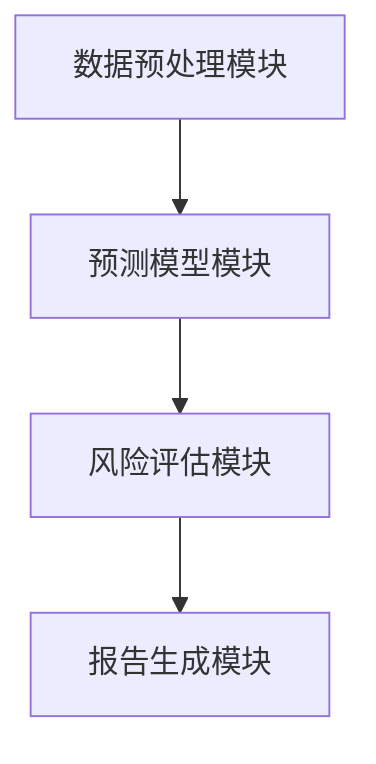
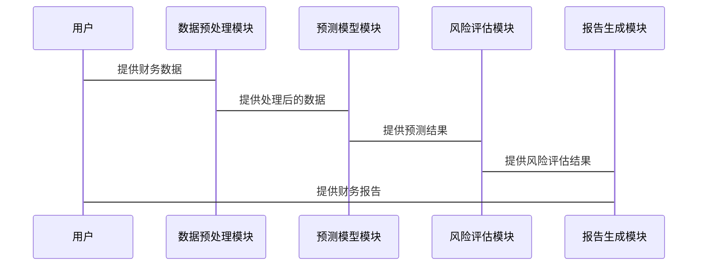

                 


# AI Agent在智能财务分析中的应用

> 关键词：AI Agent, 智能财务分析, 机器学习, 自然语言处理, 财务预测

> 摘要：本文探讨AI Agent在智能财务分析中的应用，涵盖AI Agent的基本概念、核心技术、算法原理、系统架构及实际案例，详细讲解AI Agent如何提升财务分析的效率和准确性，为读者提供全面的技术解析和应用指导。

---

# 第一部分: AI Agent在智能财务分析中的应用概述

## 第1章: AI Agent概述

### 1.1 AI Agent的基本概念

#### 1.1.1 AI Agent的定义
AI Agent（人工智能代理）是指能够感知环境、自主决策并执行任务的智能实体，通过传感器获取信息，利用算法处理数据，做出决策并采取行动。

#### 1.1.2 AI Agent的核心特征
- **自主性**：无需外部干预，自主完成任务。
- **反应性**：实时感知环境变化并做出反应。
- **目标导向**：基于目标驱动行动。
- **学习能力**：通过经验优化行为。

#### 1.1.3 AI Agent的分类与应用场景
- **简单反射型Agent**：基于规则执行任务，适用于结构简单任务。
- **基于模型的反射型Agent**：利用内部模型决策，适用于复杂场景。
- **目标驱动型Agent**：为实现特定目标主动行动。
- **实用驱动型Agent**：追求效用最大化，适用于资源优化。
- **学习型Agent**：通过机器学习改进性能，适用于动态环境。

### 1.2 财务分析的基本概念

#### 1.2.1 财务分析的定义与目的
财务分析是通过分析财务数据，评估企业财务状况、经营成果和现金流量，辅助决策的过程。

#### 1.2.2 财务分析的主要方法
- **比率分析**：评估企业财务状况。
- **趋势分析**：分析数据变化趋势。
- **预算分析**：对比实际与预算差异。

#### 1.2.3 财务分析的挑战与痛点
- 数据量大，处理复杂。
- 信息更新快，需实时分析。
- 分析结果需高准确性。

### 1.3 AI Agent在财务分析中的应用背景

#### 1.3.1 传统财务分析的局限性
- 依赖人工经验，效率低。
- 数据处理能力有限，难以应对海量数据。
- 分析结果可能存在偏差。

#### 1.3.2 AI技术在财务领域的潜力
- 提高数据处理效率。
- 增强分析准确性。
- 实现自动化报告生成。

#### 1.3.3 AI Agent在财务分析中的优势
- **自动化处理**：快速处理大量数据。
- **高精度分析**：降低人为错误。
- **实时反馈**：及时发现异常情况。

## 1.4 本章小结
本章介绍了AI Agent的基本概念、分类及其在财务分析中的应用背景，强调了AI Agent在提升财务分析效率和准确性方面的重要作用。

---

## 第2章: AI Agent的核心技术与原理

### 2.1 AI Agent的核心技术

#### 2.1.1 自然语言处理（NLP）
- **文本分析**：从财务报告中提取关键信息。
- **实体识别**：识别公司名称、金额等实体。
- **情感分析**：分析市场情绪。

#### 2.1.2 机器学习（ML）
- **监督学习**：用于分类和回归任务。
- **无监督学习**：用于聚类分析。
- **强化学习**：用于优化决策过程。

#### 2.1.3 数据挖掘与分析
- **数据清洗**：处理缺失值和异常值。
- **特征提取**：提取关键特征用于建模。
- **数据可视化**：通过图表展示分析结果。

### 2.2 AI Agent的算法原理

#### 2.2.1 基于规则的AI Agent
- **规则引擎**：根据预定义规则执行操作。
- **优点**：简单易懂，适合规则明确的任务。
- **缺点**：难以应对复杂场景。

#### 2.2.2 基于统计学习的AI Agent
- **回归分析**：预测数值型数据。
- **分类算法**：如决策树、随机森林，用于分类任务。
- **优点**：灵活性高，适合数据驱动的任务。
- **缺点**：依赖于数据质量。

#### 2.2.3 基于深度学习的AI Agent
- **神经网络**：用于复杂模式识别。
- **自然语言处理（NLP）**：如BERT，用于文本理解。
- **优点**：处理能力强，适合复杂场景。
- **缺点**：需要大量数据，计算资源消耗大。

### 2.3 AI Agent的决策机制

#### 2.3.1 基于知识图谱的决策
- **知识图谱构建**：将财务数据结构化。
- **推理引擎**：基于知识图谱进行推理。
- **优点**：知识表达能力强，推理过程透明。

#### 2.3.2 基于情境推理的决策
- **情境建模**：分析当前情境。
- **推理引擎**：根据情境做出决策。
- **优点**：适应性强，适合动态环境。

#### 2.3.3 基于强化学习的决策
- **强化学习框架**：通过试错优化策略。
- **状态空间**：环境中的各种状态。
- **动作空间**：可能采取的动作。
- **奖励函数**：评估决策的好坏。

### 2.4 本章小结
本章详细介绍了AI Agent的核心技术与算法原理，包括自然语言处理、机器学习、数据挖掘，以及基于规则、统计学习和深度学习的决策机制。

---

## 第3章: AI Agent在财务分析中的具体应用

### 3.1 财务数据的智能化处理

#### 3.1.1 数据清洗与预处理
- **数据清洗**：处理缺失值、重复值和异常值。
- **数据标准化**：将数据转换到统一尺度。
- **数据增强**：通过增加数据多样性提高模型性能。

#### 3.1.2 数据挖掘与特征提取
- **特征选择**：选择对分析结果影响大的特征。
- **特征工程**：创建新特征以提高模型性能。
- **特征提取**：利用主成分分析（PCA）提取关键特征。

#### 3.1.3 数据可视化与分析
- **数据可视化**：通过图表展示数据分布和趋势。
- **趋势分析**：识别数据中的趋势和周期性。
- **异常检测**：发现数据中的异常点。

### 3.2 财务预测与风险评估

#### 3.2.1 财务预测模型的构建
- **时间序列分析**：使用ARIMA模型预测未来趋势。
- **回归分析**：预测财务指标如销售额、利润。
- **机器学习模型**：如随机森林、梯度提升树。

#### 3.2.2 风险评估的AI Agent
- **信用评分**：评估客户的信用风险。
- **市场风险评估**：预测市场波动对财务的影响。
- **压力测试**：模拟极端情况下的财务表现。

#### 3.2.3 案例分析
- **案例1**：使用LSTM预测股票价格。
- **案例2**：利用随机森林评估信用风险。

### 3.3 智能财务报告生成

#### 3.3.1 自动化报告生成
- **自然语言处理**：将分析结果转换为自然语言报告。
- **模板引擎**：根据模板自动生成报告。
- **个性化定制**：根据用户需求定制报告内容。

#### 3.3.2 报告优化
- **内容优化**：确保报告内容准确、简洁。
- **格式优化**：调整报告格式以提高可读性。
- **版本控制**：管理报告的不同版本。

#### 3.3.3 案例分析
- **案例1**：使用spaCy提取财务报告中的关键信息。
- **案例2**：利用模板引擎生成季度财务报告。

## 3.4 本章小结
本章详细介绍了AI Agent在财务分析中的具体应用，包括数据处理、预测模型构建、风险评估和智能报告生成，并通过案例分析展示了实际应用效果。

---

## 第4章: 系统架构与实现方案

### 4.1 系统设计

#### 4.1.1 问题场景介绍
- **目标**：构建一个智能财务分析系统。
- **用户角色**：财务分析师、企业管理者。
- **功能需求**：数据处理、预测分析、风险评估、报告生成。

#### 4.1.2 系统功能设计
- **数据预处理模块**：负责数据清洗和特征提取。
- **预测模型模块**：构建和训练预测模型。
- **风险评估模块**：评估财务风险。
- **报告生成模块**：自动生成财务报告。

#### 4.1.3 系统架构设计
- **分层架构**：数据层、业务逻辑层、表现层。
- **组件交互**：各模块协同工作，完成整个流程。

### 4.2 系统实现

#### 4.2.1 系统架构图


#### 4.2.2 接口设计
- **数据接口**：与数据库交互，获取财务数据。
- **模型接口**：调用预测模型进行预测。
- **报告接口**：生成并输出财务报告。

#### 4.2.3 交互流程


### 4.3 本章小结
本章详细介绍了智能财务分析系统的架构设计和实现方案，展示了各模块的交互和协作过程。

---

## 第5章: 项目实战

### 5.1 环境安装

#### 5.1.1 安装Python
```bash
python --version
pip install --upgrade pip
```

#### 5.1.2 安装依赖库
```bash
pip install numpy pandas scikit-learn tensorflow
```

### 5.2 核心代码实现

#### 5.2.1 数据预处理代码
```python
import pandas as pd
import numpy as np

# 加载数据
data = pd.read_csv('financial_data.csv')

# 数据清洗
data.dropna(inplace=True)
data = data[~data.duplicated()]

# 特征提取
from sklearn.preprocessing import StandardScaler
scaler = StandardScaler()
scaled_data = scaler.fit_transform(data)
```

#### 5.2.2 预测模型实现
```python
from sklearn.ensemble import RandomForestRegressor
from sklearn.metrics import mean_squared_error

# 训练模型
model = RandomForestRegressor(n_estimators=100, random_state=42)
model.fit(scaled_data, target)

# 预测结果
predictions = model.predict(new_data)
```

#### 5.2.3 风险评估代码
```python
from sklearn.svm import SVC
from sklearn.metrics import accuracy_score

# 训练风险评估模型
svm_model = SVC()
svm_model.fit(features, labels)

# 预测风险
predicted_risk = svm_model.predict(test_features)
accuracy = accuracy_score(test_labels, predicted_risk)
```

#### 5.2.4 报告生成代码
```python
import docx

# 创建Word文档
doc = docx.Document()
doc.add_heading('财务分析报告', 0)

# 添加分析结果
paragraph = doc.add_paragraph('预测结果：')
paragraph.add_run(' 预测值为：' + str(predicted_value))

# 保存文档
doc.save('financial_analysis_report.docx')
```

### 5.3 案例分析

#### 5.3.1 数据来源与预处理
- 数据来源：上市公司财务报表。
- 数据清洗：处理缺失值和重复值。
- 特征提取：提取关键财务指标。

#### 5.3.2 模型训练与预测
- 训练模型：使用随机森林回归模型。
- 预测结果：预测未来季度的财务指标。
- 结果分析：评估模型的准确性和可靠性。

### 5.4 本章小结
本章通过实际项目实战，详细讲解了AI Agent在智能财务分析中的具体实现过程，包括环境搭建、数据处理、模型训练和报告生成。

---

## 第6章: 总结与展望

### 6.1 总结
本文详细探讨了AI Agent在智能财务分析中的应用，从基本概念到具体实现，展示了AI技术如何提升财务分析的效率和准确性。通过实际案例分析，验证了AI Agent在财务预测和风险评估中的有效性。

### 6.2 展望
未来，随着AI技术的不断发展，AI Agent在财务分析中的应用将更加广泛和深入。以下是未来的研究方向：
- **多模态AI Agent**：结合文本、图像等多种数据源进行分析。
- **知识图谱构建**：构建更复杂的财务知识图谱，提升推理能力。
- **隐私保护**：在数据处理中保护用户隐私。
- **可解释性提升**：提高AI决策的透明性和可解释性。

### 6.3 本章小结
本章总结了全文的主要内容，并展望了未来的研究方向，为读者提供了进一步研究的方向和思路。

---

## 作者：AI天才研究院/AI Genius Institute & 禅与计算机程序设计艺术 /Zen And The Art of Computer Programming

---

以上是《AI Agent在智能财务分析中的应用》的技术博客文章的完整大纲和内容。希望这篇文章能够为读者提供清晰的思路和技术指导，帮助他们理解AI Agent在财务分析中的应用及其实际价值。

