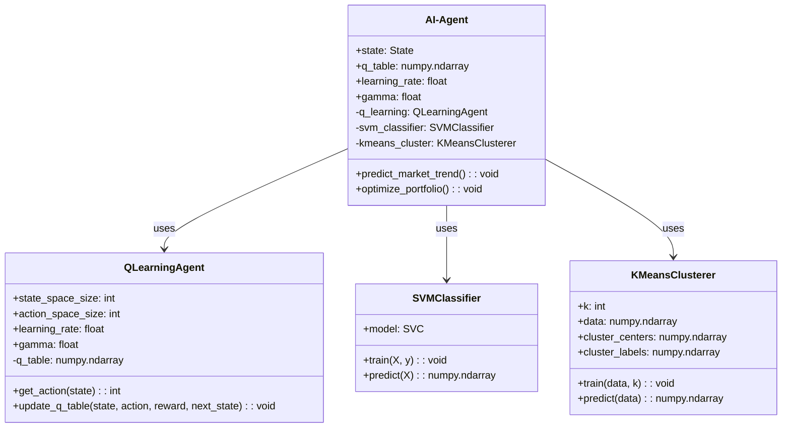
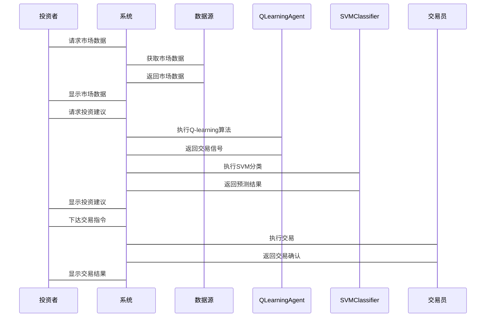

                 


# AI Agent在智能资产管理中的应用

## 关键词：
AI Agent, 智能资产管理, 强化学习, 聚类算法, 系统架构设计

## 摘要：
本文详细探讨了AI Agent在智能资产管理中的应用，从核心概念到算法原理，再到系统架构设计和项目实战，全面分析了AI Agent如何提升资产管理和投资决策的智能化水平。通过实际案例和最佳实践，展示了AI Agent在风险控制、投资组合优化等场景中的巨大潜力。

---

# 第1章: AI Agent与智能资产管理概述

## 1.1 AI Agent的基本概念

### 1.1.1 AI Agent的定义与特点

**AI Agent（人工智能代理）**是指能够感知环境、自主决策并采取行动以实现特定目标的智能实体。它具备以下特点：
- **自主性**：能够在没有外部干预的情况下独立运作。
- **反应性**：能够实时感知环境并做出响应。
- **目标导向**：所有行动都以实现预定目标为导向。
- **学习能力**：通过数据和经验不断优化自身行为。

AI Agent在智能资产管理中的应用，主要体现在通过算法分析市场数据、识别投资机会、优化资产配置等方面。

### 1.1.2 AI Agent的核心要素与功能

AI Agent的核心要素包括：
- **感知模块**：负责收集和处理环境信息（如市场数据）。
- **决策模块**：基于感知信息进行分析和决策。
- **行动模块**：根据决策结果执行操作（如买卖指令）。
- **学习模块**：通过反馈机制不断优化决策模型。

AI Agent的功能主要体现在数据处理、风险评估、投资决策等方面，能够显著提高资产管理的效率和准确性。

### 1.1.3 AI Agent与智能资产管理的关系

AI Agent通过智能化手段，将传统的资产管理过程从人工主导转变为技术驱动，实现更高效、更精准的资产管理和投资决策。AI Agent能够处理海量数据，识别复杂市场中的潜在机会和风险，从而帮助投资者做出更明智的投资决策。

## 1.2 智能资产管理的背景与挑战

### 1.2.1 资产管理的传统模式与痛点

传统资产管理主要依赖人工分析和经验判断，存在以下痛点：
- 数据量大：金融市场数据种类繁多，人工难以处理。
- 信息滞后：传统分析方法通常基于历史数据，难以实时捕捉市场变化。
- 人为误差：主观判断可能导致决策失误。

### 1.2.2 智能化转型的驱动力

随着技术的进步，特别是大数据和人工智能的发展，资产管理行业正在向智能化方向转型。智能化转型的主要驱动力包括：
- 提高决策效率：通过AI技术快速处理和分析数据。
- 降低人为风险：减少人为情绪和偏见对投资决策的影响。
- 实现个性化服务：通过AI技术为客户提供个性化的投资方案。

### 1.2.3 AI Agent在资产管理中的应用场景

AI Agent在资产管理中的应用场景包括：
- **风险控制**：实时监控市场风险，及时发出预警。
- **投资组合优化**：根据市场变化动态调整资产配置。
- **智能投顾**：为投资者提供个性化的投资建议。
- **市场预测**：基于历史数据和市场规律预测未来走势。

---

# 第2章: AI Agent的核心概念与联系

## 2.1 AI Agent的核心原理

### 2.1.1 AI Agent的感知与决策机制

AI Agent的感知与决策机制包括以下步骤：
1. **数据采集**：通过传感器或API获取市场数据。
2. **数据处理**：对数据进行清洗、转换和分析。
3. **决策制定**：基于分析结果制定投资策略。
4. **行动执行**：根据决策结果执行交易指令。

### 2.1.2 AI Agent的自主性与适应性

AI Agent的自主性体现在其无需外部干预即可完成任务。适应性则体现在其能够根据环境变化调整自身行为。例如，当市场出现突发情况时，AI Agent能够快速调整投资策略以应对变化。

### 2.1.3 AI Agent的多智能体协作

在复杂的金融市场中，单个AI Agent往往难以独立完成所有任务。通过多智能体协作，可以实现任务分工和信息共享，从而提高决策的准确性和效率。

## 2.2 AI Agent的类型与分类

### 2.2.1 基于规则的AI Agent

基于规则的AI Agent通过预设的规则和条件进行决策。例如，当某只股票的价格跌破某个阈值时，AI Agent会自动触发卖出指令。这种类型的AI Agent适用于规则明确、场景简单的场景。

### 2.2.2 基于机器学习的AI Agent

基于机器学习的AI Agent能够通过学习历史数据来识别数据中的模式和规律，并据此制定投资策略。例如，使用神经网络模型预测股票价格走势。

### 2.2.3 基于强化学习的AI Agent

基于强化学习的AI Agent通过与环境的互动获得奖励或惩罚，从而优化自身的决策策略。例如，AI Agent可以在模拟交易环境中不断尝试不同的交易策略，以找到最优的组合。

## 2.3 AI Agent的核心属性对比

以下表格展示了不同AI Agent类型的核心特征对比：

| **特性**         | **基于规则的AI Agent** | **基于机器学习的AI Agent** | **基于强化学习的AI Agent** |
|------------------|--------------------------|-----------------------------|-----------------------------|
| **决策依据**      | 预设规则                 | 历史数据学习                 | 环境反馈与奖励             |
| **灵活性**        | 较低                     | 较高                        | 最高                       |
| **应用场景**      | 简单场景                 | 复杂场景                     | 极度复杂的场景             |

## 2.4 AI Agent的实体关系图

以下是AI Agent与资产管理系统的ER图：

```mermaid
erd
    actor 投资者
    actor 经理人
    actor 交易员
    entity 资产
    entity 投资组合
    entity 交易记录
    entity 市场数据
    entity 风险报告
    entity 投资策略
    entity 交易信号
    entity 系统反馈

    投资者 --> 资产: 持有
    投资者 --> 投资组合: 投资于
    经理人 --> 投资组合: 管理
    交易员 --> 交易记录: 执行
    市场数据 --> 投资策略: 基于
    市场数据 --> 风险报告: 生成
    投资策略 --> 交易信号: 产生
    交易信号 --> 交易员: 执行
    交易记录 --> 系统反馈: 生成
    系统反馈 --> 投资策略: 优化
```

---

# 第3章: AI Agent的核心算法原理

## 3.1 强化学习算法

### 3.1.1 强化学习的基本原理

强化学习是一种通过试错方式来优化决策策略的算法。AI Agent通过与环境的互动获得奖励或惩罚，并根据反馈调整自身行为以最大化累计奖励。

### 3.1.2 Markov决策过程（MDP）的数学模型

Markov决策过程可以用以下数学模型描述：

$$ V(s) = \max_{a} [ r(s,a) + \gamma V(s') ] $$

其中：
- \( V(s) \) 表示状态 \( s \) 的价值函数。
- \( r(s,a) \) 表示在状态 \( s \) 下采取动作 \( a \) 所获得的奖励。
- \( \gamma \) 表示折扣因子，用于平衡当前奖励和未来奖励的重要性。
- \( s' \) 表示采取动作 \( a \) 后转移到的新状态。

### 3.1.3 Q-learning算法的实现

以下是Q-learning算法的实现代码：

```python
import numpy as np

class QLearningAgent:
    def __init__(self, state_space_size, action_space_size, learning_rate=0.1, gamma=0.99):
        self.state_space_size = state_space_size
        self.action_space_size = action_space_size
        self.learning_rate = learning_rate
        self.gamma = gamma
        self.q_table = np.zeros((state_space_size, action_space_size))
    
    def get_action(self, state):
        return np.argmax(self.q_table[state])
    
    def update_q_table(self, state, action, reward, next_state):
        target = reward + self.gamma * np.max(self.q_table[next_state])
        self.q_table[state, action] += self.learning_rate * (target - self.q_table[state, action])
```

---

## 3.2 监督学习算法

### 3.2.1 监督学习的基本原理

监督学习是一种通过训练数据预测目标变量的算法。AI Agent可以通过监督学习模型预测股票价格走势。

### 3.2.2 线性回归模型的数学公式

线性回归模型可以用以下公式表示：

$$ y = \beta x + \epsilon $$

其中：
- \( y \) 表示预测目标。
- \( x \) 表示输入特征。
- \( \beta \) 表示回归系数。
- \( \epsilon \) 表示误差项。

### 3.2.3 支持向量机（SVM）的实现

以下是SVM算法的实现代码：

```python
from sklearn.svm import SVC

class SVMClassifier:
    def __init__(self):
        self.model = SVC()
    
    def train(self, X, y):
        self.model.fit(X, y)
    
    def predict(self, X):
        return self.model.predict(X)
```

---

## 3.3 聚类算法

### 3.3.1 K-means算法的数学模型

K-means算法的目标函数可以用以下公式表示：

$$ \text{目标函数} = \sum_{i=1}^{k} \sum_{j=1}^{n_i} (x_j - c_i)^2 $$

其中：
- \( k \) 表示聚类的数量。
- \( n_i \) 表示第 \( i \) 个聚类中的数据点数量。
- \( x_j \) 表示第 \( j \) 个数据点。
- \( c_i \) 表示第 \( i \) 个聚类的中心。

### 3.3.2 聚类在资产分类中的应用

聚类算法可以用于将股票按相似性进行分类，从而帮助投资者识别潜在的投资机会。

---

# 第4章: 系统分析与架构设计

## 4.1 系统功能设计

### 4.1.1 资产数据采集与处理

系统需要采集市场数据，包括股票价格、成交量等，并进行清洗和转换。

### 4.1.2 AI Agent的决策模块

决策模块负责根据市场数据制定投资策略。

### 4.1.3 资产组合优化模块

优化模块根据决策结果动态调整资产配置。

## 4.2 系统架构设计

以下是系统架构设计的类图：



## 4.3 系统接口设计

系统需要提供以下接口：
- 数据接口：用于获取市场数据。
- 模型接口：用于调用AI Agent进行预测和决策。
- 用户接口：用于展示投资建议和交易记录。

## 4.4 系统交互设计

以下是系统交互的序列图：



---

# 第5章: 项目实战与应用案例

## 5.1 项目环境安装

### 5.1.1 安装Python和相关库

```bash
pip install numpy scikit-learn matplotlib
```

### 5.1.2 安装交易API

安装一个交易API，例如：

```bash
pip install pandas-datareader
```

## 5.2 系统核心实现

### 5.2.1 AI Agent的核心实现

以下是AI Agent的核心实现代码：

```python
from sklearn.svm import SVC
from sklearn.cluster import KMeans
import numpy as np

class AIAgent:
    def __init__(self, state_space_size, action_space_size):
        self.q_learning = QLearningAgent(state_space_size, action_space_size)
        self svm_classifier = SVMClassifier()
        self.kmeans_clusterer = KMeans(n_clusters=3)
    
    def predict_market_trend(self, market_data):
        self.svm_classifier.train(market_data, target)
        return self.svm_classifier.predict(market_data)
    
    def optimize_portfolio(self, portfolio):
        self.kmeans_clusterer.fit(portfolio)
        return self.kmeans_clusterer.predict(portfolio)
```

### 5.2.2 数据处理与分析

以下是数据处理的代码示例：

```python
import pandas as pd
import numpy as np

def load_data(ticker):
    data = pd.DataFrame({'price': prices, 'volume': volumes})
    return data
```

## 5.3 代码应用解读与分析

### 5.3.1 代码功能分析

上述代码实现了AI Agent的核心功能，包括市场趋势预测和资产组合优化。

### 5.3.2 代码实现细节

代码中使用了SVM进行市场趋势预测，使用K-means进行资产组合优化，同时结合Q-learning算法进行交易信号的生成。

## 5.4 实际案例分析

### 5.4.1 案例背景与数据准备

以某股票为例，加载过去一年的市场数据，包括开盘价、收盘价、最高价、最低价和成交量。

### 5.4.2 交易信号生成与投资策略优化

通过AI Agent生成交易信号，并根据信号执行买卖操作，实现投资收益的最大化。

## 5.5 项目小结

通过本案例，我们可以看到AI Agent在智能资产管理中的巨大潜力。通过结合多种算法，AI Agent能够实现高效的市场分析和投资决策，显著提高资产管理和投资的效率和准确性。

---

# 第6章: 总结与展望

## 6.1 总结

AI Agent通过智能化手段，显著提升了资产管理的效率和准确性。通过结合强化学习、监督学习和聚类算法，AI Agent能够在复杂多变的金融市场中实现高效的投资决策和风险控制。

## 6.2 未来研究方向

未来，随着技术的不断进步，AI Agent在智能资产管理中的应用将更加广泛和深入。研究方向包括：
- 更高效的算法设计：开发更智能、更高效的算法，以应对复杂的金融市场挑战。
- 更精准的数据分析：利用更先进的数据挖掘技术，提高市场预测的准确性。
- 更人性化的交互设计：开发更直观、更易用的用户界面，提升用户体验。

## 6.3 应用建议

建议资产管理机构积极引入AI Agent技术，通过智能化手段提升投资决策的效率和准确性。同时，投资者也需要加强技术学习，以便更好地利用AI Agent进行投资决策。

---

# 作者：AI天才研究院 & 禅与计算机程序设计艺术

---

以上是《AI Agent在智能资产管理中的应用》的完整目录和内容概览。每个章节都详细阐述了相关概念、算法和应用案例，结合代码示例和图表，帮助读者深入理解AI Agent在智能资产管理中的应用。

