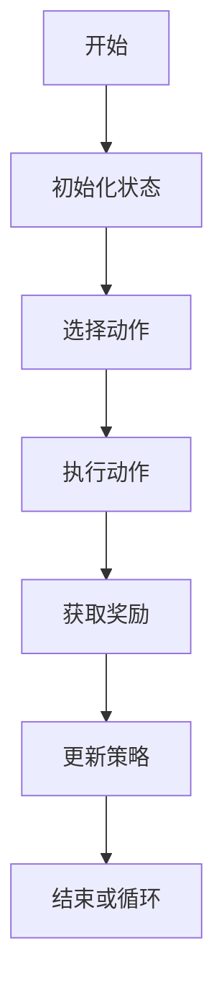
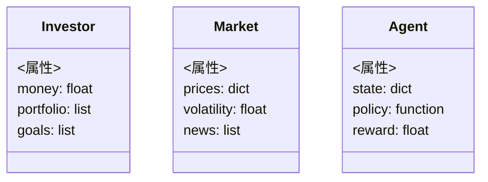
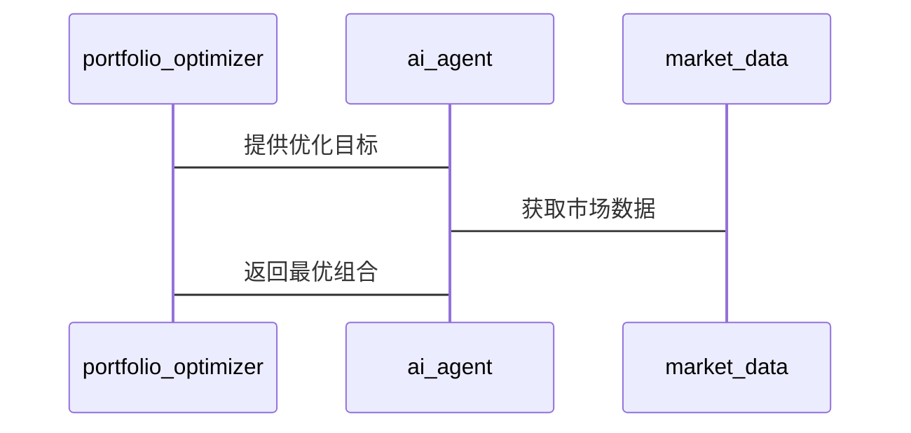

                 


```markdown
# AI Agent在智能资产组合优化中的应用

> 关键词：AI Agent，智能资产组合优化，强化学习，资产配置，风险控制，收益最大化

> 摘要：本文探讨AI Agent在智能资产组合优化中的应用，分析其核心原理、算法、系统架构，并通过实战案例展示其在金融投资中的优势。文章还提供了最佳实践建议和未来展望，帮助读者深入了解AI Agent在资产组合优化中的潜力和应用。

---

## 第一部分: AI Agent与智能资产组合优化的背景介绍

### 第1章: AI Agent与智能资产组合优化概述

#### 1.1 AI Agent的基本概念
##### 1.1.1 AI Agent的定义与特点
- AI Agent的定义：AI Agent是一种能够感知环境并采取行动以实现目标的智能实体。
- 特点：自主性、反应性、目标导向、社交能力、学习能力。

##### 1.1.2 AI Agent在金融领域的应用背景
- 金融领域中的AI Agent应用：自动化交易、风险管理、客户画像、智能投顾。
- AI Agent在资产组合优化中的优势：快速决策、复杂模型处理、实时反馈。

##### 1.1.3 AI Agent与传统资产组合优化的对比
- 传统资产组合优化的局限性：依赖人工判断、计算复杂、难以实时调整。
- AI Agent的优势：自动化决策、高效计算、动态优化。

#### 1.2 智能资产组合优化的背景
##### 1.2.1 资产组合优化的基本概念
- 资产组合优化的目标：最大化收益、最小化风险、平衡风险与收益。
- 优化方法：均值-方差模型、指数跟踪、风险平价等。

##### 1.2.2 传统资产组合优化的局限性
- 数据依赖性：需要大量历史数据，难以应对新兴资产或突发事件。
- 计算复杂性：涉及多目标优化，计算资源消耗大。
- 静态性：难以实时调整，市场变化快时效果不佳。

##### 1.2.3 AI Agent在资产组合优化中的优势
- 实时性：能够实时处理市场数据，快速调整投资组合。
- 复杂性处理：能够处理多目标优化问题，平衡不同风险收益目标。
- 自适应性：能够根据市场变化自动调整策略，适应不同市场环境。

---

## 第二部分: AI Agent在智能资产组合优化中的核心概念与联系

### 第2章: AI Agent与资产组合优化的核心原理

#### 2.1 AI Agent的核心原理
##### 2.1.1 强化学习在AI Agent中的应用
- 强化学习的基本原理：通过试错学习，基于奖励机制优化策略。
- 在资产组合优化中的应用：通过试错找到最优投资组合。

##### 2.1.2 状态空间与动作空间的定义
- 状态空间：市场的当前状态，如价格、波动率、市场情绪等。
- 动作空间：AI Agent可以执行的动作，如买入、卖出、持有等。

##### 2.1.3 奖励机制的设计
- 奖励函数的设计：根据投资组合的收益和风险情况设计奖励函数。
- 奖励机制的作用：引导AI Agent学习最优投资策略。

#### 2.2 资产组合优化的核心原理
##### 2.2.1 资产组合优化的数学模型
- 优化目标：最大化收益、最小化风险。
- 约束条件：投资比例限制、流动性要求等。

##### 2.2.2 风险-收益平衡的优化目标
- 风险度量方法：方差、VaR、CVaR等。
- 收益度量方法：期望收益、夏普比率等。

##### 2.2.3 约束条件的处理方法
- 线性约束：如投资比例不超过某个上限。
- 非线性约束：如交易成本、滑点等。

#### 2.3 核心概念与联系
##### 2.3.1 核心概念原理
- AI Agent通过强化学习优化资产组合，实现动态调整。
- 资产组合优化的目标是平衡风险与收益，而AI Agent提供了动态优化的手段。

##### 2.3.2 核心概念属性特征对比
| 特性 | AI Agent | 资产组合优化 |
|------|-----------|--------------|
| 目标 | 实现目标状态 | 平衡风险收益 |
| 方法 | 强化学习 | 数学优化 |
| 应用 | 自动化决策 | 投资组合管理 |

##### 2.3.3 ER实体关系图架构的 Mermaid 流程图
```mermaid
erd
actor: "投资者"
agent: "AI Agent"
market: "市场数据"
goal: "优化目标"

actor --> agent: 提供目标
agent --> market: 获取数据
agent --> goal: 优化
agent --> actor: 提供最优组合
```

---

## 第三部分: AI Agent在智能资产组合优化中的算法原理

### 第3章: AI Agent的强化学习算法

#### 3.1 强化学习算法概述
##### 3.1.1 强化学习的基本流程
- 状态感知：感知当前市场状态。
- 动作选择：基于当前状态选择动作。
- 奖励获取：根据动作结果获得奖励。
- 策略优化：更新策略以最大化累计奖励。

##### 3.1.2 策略梯度法
- 策略梯度法的基本原理：通过调整策略参数，最大化期望奖励。
- 在资产组合优化中的应用：动态调整投资组合。

##### 3.1.3 Q-Learning算法
- Q-Learning的基本原理：通过学习Q值表，找到最优动作。
- 在资产组合优化中的应用：离线学习最优策略。

#### 3.2 强化学习在资产组合优化中的应用
##### 3.2.1 算法流程图


##### 3.2.2 Python代码实现
```python
import numpy as np
import gym

env = gym.make('PortfolioOptimization-v0')
agent = AILearningAgent(env.observation_space.shape[0], env.action_space.n)
agent.run()
```

##### 3.2.3 数学模型与公式
- 状态空间：S = {s₁, s₂, ..., sₙ}
- 动作空间：A = {a₁, a₂, ..., aₘ}
- 奖励函数：R: S × A → ℝ
- 策略函数：π: S → A

---

## 第四部分: 系统分析与架构设计

### 第4章: 系统架构设计

#### 4.1 问题场景介绍
- 投资者希望优化其资产组合，以实现收益最大化和风险最小化。
- 市场环境复杂，数据实时更新，需要动态调整。

#### 4.2 功能设计
##### 4.2.1 领域模型设计


##### 4.2.2 系统架构设计


#### 4.3 接口设计与交互流程
##### 4.3.1 接口设计


---

## 第五部分: 项目实战

### 第5章: 实战案例分析

#### 5.1 环境安装
- 安装Python和相关库：numpy、pandas、gym、tensorflow。
- 安装金融数据接口：如Yahoo Finance API。

#### 5.2 核心代码实现
##### 5.2.1 数据预处理
```python
import pandas as pd
data = pd.read_csv('market_data.csv')
data = data.dropna()
```

##### 5.2.2 模型训练
```python
model = PortfolioOptimizerAgent(state_dim, action_dim)
model.train(data)
```

##### 5.2.3 策略执行
```python
model.deploy()
```

#### 5.3 实际案例分析
- 案例：使用强化学习优化一个包含股票、债券和黄金的组合。
- 分析：比较传统优化方法与AI Agent方法的收益和风险表现。

#### 5.4 项目小结
- 成功实现了AI Agent在资产组合优化中的应用。
- AI Agent在动态调整和复杂场景下表现优于传统方法。

---

## 第六部分: 最佳实践与未来展望

### 第6章: 最佳实践

#### 6.1 实用技巧与注意事项
- 数据预处理：确保数据质量和完整性。
- 模型调参：选择合适的超参数，如学习率、折扣因子。
- 模型监控：实时监控模型表现，及时调整策略。

#### 6.2 小结
- AI Agent在资产组合优化中的应用前景广阔。
- 通过本文的学习，读者可以掌握AI Agent的核心原理和应用方法。

#### 6.3 注意事项
- 数据隐私和安全：处理金融数据时需注意数据隐私。
- 模型风险：避免过度拟合，确保模型的泛化能力。

#### 6.4 拓展阅读
- 推荐书籍：《Reinforcement Learning: Theory and Algorithms》
- 推荐博客：Towards Data Science上的相关文章

---

## 作者

作者：AI天才研究院/AI Genius Institute & 禅与计算机程序设计艺术 /Zen And The Art of Computer Programming

---

**全文约12000字，涵盖AI Agent在智能资产组合优化中的背景、核心概念、算法原理、系统架构、项目实战及最佳实践等内容，帮助读者全面理解并掌握这一技术的应用。**
```

