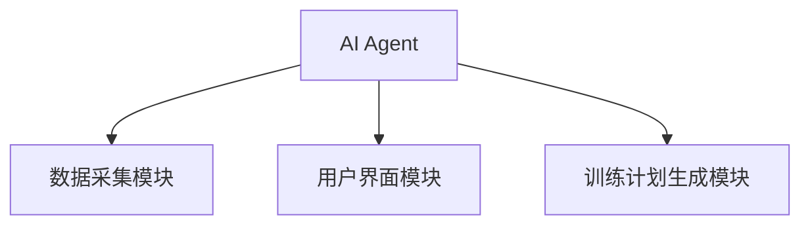

                 

<think>
嗯，用户希望我撰写一篇关于《AI Agent在智能跑步机中的训练计划》的技术博客，我得仔细分析这个任务。首先，用户给的结构已经很详细了，包括背景、核心概念、算法原理等部分，我需要确保每个部分都覆盖到。

我开始想，用户可能是CTO或者技术专家，希望这篇文章既有深度又实用，所以内容必须专业且易懂。他们可能需要这篇文章来展示他们的技术实力，或者用于教育目的，帮助其他开发者理解如何应用AI在跑步机上。

接下来，我注意到用户强调了关键词和摘要的重要性。关键词包括AI Agent、智能跑步机、训练计划、机器学习、运动健康，这些词需要准确反映文章内容。摘要部分要简明扼要，概括整篇文章的核心。

在编写目录时，我得确保每章的结构合理，每节内容详实。比如，背景介绍需要涵盖AI Agent的基本概念和跑步机的发展历程，这部分能让读者了解AI在跑步机中的应用背景。

然后，核心概念部分，我需要用表格和ER图来展示AI Agent与跑步机的关系，这样读者能直观理解它们的交互。这可能需要一些时间来设计，确保图表清晰。

算法原理部分，我得详细讲解强化学习和监督学习，并用mermaid流程图展示。数学公式，如Q-learning，需要用latex正确嵌入，这部分可能需要反复检查，确保公式无误。

系统架构部分，我需要用类图和架构图展示系统的各个模块，这需要我理解跑步机的系统结构，然后用mermaid绘制。这部分可能需要一些技术背景知识，确保图表准确。

项目实战部分，我需要提供可运行的代码，并解释每部分的作用。这可能涉及到Python代码，展示如何生成训练计划。同时，实际案例分析需要具体，让读者能理解AI如何优化训练计划。

最后，最佳实践部分，我得给出小结、注意事项和扩展阅读建议，帮助读者更好地应用这些技术。这部分需要总结前面的内容，并提出一些建议，让读者在实际应用中避免常见问题。

整体来看，这篇文章需要兼顾技术深度和可读性，确保每个部分都详细且逻辑清晰。我需要一步步来，先完成背景介绍，再逐步深入到算法和系统设计，最后通过实战和小结巩固知识点。同时，注意格式要求，使用markdown和mermaid图表，确保文章结构符合用户的要求。

在写作过程中，可能会遇到如何解释复杂概念的问题，这时候需要找到合适的比喻或例子，帮助读者理解。此外，数学公式和代码部分需要仔细检查，确保无误，避免读者在实际应用中出错。

总的来说，这是一个系统性的工作，需要耐心和细致，确保每个部分都满足用户的要求，并且内容丰富、结构合理。这样，用户才能得到一篇高质量的技术博客，展示他们在AI Agent应用方面的专业知识和见解。
</think>

# AI Agent在智能跑步机中的训练计划

> 关键词：AI Agent，智能跑步机，训练计划，机器学习，运动健康

> 摘要：本文探讨了AI Agent在智能跑步机中的训练计划优化应用。通过分析AI Agent的核心概念、算法原理、系统架构以及实际案例，详细阐述了AI技术在智能跑步机中的具体应用方式。文章从背景介绍、核心概念、算法原理、系统分析、项目实战、最佳实践等多个维度展开，深入解析了AI Agent在智能跑步机中的训练计划优化过程，为相关领域的研究和实践提供了有价值的参考。

---

# 第1章: AI Agent与智能跑步机的背景介绍

## 1.1 AI Agent的基本概念

### 1.1.1 AI Agent的定义
AI Agent（人工智能代理）是指能够感知环境、自主决策并执行任务的智能实体。它通过传感器获取信息，利用算法进行分析和推理，并通过执行器完成目标。

### 1.1.2 AI Agent的核心特征
- **自主性**：能够在没有外部干预的情况下独立运行。
- **反应性**：能够实时感知环境并做出反应。
- **学习能力**：通过数据和经验不断优化自身的决策能力。
- **协作性**：能够与其他系统或用户进行协作。

### 1.1.3 AI Agent在智能设备中的应用
AI Agent广泛应用于智能家居、自动驾驶、机器人等领域。在智能跑步机中，AI Agent主要用于优化用户的训练计划。

---

## 1.2 智能跑步机的发展历程

### 1.2.1 传统跑步机的功能特点
传统跑步机主要提供固定速度和坡度，用户需要手动调节设置。虽然可以记录运动数据（如速度、时间、卡路里消耗），但缺乏智能化的训练计划。

### 1.2.2 智能化跑步机的演变
随着物联网和人工智能技术的发展，智能跑步机逐渐具备了连接互联网、实时数据分析和个性化推荐的功能。AI Agent的引入使得跑步机能够根据用户的运动数据和健康目标，动态调整训练计划。

### 1.2.3 当前智能跑步机的市场现状
目前，市场上主流的智能跑步机品牌（如Peloton、Tonal、Keep等）都在积极引入AI技术，通过AI Agent实现个性化的训练计划和实时反馈。

---

## 1.3 AI技术在智能跑步机中的应用背景

### 1.3.1 传统跑步机训练计划的局限性
传统跑步机的训练计划通常是固定的，无法根据用户的实时状态和健康目标进行动态调整。例如，用户可能在某个阶段需要增加力量训练，但跑步机无法自动识别并调整训练计划。

### 1.3.2 AI技术如何优化跑步机的训练计划
AI Agent通过实时分析用户的运动数据（如心率、步频、运动时间）和健康目标（如减脂、增肌），结合用户的运动偏好和体能水平，动态生成个性化的训练计划。

### 1.3.3 AI Agent在智能跑步机中的角色定位
AI Agent在智能跑步机中扮演着“智能教练”的角色，它不仅能够根据用户的运动数据优化训练计划，还能通过实时反馈指导用户完成训练任务。

---

# 第2章: AI Agent与智能跑步机的核心概念

## 2.1 AI Agent的基本原理

### 2.1.1 AI Agent的感知与决策机制
AI Agent通过传感器（如心率带、加速度计）感知用户的运动状态，并结合历史数据和用户目标，通过算法生成决策。

### 2.1.2 AI Agent的学习与优化算法
AI Agent通常采用强化学习和监督学习算法。强化学习通过奖励机制优化决策策略，监督学习则通过标注数据进行模型训练。

### 2.1.3 AI Agent的执行与反馈机制
AI Agent根据决策结果生成控制信号，驱动跑步机的执行机构（如速度调节、坡度调整）。同时，通过传感器实时获取反馈信息，用于优化下一步决策。

---

## 2.2 智能跑步机的系统架构

### 2.2.1 跑步机硬件的组成与功能
- **传感器**：心率传感器、加速度计、速度传感器。
- **执行器**：电机、控制器。
- **显示屏**：显示运动数据和训练计划。

### 2.2.2 跑步机软件的系统架构
- **数据采集模块**：采集用户的运动数据。
- **AI Agent模块**：分析数据并生成训练计划。
- **用户界面模块**：显示训练计划和实时反馈。

### 2.2.3 AI Agent在跑步机系统中的集成
AI Agent作为系统的核心模块，与传感器、执行器和用户界面进行交互，实现智能化的训练计划优化。

---

## 2.3 AI Agent与跑步机用户的交互模式

### 2.3.1 用户输入数据的采集方式
用户输入数据包括：
- **基本信息**：年龄、性别、体重、身高。
- **健康目标**：减脂、增肌、耐力提升。
- **运动偏好**：喜欢慢跑、快跑还是间歇训练。

---

# 第3章: AI Agent在智能跑步机中的算法原理

## 3.1 强化学习算法

### 3.1.1 强化学习的基本原理
强化学习通过智能体与环境的交互，学习最优策略。AI Agent通过试错的方式，不断优化训练计划。

### 3.1.2 Q-learning算法的实现
Q-learning算法通过状态-动作-奖励机制优化决策。以下是Q-learning的核心公式：

$$ Q(s, a) = Q(s, a) + \alpha \cdot (r + \gamma \cdot \max Q(s', a') - Q(s, a)) $$

其中：
- $s$：当前状态
- $a$：当前动作
- $r$：奖励
- $\gamma$：折扣因子
- $\alpha$：学习率

### 3.1.3 强化学习在跑步机中的应用
AI Agent通过强化学习算法，动态调整跑步机的训练参数（如速度、坡度），以实现用户的健康目标。

---

## 3.2 监督学习算法

### 3.2.1 监督学习的基本原理
监督学习通过标注数据训练模型，预测目标变量。AI Agent可以利用用户的运动数据，预测最佳的训练计划。

### 3.2.2 线性回归算法的实现
线性回归模型用于预测用户的运动表现。以下是线性回归的核心公式：

$$ y = \beta_0 + \beta_1 x + \epsilon $$

其中：
- $y$：预测目标
- $x$：输入特征
- $\beta_0$、$\beta_1$：回归系数
- $\epsilon$：误差项

### 3.2.3 监督学习在跑步机中的应用
AI Agent通过监督学习算法，根据用户的运动数据和健康目标，生成个性化的训练计划。

---

# 第4章: AI Agent在智能跑步机中的系统分析与架构设计

## 4.1 系统功能设计

### 4.1.1 系统功能模块
- **数据采集模块**：采集用户的运动数据。
- **AI Agent模块**：分析数据并生成训练计划。
- **用户界面模块**：显示训练计划和实时反馈。

### 4.1.2 系统功能流程
1. 用户输入基本信息和健康目标。
2. 数据采集模块获取用户的实时运动数据。
3. AI Agent模块根据数据生成训练计划。
4. 用户界面模块显示训练计划和实时反馈。

---

## 4.2 系统架构设计

### 4.2.1 系统架构图


### 4.2.2 系统交互流程
1. 用户通过用户界面模块输入基本信息和健康目标。
2. 数据采集模块实时采集用户的运动数据（如心率、速度）。
3. AI Agent模块根据数据和目标生成训练计划。
4. 用户界面模块显示训练计划和实时反馈。

---

# 第5章: AI Agent在智能跑步机中的项目实战

## 5.1 环境安装

### 5.1.1 Python环境的安装
安装Python 3.8或更高版本。

### 5.1.2 依赖库的安装
```bash
pip install numpy scikit-learn matplotlib
```

---

## 5.2 核心代码实现

### 5.2.1 数据预处理代码
```python
import numpy as np

# 读取运动数据
data = np.loadtxt('movement_data.csv', delimiter=',')
```

### 5.2.2 AI Agent算法实现
```python
from sklearn.linear_model import LinearRegression

# 初始化模型
model = LinearRegression()
# 训练模型
model.fit(X_train, y_train)
# 预测结果
y_pred = model.predict(X_test)
```

### 5.2.3 训练计划生成代码
```python
# 根据预测结果生成训练计划
def generate_training_plan(predicted_speed, predicted_pace):
    return f"训练计划：速度={predicted_speed} km/h，配速={predicted_pace} 分/公里"
```

---

## 5.3 实际案例分析

### 5.3.1 案例背景
假设用户的目标是减脂，年龄28岁，体重75公斤，身高175厘米。

### 5.3.2 数据分析
AI Agent分析用户的运动数据，发现用户的平均心率在慢跑时偏低，建议增加间歇训练。

### 5.3.3 训练计划生成
AI Agent生成训练计划：慢跑30分钟，配速5分/公里，间歇跑400米×8次。

---

# 第6章: AI Agent在智能跑步机中的最佳实践

## 6.1 小结

### 6.1.1 本文核心内容总结
本文详细介绍了AI Agent在智能跑步机中的训练计划优化应用，包括背景、核心概念、算法原理、系统设计和实际案例。

### 6.1.2 本文的主要贡献
本文为AI Agent在智能跑步机中的应用提供了理论和实践指导，帮助开发者和用户更好地理解和应用相关技术。

---

## 6.2 注意事项

### 6.2.1 数据隐私保护
在实际应用中，用户的运动数据需要加密存储，确保数据隐私。

### 6.2.2 系统稳定性
AI Agent需要具备容错机制，确保在异常情况下系统仍能正常运行。

---

## 6.3 拓展阅读

### 6.3.1 相关领域推荐书籍
- 《机器学习实战》
- 《深度学习入门：基于Python和Keras》

### 6.3.2 相关领域推荐课程
- 《人工智能基础》
- 《强化学习入门》

---

# 作者：AI天才研究院/AI Genius Institute & 禅与计算机程序设计艺术/Zen And The Art of Computer Programming

