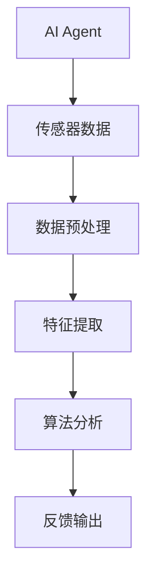
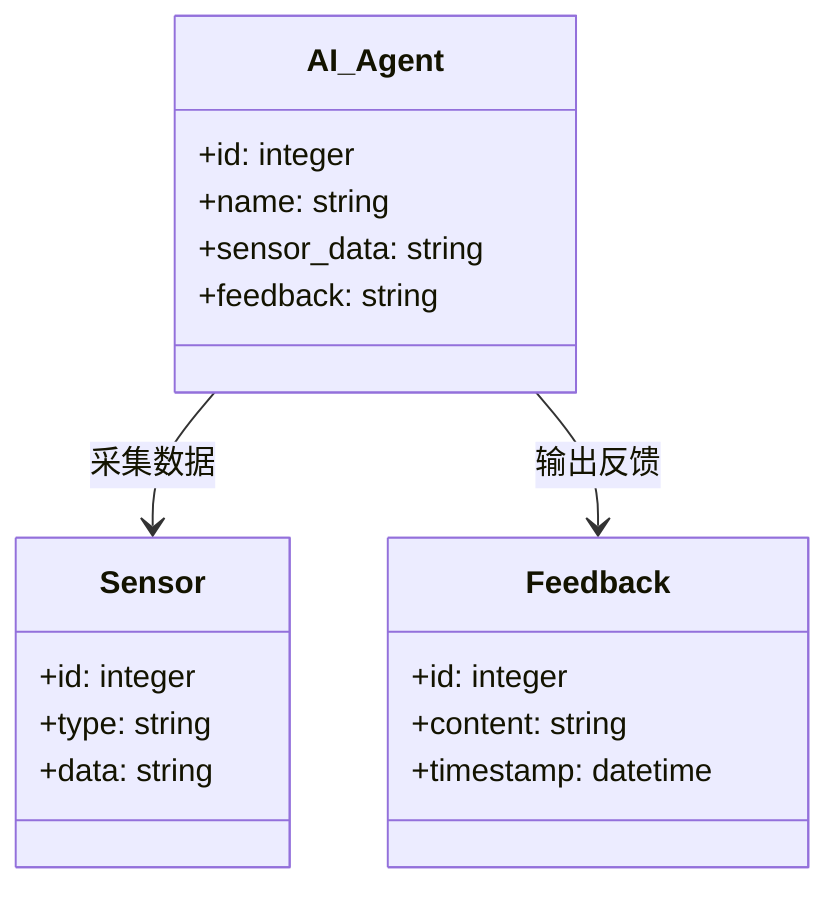
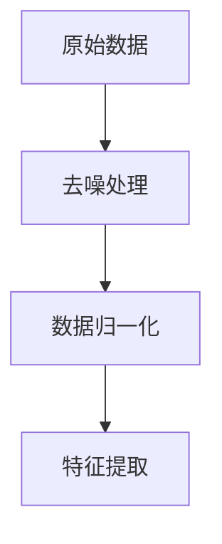
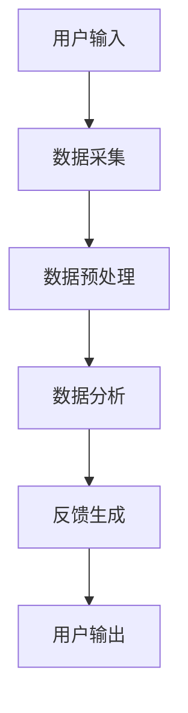
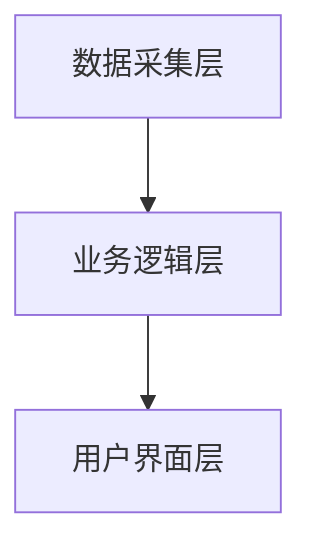
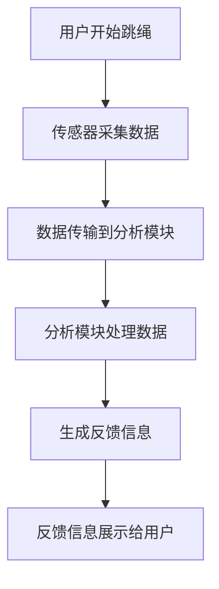

                 


# AI Agent在智能跳绳中的运动数据追踪

## 关键词：AI Agent，运动数据追踪，智能跳绳，算法原理，系统架构，项目实战

## 摘要：  
本文深入探讨了AI Agent在智能跳绳运动数据追踪中的应用，从背景介绍到系统架构设计，再到项目实战，详细分析了AI Agent如何帮助优化运动表现。文章首先介绍了AI Agent的基本概念及其在运动数据追踪中的重要性，然后从算法原理、系统架构、项目实战等多个方面展开讨论，通过具体案例展示了AI Agent在智能跳绳中的实际应用效果。最后，本文总结了AI Agent的优势，并提出了未来的研究方向。

---

# 第1章: AI Agent与运动数据追踪概述

## 1.1 AI Agent的基本概念  
### 1.1.1 AI Agent的定义与特点  
AI Agent（人工智能代理）是一种能够感知环境、自主决策并执行任务的智能实体。它具备以下特点：  
1. **自主性**：无需外部干预，自主完成任务。  
2. **反应性**：能够实时感知环境变化并做出反应。  
3. **目标导向性**：基于目标驱动行为。  
4. **学习能力**：通过数据和经验不断优化自身性能。  

### 1.1.2 AI Agent在运动数据追踪中的作用  
AI Agent在运动数据追踪中的作用主要体现在：  
1. **数据采集与处理**：通过传感器获取运动数据并进行预处理。  
2. **分析与反馈**：利用算法对数据进行分析，并提供个性化反馈。  
3. **优化建议**：根据分析结果提出运动优化建议。  

### 1.1.3 智能跳绳运动数据追踪的背景与意义  
智能跳绳作为一种新兴的运动设备，结合AI技术可以实现精准的运动数据追踪。其意义在于：  
1. **提升运动效率**：通过实时反馈优化运动表现。  
2. **个性化训练**：根据个体差异提供定制化训练方案。  
3. **预防运动损伤**：通过数据分析提前发现潜在问题。  

---

## 1.2 运动数据追踪的重要性  
### 1.2.1 运动数据的种类与应用场景  
运动数据主要包括：  
1. **时间与频率**：跳绳的速率和持续时间。  
2. **动作准确性**：跳绳动作的标准程度。  
3. **能量消耗**：运动过程中消耗的热量。  
4. **心率与节奏**：运动时的心率变化。  

### 1.2.2 数据追踪对运动表现的提升作用  
数据追踪可以帮助运动员：  
1. **量化表现**：通过数据了解自己的进步。  
2. **发现不足**：识别技术上的薄弱环节。  
3. **制定计划**：根据数据调整训练策略。  

### 1.2.3 智能跳绳运动数据的特殊性与挑战  
智能跳绳数据的特殊性在于其高频性和实时性，这带来了以下挑战：  
1. **数据量大**：高频采样导致数据量大。  
2. **实时性要求高**：需要快速处理和反馈。  
3. **准确性要求高**：数据误差可能影响分析结果。  

---

## 1.3 AI技术在运动数据追踪中的应用现状  
### 1.3.1 AI在运动数据分析中的优势  
AI技术的优势包括：  
1. **高效性**：快速处理大量数据。  
2. **准确性**：通过算法提高数据分析的准确性。  
3. **适应性**：能够根据数据动态调整分析策略。  

### 1.3.2 智能跳绳领域的AI应用现状  
目前，AI在智能跳绳中的应用主要集中在：  
1. **数据采集**：通过传感器获取跳绳动作数据。  
2. **动作识别**：利用AI算法识别跳绳动作的规范性。  
3. **个性化反馈**：根据数据提供个性化训练建议。  

### 1.3.3 当前技术的局限性与未来发展方向  
当前技术的局限性包括：  
1. **数据隐私问题**：运动数据的隐私保护尚未完善。  
2. **算法鲁棒性**：在复杂环境下的算法性能有待提升。  
3. **用户体验优化**：如何将AI技术更好地融入用户体验是未来发展方向。  

---

# 第2章: AI Agent的核心概念与联系  

## 2.1 AI Agent的核心原理  
### 2.1.1 AI Agent的感知机制  
AI Agent的感知机制主要依赖于传感器和数据采集设备，能够实时获取跳绳运动的动态数据。  

### 2.1.2 AI Agent的决策逻辑  
AI Agent通过分析感知到的数据，利用预设的算法模型做出决策，例如判断动作是否标准、是否需要调整节奏等。  

### 2.1.3 AI Agent的执行方式  
AI Agent根据决策结果执行相应的动作，例如发出反馈指令、调整训练计划等。  

---

## 2.2 AI Agent与运动数据的关系  
### 2.2.1 数据输入与AI Agent  
AI Agent通过传感器获取跳绳运动的动态数据，如跳绳速度、频率、幅度等。  

### 2.2.2 数据处理与AI Agent  
AI Agent对获取的数据进行预处理、特征提取和建模分析，从而生成有意义的反馈信息。  

### 2.2.3 数据输出与AI Agent  
AI Agent将分析结果以反馈形式输出，帮助用户优化运动表现。  

---

## 2.3 AI Agent与运动数据的关系图  



---

## 2.4 AI Agent与运动数据的关系ER图  



---

# 第3章: AI Agent在智能跳绳中的算法原理  

## 3.1 数据预处理与特征提取  
### 3.1.1 数据预处理流程  



### 3.1.2 特征提取方法  
常用的特征提取方法包括：  
1. **时域特征**：如均值、标准差、最大值等。  
2. **频域特征**：如频谱分析、周期性特征等。  
3. **运动学特征**：如加速度、角速度等。  

---

## 3.2 基于AI Agent的分类算法  
### 3.2.1 分类算法的选择  
常用的分类算法包括：  
1. K-近邻算法（KNN）。  
2. 支持向量机（SVM）。  
3. 人工神经网络（ANN）。  

### 3.2.2 分类算法的实现  

```python
from sklearn.neighbors import KNeighborsClassifier

# 训练数据
X_train = [...]  # 特征向量
y_train = [...]  # 标签

# 创建KNN分类器
knn = KNeighborsClassifier(n_neighbors=3)
knn.fit(X_train, y_train)

# 测试数据
X_test = [...]  # 特征向量
y_pred = knn.predict(X_test)
```

### 3.2.3 分类算法的数学模型  
KNN算法的核心公式：  
$$ P(y|x) = \frac{1}{h} \sum_{i=1}^{h} \mathbb{I}(y_i = y) $$  
其中，$h$ 是最近邻的数量，$y_i$ 是训练数据的标签。  

---

## 3.3 基于AI Agent的回归算法  
### 3.3.1 回归算法的选择  
常用的回归算法包括：  
1. 线性回归（Linear Regression）。  
2. 支持向量回归（SVR）。  
3. 随机森林回归（Random Forest）。  

### 3.3.2 回归算法的实现  

```python
from sklearn.linear_model import LinearRegression

# 训练数据
X_train = [...]  # 特征向量
y_train = [...]  # 标签

# 创建线性回归模型
lr = LinearRegression()
lr.fit(X_train, y_train)

# 测试数据
X_test = [...]  # 特征向量
y_pred = lr.predict(X_test)
```

### 3.3.3 回归算法的数学模型  
线性回归的核心公式：  
$$ y = \beta_0 + \beta_1 x + \epsilon $$  
其中，$\beta_0$ 和 $\beta_1$ 是回归系数，$\epsilon$ 是误差项。  

---

# 第4章: AI Agent在智能跳绳中的系统分析与架构设计  

## 4.1 系统功能设计  
### 4.1.1 系统功能模块  
系统功能模块包括：  
1. 数据采集模块：负责采集跳绳运动数据。  
2. 数据分析模块：对数据进行预处理和分析。  
3. 反馈模块：提供运动反馈和优化建议。  
4. 数据存储模块：存储运动数据和分析结果。  

### 4.1.2 系统功能流程  



---

## 4.2 系统架构设计  
### 4.2.1 分层架构设计  
系统架构采用分层设计，包括：  
1. **数据采集层**：负责数据采集和初步处理。  
2. **业务逻辑层**：负责数据分析和算法实现。  
3. **用户界面层**：负责与用户的交互和反馈展示。  

### 4.2.2 系统架构图  



---

## 4.3 系统接口设计  
### 4.3.1 接口描述  
系统主要接口包括：  
1. 数据采集接口：用于获取跳绳运动数据。  
2. 数据分析接口：用于调用AI算法进行分析。  
3. 反馈展示接口：用于将分析结果反馈给用户。  

---

## 4.4 系统交互流程  
### 4.4.1 交互流程  



---

# 第5章: AI Agent在智能跳绳中的项目实战  

## 5.1 项目环境与工具安装  
### 5.1.1 环境要求  
- 操作系统：Windows/Mac/Linux  
- 开发工具：Python、Jupyter Notebook  
- 传感器：智能跳绳传感器  

### 5.1.2 工具安装  
安装必要的库：  
```bash
pip install numpy
pip install pandas
pip install scikit-learn
pip install matplotlib
```

---

## 5.2 系统核心实现  
### 5.2.1 数据采集与预处理  
代码示例：  
```python
import numpy as np
import pandas as pd

# 读取传感器数据
data = pd.read_csv('jump_rope_data.csv')

# 数据预处理
data.dropna(inplace=True)
data = data[~data['timestamp'].is_duplicates()]
```

### 5.2.2 数据分析与建模  
代码示例：  
```python
from sklearn.tree import DecisionTreeClassifier
from sklearn.metrics import accuracy_score

# 数据分割
X_train, X_test, y_train, y_test = train_test_split(data.drop('label', axis=1), data['label'], test_size=0.2)

# 创建决策树分类器
clf = DecisionTreeClassifier()
clf.fit(X_train, y_train)

# 预测与评估
y_pred = clf.predict(X_test)
print("Accuracy:", accuracy_score(y_test, y_pred))
```

### 5.2.3 系统反馈与展示  
代码示例：  
```python
import matplotlib.pyplot as plt

# 绘制训练与测试准确率
plt.figure(figsize=(10, 5))
plt.plot(clf.feature_importances_, 'o')
plt.xlabel('Feature')
plt.ylabel('Importance')
plt.show()
```

---

## 5.3 实际案例分析  
### 5.3.1 案例背景  
以一名普通用户为例，分析其跳绳数据。  

### 5.3.2 数据分析结果  
通过AI Agent分析，发现用户跳绳动作的不规范性，建议调整动作幅度和频率。  

### 5.3.3 系统反馈与优化建议  
系统根据分析结果，提供个性化的训练计划，帮助用户提高跳绳效率。  

---

## 5.4 项目小结  
通过本项目，我们实现了AI Agent在智能跳绳中的应用，验证了AI技术在运动数据追踪中的有效性。同时，我们也发现了当前技术的一些不足，例如算法的鲁棒性和用户体验的优化空间。  

---

# 第6章: 最佳实践、小结与拓展阅读  

## 6.1 最佳实践 Tips  
1. 在实际应用中，建议结合多种算法进行对比实验，选择最优方案。  
2. 数据隐私保护是未来的重要研究方向。  
3. 在系统设计中，注重模块化设计，便于后续优化和维护。  

---

## 6.2 小结  
本文详细探讨了AI Agent在智能跳绳运动数据追踪中的应用，从背景介绍到系统架构设计，再到项目实战，全面展示了AI技术在运动数据追踪中的巨大潜力。通过本文的分析，我们不仅了解了AI Agent的核心原理，还掌握了如何将其应用于实际场景中。  

---

## 6.3 注意事项  
1. 数据采集时，确保传感器的准确性。  
2. 算法选择时，综合考虑数据量、计算复杂度和实际需求。  
3. 系统设计时，注重用户体验，确保反馈信息的易理解和实用性。  

---

## 6.4 拓展阅读  
1. 《机器学习实战》—— 学习更多机器学习算法。  
2. 《深度学习》—— 探索深度学习在运动数据分析中的应用。  
3. 《AI在体育中的应用》—— 了解AI在更多运动领域的应用案例。  

---

# 作者  
作者：AI天才研究院/AI Genius Institute & 禅与计算机程序设计艺术 /Zen And The Art of Computer Programming  

---

通过本文的详细分析，我们不仅了解了AI Agent在智能跳绳中的应用，还掌握了如何从算法原理到系统设计，再到项目实战，全面实现AI驱动的运动数据追踪。未来，随着AI技术的不断发展，智能跳绳运动数据追踪将变得更加精准和智能化，为运动爱好者提供更加个性化的训练方案。

