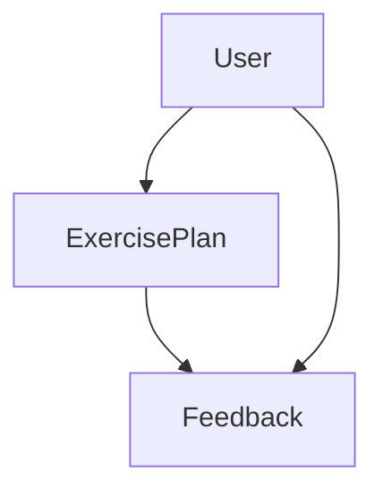
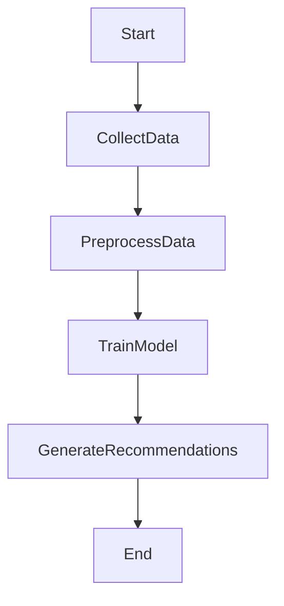
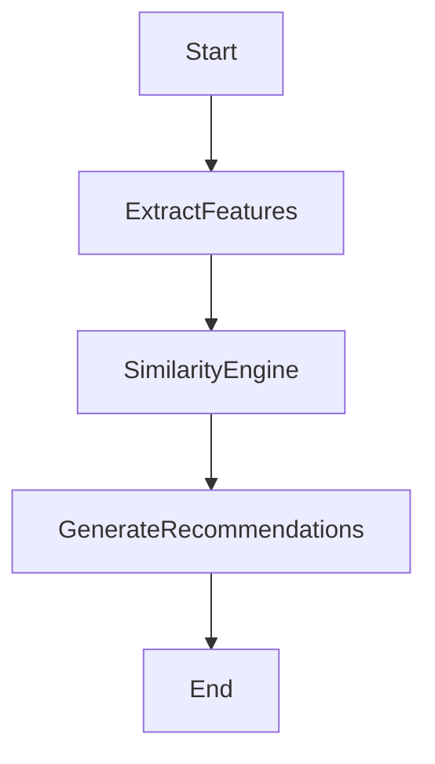
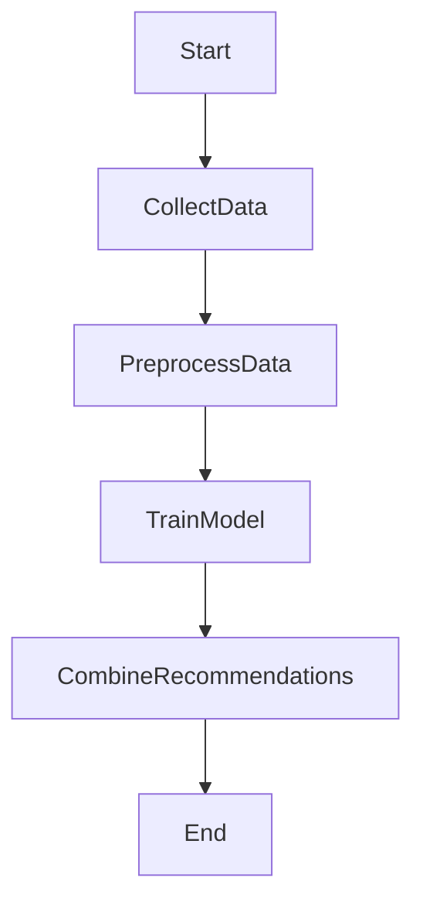
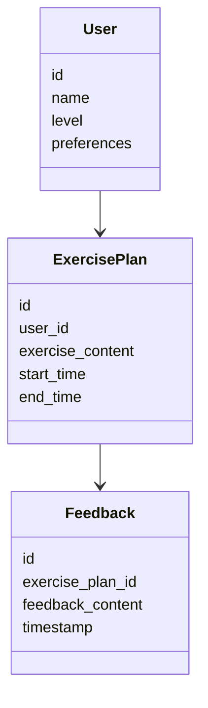
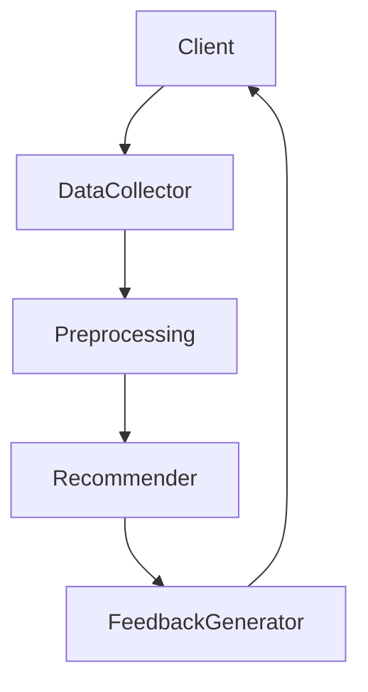
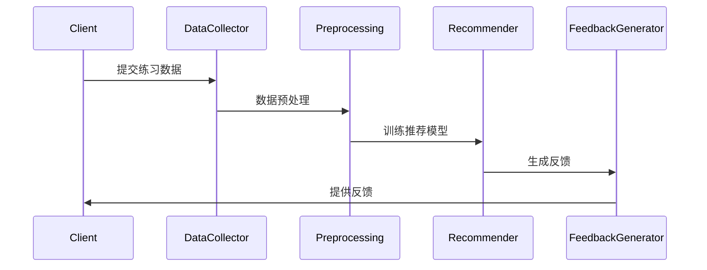

                 


# AI Agent在智能钢琴中的个性化练习计划

## 关键词：AI Agent, 智能钢琴, 个性化练习计划, 机器学习, 推荐算法, 实时反馈, 系统架构

## 摘要：
本文深入探讨了AI Agent在智能钢琴中的应用，特别是在个性化练习计划制定方面。通过结合机器学习和实时反馈机制，AI Agent能够根据学习者的具体需求和表现，动态调整练习计划，从而提高钢琴学习的效率和效果。本文详细分析了AI Agent的核心原理、推荐算法、系统架构，并通过实际案例展示了如何在智能钢琴中实现个性化的练习计划。

---

# 第一部分：AI Agent在智能钢琴中的个性化练习计划概述

## 第1章：背景介绍

### 1.1 问题背景

#### 1.1.1 钢琴学习中的常见问题
钢琴作为一种复杂的音乐乐器，学习者在练习过程中常常面临以下问题：
- **缺乏系统性**：传统练习计划通常固定，难以根据学习者的实际表现进行调整。
- **效率低下**：学习者可能花费大量时间练习，但效果不佳，因为练习内容可能与他们的学习目标或兴趣不符。
- **反馈滞后**：传统教学中，教师的反馈通常滞后，无法实时指导学习者改进。

#### 1.1.2 传统练习计划的局限性
传统练习计划通常基于固定的教学大纲，难以满足每个学习者的个性化需求。例如：
- **一刀切**：同一练习计划可能适用于不同水平和兴趣的学习者。
- **缺乏互动**：练习计划通常缺乏与学习者互动的机制，无法实时调整。

#### 1.1.3 AI技术在音乐教育中的潜力
AI技术的快速发展为音乐教育带来了新的可能性。通过AI Agent，可以实时分析学习者的练习数据，动态调整练习计划，从而提供个性化的学习体验。

### 1.2 问题描述

#### 1.2.1 学习者需求的多样性
不同学习者有不同的学习目标、兴趣和水平。例如，一些学习者可能更感兴趣于古典音乐，而另一些则可能更喜欢现代音乐。AI Agent需要能够识别这些差异，并制定相应的练习计划。

#### 1.2.2 练习计划的个性化要求
个性化练习计划需要根据学习者的当前水平、兴趣和目标动态调整。例如：
- 初学者可能需要更多基础练习，而进阶学习者则需要更多复杂曲目的练习。
- 学习者可能在某些技巧上需要额外练习，而AI Agent需要能够识别这些薄弱环节。

#### 1.2.3 AI Agent在实时反馈中的作用
AI Agent可以通过实时分析学习者的练习数据，提供即时反馈。例如：
- 分析学习者的弹奏速度、节奏和音准，识别错误并提供纠正建议。
- 根据学习者的进步情况，动态调整练习计划。

### 1.3 问题解决

#### 1.3.1 AI Agent的核心功能
AI Agent在智能钢琴中的核心功能包括：
- **实时数据采集**：通过传感器或 MIDI 接口采集学习者的练习数据。
- **个性化推荐**：基于学习者的数据，推荐适合的练习内容。
- **实时反馈**：根据练习数据提供即时反馈，帮助学习者改进。

#### 1.3.2 个性化练习计划的设计思路
个性化练习计划的设计需要考虑以下因素：
- **学习者的水平**：根据学习者的当前水平，推荐适合的练习内容。
- **学习者的兴趣**：根据学习者的偏好，推荐相关曲目。
- **学习目标**：根据学习者的长期目标，制定阶段性练习计划。

#### 1.3.3 实时反馈机制的实现
实时反馈机制需要通过传感器和AI算法实现：
- **数据采集**：采集学习者的练习数据，如音准、节奏、速度等。
- **数据分析**：使用机器学习算法分析数据，识别问题。
- **反馈生成**：根据分析结果，生成即时反馈。

### 1.4 边界与外延

#### 1.4.1 系统的边界定义
AI Agent在智能钢琴中的边界包括：
- **数据采集**：仅采集与练习相关的数据，如音准、节奏等。
- **反馈范围**：仅提供与练习相关的反馈，如技术问题、练习建议等。

#### 1.4.2 功能的外延扩展
AI Agent的功能可以扩展到其他领域：
- **音乐创作**：帮助学习者创作音乐，提供灵感。
- **演奏分析**：分析演奏家的表演，提供改进建议。

#### 1.4.3 与其他系统的接口设计
AI Agent需要与其他系统接口设计：
- **传感器接口**：与钢琴传感器接口通信，获取练习数据。
- **用户界面**：与钢琴的用户界面交互，提供反馈。

### 1.5 概念结构与核心要素组成

#### 1.5.1 核心概念的层次结构
AI Agent在智能钢琴中的核心概念层次结构如下：
1. **学习者**：学习者的练习数据和需求。
2. **练习计划**：根据学习者的数据制定的个性化练习计划。
3. **反馈机制**：实时反馈学习者的练习结果，调整练习计划。

#### 1.5.2 核心要素的对比分析
以下表格对比了核心要素的属性特征：

| 属性特征 | 练习计划 | 反馈机制 |
|----------|----------|----------|
| 实时性   | 非实时   | 实时     |
| 个性化   | 高       | 高       |
| 反馈类型 | 练习内容 | 技术问题 |
| 调整频率 | 定期     | 实时     |

#### 1.5.3 概念之间的关系图



---

## 第2章：核心概念与联系

### 2.1 AI Agent的核心原理

#### 2.1.1 AI Agent的基本定义
AI Agent是一种能够感知环境并采取行动以实现目标的智能实体。在智能钢琴中，AI Agent通过分析学习者的练习数据，动态调整练习计划。

#### 2.1.2 AI Agent在智能钢琴中的应用
AI Agent在智能钢琴中的应用包括：
- **实时数据采集**：通过传感器采集练习数据。
- **个性化推荐**：根据数据推荐练习内容。
- **实时反馈**：根据数据提供即时反馈。

#### 2.1.3 AI Agent的核心算法
AI Agent的核心算法包括：
- **机器学习算法**：用于分析练习数据。
- **推荐算法**：用于推荐练习内容。

### 2.2 核心概念的属性特征对比

#### 2.2.1 实时反馈与定期评估的对比

| 特性 | 实时反馈 | 定期评估 |
|------|----------|----------|
| 时间范围 | 实时     | 定期     |
| 反馈频率 | 高       | 低       |
| 数据分析 | 细粒度   | 宽泛     |

#### 2.2.2 个性化推荐与固定计划的对比

| 特性 | 个性化推荐 | 固定计划 |
|------|------------|----------|
| 灵活性 | 高          | 低        |
| 针对性 | 高          | 低        |
| 用户参与度 | 高          | 低        |

#### 2.2.3 用户行为分析与练习计划调整的对比

| 特性 | 用户行为分析 | 练习计划调整 |
|------|--------------|-------------|
| 数据来源 | 用户行为数据 | 练习数据     |
| 目标 | 分析用户偏好 | 调整练习计划 |
| 方法 | 数据挖掘     | 机器学习    |

### 2.3 ER实体关系图


---

## 第3章：算法原理讲解

### 3.1 推荐算法

#### 3.1.1 协同过滤算法

##### 3.1.1.1 基于用户的协同过滤
基于用户的协同过滤算法通过分析用户的历史数据，找到相似用户的偏好，推荐相似的内容。例如：
- **用户A** 喜欢曲目X，**用户B** 喜欢曲目Y，如果用户A和用户B的偏好相似，则推荐曲目Y给用户A。

##### 3.1.1.2 基于物品的协同过滤
基于物品的协同过滤算法通过分析物品的特征，找到与目标物品相似的物品，推荐给用户。例如：
- **曲目X** 和曲目Y在风格上相似，推荐曲目Y给喜欢曲目X的用户。

#### 3.1.2 基于内容的推荐算法
基于内容的推荐算法通过分析物品的内容特征，推荐与目标物品相似的内容。例如：
- **曲目X** 的特征是古典风格，推荐其他古典风格的曲目。

#### 3.1.3 混合推荐算法
混合推荐算法结合基于用户的协同过滤和基于内容的推荐算法，利用两者的优点。例如：
- 根据用户的偏好和曲目的内容特征，推荐适合的曲目。

### 3.2 推荐算法的实现流程

#### 3.2.1 协同过滤算法实现流程



#### 3.2.2 基于内容的推荐算法实现流程



#### 3.2.3 混合推荐算法实现流程



### 3.3 推荐算法的数学模型

#### 3.3.1 用户-物品矩阵
用户-物品矩阵表示用户对物品的偏好程度：

$$ R = [r_{ij}] \text{，其中} r_{ij} \text{表示用户} i \text{对物品} j \text{的偏好程度} $$

#### 3.3.2 相似度计算
相似度计算可以使用余弦相似度：

$$ \text{相似度}(i, j) = \frac{\sum_{k=1}^{n} r_{ik} r_{jk}}{\sqrt{\sum_{k=1}^{n} r_{ik}^2} \sqrt{\sum_{k=1}^{n} r_{jk}^2}} } $$

---

## 第4章：系统分析与架构设计

### 4.1 问题场景介绍

#### 4.1.1 系统功能需求
系统需要实现以下功能：
- 实时采集练习数据
- 动态调整练习计划
- 提供实时反馈

#### 4.1.2 系统性能需求
系统需要满足以下性能需求：
- 实时反馈的响应时间不超过1秒
- 系统支持多用户同时使用

### 4.2 项目介绍

#### 4.2.1 项目目标
项目目标是开发一个基于AI Agent的智能钢琴系统，能够根据学习者的练习数据，动态调整练习计划。

#### 4.2.2 项目范围
项目范围包括：
- 数据采集模块
- 练习计划推荐模块
- 反馈模块

### 4.3 系统功能设计

#### 4.3.1 领域模型设计



#### 4.3.2 系统架构设计



#### 4.3.3 系统接口设计
系统接口设计包括：
- 数据采集接口
- 推荐接口
- 反馈接口

#### 4.3.4 系统交互设计



---

## 第5章：项目实战

### 5.1 环境安装

#### 5.1.1 安装Python
安装Python 3.8或更高版本。

#### 5.1.2 安装依赖库
安装以下依赖库：
```bash
pip install numpy pandas scikit-learn
```

### 5.2 系统核心实现

#### 5.2.1 数据采集模块
数据采集模块代码示例：

```python
import numpy as np

def collect_data(user_id):
    # 模拟数据采集
    data = np.random.randn(100, 5)  # 生成100条数据，5个特征
    return data
```

#### 5.2.2 练习计划推荐模块
练习计划推荐模块代码示例：

```python
from sklearn.neighbors import NearestNeighbors

def recommend_exercise(user_id, data):
    model = NearestNeighbors(n_neighbors=5).fit(data)
    distances, indices = model.kneighbors(data)
    return indices
```

#### 5.2.3 反馈模块
反馈模块代码示例：

```python
def generate_feedback(indices, data):
    feedback = []
    for i in indices:
        feedback.append(f"推荐曲目{data[i]}")
    return feedback
```

### 5.3 代码应用解读与分析

#### 5.3.1 数据采集模块解读
数据采集模块通过传感器采集学习者的练习数据，如音准、节奏等。

#### 5.3.2 练习计划推荐模块解读
练习计划推荐模块使用机器学习算法，如协同过滤，推荐适合的学习内容。

#### 5.3.3 反馈模块解读
反馈模块根据推荐结果，生成即时反馈，帮助学习者改进。

### 5.4 实际案例分析

#### 5.4.1 案例分析
假设学习者A的练习数据如下：

| 练习内容 | 音准 | 节奏 | 速度 | 音量 |
|----------|------|------|------|------|
| 曲目1     | 85%  | 90%  | 80%  | 85%  |
| 曲目2     | 75%  | 85%  | 75%  | 80%  |

AI Agent会根据数据推荐适合的学习内容，如曲目3。

#### 5.4.2 案例小结
通过实际案例分析，可以验证AI Agent在智能钢琴中的个性化练习计划的有效性。

### 5.5 项目小结

#### 5.5.1 项目总结
通过本项目，我们可以看到AI Agent在智能钢琴中的应用潜力。

#### 5.5.2 项目经验
在项目实施过程中，需要注意数据采集的准确性和算法的实时性。

---

## 第6章：最佳实践

### 6.1 小结

#### 6.1.1 学习小结
通过本篇文章，我们可以看到AI Agent在智能钢琴中的应用前景。

#### 6.1.2 知识巩固
巩固AI Agent的核心原理和推荐算法。

### 6.2 注意事项

#### 6.2.1 开发注意事项
在开发过程中，需要注意数据隐私和系统的稳定性。

#### 6.2.2 使用注意事项
在使用过程中，需要注意系统的实时性和反馈的准确性。

### 6.3 拓展阅读

#### 6.3.1 推荐书目
推荐以下书籍：
- 《机器学习实战》
- 《深入浅出AI》

#### 6.3.2 在线资源
推荐以下在线资源：
- [Kaggle](https://www.kaggle.com/)
- [Towards Data Science](https://towardsdatascience.com/)

---

## 作者：AI天才研究院/AI Genius Institute & 禅与计算机程序设计艺术 /Zen And The Art of Computer Programming

---

以上就是《AI Agent在智能钢琴中的个性化练习计划》的技术博客文章，希望对您有所帮助！

