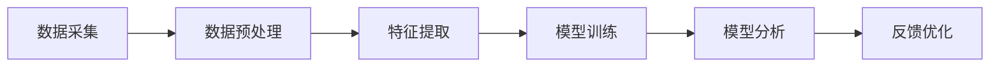
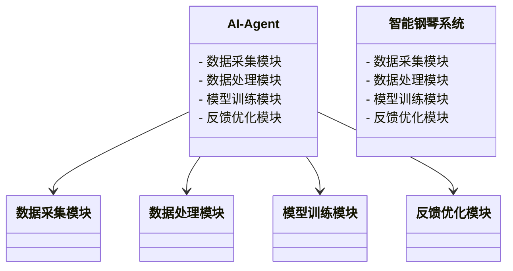
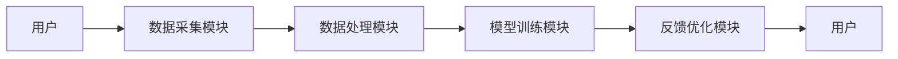
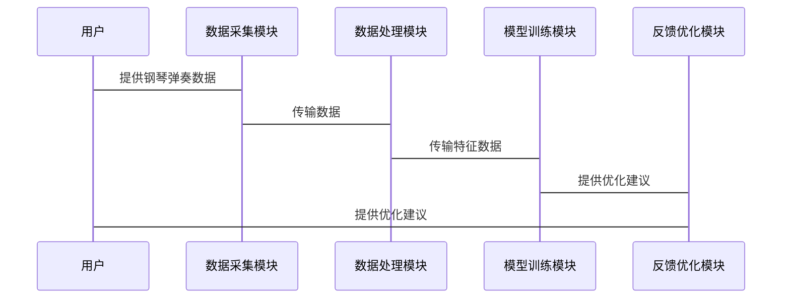

                 


# AI Agent在智能钢琴中的弹奏技巧分析

> 关键词：AI Agent，智能钢琴，钢琴弹奏技巧，算法原理，系统设计，技术分析，音乐教育

> 摘要：本文深入探讨了AI Agent在智能钢琴中的应用，分析了其在钢琴弹奏技巧中的算法原理和系统设计。文章从背景介绍、核心概念、算法实现、系统架构、项目实战等方面进行详细阐述，并通过具体案例展示AI Agent如何提升钢琴教学和演奏的效果。通过本文，读者将能够全面理解AI Agent在智能钢琴中的技术应用及其对未来音乐教育的深远影响。

---

# 第1章: AI Agent与智能钢琴的背景介绍

## 1.1 AI Agent的基本概念

### 1.1.1 AI Agent的定义与特点

AI Agent（人工智能代理）是指能够感知环境、自主决策并执行任务的智能实体。其核心特点包括：

- **自主性**：能够在没有外部干预的情况下自主运行。
- **反应性**：能够实时感知环境并做出反应。
- **学习能力**：能够通过数据和经验不断优化自身的决策能力。
- **社交能力**：能够与其他系统或用户进行交互和协作。

### 1.1.2 AI Agent的核心要素与功能

AI Agent的核心要素包括感知、决策、执行和反馈。其功能主要体现在以下几个方面：

- **数据采集**：通过传感器或API接口获取钢琴弹奏的相关数据。
- **特征提取**：对采集到的数据进行特征提取，识别出音高、节奏、力度等关键信息。
- **模型训练**：基于特征数据，训练机器学习模型，用于识别和分析钢琴弹奏技巧。
- **反馈优化**：根据模型分析结果，向用户反馈优化建议，帮助用户改进弹奏技巧。

### 1.1.3 AI Agent在音乐领域的应用潜力

在音乐领域，AI Agent的应用潜力主要体现在以下几个方面：

- **个性化教学**：通过分析学习者的弹奏数据，提供个性化的教学建议。
- **实时反馈**：在钢琴弹奏过程中，实时检测并反馈演奏中的问题。
- **音乐创作辅助**：基于AI Agent的分析能力，辅助音乐人进行创作和编曲。

## 1.2 智能钢琴的定义与特点

### 1.2.1 智能钢琴的定义

智能钢琴是一种结合了传统钢琴与现代信息技术的乐器，它能够通过传感器、MIDI接口或其他数据采集设备，将钢琴弹奏的物理动作转化为数字信号，并通过计算机进行分析和处理。

### 1.2.2 智能钢琴的核心技术

智能钢琴的核心技术主要包括：

- **数据采集技术**：通过传感器或MIDI接口采集钢琴的按键、力度、音高、节奏等数据。
- **数据处理技术**：对采集到的数据进行预处理、特征提取和分析。
- **人工智能技术**：利用机器学习算法对数据进行分析，并生成优化建议或音乐内容。

### 1.2.3 智能钢琴与传统钢琴的对比

以下是智能钢琴与传统钢琴的主要对比：

| 特性                | 传统钢琴                | 智能钢琴                |
|---------------------|-------------------------|-------------------------|
| 功能                | 单纯的音乐演奏工具      | 集成了数据采集与分析功能|
| 互动性              | 仅限于人与音乐的互动    | 可与计算机进行数据交互  |
| 教学辅助能力        | 需要专业教师指导        | 可通过AI Agent实现自动化教学辅助|
| 技术复杂度          | 机械结构简单            | 集成了传感器、计算机等技术|

## 1.3 AI Agent与智能钢琴的结合

### 1.3.1 AI Agent在智能钢琴中的应用场景

AI Agent在智能钢琴中的应用场景主要体现在以下几个方面：

- **实时反馈**：AI Agent可以实时分析钢琴弹奏数据，检测并反馈演奏中的问题。
- **个性化教学**：通过分析学习者的弹奏习惯和水平，提供个性化的教学建议。
- **音乐创作辅助**：AI Agent可以帮助音乐人进行音乐创作，生成新的音乐作品。

### 1.3.2 AI Agent与智能钢琴结合的意义

AI Agent与智能钢琴的结合，不仅能够提升钢琴教学的效率和质量，还能够为音乐教育带来新的可能性。通过AI Agent的实时反馈和个性化教学功能，学习者可以更快速地掌握钢琴弹奏技巧，同时也能激发他们的创造力和兴趣。

### 1.3.3 本章小结

本章主要介绍了AI Agent和智能钢琴的基本概念、特点以及它们的结合方式。通过对比和分析，我们明确了AI Agent在智能钢琴中的应用价值和潜力。

---

# 第2章: AI Agent在智能钢琴中的核心概念与联系

## 2.1 AI Agent的核心原理

### 2.1.1 AI Agent的基本原理

AI Agent的核心原理是通过感知环境、分析数据、做出决策并执行任务。在智能钢琴的应用中，AI Agent主要通过以下步骤实现其功能：

1. **数据采集**：通过传感器或MIDI接口采集钢琴的弹奏数据。
2. **数据处理**：对采集到的数据进行预处理、特征提取和分析。
3. **模型训练**：基于特征数据，训练机器学习模型，用于识别和分析钢琴弹奏技巧。
4. **反馈优化**：根据模型分析结果，向用户反馈优化建议，帮助用户改进弹奏技巧。

### 2.1.2 AI Agent的决策机制

AI Agent的决策机制主要包括以下几个步骤：

1. **数据输入**：通过传感器或API接口获取钢琴弹奏的相关数据。
2. **特征提取**：对输入数据进行特征提取，识别出音高、节奏、力度等关键信息。
3. **模型分析**：利用训练好的机器学习模型，对特征数据进行分析，识别出演奏中的问题。
4. **决策输出**：根据分析结果，生成优化建议或反馈信息。

### 2.1.3 AI Agent的学习与优化

AI Agent的学习与优化主要通过以下步骤实现：

1. **数据采集**：收集大量的钢琴弹奏数据，包括正确弹奏和错误弹奏的数据。
2. **模型训练**：利用这些数据训练机器学习模型，优化模型的准确性和鲁棒性。
3. **持续优化**：通过不断地数据采集和模型训练，优化AI Agent的性能和准确性。

## 2.2 AI Agent与钢琴弹奏技巧的关系

### 2.2.1 AI Agent如何分析钢琴弹奏技巧

AI Agent通过以下步骤分析钢琴弹奏技巧：

1. **数据采集**：采集钢琴的弹奏数据，包括按键、力度、音高、节奏等信息。
2. **特征提取**：从采集到的数据中提取出关键特征，如音高准确度、节奏稳定性、力度一致性等。
3. **模型分析**：利用机器学习模型，分析这些特征，识别出演奏中的问题，如音高不准确、节奏不稳、力度不均匀等。
4. **反馈优化**：根据分析结果，向用户反馈优化建议，帮助用户改进弹奏技巧。

### 2.2.2 AI Agent如何辅助钢琴学习者

AI Agent通过以下方式辅助钢琴学习者：

1. **实时反馈**：在钢琴弹奏过程中，实时检测并反馈演奏中的问题，帮助学习者及时纠正错误。
2. **个性化教学**：通过分析学习者的弹奏习惯和水平，提供个性化的教学建议，帮助学习者更有效地掌握弹奏技巧。
3. **音乐创作辅助**：通过分析学习者的弹奏数据，帮助他们进行音乐创作，激发创造力。

### 2.2.3 AI Agent与钢琴演奏家的互动

AI Agent与钢琴演奏家的互动主要体现在以下几个方面：

1. **技术优化**：AI Agent可以帮助演奏家优化演奏技巧，提升演奏的准确性和表现力。
2. **创作辅助**：AI Agent可以辅助演奏家进行音乐创作，生成新的音乐作品。
3. **数据分析**：通过分析演奏家的演奏数据，帮助他们更好地理解自己的演奏风格和技巧，从而进行更有针对性的练习和改进。

## 2.3 核心概念对比表格

以下是AI Agent与传统钢琴教学的对比表格：

| 特性                | AI Agent                | 传统钢琴教学          |
|---------------------|-------------------------|-----------------------|
| 教学方式            | 基于AI分析的个性化教学  | 需要专业教师指导      |
| 反馈速度            | 实时反馈                | 非实时反馈            |
| 技术复杂度          | 高                      | 低                    |
| 灵活性              | 高                      | 低                    |

---

# 第3章: AI Agent在钢琴弹奏技巧中的算法原理

## 3.1 数据采集与处理

### 3.1.1 钢琴弹奏数据的采集方式

AI Agent在智能钢琴中的数据采集方式主要包括以下几种：

1. **传感器采集**：通过安装在钢琴键上的传感器，采集按键的时间、力度等数据。
2. **MIDI接口采集**：通过MIDI接口，采集钢琴的音高、节奏等数据。
3. **音频采集**：通过麦克风采集钢琴的音频信号，进行音高检测和节奏分析。

### 3.1.2 数据预处理与特征提取

数据预处理的主要步骤包括：

1. **数据清洗**：去除噪声和无关数据，确保数据的准确性。
2. **特征提取**：从原始数据中提取关键特征，如音高、节奏、力度等。

### 3.1.3 数据的标准化与归一化

为了提高模型的训练效果，通常需要对数据进行标准化和归一化处理：

- **标准化**：将数据按照均值和标准差进行标准化处理，使其符合一定的分布特征。
- **归一化**：将数据映射到0-1的范围内，以便模型能够更好地处理不同量级的数据。

## 3.2 算法原理与流程

### 3.2.1 基于深度学习的钢琴弹奏技巧分析

以下是基于深度学习的钢琴弹奏技巧分析的算法流程：

1. **数据采集**：通过传感器或MIDI接口采集钢琴的弹奏数据。
2. **数据预处理**：对采集到的数据进行清洗和特征提取。
3. **模型训练**：利用深度学习模型（如神经网络）对特征数据进行训练，生成分类或回归模型。
4. **模型分析**：利用训练好的模型，分析钢琴弹奏技巧，识别演奏中的问题。
5. **反馈优化**：根据模型分析结果，向用户反馈优化建议，帮助用户改进弹奏技巧。

### 3.2.2 算法实现的数学模型

以下是基于深度学习的钢琴弹奏技巧分析的数学模型示例：

$$
y = f(x) = W_2 \cdot \sigma(W_1 \cdot x + b_1) + b_2
$$

其中，$x$是输入特征向量，$W_1$和$W_2$是权重矩阵，$b_1$和$b_2$是偏置项，$\sigma$是激活函数。

### 3.2.3 算法流程的 mermaid 图

以下是算法流程的 mermaid 图：



---

# 第4章: AI Agent的系统架构设计

## 4.1 问题场景介绍

AI Agent在智能钢琴中的应用场景主要包括以下几点：

- **实时反馈**：在钢琴弹奏过程中，实时检测并反馈演奏中的问题。
- **个性化教学**：通过分析学习者的弹奏习惯和水平，提供个性化的教学建议。
- **音乐创作辅助**：通过分析学习者的弹奏数据，帮助他们进行音乐创作。

## 4.2 项目介绍

本项目旨在开发一个基于AI Agent的智能钢琴系统，能够实时分析钢琴弹奏数据，并提供优化建议。系统的主要功能包括：

- **数据采集**：通过传感器或MIDI接口采集钢琴的弹奏数据。
- **数据处理**：对采集到的数据进行预处理、特征提取和分析。
- **模型训练**：利用机器学习模型，分析钢琴弹奏技巧，识别演奏中的问题。
- **反馈优化**：根据模型分析结果，向用户反馈优化建议，帮助用户改进弹奏技巧。

## 4.3 系统功能设计

### 4.3.1 领域模型 mermaid 类图

以下是系统功能的领域模型 mermaid 类图：



### 4.3.2 系统架构 mermaid 架构图

以下是系统的架构 mermaid 图：



### 4.3.3 系统接口设计

系统接口设计主要包括以下几个部分：

1. **数据采集接口**：通过传感器或MIDI接口采集钢琴的弹奏数据。
2. **数据处理接口**：对采集到的数据进行预处理、特征提取和分析。
3. **模型训练接口**：利用机器学习模型，分析钢琴弹奏技巧，识别演奏中的问题。
4. **反馈优化接口**：根据模型分析结果，向用户反馈优化建议，帮助用户改进弹奏技巧。

### 4.3.4 系统交互 mermaid 序列图

以下是系统的交互 mermaid 序列图：



---

# 第5章: 项目实战

## 5.1 环境安装

### 5.1.1 开发环境的选择

推荐使用以下开发环境：

- **操作系统**：Windows、MacOS或Linux。
- **编程语言**：Python。
- **开发工具**：PyCharm、VS Code等。
- **深度学习框架**：TensorFlow、Keras等。

### 5.1.2 必要的软件安装

需要安装以下软件：

- **Python**：3.6及以上版本。
- **TensorFlow**：2.0及以上版本。
- **MIDI接口驱动**：根据具体硬件需求安装相应的驱动程序。
- **传感器驱动**：安装与传感器兼容的驱动程序。

## 5.2 系统核心实现源代码

以下是系统核心实现的Python代码示例：

```python
import numpy as np
import tensorflow as tf
from tensorflow.keras import layers

# 数据采集模块
def采集数据():
    # 采集钢琴弹奏数据
    pass

# 数据处理模块
def 处理数据(数据):
    # 数据预处理和特征提取
    pass

# 模型训练模块
def 训练模型(特征数据, 标签):
    model = tf.keras.Sequential([
        layers.Dense(64, activation='relu'),
        layers.Dense(1, activation='sigmoid')
    ])
    model.compile(optimizer='adam', loss='binary_crossentropy', metrics=['accuracy'])
    model.fit(特征数据, 标签, epochs=10, batch_size=32)
    return model

# 反馈优化模块
def 提供反馈(模型, 数据):
    预测结果 = 模型.predict(数据)
    # 根据预测结果提供优化建议
    pass

# 主程序
def 主程序():
    数据 = 采集数据()
    特征数据 = 处理数据(数据)
    模型 = 训练模型(特征数据, 标签)
    提供反馈(模型, 数据)

if __name__ == '__main__':
    主程序()
```

## 5.3 代码应用解读与分析

### 5.3.1 代码功能模块划分

代码主要划分为以下几个模块：

1. **数据采集模块**：负责采集钢琴弹奏数据。
2. **数据处理模块**：对采集到的数据进行预处理和特征提取。
3. **模型训练模块**：利用机器学习模型，分析钢琴弹奏技巧，识别演奏中的问题。
4. **反馈优化模块**：根据模型分析结果，向用户反馈优化建议，帮助用户改进弹奏技巧。

### 5.3.2 代码实现细节

1. **数据采集模块**：
   - 使用传感器或MIDI接口采集钢琴的弹奏数据。
   - 数据格式：可以是时间戳、力度值、音高值等。

2. **数据处理模块**：
   - 对采集到的数据进行清洗和特征提取。
   - 特征提取：可以提取音高、节奏、力度等关键特征。

3. **模型训练模块**：
   - 使用深度学习模型（如神经网络）对特征数据进行训练。
   - 模型训练：可以使用TensorFlow框架，训练一个分类或回归模型。

4. **反馈优化模块**：
   - 根据模型分析结果，向用户反馈优化建议。
   - 优化建议：可以是具体的弹奏技巧改进、练习建议等。

## 5.4 实际案例分析与详细讲解剖析

### 5.4.1 案例背景介绍

假设我们有一个智能钢琴系统，用户在弹奏一首曲子时，系统能够实时检测并反馈演奏中的问题。

### 5.4.2 数据采集与处理

1. **数据采集**：
   - 用户弹奏一首曲子，系统通过传感器采集按键的时间、力度等数据。
   - 数据格式：时间戳、力度值、音高值。

2. **数据处理**：
   - 对采集到的数据进行清洗，去除噪声和无关数据。
   - 提取音高、节奏、力度等关键特征。

### 5.4.3 模型训练与分析

1. **模型训练**：
   - 使用深度学习模型（如神经网络）对特征数据进行训练。
   - 训练目标：识别演奏中的问题，如音高不准确、节奏不稳、力度不均匀等。

2. **模型分析**：
   - 利用训练好的模型，分析用户弹奏的音高、节奏、力度等特征。
   - 识别演奏中的问题，并生成优化建议。

### 5.4.4 反馈优化与用户交互

1. **反馈优化**：
   - 根据模型分析结果，向用户反馈优化建议。
   - 优化建议：如“你的音高偏高，请注意调整”，“节奏不稳，请放慢速度”等。

2. **用户交互**：
   - 用户根据反馈建议进行改进，重新弹奏曲子。
   - 系统再次采集数据，进行分析和反馈，直到用户达到预期效果。

## 5.5 项目小结

通过本项目的实战，我们实现了基于AI Agent的智能钢琴系统，能够实时分析钢琴弹奏数据，并提供优化建议。系统的实现过程包括数据采集、数据处理、模型训练和反馈优化等多个环节，每个环节都涉及到具体的技术实现和代码编写。通过实际案例的分析，我们验证了系统的可行性和有效性。

---

# 第6章: 总结与展望

## 6.1 总结

本文深入探讨了AI Agent在智能钢琴中的应用，分析了其在钢琴弹奏技巧中的算法原理和系统设计。通过具体案例的分析和实战，我们验证了AI Agent在智能钢琴中的技术应用及其对未来音乐教育的深远影响。AI Agent的实时反馈和个性化教学功能，不仅能够提升钢琴教学的效率和质量，还能够激发学习者的创造力和兴趣。

## 6.2 展望

随着人工智能技术的不断发展，AI Agent在智能钢琴中的应用前景将更加广阔。未来的研究方向包括：

1. **结合虚拟现实技术**：通过虚拟现实技术，提供更加沉浸式的钢琴教学体验。
2. **智能化音乐创作**：利用AI Agent的分析能力，辅助音乐人进行创作和编曲。
3. **个性化教学系统**：通过AI Agent的个性化教学功能，实现更加精准和高效的钢琴教学。

## 6.3 最佳实践 Tips

- 在使用AI Agent进行钢琴教学时，建议结合实际教学需求，选择合适的算法和模型。
- 在数据采集和处理阶段，需要注意数据的准确性和完整性，以确保模型的训练效果。
- 在系统设计和实现过程中，建议采用模块化设计，便于系统的扩展和维护。

## 6.4 小结

通过本文的分析和总结，我们对AI Agent在智能钢琴中的应用有了更加深入的理解。未来，随着技术的不断发展，AI Agent在智能钢琴中的应用将更加广泛和深远，为音乐教育和音乐创作带来更多的可能性。

---

# 作者：AI天才研究院/AI Genius Institute & 禅与计算机程序设计艺术/Zen And The Art of Computer Programming

---

以上是《AI Agent在智能钢琴中的弹奏技巧分析》的完整目录和部分正文内容。如果需要进一步扩展或调整，请随时告知！

