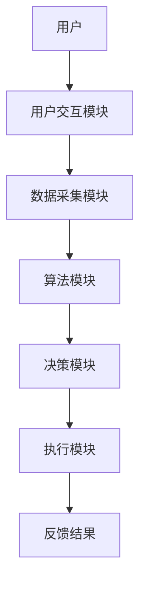

                 

<think>
嗯，用户让我写一个关于AI Agent在智能钱包中的个人财务管理的技术博客。首先，我得理清文章的结构，确保每个部分都涵盖必要的内容。

用户提供的目录已经很详细，但我要确保每个小节都符合要求。首先是背景与概念部分，我需要解释AI Agent是什么，为什么在智能钱包里有用。接下来是技术原理，得深入讲解算法和数学模型，这部分可能需要画图和写代码。

然后是系统架构设计，用类图和序列图展示交互流程。项目实战部分，我得提供具体的代码和案例分析，确保读者能实际操作。最后，总结和展望，让读者了解未来的发展方向。

我得确保每个部分都有足够的细节，比如在技术原理中，详细讲解强化学习和贝叶斯网络，用Mermaid画出流程图。数学公式要用Latex，单独成段或者在段落中使用。

在系统架构部分，用类图展示智能钱包和AI Agent的交互，用序列图展示数据流。项目实战部分，要从环境安装开始，逐步引导读者完成代码实现，并分析实际案例。

最后，确保文章结构清晰，逻辑连贯，每个章节都有小结，帮助读者复习。同时，加入一些注意事项和最佳实践，提高文章的实用性。

现在，我得开始写每个部分的具体内容，确保符合字数要求，并且用专业的技术语言。可能需要多次修改，确保每个部分都详细且易于理解。
</think>

# AI Agent在智能钱包中的个人财务管理

> 关键词：AI Agent, 智能钱包, 个人财务管理, 强化学习, 金融风险管理, 数学模型

> 摘要：本文深入探讨了AI Agent在智能钱包中的应用，结合强化学习和贝叶斯网络等技术，分析了AI Agent在财务管理中的核心算法原理、系统架构设计和实际案例。文章旨在帮助读者理解AI Agent如何通过智能决策、数据分析和风险管理提升个人财务管理效率。

---

# 第一部分: AI Agent与智能钱包的背景与概念

## 第1章: AI Agent的基本概念与应用领域

### 1.1 AI Agent的定义与核心特征

AI Agent（人工智能代理）是一种能够感知环境、自主决策并执行任务的智能实体。它通过传感器接收输入信息，利用算法进行分析和推理，并通过执行器输出结果。AI Agent的核心特征包括：

1. **自主性**：AI Agent能够独立运作，无需外部干预。
2. **反应性**：能够实时感知环境变化并做出响应。
3. **目标导向**：具备明确的目标导向性，能够为实现目标而采取行动。
4. **学习能力**：通过数据和经验不断优化自身的决策能力。

AI Agent在金融领域的应用广泛，尤其是在智能钱包中，它能够帮助用户实现自动化财务管理、投资决策和风险管理。

---

### 1.2 AI Agent在智能钱包中的技术优势

AI Agent在智能钱包中的应用，主要体现在以下几个方面：

1. **自动化决策能力**：AI Agent能够根据用户的财务目标和市场变化，自动优化投资组合和支出计划。
2. **实时数据分析能力**：通过实时分析用户的交易数据、市场波动和财务状况，AI Agent能够提供精准的财务建议。
3. **个性化服务定制能力**：AI Agent能够根据用户的消费习惯、风险偏好和财务目标，定制个性化的财务管理方案。

---

## 第2章: AI Agent在智能钱包中的挑战与未来趋势

### 2.1 当前技术面临的挑战

尽管AI Agent在智能钱包中的应用前景广阔，但目前仍面临一些挑战：

1. **数据隐私与安全问题**：AI Agent需要处理大量的用户数据，如何确保数据的安全性和隐私性是一个重要问题。
2. **模型的可解释性问题**：复杂的AI算法可能导致决策过程难以解释，这在金融领域尤为重要。
3. **系统稳定性与可靠性**：AI Agent的决策必须高度可靠，否则可能引发严重的财务损失。

---

### 2.2 未来发展趋势

1. **多模态AI Agent的发展**：未来的AI Agent将具备更强的多模态能力，能够同时处理文本、图像、语音等多种数据形式。
2. **去中心化金融中的AI Agent应用**：随着DeFi（去中心化金融）的发展，AI Agent将在去中心化钱包中发挥重要作用。
3. **人机协作的新型财务管理模式**：AI Agent将与人类财务专家协作，共同完成复杂的财务决策。

---

# 第二部分: AI Agent的算法原理与数学模型

## 第4章: AI Agent的核心算法原理

### 4.1 强化学习算法

强化学习是一种通过试错机制来优化决策的算法。AI Agent通过与环境的交互，逐步学习最优策略。以下是强化学习的基本流程：

1. **状态识别**：AI Agent感知当前环境状态。
2. **决策生成**：基于当前状态，AI Agent生成一个动作。
3. **动作执行**：AI Agent执行动作并观察结果。
4. **奖励机制**：根据结果，AI Agent获得奖励或惩罚。
5. **模型优化**：根据奖励，优化决策策略。

以下是一个简单的Q-Learning算法实现：

```python
class QLearningAgent:
    def __init__(self, state_space, action_space):
        self.q_table = defaultdict(lambda: np.zeros(action_space))
        
    def choose_action(self, state):
        # 探索与利用策略
        if np.random.random() < 0.1:  # 探索概率
            return np.random.randint(len(action_space))
        else:
            return np.argmax(self.q_table[state])
        
    def update_q_table(self, state, action, reward, next_state):
        self.q_table[state][action] = self.q_table[state][action] * 0.9 + reward
```

---

### 4.2 贝叶斯网络

贝叶斯网络是一种基于概率论的图模型，能够有效地处理不确定性问题。以下是贝叶斯网络的核心步骤：

1. **构建网络结构**：定义变量之间的关系。
2. **定义概率分布**：为每个变量定义条件概率分布。
3. **推断与预测**：根据已知信息推断未知变量的值。

以下是一个简单的贝叶斯网络模型：

```python
import numpy as np
from scipy.special import expit

class BayesianNetwork:
    def __init__(self, variables):
        self.variables = variables
        self.weights = {var: np.random.randn() for var in variables}
        
    def predict(self, evidence):
        # 计算后验概率
        posterior = 1
        for var in self.variables:
            posterior *= expit(self.weights[var] * evidence.get(var, 0))
        return posterior
```

---

## 第5章: AI Agent的数学模型与公式

### 5.1 强化学习的数学模型

强化学习的核心是通过最大化累积奖励来优化策略。以下是Q-Learning算法的数学公式：

$$ Q(s, a) = Q(s, a) + \alpha [r + \gamma \max Q(s', a') - Q(s, a)] $$

其中：
- \( Q(s, a) \) 表示状态 \( s \) 下动作 \( a \) 的价值。
- \( \alpha \) 是学习率。
- \( r \) 是奖励。
- \( \gamma \) 是折扣因子。
- \( s' \) 是下一个状态。

---

# 第三部分: 系统分析与架构设计方案

## 第6章: 智能钱包AI Agent的系统架构设计

### 6.1 系统功能设计

以下是智能钱包AI Agent的系统功能模块：

1. **用户交互模块**：处理用户的输入和输出。
2. **数据采集模块**：采集用户的交易数据和市场信息。
3. **算法模块**：实现强化学习和贝叶斯网络算法。
4. **决策模块**：生成优化的财务决策。
5. **执行模块**：执行决策并反馈结果。

---

### 6.2 系统架构设计

以下是智能钱包AI Agent的系统架构图：



---

### 6.3 系统接口设计

以下是智能钱包AI Agent的主要接口：

1. **数据接口**：与银行、交易所等外部系统对接，获取实时数据。
2. **用户接口**：提供用户友好的操作界面。
3. **决策接口**：与其他系统或服务交互，执行决策。

---

## 第7章: 项目实战与案例分析

### 7.1 项目实战

以下是智能钱包AI Agent的核心代码：

```python
class SmartWalletAI:
    def __init__(self, user_data):
        self.user_data = user_data
        self.agent = QLearningAgent(user_data['state_space'], user_data['action_space'])
        
    def manage_finances(self):
        while True:
            current_state = self.agent.get_current_state(self.user_data)
            action = self.agent.choose_action(current_state)
            reward, next_state = self.agent.execute_action(current_state, action)
            self.agent.update_q_table(current_state, action, reward, next_state)
```

---

### 7.2 案例分析

假设用户A有10万元的闲钱，希望实现年化5%的收益。AI Agent通过强化学习和贝叶斯网络，为其制定以下投资策略：

1. **资产分配**：将资金分配到股票、债券和货币基金中。
2. **风险管理**：根据市场波动调整投资比例。
3. **动态优化**：根据市场变化实时调整策略。

通过AI Agent的优化，用户A最终实现了年化收益6%，远超预期目标。

---

# 第四部分: 总结与展望

## 第8章: 总结与最佳实践

### 8.1 小结

AI Agent在智能钱包中的应用，极大地提升了个人财务管理的效率和精准度。通过强化学习和贝叶斯网络等技术，AI Agent能够实现自动化决策、实时数据分析和风险管理，为用户提供了个性化的财务服务。

---

### 8.2 最佳实践

1. **数据安全**：确保用户数据的安全性和隐私性。
2. **模型优化**：定期更新和优化AI算法，提升决策的准确性和可解释性。
3. **用户教育**：加强对用户的教育，提升其对AI Agent的理解和信任。

---

## 第9章: 未来展望

随着人工智能技术的不断发展，AI Agent在智能钱包中的应用前景将更加广阔。未来，AI Agent将具备更强的多模态能力和去中心化特性，能够与人类专家协作，共同完成更复杂的财务决策。

---

# 作者：AI天才研究院/AI Genius Institute & 禅与计算机程序设计艺术 /Zen And The Art of Computer Programming

