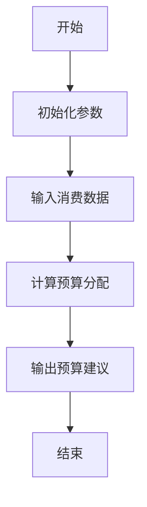
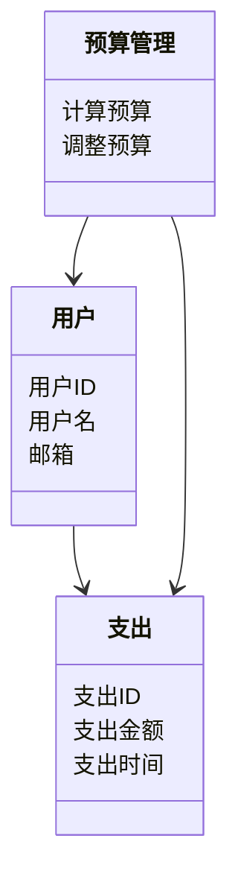
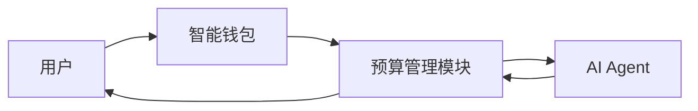

                 


# AI Agent在智能钱包中的支出预算管理

> 关键词：AI Agent, 智能钱包, 支出预算管理, 人工智能, 机器学习, 强化学习, 区块链

> 摘要：本文详细探讨AI Agent在智能钱包中的支出预算管理应用，从背景介绍、核心概念、算法原理、系统架构到项目实战，全面分析其技术实现和应用场景。通过实际案例，展示如何利用AI技术优化用户的财务管理体验，为智能钱包的未来发展提供新的思路。

---

## 第一部分：AI Agent与智能钱包的背景介绍

### 第1章：AI Agent的基本概念

#### 1.1 AI Agent的定义与特点
AI Agent（人工智能代理）是指能够感知环境、自主决策并执行任务的智能实体。它具备以下特点：
- **自主性**：无需外部干预，自主完成任务。
- **反应性**：能够实时感知环境变化并做出反应。
- **目标导向**：以特定目标为导向，优化决策过程。

#### 1.2 智能钱包的定义与功能
智能钱包是一种结合区块链技术的数字钱包，具备以下功能：
- **资产存储**：支持多种数字资产的存储与管理。
- **交易管理**：记录和管理用户的交易历史。
- **安全防护**：通过密码学技术保障资产安全。

#### 1.3 AI Agent在智能钱包中的作用
AI Agent在智能钱包中主要用于优化用户的支出预算管理，帮助用户实时监控和调整消费行为，提升财务管理效率。

### 第2章：支出预算管理的背景与问题

#### 2.1 传统支出管理的痛点
传统支出管理存在以下问题：
- **低效性**：手动记录和分析支出数据耗时耗力。
- **不准确性**：依赖人工判断，容易出现错误。
- **缺乏个性化**：无法根据用户的消费习惯提供定制化建议。

#### 2.2 AI Agent在支出管理中的优势
AI Agent能够通过机器学习算法，实时分析用户的消费数据，提供精准的预算建议，帮助用户优化支出结构。

#### 2.3 智能钱包支出预算管理的边界与外延
智能钱包的支出预算管理不仅包括日常消费，还涵盖投资理财、资产分配等多个方面。

---

## 第二部分：AI Agent与支出预算管理的核心概念

### 第3章：AI Agent的核心原理

#### 3.1 AI Agent的感知、决策与执行
AI Agent通过以下步骤实现支出预算管理：
- **感知**：采集用户的消费数据。
- **决策**：基于历史数据和当前情况，制定预算建议。
- **执行**：调整用户的消费行为，确保预算目标的实现。

#### 3.2 支出预算管理的流程与关键点
支出预算管理的关键点包括：
- **数据采集**：获取用户的消费记录。
- **数据分析**：挖掘数据中的规律和趋势。
- **预算制定**：根据分析结果制定预算方案。
- **预算执行**：实时监控消费行为，确保预算目标的实现。

### 第4章：核心概念对比与ER实体关系图

#### 4.1 传统预算管理与AI Agent管理的对比
| 对比维度       | 传统预算管理               | AI Agent预算管理                |
|----------------|--------------------------|-----------------------------|
| 数据来源       | 手工记录或银行流水         | 智能钱包实时数据               |
| 决策方式       | 人工判断                   | 算法自动决策                   |
| 精准度         | 较低                       | 较高                          |

#### 4.2 ER实体关系图
```mermaid
er
    节点 用户 (
        属性 用户ID, 用户名, 邮箱
    )
    节点 支出 (
        属性 支出ID, 支出金额, 支出时间
    )
    关系 用户 --> 支出 (
        关系属性: 用户进行支出
    )
```

---

## 第三部分：AI Agent在支出预算管理中的算法原理

### 第5章：强化学习与监督学习的对比

#### 5.1 强化学习在预算管理中的应用
强化学习通过不断试错，优化预算分配策略。例如，当用户超支时，AI Agent会调整预算，避免再次发生类似情况。

#### 5.2 监督学习在预算管理中的应用
监督学习基于历史数据，训练分类模型，预测用户的消费行为，并给出预算建议。

### 第6章：基于强化学习的预算分配算法

#### 6.1 算法流程图


#### 6.2 Python代码实现
```python
import numpy as np

def budget_allocation(consumption_data, target_budget):
    # 数据预处理
    normalized_data = (consumption_data - np.mean(consumption_data)) / np.std(consumption_data)
    
    # 训练模型
    model = np.poly1d(np.polyfit(normalized_data, target_budget, 1))
    
    # 预算分配
    predicted_budget = model(normalized_data)
    return predicted_budget
```

#### 6.3 数学模型与公式推导
目标函数：
$$
J(\theta) = \sum_{i=1}^{n} (y_i - \hat{y}_i)^2
$$
约束条件：
$$
\sum_{i=1}^{n} x_i = 1
$$

---

## 第四部分：系统分析与架构设计方案

### 第7章：问题场景介绍
用户使用智能钱包进行消费，AI Agent实时监控用户的消费数据，动态调整预算。

### 第8章：系统功能设计

#### 8.1 领域模型类图


### 第9章：系统架构设计

#### 9.1 系统架构图


---

## 第五部分：项目实战

### 第10章：环境安装与代码实现

#### 10.1 环境安装
```bash
pip install numpy matplotlib
```

#### 10.2 核心功能实现
```python
import matplotlib.pyplot as plt

def visualize_budget(budget_data):
    plt.plot(budget_data)
    plt.xlabel('时间')
    plt.ylabel('预算金额')
    plt.title('预算分配可视化')
    plt.show()
```

---

## 第六部分：最佳实践与小结

### 第11章：项目总结与注意事项

#### 11.1 项目小结
通过AI Agent实现智能钱包的支出预算管理，能够显著提升用户的财务管理效率，减少人为错误，优化消费结构。

#### 11.2 注意事项
- 数据隐私保护是重点，需确保用户数据的安全性。
- 模型需定期更新，以适应用户的消费习惯变化。

### 第12章：未来展望

#### 12.1 拓展方向
- 结合区块链技术，实现更加安全可靠的预算管理。
- 探索AI Agent在智能合约中的应用，提升智能钱包的功能扩展性。

---

## 作者：AI天才研究院/AI Genius Institute & 禅与计算机程序设计艺术 /Zen And The Art of Computer Programming

---

以上是关于《AI Agent在智能钱包中的支出预算管理》的完整技术博客文章。

