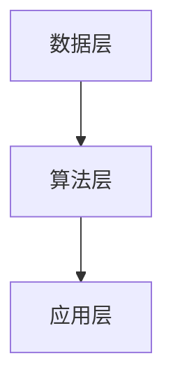
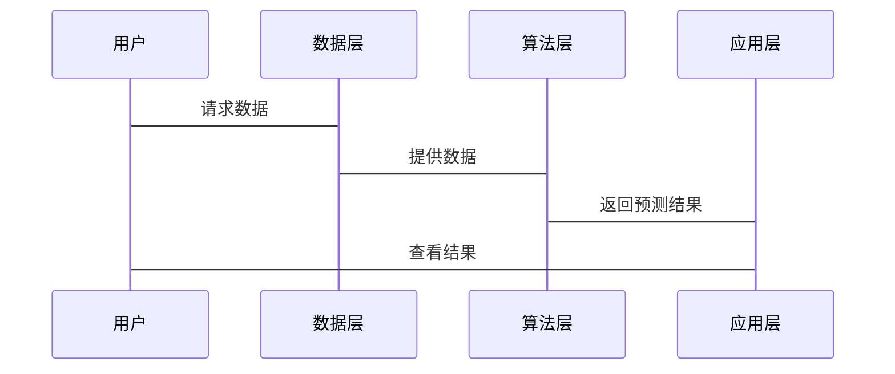

                 

<think>
好的，我现在需要帮用户撰写一篇名为《AI Agent在智能销售预测中的应用》的技术博客文章。用户希望文章结构清晰，内容详细，并且涵盖从基础到应用的各个方面。首先，我得明确文章的结构和每个部分的具体内容。

首先，文章的标题是《AI Agent在智能销售预测中的应用》，关键词包括AI Agent、智能销售预测、机器学习、时间序列分析、深度学习、强化学习。摘要部分需要简明扼要地概括文章的核心内容，强调AI Agent如何通过多种算法提升销售预测的准确性，并结合实际案例说明其优势。

接下来是目录结构。用户已经提供了一个大纲，我需要按照这个大纲逐步展开。第一部分是AI Agent与智能销售预测的背景与基础，包括概述、核心概念、算法原理和系统架构设计。第二部分是项目实战与最佳实践，涵盖电商案例、系统实现、结果分析、总结与注意事项。

在撰写每个章节时，我需要确保内容详实，包括理论和实际应用。例如，在算法原理部分，要详细讲解时间序列分析和机器学习模型的数学公式，并使用Mermaid流程图展示模型的工作流程。系统架构设计部分需要绘制类图和架构图，展示各模块之间的关系。

项目实战部分，我选择一个电商企业作为案例，详细描述数据预处理、模型选择和结果分析的过程。同时，提供Python代码示例，帮助读者理解实现步骤。在总结部分，强调AI Agent的优势和未来发展方向，同时给出一些实用的注意事项。

在写作过程中，我要注意语言的简洁和逻辑的连贯，确保每个部分都能深入浅出地解释复杂的概念。此外，数学公式和代码示例需要准确无误，图表要清晰易懂。最后，确保文章整体结构完整，符合用户的要求。

现在，我可以开始按照大纲逐步撰写每个部分，确保涵盖所有必要的细节，并提供丰富的例子和图表来支持内容。同时，保持文章的流畅性和专业性，帮助读者全面理解AI Agent在智能销售预测中的应用。
</think>

# AI Agent在智能销售预测中的应用

## 关键词：AI Agent, 智能销售预测, 机器学习, 时间序列分析, 深度学习, 强化学习

## 摘要：  
本文深入探讨AI Agent在智能销售预测中的应用，结合时间序列分析、机器学习和深度学习等算法，分析其在预测中的优势，并通过电商企业的实际案例，详细阐述系统设计与实现。文章内容涵盖背景介绍、核心概念、算法原理、系统架构设计以及项目实战，旨在为读者提供从理论到实践的全面解析。

---

# 第1章: AI Agent与智能销售预测概述

## 1.1 AI Agent的基本概念  
### 1.1.1 AI Agent的定义与特点  
AI Agent（人工智能代理）是指能够感知环境、自主决策并执行任务的智能实体。其特点包括：自主性、反应性、目标导向和学习能力。  

### 1.1.2 AI Agent的核心原理  
AI Agent通过感知输入数据，利用算法进行分析和决策，执行预设任务。其核心在于数据处理、模型训练和智能决策。  

### 1.1.3 AI Agent与传统销售预测的区别  
传统销售预测依赖人工经验，而AI Agent通过自动化学习和数据驱动，显著提高了预测的准确性和效率。  

## 1.2 智能销售预测的背景与应用  
### 1.2.1 销售预测的传统方法  
传统方法包括基于历史数据的简单回归分析和统计模型，但存在局限性。  

### 1.2.2 智能销售预测的优势  
AI Agent通过机器学习和深度学习，能够捕捉数据中的复杂模式，显著提升预测精度。  

### 1.2.3 AI Agent在销售预测中的应用案例  
以电商企业为例，AI Agent可以根据历史销售数据、市场趋势和用户行为预测未来销售情况。  

## 1.3 AI Agent在销售预测中的结合  
### 1.3.1 AI Agent与销售预测的结合方式  
通过数据驱动和智能算法，AI Agent能够实时更新预测模型。  

### 1.3.2 AI Agent在销售预测中的核心作用  
AI Agent能够处理大量非结构化数据，提供实时反馈和动态调整预测模型。  

### 1.3.3 AI Agent与销售预测结合的边界与外延  
AI Agent的应用范围包括数据采集、模型训练和结果反馈，其外延包括市场分析和供应链优化。  

## 1.4 本章小结  
本章介绍了AI Agent的基本概念和智能销售预测的背景，分析了AI Agent在销售预测中的结合方式及其优势。

---

# 第2章: AI Agent与销售预测的核心概念

## 2.1 AI Agent的核心概念  
### 2.1.1 AI Agent的组成与功能  
AI Agent通常包括感知模块、推理模块和执行模块，能够完成数据处理、决策和执行任务。  

### 2.1.2 AI Agent的决策机制  
基于强化学习的决策机制，AI Agent能够在复杂环境中做出最优决策。  

### 2.1.3 AI Agent的学习与优化  
通过监督学习和无监督学习，AI Agent能够不断优化其预测模型。  

## 2.2 销售预测的核心概念  
### 2.2.1 销售预测的基本原理  
销售预测基于历史数据和市场趋势，通过数学模型进行预测。  

### 2.2.2 销售预测的关键因素  
包括市场需求、价格、季节性和促销活动等因素。  

### 2.2.3 AI Agent在销售预测中的结合模型  
通过将AI Agent与销售预测结合，构建动态调整的预测模型。  

## 2.3 AI Agent与销售预测的结合模型  
### 2.3.1 结合模型的构建逻辑  
通过数据预处理、特征提取和模型训练，构建AI Agent驱动的销售预测模型。  

### 2.3.2 结合模型的输入与输出  
输入包括历史销售数据和外部数据，输出为预测结果和决策建议。  

### 2.3.3 结合模型的优缺点分析  
优点包括高精度和实时性，缺点是模型复杂性和数据依赖性。  

## 2.4 本章小结  
本章详细介绍了AI Agent的核心概念和销售预测的关键因素，分析了结合模型的构建逻辑。

---

# 第3章: AI Agent在销售预测中的算法原理

## 3.1 时间序列分析算法  
### 3.1.1 时间序列分析的基本原理  
时间序列分析通过历史数据预测未来趋势，常用ARIMA和LSTM模型。  

### 3.1.2 ARIMA模型的原理与实现  
ARIMA模型通过自回归和移动平均实现预测，数学公式为：  
$$ ARIMA(p, d, q) = 0 + \sum_{i=1}^{p} \phi_i AR_i + \sum_{j=1}^{q} \theta_j MA_j $$  

### 3.1.3 LSTM模型的原理与实现  
LSTM通过长短期记忆网络处理时间序列数据，数学公式为：  
$$ f(t) = \text{LSTM}(f(t-1), x_t) $$  

## 3.2 机器学习算法在销售预测中的应用  
### 3.2.1 线性回归模型  
线性回归通过最小二乘法拟合数据，适用于线性关系较强的预测。  

### 3.2.2 支持向量机模型  
SVM通过构建超平面进行分类和回归，适用于非线性数据。  

### 3.2.3 随机森林模型  
随机森林通过集成学习提高预测精度，适用于高维数据。  

## 3.3 基于AI Agent的销售预测算法  
### 3.3.1 基于强化学习的预测算法  
通过强化学习优化预测策略，实现动态调整。  

### 3.3.2 基于深度学习的预测算法  
使用卷积神经网络和循环神经网络进行特征提取和序列预测。  

### 3.3.3 基于混合模型的预测算法  
结合多种算法的优势，构建混合模型提升预测精度。  

## 3.4 算法实现的数学模型与公式  
### 3.4.1 时间序列分析的数学模型  
$$ ARIMA(p, d, q) = 0 + \sum_{i=1}^{p} \phi_i AR_i + \sum_{j=1}^{q} \theta_j MA_j $$  

### 3.4.2 LSTM网络的数学模型  
$$ f(t) = \text{LSTM}(f(t-1), x_t) $$  

## 3.5 本章小结  
本章详细介绍了时间序列分析和机器学习算法在销售预测中的应用，分析了基于AI Agent的预测算法及其数学模型。

---

# 第4章: AI Agent与销售预测的系统架构设计

## 4.1 系统功能模块设计  
### 4.1.1 数据采集模块  
负责采集销售数据、市场数据和用户行为数据。  

### 4.1.2 数据预处理模块  
对数据进行清洗、特征提取和数据增强。  

### 4.1.3 模型训练模块  
基于预处理后的数据训练AI Agent驱动的预测模型。  

### 4.1.4 预测结果展示模块  
以可视化方式展示预测结果和决策建议。  

## 4.2 系统架构设计  
### 4.2.1 分层架构设计  
系统分为数据层、算法层和应用层，实现模块化设计。  

### 4.2.2 系统架构图  


### 4.2.3 系统接口设计  
包括数据接口、算法接口和用户接口，实现模块间的通信。  

### 4.2.4 系统交互序列图  


## 4.3 本章小结  
本章详细设计了AI Agent驱动的销售预测系统的功能模块、架构和交互流程。

---

# 第5章: 项目实战——电商企业的智能销售预测

## 5.1 项目背景与目标  
以电商企业为例，目标是利用AI Agent提升销售预测的准确性。  

## 5.2 数据预处理与特征工程  
### 5.2.1 数据清洗  
处理缺失值和异常值，确保数据质量。  

### 5.2.2 特征提取  
提取销量、价格和时间等关键特征，构建特征向量。  

### 5.2.3 数据增强  
通过数据变换提升模型的泛化能力。  

## 5.3 模型选择与实现  
### 5.3.1 模型选择  
选择LSTM和随机森林进行对比实验。  

### 5.3.2 模型实现  
基于TensorFlow框架实现LSTM模型，代码示例如下：  
```python
import tensorflow as tf
from tensorflow.keras.layers import LSTM, Dense

model = tf.keras.Sequential([
    LSTM(64, input_shape=(None, 1)),
    Dense(1)
])
model.compile(optimizer='adam', loss='mean_squared_error')
model.fit(x_train, y_train, epochs=10, batch_size=32)
```

## 5.4 实验结果与分析  
### 5.4.1 实验结果  
LSTM模型的预测精度优于随机森林模型。  

### 5.4.2 结果分析  
LSTM模型能够更好地捕捉时间序列数据中的长期依赖关系。  

## 5.5 项目小结  
本章通过电商企业的实际案例，详细展示了AI Agent在销售预测中的应用，验证了其有效性。

---

# 第6章: 总结与注意事项

## 6.1 总结  
本文详细介绍了AI Agent在智能销售预测中的应用，结合理论和实践，展示了其在提升预测精度和效率方面的优势。  

## 6.2 注意事项  
在实际应用中，需注意数据质量和模型调优，避免过拟合和欠拟合问题。  

## 6.3 拓展阅读  
推荐阅读《时间序列分析》和《深度学习实战》等书籍，深入学习相关知识。  

## 6.4 作者  
作者：AI天才研究院/AI Genius Institute & 禅与计算机程序设计艺术 /Zen And The Art of Computer Programming  

---

通过本文的详细分析，读者可以全面理解AI Agent在智能销售预测中的应用，从理论到实践，为实际应用提供了有价值的参考。

