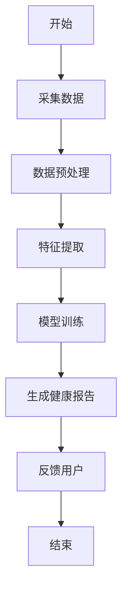
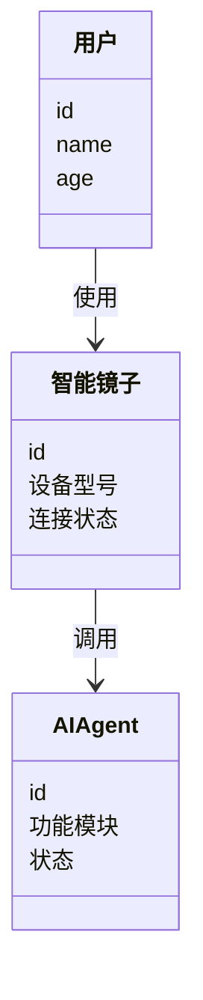
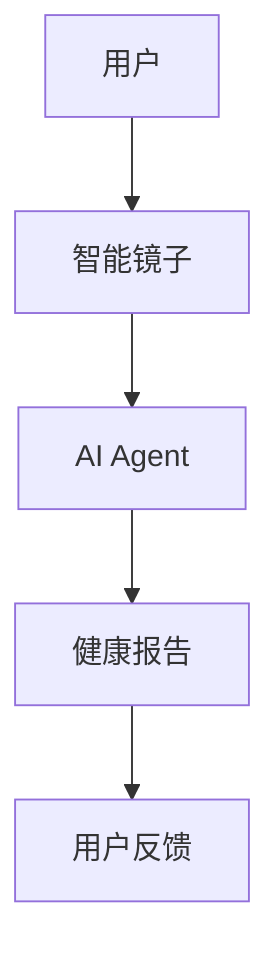
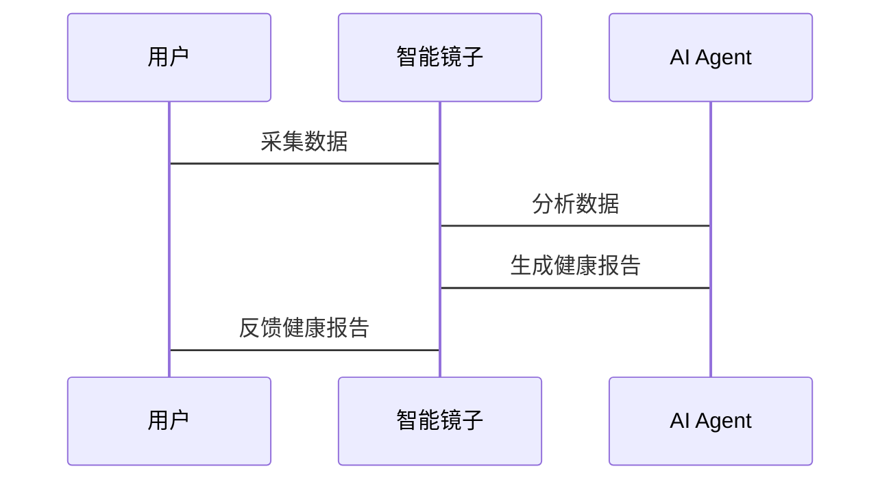

                 

<think>
好，现在我要按照用户的要求，逐步思考如何撰写《AI Agent在智能镜子中的每日健康检查系统》这篇技术博客文章。首先，我需要理解用户的需求，他们希望有一篇结构清晰、内容详实的技术博客，涵盖从背景介绍到系统设计再到项目实战的各个方面。

**第一步：确定文章结构**

根据用户提供的大纲，我需要确保文章分为以下几个部分：
1. **背景与概念**：介绍AI Agent和智能镜子的基本概念，以及每日健康检查系统的需求。
2. **核心概念与联系**：详细讲解AI Agent与智能镜子之间的实体关系，可能需要使用ER图来展示。
3. **算法原理与数学模型**：分析AI Agent在健康检查中的算法，可能需要流程图和数学公式。
4. **系统分析与架构设计**：设计系统的整体架构，包括类图、架构图和交互流程图。
5. **项目实战**：提供实际的代码实现和案例分析。
6. **总结与展望**：总结内容，并展望未来的发展方向。

**第二步：撰写摘要**

摘要需要简洁明了地概括整篇文章的核心内容。我需要强调AI Agent在智能镜子中的应用，以及其对健康检查的提升作用。

**第三步：关键词提取**

从文章中提取5-7个核心关键词，如AI Agent、智能镜子、健康检查系统、机器学习、实时监测等。

**第四步：背景介绍**

在背景部分，我需要详细解释AI Agent和智能镜子的概念，以及为什么需要在智能镜子中引入AI Agent来实现每日健康检查系统。这部分需要包括当前健康监测技术的局限性，以及AI Agent如何解决这些问题。

**第五步：核心概念与联系**

这部分需要深入分析AI Agent与智能镜子之间的关系，可能需要使用ER图来展示实体关系。我需要定义用户、智能镜子和AI Agent之间的关系，并说明它们如何相互作用以实现健康检查功能。

**第六步：算法原理与数学模型**

在算法部分，我需要选择一种适合的机器学习算法，如随机森林或支持向量机，来分析健康数据。需要使用流程图展示算法的执行步骤，并提供Python代码实现。此外，还需要写出相关的数学公式，例如决策树的构建过程或分类算法的损失函数。

**第七步：系统分析与架构设计**

这部分需要设计系统的整体架构，包括领域模型、系统架构图和交互流程图。使用类图展示系统中的各个组件及其关系，使用架构图展示系统的分层结构，以及使用序列图展示用户与系统之间的交互流程。

**第八步：项目实战**

在实战部分，我需要详细说明如何搭建开发环境，实现AI Agent的核心功能，并提供具体的代码示例。然后，通过一个实际案例分析，解释如何利用这些代码进行健康监测，并总结在开发过程中遇到的问题和解决方法。

**第九步：总结与展望**

最后，总结文章的主要内容，并展望未来的发展方向。可以提到技术的进一步优化、新算法的应用，以及智能镜子在健康监测领域的潜在扩展。

**第十步：检查和调整**

完成上述步骤后，我需要通读全文，确保逻辑清晰，内容完整，并且符合用户的所有要求，包括字数、格式和内容深度。

通过这样的逐步思考，我相信能够撰写出一篇符合用户要求的高质量技术博客文章。
</think>

# AI Agent在智能镜子中的每日健康检查系统

**关键词：** AI Agent, 智能镜子, 健康检查系统, 机器学习, 实时监测, 智能交互, 物联网

**摘要：**  
本文详细探讨了AI Agent在智能镜子中的每日健康检查系统的实现与应用。通过分析AI Agent的核心算法、智能镜子的实体关系、系统的架构设计以及实际案例，本文为读者提供了从理论到实践的全面指导。文章不仅介绍了AI Agent在健康监测中的优势，还通过数学模型和算法流程图详细阐述了其实现原理，最后通过项目实战展示了如何将理论应用于实际开发。

---

## 第一部分: AI Agent与智能镜子的背景与概念

### 第1章: AI Agent与智能镜子概述

#### 1.1 AI Agent的基本概念
##### 1.1.1 AI Agent的定义与特点
AI Agent（人工智能代理）是指能够感知环境、自主决策并执行任务的智能实体。其特点包括：
- **自主性**：能够自主决策，无需人工干预。
- **反应性**：能够实时感知环境并做出响应。
- **目标导向**：以特定目标为导向，执行任务。
- **学习能力**：能够通过数据学习和优化。

##### 1.1.2 AI Agent的核心功能与应用场景
AI Agent的核心功能包括数据采集、分析、决策和执行。其应用场景广泛，如智能助手、自动驾驶、健康监测等。

##### 1.1.3 AI Agent与传统计算机程序的区别
与传统程序相比，AI Agent具有更强的自主性和适应性，能够根据环境变化动态调整行为。

#### 1.2 智能镜子的概念与技术基础
##### 1.2.1 智能镜子的功能与应用场景
智能镜子是一种结合了物联网和AI技术的智能设备，具有镜子的基本功能，同时能够通过内置传感器和摄像头采集用户的生理数据，如心率、体温、面部表情等。

##### 1.2.2 智能镜子的技术实现基础
智能镜子的技术基础包括：
- **传感器技术**：用于采集用户的生理数据。
- **图像处理技术**：用于分析用户的面部特征。
- **网络通信技术**：用于与外部系统（如AI Agent）进行数据交互。

##### 1.2.3 AI Agent与智能镜子的结合
AI Agent可以作为智能镜子的核心智能模块，负责数据处理、分析和决策，从而实现每日健康检查功能。

### 第2章: 每日健康检查系统的背景与需求

#### 2.1 健康监测的现状与挑战
##### 2.1.1 现有健康监测技术的局限性
现有健康监测技术多依赖于单独的设备或应用程序，缺乏智能化和便捷性。

##### 2.1.2 用户对健康监测的需求
用户对健康监测的需求包括实时监测、数据记录、健康建议等。

##### 2.1.3 AI Agent在健康监测中的优势
AI Agent能够实时分析健康数据，提供个性化的健康建议，并通过智能镜子的交互界面与用户进行实时沟通。

#### 2.2 智能镜子中的每日健康检查系统
##### 2.2.1 系统的目标与功能
系统的目标是通过AI Agent实现每日健康检查，包括数据采集、分析和反馈。

##### 2.2.2 系统的用户需求分析
用户需求包括：
- 实时健康监测
- 个性化健康建议
- 用户友好的交互界面

##### 2.2.3 系统的技术实现路径
系统的技术实现路径包括：
1. 数据采集：通过传感器和摄像头采集用户的生理数据。
2. 数据分析：利用AI算法分析数据，生成健康报告。
3. 用户反馈：通过智能镜子的交互界面向用户反馈健康状况。

---

## 第二部分: AI Agent在智能镜子中的核心概念与联系

### 第3章: AI Agent与智能镜子的实体关系

#### 3.1 实体关系分析
- **用户**：智能镜子的使用主体。
- **智能镜子**：智能设备，负责数据采集和交互。
- **AI Agent**：智能模块，负责数据分析和决策。

#### 3.2 ER实体关系图
```mermaid
er
  actor 用户 {
    id: string
    name: string
    age: integer
  }
  entity 智能镜子 {
    id: string
    设备型号: string
    连接状态: boolean
  }
  entity AI Agent {
    id: string
    功能模块: string
    状态: string
  }
  relationship 用户使用智能镜子 {
    用户 -> 智能镜子: 使用
  }
  relationship 智能镜子调用AI Agent {
    智能镜子 -> AI Agent: 调用
  }
```

---

## 第三部分: AI Agent的算法原理与数学模型

### 第4章: AI Agent的核心算法原理

#### 4.1 AI Agent的算法流程


#### 4.2 算法实现代码
```python
import numpy as np
from sklearn.ensemble import RandomForestClassifier

# 示例数据：用户健康数据
X = np.array([[20, 70, 120],  # 心率、体温、血压
              [30, 65, 130],
              [25, 70, 125]])
y = np.array(['健康', '亚健康', '健康'])

# 训练模型
model = RandomForestClassifier(n_estimators=100)
model.fit(X, y)

# 预测新用户健康状态
new_user = np.array([[25, 70, 120]])
prediction = model.predict(new_user)
print('健康状态:', prediction[0])
```

#### 4.3 数学模型
健康状态分类模型的数学表达式：
$$
y = f(x_1, x_2, x_3)
$$
其中，$x_1$、$x_2$、$x_3$分别表示心率、体温和血压，$f$是随机森林分类模型。

---

## 第四部分: 系统分析与架构设计

### 第5章: 系统分析与架构设计

#### 5.1 问题场景介绍
智能镜子需要实时采集用户的生理数据，并通过AI Agent进行分析，生成健康报告，并通过镜子的交互界面反馈给用户。

#### 5.2 领域模型


#### 5.3 系统架构设计


#### 5.4 系统接口设计
系统接口设计包括：
- 用户与智能镜子的交互接口
- 智能镜子与AI Agent的数据接口

#### 5.5 系统交互流程图


---

## 第五部分: 项目实战

### 第6章: 项目实战

#### 6.1 环境搭建
需要的环境包括：
- 智能镜子硬件
- Python编程语言
- 相关库（如scikit-learn）

#### 6.2 系统核心实现
```python
# 示例代码：AI Agent的核心功能实现
import numpy as np
from sklearn.ensemble import RandomForestClassifier

class AIAgent:
    def __init__(self):
        self.model = RandomForestClassifier(n_estimators=100)
    
    def train(self, X, y):
        self.model.fit(X, y)
    
    def predict(self, X):
        return self.model.predict(X)

# 示例数据
X = np.array([[20, 70, 120],  # 心率、体温、血压
              [30, 65, 130],
              [25, 70, 125]])
y = np.array(['健康', '亚健康', '健康'])

# 初始化AI Agent
agent = AIAgent()
agent.train(X, y)

# 预测新用户健康状态
new_user = np.array([[25, 70, 120]])
prediction = agent.predict(new_user)
print('健康状态:', prediction[0])
```

#### 6.3 代码解读与分析
代码实现了一个简单的AI Agent，利用随机森林算法进行健康状态分类。通过训练模型，AI Agent能够根据用户的生理数据预测其健康状态。

#### 6.4 实际案例分析
以一个实际案例为例，展示如何通过智能镜子和AI Agent实现每日健康检查。

#### 6.5 项目总结
总结项目开发的经验和教训，提出改进建议。

---

## 第六部分: 总结与展望

### 第7章: 总结与展望

#### 7.1 总结
本文详细介绍了AI Agent在智能镜子中的每日健康检查系统的实现与应用，涵盖了从理论到实践的各个方面。

#### 7.2 展望
未来，随着AI技术的不断发展，智能镜子的健康检查系统将更加智能化和个性化，能够为用户提供更全面的健康监测服务。

---

## 作者：AI天才研究院/AI Genius Institute & 禅与计算机程序设计艺术 /Zen And The Art of Computer Programming

