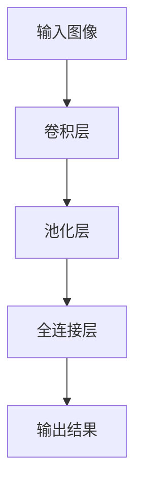
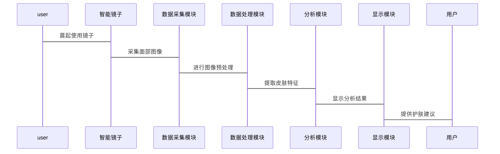

                 


# AI Agent在智能镜子中的皮肤状况分析

---

## 关键词：AI Agent, 智能镜子, 皮肤状况分析, 图像处理, 机器学习, 深度学习

---

## 摘要：本文探讨了AI Agent在智能镜子中的应用，重点分析其在皮肤状况评估中的技术实现。通过图像处理、机器学习和深度学习等技术，AI Agent能够实时采集和分析用户的皮肤数据，提供个性化的健康建议。本文详细介绍了相关技术原理、系统架构设计及实际应用案例，为智能镜子的开发提供了理论和实践指导。

---

# 1. 引言

智能镜子作为一种新兴的智能设备，正在逐渐融入人们的日常生活。通过集成AI技术，智能镜子能够提供更多功能，如天气预报、日历查看和健康监测。其中，皮肤状况分析是健康监测的重要组成部分，AI Agent在这一领域的应用尤为突出。本文将详细探讨AI Agent在智能镜子中的技术实现，特别是在皮肤分析中的应用。

---

# 2. AI Agent的核心原理

AI Agent是一种能够感知环境、做出决策并执行任务的智能实体。在智能镜子中，AI Agent主要负责数据的采集、处理和分析。以下是其核心原理的详细分析：

## 2.1 感知机制

AI Agent通过摄像头和传感器采集用户的皮肤图像和相关数据。图像处理技术用于提取皮肤特征，如颜色、纹理和斑点等。这些特征将被输入到AI模型中进行分析。

## 2.2 决策机制

基于机器学习算法，AI Agent对皮肤数据进行分类和诊断。常用的算法包括支持向量机（SVM）和卷积神经网络（CNN）。以下是SVM的数学模型：

$$
\text{损失函数} = \sum_{i=1}^{n} \max(0, y_i - y_{\text{pred}_i} + \xi_i)
$$

其中，\( y_i \) 是真实标签，\( y_{\text{pred}_i} \) 是预测标签，\( \xi_i \) 是松弛变量。

## 2.3 执行机制

根据分析结果，AI Agent提供个性化的建议，如护肤推荐和健康提醒。这些结果通过智能镜子的显示界面呈现给用户。

---

# 3. 皮肤状况分析的关键技术

## 3.1 图像处理技术

图像处理是皮肤分析的基础。以下是常见的图像处理步骤：

1. **图像增强**：通过调整亮度、对比度和锐化来改善图像质量。
2. **图像分割**：将皮肤区域与其他区域分离，常用的方法包括阈值分割和边缘检测。
3. **特征提取**：提取皮肤的颜色、纹理和形状特征。

## 3.2 基于深度学习的皮肤分类

深度学习在皮肤分类中表现出色。以下是使用卷积神经网络（CNN）的流程图：



---

# 4. 系统架构设计

## 4.1 系统模块划分

智能镜子的系统架构包括以下几个模块：

1. **数据采集模块**：负责采集用户的皮肤图像。
2. **数据处理模块**：对图像进行预处理和特征提取。
3. **分析模块**：利用AI模型进行皮肤分析。
4. **显示与反馈模块**：将分析结果呈现给用户。

## 4.2 系统交互流程

以下是系统交互的流程图：



---

# 5. 项目实战：智能镜子的实现

## 5.1 环境配置

开发环境包括Python 3.8及以上版本，安装TensorFlow、OpenCV和Keras库。

## 5.2 核心代码实现

以下是皮肤分析模块的Python代码示例：

```python
import cv2
import numpy as np

def preprocess_image(image_path):
    img = cv2.imread(image_path)
    img = cv2.cvtColor(img, cv2.COLOR_BGR2RGB)
    img = cv2.resize(img, (224, 224))
    return img

def analyze_skin(image):
    model = load_model('skin_analysis_model.h5')
    prediction = model.predict(np.array([image]))
    return prediction[0]

# 使用示例
image_path = 'face.jpg'
processed_image = preprocess_image(image_path)
result = analyze_skin(processed_image)
print("皮肤状况分析结果:", result)
```

---

# 6. 最佳实践与小结

AI Agent在智能镜子中的应用前景广阔，但实际应用中仍需注意数据隐私和系统优化。建议开发者：

1. **确保数据隐私**：严格保护用户的健康数据，避免泄露。
2. **优化系统性能**：提升AI模型的运行效率，减少延迟。
3. **定期更新模型**：引入新的数据和算法，保持分析的准确性。

---

# 7. 扩展阅读

- 《Deep Learning》 by Ian Goodfellow
- 《Hands-On Machine Learning with Scikit-Learn, Keras, and TensorFlow》 by Aurélien Géron

---

# 作者：AI天才研究院/AI Genius Institute & 禅与计算机程序设计艺术 /Zen And The Art of Computer Programming

