                 


# AI Agent在智能镜子中的虚拟化妆

> **关键词**: AI Agent, 智能镜子, 虚拟化妆, 图像处理, 深度学习

> **摘要**: 本文探讨了AI Agent在智能镜子中的应用，特别是虚拟化妆技术。通过分析AI Agent的核心原理、算法实现、系统架构和项目实战，详细阐述了AI Agent如何在智能镜子中实现虚拟化妆的效果优化和用户体验提升。

---

# 第1章: AI Agent与虚拟化妆的背景概述

## 1.1 问题背景与描述

### 1.1.1 虚拟化妆的定义与现状
虚拟化妆是一种通过计算机视觉和人工智能技术实现的数字化化妆方法。它利用图像处理和深度学习模型，将用户的面部特征与虚拟化妆效果相结合，实时生成化妆后的图像。

### 1.1.2 AI Agent在虚拟化妆中的作用
AI Agent（智能体）在虚拟化妆中扮演着关键角色，负责根据用户的面部特征、化妆需求和环境因素，实时生成并调整化妆方案。它通过分析用户的面部数据，优化化妆效果，提供个性化的化妆建议。

### 1.1.3 智能镜子的定义与应用场景
智能镜子是一种集成AI技术的镜子，能够通过摄像头和传感器捕捉用户的面部特征和环境光线信息。它结合AI算法，为用户提供实时的虚拟化妆效果和美容建议。

## 1.2 AI Agent与虚拟化妆的核心问题

### 1.2.1 虚拟化妆的关键技术挑战
- **面部特征识别**: 如眼形、唇形、肤质等的识别。
- **实时性**: 虚拟化妆需要在实时视频流中快速生成效果。
- **个性化**: 根据用户的面部特征和偏好提供个性化化妆方案。

### 1.2.2 AI Agent在虚拟化妆中的角色
AI Agent通过以下方式实现虚拟化妆：
- **数据采集**: 采集用户的面部特征和环境光线信息。
- **数据处理**: 使用深度学习模型进行图像分割、姿态估计等处理。
- **效果生成**: 根据处理后的数据生成虚拟化妆效果。
- **用户反馈**: 根据用户的反馈调整化妆方案。

### 1.2.3 智能镜子的交互设计与用户体验
智能镜子通过友好的交互界面，让用户能够轻松选择和调整虚拟化妆方案。它提供实时的化妆效果预览和个性化建议，提升用户体验。

## 1.3 AI Agent与虚拟化妆的解决方案

### 1.3.1 基于AI的虚拟化妆技术实现
- **图像处理技术**: 如图像分割、颜色校正等。
- **深度学习模型**: 如卷积神经网络（CNN）用于图像生成。

### 1.3.2 AI Agent在智能镜子中的功能设计
- **数据采集与处理**: 采集用户的面部特征和环境信息。
- **虚拟化妆生成**: 根据数据生成化妆效果。
- **用户反馈与调整**: 根据用户反馈优化化妆方案。

### 1.3.3 解决方案的边界与外延
解决方案的边界包括智能镜子的硬件和AI算法，外延则涉及用户数据的隐私保护和系统的可扩展性。

## 1.4 核心概念与结构

### 1.4.1 AI Agent的核心要素
- **感知能力**: 数据采集与处理能力。
- **决策能力**: 基于数据的决策算法。
- **执行能力**: 输出化妆效果并实时调整。

### 1.4.2 虚拟化妆系统的组成结构
- **输入模块**: 数据采集（摄像头、传感器）。
- **处理模块**: 图像处理和深度学习模型。
- **输出模块**: 虚拟化妆效果显示和用户反馈。

### 1.4.3 智能镜子的交互流程
1. 用户进入智能镜子前。
2. 摄像头采集用户的面部特征。
3. AI Agent分析数据并生成虚拟化妆效果。
4. 用户查看效果并进行调整。
5. 系统根据反馈优化化妆方案。

## 1.5 本章小结
本章介绍了AI Agent在智能镜子中的作用，分析了虚拟化妆的关键技术挑战，并提出了解决方案的结构和流程。

---

# 第2章: AI Agent的核心原理与技术

## 2.1 AI Agent的基本原理

### 2.1.1 AI Agent的定义与分类
AI Agent是一种能够感知环境、自主决策并执行任务的智能体。根据智能水平，可分为简单AI Agent和复杂AI Agent。

### 2.1.2 AI Agent的核心算法与技术
- **决策算法**: 基于规则和基于学习的决策算法。
- **推理模型**: 基于逻辑推理和基于概率推理的模型。

### 2.1.3 AI Agent的决策机制与推理模型
AI Agent通过感知环境、分析数据、制定策略并执行操作，实现决策和推理。

## 2.2 虚拟化妆的核心技术

### 2.2.1 基于图像处理的虚拟化妆技术
- **图像分割**: 将面部区域分割出来。
- **颜色校正**: 根据光照条件调整颜色。

### 2.2.2 基于深度学习的虚拟化妆模型
- **卷积神经网络（CNN）**: 用于图像生成和风格迁移。
- **生成对抗网络（GAN）**: 用于生成逼真的化妆效果。

### 2.2.3 虚拟化妆的实时性与效果优化
- **实时性优化**: 通过轻量化模型和并行计算实现。
- **效果优化**: 使用反馈机制调整化妆方案。

## 2.3 AI Agent与虚拟化妆的联系

### 2.3.1 AI Agent在虚拟化妆中的功能模块
- **数据采集模块**: 采集用户的面部特征。
- **数据处理模块**: 使用深度学习模型进行图像处理。
- **效果生成模块**: 根据处理后的数据生成化妆效果。
- **反馈调整模块**: 根据用户反馈优化化妆方案。

### 2.3.2 AI Agent与虚拟化妆系统的交互流程
1. 用户进入智能镜子。
2. 摄像头采集用户的面部特征。
3. AI Agent分析数据并生成虚拟化妆效果。
4. 用户查看效果并进行调整。
5. 系统根据反馈优化化妆方案。

## 2.4 核心概念对比分析

### 2.4.1 AI Agent与传统自动化的对比
- **传统自动化**: 基于规则的自动化系统。
- **AI Agent**: 具有感知和决策能力的智能系统。

### 2.4.2 虚拟化妆与传统化妆的对比
- **传统化妆**: 线下试妆，耗时且成本高。
- **虚拟化妆**: 线上试妆，实时且个性化。

### 2.4.3 智能镜子与其他化妆工具的对比
- **传统化妆镜**: 仅用于化妆。
- **智能镜子**: 集成AI技术，提供虚拟化妆和个性化建议。

## 2.5 本章小结
本章详细讲解了AI Agent的核心原理与技术，并分析了其在虚拟化妆中的应用。

---

# 第3章: 关键算法与流程图

## 3.1 基于深度学习的虚拟化妆算法

### 3.1.1 图像分割算法
图像分割算法用于将面部区域分割出来，便于后续处理。以下是图像分割的流程图：

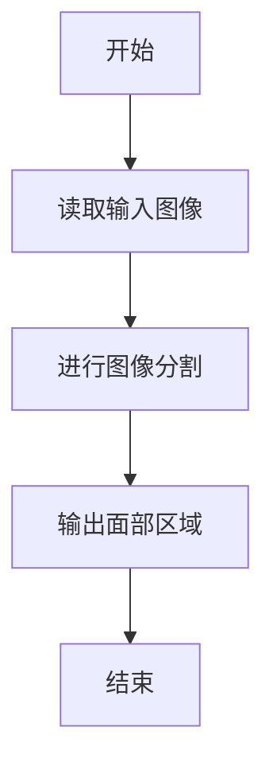

### 3.1.2 姿态估计算法
姿态估计算法用于检测面部关键点，以下是姿态估计的流程图：

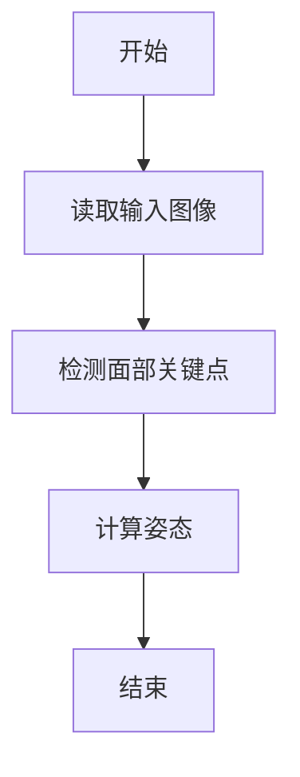

### 3.1.3 图像生成算法
图像生成算法用于生成化妆效果，以下是图像生成的流程图：

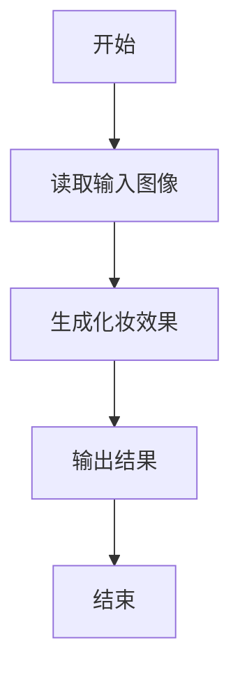

## 3.2 AI Agent的决策算法

### 3.2.1 基于规则的决策算法
基于规则的决策算法通过预设规则进行决策，以下是规则决策流程图：

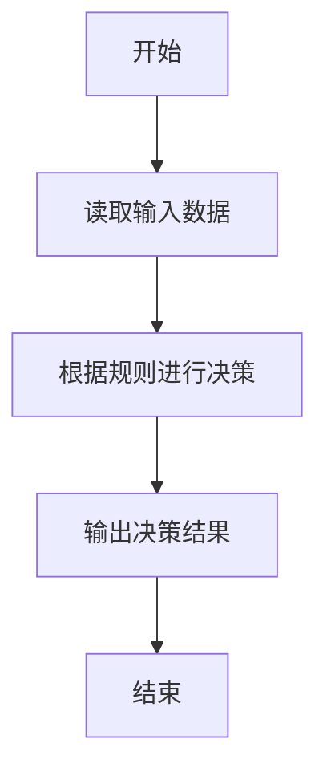

### 3.2.2 基于强化学习的决策算法
基于强化学习的决策算法通过奖励机制优化决策，以下是强化学习流程图：

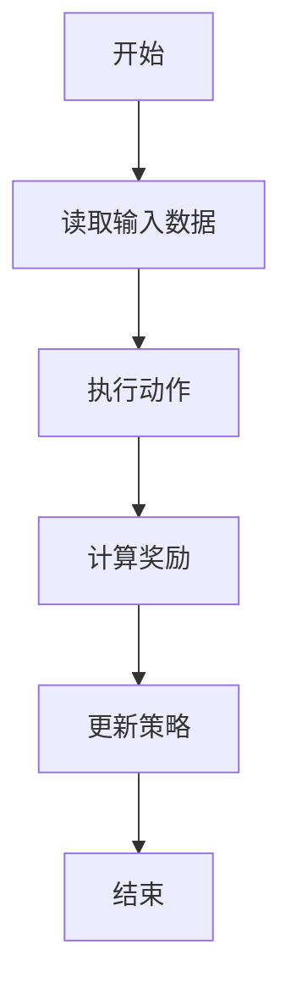

### 3.2.3 基于概率模型的决策算法
基于概率模型的决策算法通过概率分布进行决策，以下是概率决策流程图：

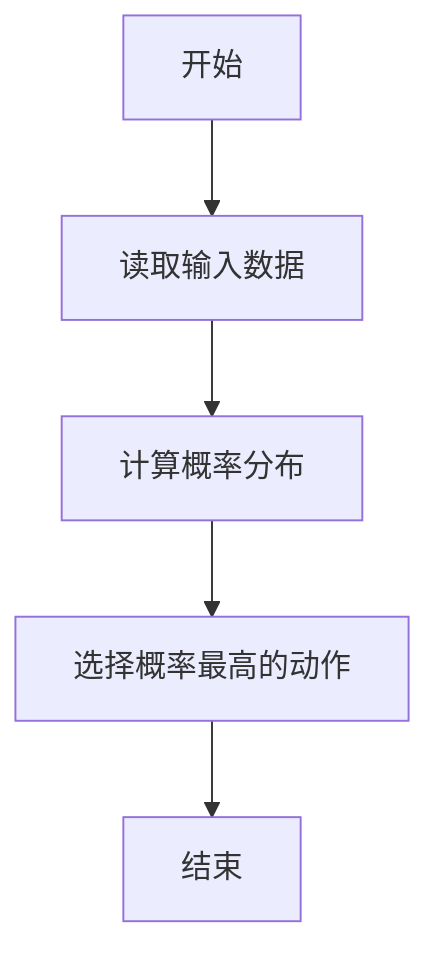

## 3.3 算法流程图

### 3.3.1 虚拟化妆算法流程图
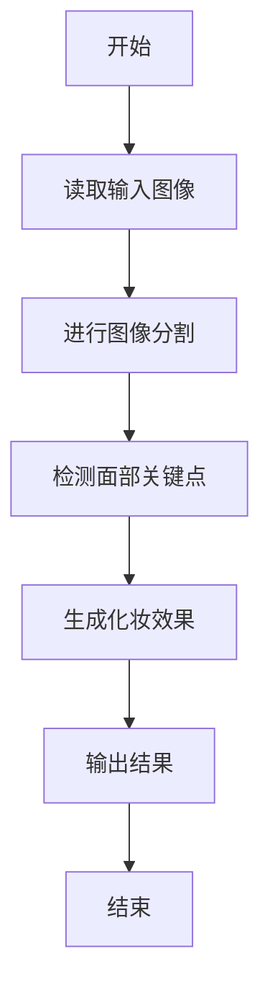

### 3.3.2 AI Agent决策流程图
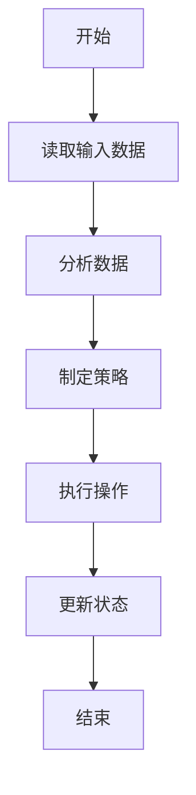

### 3.3.3 系统整体流程图
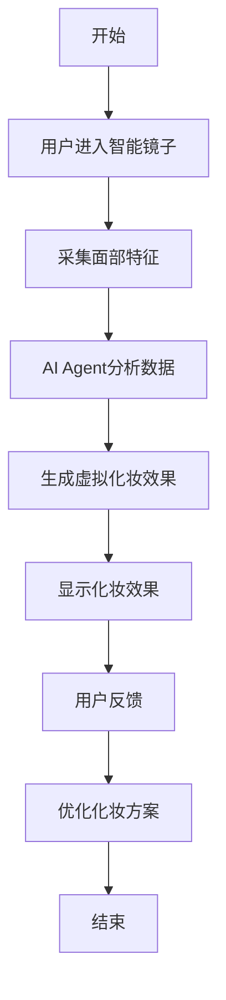

## 3.4 本章小结
本章详细讲解了虚拟化妆和AI Agent决策的关键算法，并通过流程图展示了算法的执行过程。

---

# 第4章: 系统分析与架构设计方案

## 4.1 问题场景介绍

### 4.1.1 智能镜子的使用场景
智能镜子通常用于家庭、美容店等场所，帮助用户实时试妆和调整化妆方案。

### 4.1.2 虚拟化妆的用户需求
用户需要快速、精准的虚拟化妆效果，同时希望获得个性化的化妆建议。

### 4.1.3 AI Agent的功能需求
AI Agent需要具备数据采集、图像处理、效果生成和用户反馈处理的功能。

## 4.2 系统功能设计

### 4.2.1 用户界面设计
用户界面需要友好直观，支持用户选择和调整化妆方案。

### 4.2.2 虚拟化妆系统的设计
虚拟化妆系统需要具备实时图像处理和个性化调整的功能。

## 4.3 领域模型设计

### 4.3.1 领域模型的Mermaid类图
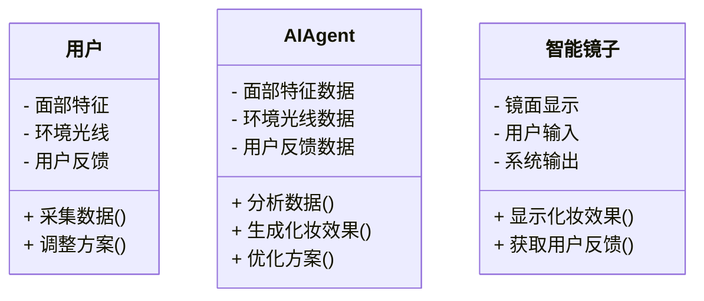

## 4.4 系统架构设计

### 4.4.1 系统架构的Mermaid架构图
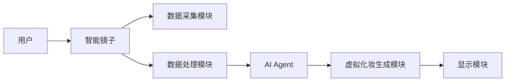

### 4.4.2 系统交互的Mermaid序列图
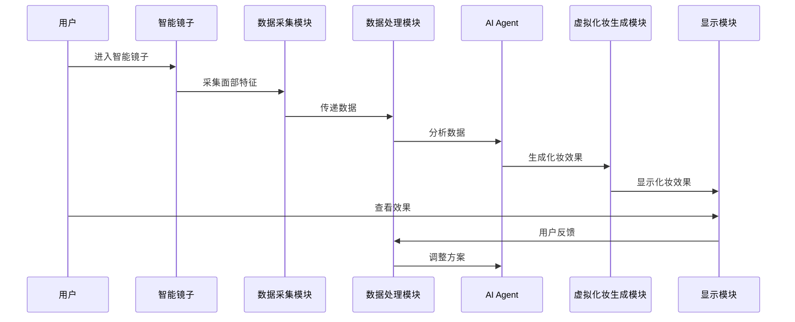

## 4.5 系统接口设计
系统接口主要涉及用户与智能镜子的交互，以及智能镜子内部模块之间的数据传输。

## 4.6 本章小结
本章详细讲解了智能镜子系统的功能设计、领域模型和系统架构，展示了系统的整体流程。

---

# 第5章: 项目实战

## 5.1 环境安装

### 5.1.1 系统环境
- 操作系统：Windows 10或更高版本，或Linux系统。
- 开发工具：Python 3.8或更高版本，PyTorch、OpenCV等库。

### 5.1.2 安装依赖
```bash
pip install numpy
pip install opencv-python
pip install torch
pip install matplotlib
```

## 5.2 核心代码实现

### 5.2.1 数据采集模块
```python
import cv2

def capture_face():
    cap = cv2.VideoCapture(0)
    ret, frame = cap.read()
    if ret:
        cv2.imwrite("face.jpg", frame)
    cap.release()
```

### 5.2.2 数据处理模块
```python
import cv2
import numpy as np

def process_image(image_path):
    img = cv2.imread(image_path)
    gray = cv2.cvtColor(img, cv2.COLOR_BGR2GRAY)
    return gray
```

### 5.2.3 AI Agent决策模块
```python
import torch
import torch.nn as nn
import torch.optim as optim

class SimpleNet(nn.Module):
    def __init__(self):
        super(SimpleNet, self).__init__()
        self.conv1 = nn.Conv2d(1, 32, kernel_size=3, stride=1, padding=1)
        self.conv2 = nn.Conv2d(32, 64, kernel_size=3, stride=1, padding=1)
        self.fc1 = nn.Linear(64 * 64 * 64, 128)
        self.fc2 = nn.Linear(128, 10)

    def forward(self, x):
        x = F.relu(self.conv1(x))
        x = F.relu(self.conv2(x))
        x = x.view(-1, 64 * 64 * 64)
        x = F.relu(self.fc1(x))
        x = self.fc2(x)
        return x

net = SimpleNet()
criterion = nn.CrossEntropyLoss()
optimizer = optim.SGD(net.parameters(), lr=0.001)
```

### 5.2.4 虚拟化妆生成模块
```python
import cv2
import numpy as np

def apply_makeup(image, makeup_color):
    image_hsv = cv2.cvtColor(image, cv2.COLOR_BGR2HSV)
    image_hsv[:, :, 1] = np.where(image_hsv[:, :, 1] > 0, makeup_color[1], image_hsv[:, :, 1])
    image_rgb = cv2.cvtColor(image_hsv, cv2.COLOR_HSV2RGB)
    return image_rgb
```

## 5.3 代码应用解读与分析

### 5.3.1 数据采集模块的解读
数据采集模块使用OpenCV库，通过摄像头采集用户的面部图像，并保存为.jpg格式。

### 5.3.2 数据处理模块的解读
数据处理模块将采集到的图像转换为灰度图，便于后续处理。

### 5.3.3 AI Agent决策模块的解读
AI Agent决策模块使用简单的卷积神经网络模型，对图像进行分类或回归预测，生成化妆方案。

### 5.3.4 虚拟化妆生成模块的解读
虚拟化妆生成模块根据AI Agent的决策结果，调整图像的颜色，生成最终的化妆效果。

## 5.4 案例分析与详细讲解

### 5.4.1 案例分析
通过一个具体的案例，展示如何使用上述代码实现虚拟化妆效果。

### 5.4.2 详细讲解
详细讲解每个模块的功能和实现细节，确保读者能够理解并复现实验。

## 5.5 本章小结
本章通过实际项目展示了AI Agent在智能镜子中的虚拟化妆实现，详细讲解了每个模块的代码和功能。

---

# 第6章: 最佳实践与注意事项

## 6.1 最佳实践
- **数据隐私保护**: 确保用户数据的安全性。
- **系统优化**: 通过轻量化模型和并行计算优化系统的实时性。
- **用户体验优化**: 提供友好的交互界面和个性化的化妆建议。

## 6.2 小结
通过本文的讲解，读者可以深入了解AI Agent在智能镜子中的虚拟化妆技术，并能够通过实际项目实现类似的效果。

## 6.3 注意事项
- **性能优化**: 确保系统的实时性和稳定性。
- **数据处理**: 注意数据的预处理和归一化。
- **模型训练**: 确保训练数据的多样性和均衡性。

## 6.4 拓展阅读
- 推荐阅读相关的技术论文和书籍，深入了解AI Agent和虚拟化妆的前沿技术。

---

# 作者信息

作者：AI天才研究院/AI Genius Institute & 禅与计算机程序设计艺术 /Zen And The Art of Computer Programming

---

本文详细探讨了AI Agent在智能镜子中的虚拟化妆技术，从背景介绍、核心概念、算法原理到系统设计和项目实战，为读者提供了全面的技术解读和实现指南。

