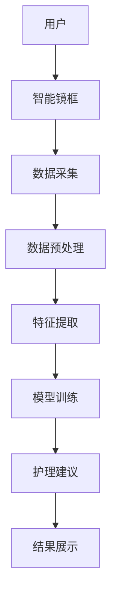
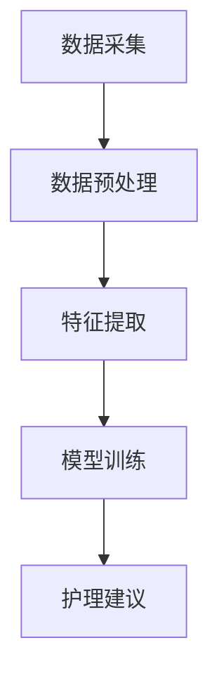
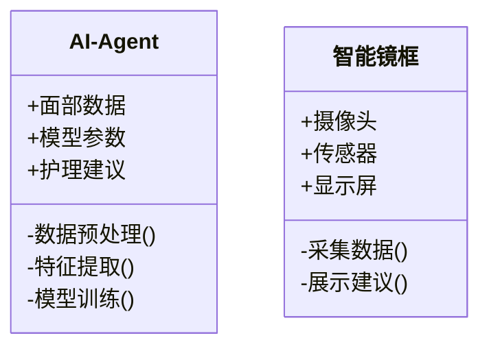
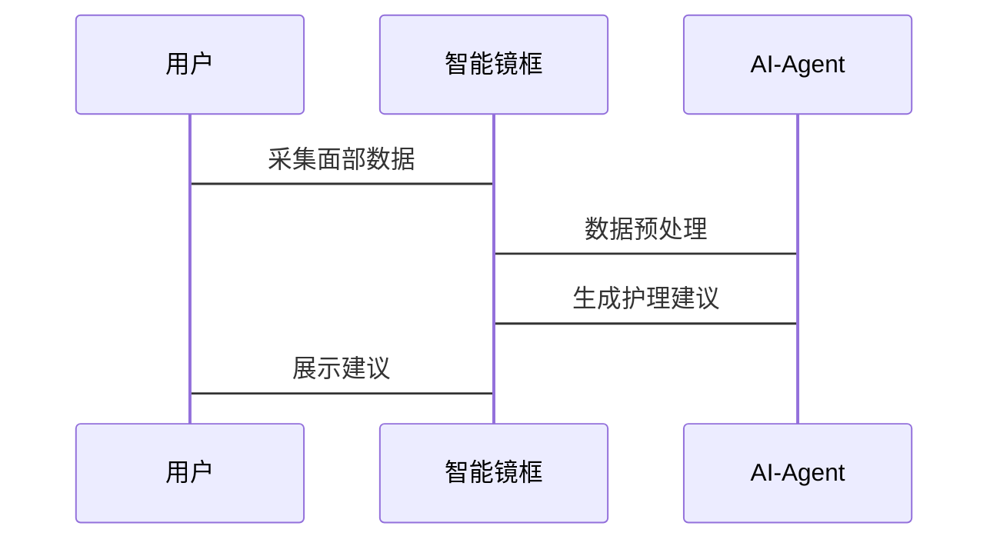

                 


# AI Agent在智能镜框中的面部护理建议

> 关键词：AI Agent，智能镜框，面部护理，机器学习，数据采集，健康科技

> 摘要：本文探讨了AI Agent在智能镜框中的应用，重点分析了AI Agent如何通过数据采集、分析和个性化建议生成，为用户提供高效的面部护理方案。文章详细阐述了AI Agent的核心概念、算法原理、系统架构以及实际项目实现，最后总结了最佳实践和未来发展方向。

---

# 正文

## 第1章 背景介绍

### 1.1 AI Agent的基本概念

AI Agent，即人工智能代理，是一种能够感知环境、自主决策并执行任务的智能实体。AI Agent的核心在于其能够通过传感器获取数据，利用算法进行分析，并根据结果采取相应行动。

#### 1.1.1 AI Agent的定义

AI Agent是指具备以下特点的智能系统：
- **自主性**：能够在没有外部干预的情况下运行。
- **反应性**：能够根据环境变化实时调整行为。
- **目标导向**：具备明确的目标，并通过行为实现目标。

#### 1.1.2 AI Agent的核心特点

AI Agent的核心特点包括：
1. **数据驱动**：依赖数据进行决策。
2. **智能推理**：能够进行逻辑推理和问题解决。
3. **自主学习**：通过机器学习算法不断优化性能。

#### 1.1.3 AI Agent与传统软件的区别

AI Agent与传统软件的主要区别在于：
- AI Agent具备自主决策能力，而传统软件依赖于预设规则。
- AI Agent能够通过学习和适应环境变化，而传统软件无法做到。

### 1.2 面部护理的重要性

面部护理是保持皮肤健康和美观的重要手段，但传统护理方式存在以下问题：
1. **缺乏个性化**：每个人的肤质和需求不同，统一的护理方案难以满足所有人的需求。
2. **依赖经验**：传统护理方案往往依赖美容师的经验，存在主观性和不准确性。
3. **数据不足**：传统护理缺乏科学的数据支持，难以实现精准护理。

### 1.3 智能镜框的发展现状

智能镜框是一种结合了传感器技术和AI算法的智能设备，主要用于面部数据采集和分析。目前，智能镜框的应用主要集中在以下几个方面：
1. **面部特征提取**：通过摄像头和传感器获取面部数据。
2. **皮肤状况分析**：利用AI算法分析皮肤健康状况。
3. **个性化护理建议**：根据分析结果提供定制化的护理方案。

---

## 第2章 AI Agent在智能镜框中的核心概念与联系

### 2.1 AI Agent的感知、决策与执行

AI Agent在智能镜框中的核心功能可以分为三个阶段：
1. **感知**：通过传感器和摄像头采集面部数据。
2. **决策**：利用机器学习算法对数据进行分析，生成护理建议。
3. **执行**：通过智能镜框的显示设备向用户展示护理建议。

#### 2.1.1 感知阶段

在感知阶段，AI Agent需要完成以下任务：
- **数据采集**：通过摄像头和传感器获取面部图像和生理数据。
- **数据预处理**：对采集到的数据进行清洗和标准化处理。

#### 2.1.2 决策阶段

在决策阶段，AI Agent需要完成以下任务：
- **特征提取**：从面部数据中提取关键特征，如皮肤纹理、色斑、毛孔等。
- **模型训练**：利用机器学习算法对特征进行分类和预测，生成护理建议。

#### 2.1.3 执行阶段

在执行阶段，AI Agent需要完成以下任务：
- **结果展示**：将护理建议以用户友好的方式展示在智能镜框的屏幕上。
- **反馈收集**：收集用户的反馈，优化AI算法。

### 2.2 AI Agent与面部护理数据的关系

AI Agent的核心能力在于数据的处理和分析。通过智能镜框采集的面部数据，AI Agent能够生成个性化护理建议。以下是一个简单的数据流图：



### 2.3 AI Agent与传统面部护理的区别

以下是AI Agent与传统面部护理的主要区别：

| 特性 | 传统面部护理 | AI Agent驱动的智能镜框 |
|------|--------------|------------------------|
| 数据来源 | 依赖美容师经验 | 基于传感器和算法分析 |
| 个性化 | 有限 | 高度个性化 |
| 效率 | 低效 | 高效实时 |

---

## 第3章 AI Agent在智能镜框中的算法原理

### 3.1 算法概述

AI Agent的核心算法包括数据预处理、特征提取和模型训练三个部分。以下是一个简单的算法流程图：



### 3.2 数据预处理

数据预处理是AI Agent工作的基础，主要包括以下步骤：
1. **数据清洗**：去除噪声和无关数据。
2. **数据归一化**：将数据标准化，便于后续处理。
3. **数据增强**：通过数据扩展增加数据多样性。

### 3.3 特征提取

特征提取是AI Agent的关键步骤，主要包括以下内容：
- **皮肤纹理分析**：提取皮肤的纹理特征。
- **色斑检测**：识别面部色斑的位置和数量。
- **毛孔检测**：分析毛孔的大小和密度。

### 3.4 模型训练

模型训练是AI Agent的核心环节，通常使用监督学习算法。以下是K-近邻算法（KNN）的Python实现示例：

```python
from sklearn.neighbors import KNeighborsClassifier
import numpy as np

# 示例数据
X = np.array([[25, 30], [28, 35], [26, 32]])
y = np.array(['健康皮肤', '有粉刺', '有痘痘'])

# 训练模型
knn = KNeighborsClassifier(n_neighbors=3)
knn.fit(X, y)

# 预测新样本
new_X = np.array([[27, 33]])
prediction = knn.predict(new_X)
print("预测结果:", prediction)
```

### 3.5 数学模型

以下是模型训练中的一个简单数学公式：

$$
\text{预测结果} = \text{argmin}(\sum_{i=1}^{n} (y_i - y_{\text{预测}})^2)
$$

---

## 第4章 智能镜框的系统分析与架构设计

### 4.1 系统功能设计

以下是系统功能设计的类图：



### 4.2 系统架构设计

以下是系统架构设计的架构图：


### 4.3 系统接口设计

以下是系统接口设计的序列图：



---

## 第5章 项目实战：AI Agent驱动的智能镜框实现

### 5.1 环境搭建

以下是环境搭建步骤：
1. 安装Python和必要的库（如OpenCV、scikit-learn）。
2. 安装智能镜框硬件（如摄像头和传感器）。
3. 配置开发环境（如Jupyter Notebook）。

### 5.2 核心代码实现

以下是核心代码实现：

```python
import cv2
import numpy as np
from sklearn.neighbors import KNeighborsClassifier

# 采集面部数据
def capture_face():
    cap = cv2.VideoCapture(0)
    while True:
        ret, frame = cap.read()
        cv2.imshow('Capture', frame)
        if cv2.waitKey(1) & 0xFF == ord('q'):
            cv2.imwrite('face.jpg', frame)
            break
    cap.release()
    cv2.destroyAllWindows()

# 数据预处理
def preprocess_image(image_path):
    image = cv2.imread(image_path)
    gray = cv2.cvtColor(image, cv2.COLOR_BGR2GRAY)
    return gray

# 特征提取
def extract_features(image):
    # 使用OpenCV进行特征提取
    face_cascade = cv2.CascadeClassifier(cv2.data.haarcascades + 'haarcascade_frontalface_default.xml')
    faces = face_cascade.detectMultiScale(image, 1.3, 5)
    return faces

# 模型训练
def train_model(features, labels):
    knn = KNeighborsClassifier(n_neighbors=3)
    knn.fit(features, labels)
    return knn

# 预测与建议
def get_recommendation(model, features):
    prediction = model.predict(features)
    return prediction[0]

# 主函数
def main():
    capture_face()
    preprocessed = preprocess_image('face.jpg')
    features = extract_features(preprocessed)
    labels = ['健康皮肤', '有粉刺', '有痘痘']
    model = train_model(features, labels)
    recommendation = get_recommendation(model, features)
    print(f"护理建议：{recommendation}")

if __name__ == "__main__":
    main()
```

### 5.3 实际案例分析

以下是实际案例分析：
1. 用户A：皮肤健康，系统建议定期清洁和保湿。
2. 用户B：有轻微粉刺，系统建议使用控油产品。
3. 用户C：有痘痘，系统建议使用抗炎产品。

---

## 第6章 最佳实践与小结

### 6.1 最佳实践

在使用AI Agent驱动的智能镜框时，需要注意以下几点：
1. **数据隐私**：确保用户数据的安全性。
2. **模型优化**：定期更新模型以提高准确性。
3. **用户反馈**：及时收集用户反馈以优化系统。

### 6.2 小结

AI Agent在智能镜框中的应用为面部护理提供了全新的解决方案。通过数据采集、分析和个性化建议生成，AI Agent能够为用户提供高效、精准的护理方案。未来，随着AI技术的不断发展，智能镜框的应用场景将更加广泛。

---

## 作者

作者：AI天才研究院/AI Genius Institute & 禅与计算机程序设计艺术 /Zen And The Art of Computer Programming

