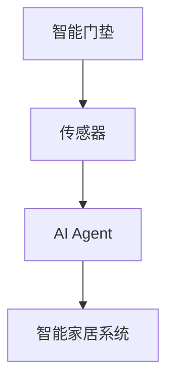
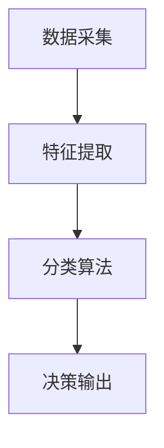
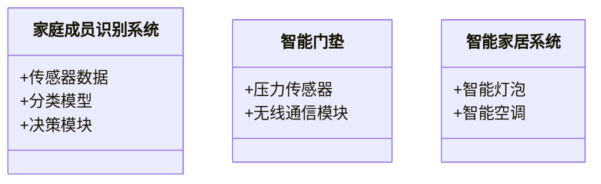
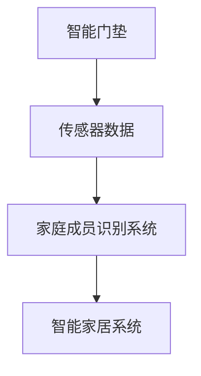
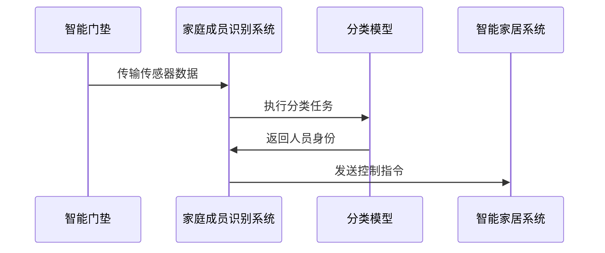

                 


# AI Agent在智能门垫中的家庭成员识别

> 关键词：AI Agent，智能门垫，家庭成员识别，传感器数据，机器学习

> 摘要：本文探讨了AI Agent在智能门垫中的家庭成员识别技术。通过分析传感器数据，结合机器学习算法，实现对家庭成员的智能识别。文章详细介绍了AI Agent的基本概念、家庭成员识别的背景与意义、算法原理与数学模型、系统架构设计，以及项目实战与最佳实践。

---

# 第1章: AI Agent与智能门垫概述

## 1.1 AI Agent的基本概念
### 1.1.1 AI Agent的定义与特点
AI Agent（人工智能代理）是指能够感知环境、做出决策并执行动作的智能实体。它具有以下特点：
- **自主性**：能够在没有外部干预的情况下独立运行。
- **反应性**：能够实时感知环境并做出反应。
- **学习能力**：通过数据和经验不断优化自身行为。
- **社交能力**：能够与其他智能体或人类进行交互。

### 1.1.2 AI Agent的核心要素与功能
AI Agent的核心要素包括：
- **感知模块**：负责收集环境数据。
- **决策模块**：基于感知数据做出决策。
- **执行模块**：执行决策动作。
- **学习模块**：通过数据优化决策模型。

### 1.1.3 AI Agent在智能家居中的应用潜力
AI Agent在智能家居中的应用广泛，包括家庭成员识别、设备控制、安全监控等。其潜力在于能够通过智能算法优化家居体验，提升居住舒适度和安全性。

## 1.2 智能门垫的基本原理
### 1.2.1 智能门垫的工作原理
智能门垫通过内置传感器感知压力变化，判断是否有人员踏上或离开门垫。传感器数据通过无线通信模块传输到中央控制系统，系统根据数据判断进入人员的身份。

### 1.2.2 智能门垫的主要功能与应用场景
智能门垫的主要功能包括：
- **人员检测**：检测是否有人员踏上或离开门垫。
- **身份识别**：通过传感器数据识别家庭成员的身份。
- **智能联动**：与智能家居设备联动，执行预设操作（如调整灯光、空调等）。

### 1.2.3 智能门垫与智能家居生态的结合
智能门垫通过与智能家居生态系统的整合，能够实现更复杂的功能。例如，结合智能门锁，可以实现基于家庭成员身份的门禁控制。

## 1.3 家庭成员识别的背景与意义
### 1.3.1 家庭成员识别的需求背景
随着智能家居的普及，家庭成员识别的需求日益增长。通过识别家庭成员身份，可以实现个性化的家居体验，提升生活便利性。

### 1.3.2 家庭成员识别的应用场景
家庭成员识别的应用场景包括：
- **智能门禁**：基于家庭成员身份控制门锁权限。
- **智能照明**：根据家庭成员习惯调整灯光亮度。
- **智能安防**：识别家庭成员活动模式，优化安全监控。

### 1.3.3 家庭成员识别的技术挑战与解决方案
技术挑战包括传感器数据的准确性、算法的实时性以及隐私保护。解决方案包括优化传感器性能、改进算法模型和加强数据加密。

## 1.4 本章小结
本章介绍了AI Agent和智能门垫的基本概念，分析了家庭成员识别的背景与意义，并指出了技术挑战与解决方案。

---

# 第2章: AI Agent与家庭成员识别的核心概念

## 2.1 AI Agent在家庭成员识别中的作用
### 2.1.1 AI Agent作为家庭成员识别的智能决策者
AI Agent在家庭成员识别中充当决策者的角色，通过分析传感器数据，判断人员身份并执行相应的操作。

### 2.1.2 AI Agent的核心算法与数据处理能力
AI Agent的核心算法包括支持向量机（SVM）和随机森林，能够高效处理传感器数据并实现分类。

### 2.1.3 AI Agent与智能门垫的协同工作模式
AI Agent与智能门垫协同工作，通过传感器数据和决策算法实现家庭成员识别。

## 2.2 智能门垫的家庭成员识别系统架构
### 2.2.1 系统的输入与输出
系统的输入包括传感器数据和用户指令，输出包括人员身份和控制指令。

### 2.2.2 系统的实体关系分析


### 2.2.3 系统的核心功能模块与数据流关系


## 2.3 核心概念对比与联系
### 2.3.1 AI Agent与传统传感器的区别
| 属性 | AI Agent | 传统传感器 |
|------|----------|------------|
| 功能 | 智能决策 | 数据采集   |
| 复杂度 | 高 | 低         |
| 应用 | 家庭成员识别 | 简单监控 |

### 2.3.2 智能门垫与传统门垫的对比
| 属性 | 智能门垫 | 传统门垫 |
|------|----------|------------|
| 功能 | 智能识别 | 纯粹承重   |
| 连接性 | 无线通信 | 无连接     |
| 智能性 | 高 | 低         |

### 2.3.3 家庭成员识别系统与其他智能设备的关联
家庭成员识别系统通过智能家居系统与其他设备（如智能灯泡、智能空调）联动，实现个性化的家居体验。

## 2.4 本章小结
本章分析了AI Agent与家庭成员识别的核心概念，通过对比和联系，明确了系统架构和功能模块。

---

# 第3章: 家庭成员识别算法原理

## 3.1 数据采集与特征提取
### 3.1.1 传感器数据的采集与处理
智能门垫通过压力传感器采集人员踏上或离开门垫的压力变化数据。

### 3.1.2 家庭成员特征的提取方法
基于时间序列的特征提取方法，包括峰值、持续时间和频率。

### 3.1.3 数据预处理与特征工程
数据预处理包括去噪和标准化，特征工程包括主成分分析（PCA）。

## 3.2 分类算法原理
### 3.2.1 常见分类算法的原理与优缺点
- **支持向量机（SVM）**：适用于小规模数据，分类精度高。
- **随机森林**：适用于大规模数据，鲁棒性强。

### 3.2.2 支持向量机(SVM)在家庭成员识别中的应用
SVM通过构建超平面实现分类，适用于小规模数据集。

### 3.2.3 随机森林与神经网络的对比分析
随机森林适用于特征较多的情况，神经网络适用于非线性分类任务。

## 3.3 算法流程图


## 3.4 算法实现
### 3.4.1 Python代码实现
```python
from sklearn.svm import SVC
from sklearn.ensemble import RandomForestClassifier

# 数据预处理
X_train, X_test, y_train, y_test = train_test_split(X, y, test_size=0.2)

# SVM模型训练
svm_model = SVC()
svm_model.fit(X_train, y_train)

# 随机森林模型训练
rf_model = RandomForestClassifier()
rf_model.fit(X_train, y_train)
```

### 3.4.2 算法的数学模型和公式
支持向量机的目标函数：
$$ \min_{w,b,\xi} \frac{1}{2}||w||^2 + C \sum_{i=1}^n \xi_i $$
约束条件：
$$ y_i (w \cdot x_i + b) \geq 1 - \xi_i $$
$$ \xi_i \geq 0 $$

---

# 第4章: 系统分析与架构设计

## 4.1 问题场景介绍
家庭成员识别系统需要在智能家居环境中实现人员身份识别，支持智能设备的联动。

## 4.2 系统功能设计
### 4.2.1 领域模型类图


### 4.2.2 系统架构设计


## 4.3 系统接口设计
### 4.3.1 接口描述
- **输入接口**：传感器数据
- **输出接口**：人员身份和控制指令

### 4.3.2 交互流程


---

# 第5章: 项目实战

## 5.1 环境搭建
- **硬件**：智能门垫、智能家居设备
- **软件**：Python编程环境、机器学习库（如Scikit-learn）

## 5.2 核心实现
### 5.2.1 传感器数据采集
```python
import numpy as np

# 传感器数据采集
def collect_data():
    data = np.random.rand(100, 10)  # 示例数据
    return data
```

### 5.2.2 分类模型训练
```python
from sklearn.svm import SVC

# 数据预处理
X_train, X_test, y_train, y_test = train_test_split(X, y, test_size=0.2)

# SVM模型训练
model = SVC()
model.fit(X_train, y_train)
```

## 5.3 案例分析
### 5.3.1 数据分析
通过分析传感器数据，优化分类模型的性能。

### 5.3.2 模型评估
评估分类模型的准确率、召回率和F1分数。

## 5.4 项目小结
本章通过实际案例分析，展示了家庭成员识别系统的实现过程和效果。

---

# 第6章: 最佳实践

## 6.1 小结
家庭成员识别系统通过AI Agent和智能门垫的协同工作，实现了智能化的家庭识别功能。

## 6.2 注意事项
- **数据隐私**：确保传感器数据的安全性。
- **模型优化**：定期更新分类模型，提升识别准确率。
- **系统维护**：定期检查硬件设备，确保系统稳定运行。

## 6.3 拓展阅读
- 《机器学习实战》
- 《Python机器学习》
- 《智能门垫与智能家居》

---

# 作者：AI天才研究院 & 禅与计算机程序设计艺术

---

本文通过详细分析AI Agent在智能门垫中的家庭成员识别技术，结合算法原理和系统设计，为读者提供了从理论到实践的完整指导。

