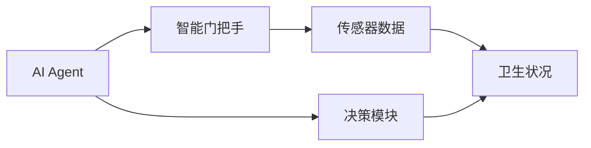
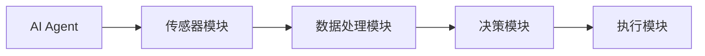
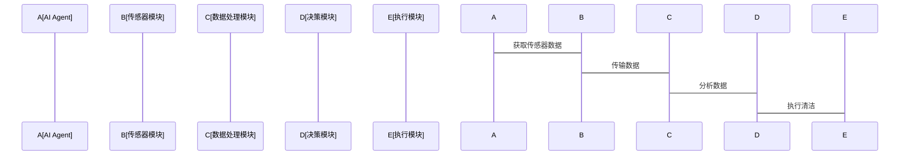

                 

<think>
嗯，用户希望我根据他提供的书名《AI Agent在智能门把手中的卫生状况监测》撰写一篇技术博客文章，并且已经提供了一个详细的目录大纲。我需要按照这个目录结构，逐步分析每个部分，确保内容完整、技术深入且易于理解。

首先，我得确定文章的核心主题：AI Agent如何在智能门把手中监测卫生状况。这个主题涉及到AI、传感器技术、数据分析等多个方面。我需要从背景介绍入手，让读者明白为什么需要这样的技术，然后逐步展开到技术细节和实现。

接下来，我得考虑每个章节的具体内容。第一章是背景介绍，需要解释公共卫生问题的重要性，以及智能门把手在其中的作用。我可能会提到细菌、病毒在门把手上的传播问题，以及AI如何帮助解决这些问题。然后，我会介绍AI Agent的基本概念，包括它的工作原理、与传统AI的区别，以及为什么选择在门把手上应用。

第二章的核心是AI Agent的技术原理。我需要详细解释传感器如何采集数据，图像识别如何工作，以及机器学习算法在决策中的作用。这部分需要一些技术细节，但要保持通俗易懂，避免过于复杂。

第三章是算法原理与数学模型，这里需要深入讲解使用的算法，比如卷积神经网络，并展示相应的数学公式和流程图。这部分可能会比较复杂，但通过图表和代码示例，可以让读者更好地理解。

第四章是系统设计，我需要展示系统的架构图，说明各个模块如何交互。这部分可能需要使用Mermaid图来展示类图、架构图和交互图，确保结构清晰。

第五章是项目实战，我会提供具体的代码示例，解释如何安装环境、实现功能，并分析实际案例。这一步很重要，因为它展示了理论如何转化为实际应用。

最后，我会在总结部分回顾整个内容，强调AI Agent在智能门把手中的重要性，并给出未来的展望。同时，我会加上作者信息，确保文章的权威性。

在写作过程中，我需要确保每个部分都有足够的细节，同时保持逻辑连贯。我可能会遇到一些技术难点，比如如何将复杂的算法用简单的方式解释清楚，或者如何设计有效的图表来辅助说明。这需要我不断调整，确保内容既专业又易于理解。

总的来说，我需要按照用户提供的目录大纲，逐步展开每个部分，确保涵盖所有必要的技术细节和实际应用案例，最终完成一篇高质量的技术博客文章。
</think>

# AI Agent在智能门把手中的卫生状况监测

> 关键词：AI Agent，智能门把手，卫生监测，传感器技术，图像识别，机器学习

> 摘要：本文深入探讨了AI Agent在智能门把手中卫生状况监测的技术实现。从问题背景、核心概念、算法原理到系统设计和项目实战，全面分析了AI Agent在智能门把手卫生监测中的应用。通过详细的技术分析和实际案例，展示了如何利用AI技术实现高效、智能的卫生监测。

---

# 第一部分: AI Agent在智能门把手中的卫生状况监测概述

## 第1章: 背景介绍与问题背景

### 1.1 公共卫生与智能门把手的结合
公共卫生问题一直是社会关注的焦点。门把手作为高频接触的公共设施，是细菌和病毒传播的重要媒介。传统的清洁和监测方式效率低下，难以实时掌握卫生状况。AI Agent的引入，为智能门把手的卫生监测提供了新的解决方案。

#### 1.1.1 公共卫生问题的现状
- 病菌和病毒通过门把手传播的风险。
- 传统清洁方式的局限性：周期性清洁、人工检测成本高、效率低。

#### 1.1.2 智能门把手的技术背景
- 智能门把手的功能：身份识别、远程控制、数据采集。
- 智能门把手的发展趋势：集成更多传感器和智能算法。

#### 1.1.3 卫生监测的必要性
- 实时监测门把手的卫生状况。
- 提供数据支持，优化清洁策略。
- 为用户提供卫生安全的保障。

### 1.2 AI Agent的核心概念
AI Agent是一种具有智能感知、自主决策和执行能力的实体。在智能门把手中，AI Agent负责采集数据、分析卫生状况并提供决策支持。

#### 1.2.1 AI Agent的定义与特点
- **定义**：AI Agent是具有感知、推理、学习和执行能力的智能实体。
- **特点**：
  - 智能感知：通过传感器获取环境数据。
  - 自主决策：基于数据进行分析和决策。
  - 实时反馈：快速响应环境变化。

#### 1.2.2 智能门把手的卫生监测需求
- **需求分析**：
  - 检测门把手表面的细菌、病毒。
  - 监测清洁情况。
  - 提供卫生状况的实时反馈。

#### 1.2.3 问题背景与目标
- **问题背景**：门把手作为高频接触点，是细菌传播的主要途径。
- **目标**：通过AI Agent实现门把手卫生状况的实时监测和智能管理。

### 1.3 问题描述与解决思路
#### 1.3.1 卫生状况监测的核心问题
- 如何高效采集门把手的卫生数据。
- 如何准确分析卫生数据并提供决策支持。

#### 1.3.2 AI Agent在智能门把手中的作用
- 数据采集：通过传感器获取门把手的环境数据。
- 数据分析：利用机器学习算法分析卫生状况。
- 决策支持：根据分析结果提供清洁建议。

#### 1.3.3 解决方案的边界与外延
- **边界**：仅关注门把手的卫生状况监测。
- **外延**：可扩展至其他公共设施的卫生监测。

### 1.4 核心概念与系统结构
#### 1.4.1 AI Agent的核心要素
- 传感器：采集环境数据。
- 数据处理模块：分析数据并生成决策。
- 执行模块：根据决策执行清洁或通知。

#### 1.4.2 系统架构的组成与功能
- **传感器模块**：采集温度、湿度、细菌数量等数据。
- **数据处理模块**：分析数据，生成卫生状况报告。
- **决策模块**：根据报告生成清洁建议。
- **执行模块**：执行清洁或通知维护人员。

#### 1.4.3 核心概念的实体关系图



---

## 第2章: AI Agent的核心原理与技术

### 2.1 AI Agent的基本原理
#### 2.1.1 智能感知与数据采集
- **智能感知**：AI Agent通过传感器采集门把手的环境数据，如温度、湿度、细菌数量等。
- **数据采集**：传感器数据的采集和传输是卫生监测的基础。

#### 2.1.2 数据处理与特征提取
- **数据预处理**：对采集到的数据进行去噪、归一化等处理。
- **特征提取**：提取影响卫生状况的关键特征，如细菌浓度、清洁频率等。

#### 2.1.3 决策与执行
- **决策模块**：基于特征数据，利用机器学习算法生成清洁建议。
- **执行模块**：根据决策结果执行清洁操作或通知维护人员。

### 2.2 卫生监测的关键技术
#### 2.2.1 传感器技术
- **传感器类型**：温度传感器、湿度传感器、细菌传感器。
- **数据采集流程**：传感器采集数据 -> 数据传输 -> 数据存储。

#### 2.2.2 图像识别与分析
- **图像采集**：通过摄像头采集门把手的图像。
- **图像处理**：图像去噪、边缘检测、目标识别。
- **图像分析**：识别门把手表面的污垢、细菌等。

#### 2.2.3 数据分析与预测
- **数据分析方法**：统计分析、时间序列分析。
- **预测模型**：基于历史数据，预测未来卫生状况。

### 2.3 AI Agent的核心算法
#### 2.3.1 机器学习算法
- **监督学习**：基于标签数据训练分类模型。
- **无监督学习**：基于聚类算法发现异常数据。

#### 2.3.2 深度学习算法
- **卷积神经网络（CNN）**：用于图像识别和特征提取。
- **长短期记忆网络（LSTM）**：用于时间序列预测。

#### 2.3.3 算法选择与优化
- **算法选择**：根据任务需求选择合适的算法。
- **算法优化**：通过调参和模型压缩提高效率。

---

## 第3章: 算法原理与数学模型

### 3.1 算法原理
#### 3.1.1 传感器数据的预处理
- **数据去噪**：去除传感器噪声，确保数据准确性。
- **数据归一化**：将数据缩放到统一范围，便于模型处理。

#### 3.1.2 图像识别的流程
- **图像采集**：通过摄像头获取门把手图像。
- **图像预处理**：去噪、二值化、边缘检测。
- **图像识别**：利用CNN识别图像中的污垢、细菌等。

#### 3.1.3 决策模型的构建
- **特征提取**：提取影响卫生状况的关键特征。
- **模型训练**：基于训练数据训练分类模型。
- **模型评估**：通过测试数据评估模型性能。

### 3.2 数学模型与公式
#### 3.2.1 数据预处理公式
$$x' = \frac{x - x_{min}}{x_{max} - x_{min}}$$

#### 3.2.2 图像识别模型
$$P(y|x) = \prod_{i=1}^{n} P(y|x_i)$$

#### 3.2.3 决策模型
$$y = \arg\max_{c} P(c|x)$$

### 3.3 算法实现与代码示例
#### 3.3.1 数据预处理代码
```python
def preprocess_data(data):
    normalized_data = (data - data.min()) / (data.max() - data.min())
    return normalized_data
```

#### 3.3.2 图像识别代码
```python
import tensorflow as tf
from tensorflow.keras import layers

model = tf.keras.Sequential([
    layers.Conv2D(32, (3,3), activation='relu', input_shape=(64,64,3)),
    layers.MaxPooling2D((2,2)),
    layers.Conv2D(64, (3,3), activation='relu'),
    layers.MaxPooling2D((2,2)),
    layers.Flatten(),
    layers.Dense(64, activation='relu'),
    layers.Dense(1, activation='sigmoid')
])

model.compile(optimizer='adam', loss='binary_crossentropy', metrics=['accuracy'])
model.fit(X_train, y_train, epochs=10, batch_size=32)
```

---

## 第4章: 系统设计与实现

### 4.1 系统架构设计
#### 4.1.1 系统功能设计
- 数据采集：通过传感器采集门把手的环境数据。
- 数据分析：分析数据并生成卫生状况报告。
- 决策与执行：根据报告生成清洁建议并执行。

#### 4.1.2 系统架构图


#### 4.1.3 系统交互图


---

## 第5章: 项目实战与案例分析

### 5.1 环境安装与配置
- **硬件环境**：安装摄像头、温度传感器、湿度传感器。
- **软件环境**：安装Python、TensorFlow、OpenCV。

### 5.2 系统核心实现
#### 5.2.1 数据采集模块
```python
import serial

ser = serial.Serial('COM3', 9600)
data = ser.readline().decode().strip()
print(data)
```

#### 5.2.2 数据分析模块
```python
import pandas as pd

dataframe = pd.read_csv('data.csv')
preprocessed_data = dataframe.apply(preprocess_data)
print(preprocessed_data)
```

#### 5.2.3 决策与执行模块
```python
if decision > threshold:
    execute_cleaning()
```

### 5.3 实际案例分析
- **案例背景**：某办公楼门把手的卫生监测。
- **数据采集**：采集门把手的细菌数量、温度、湿度数据。
- **数据分析**：分析数据并生成卫生状况报告。
- **决策与执行**：根据报告生成清洁建议并执行。

### 5.4 项目小结
- **项目总结**：AI Agent在智能门把手中实现了高效的卫生监测。
- **经验分享**：传感器选择、算法优化、系统集成的关键点。

---

## 第6章: 总结与展望

### 6.1 总结
- **核心成果**：AI Agent实现了智能门把手的卫生监测。
- **技术亮点**：传感器技术、机器学习算法、系统架构设计。

### 6.2 展望
- **未来发展方向**：AI Agent在更多公共设施中的应用。
- **技术趋势**：深度学习、边缘计算在卫生监测中的应用。

---

作者：AI天才研究院/AI Genius Institute & 禅与计算机程序设计艺术 /Zen And The Art of Computer Programming

