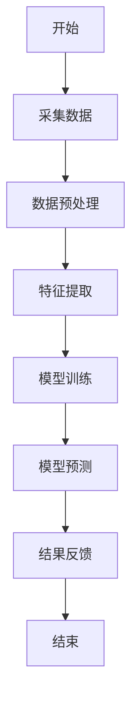
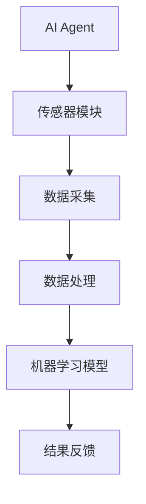
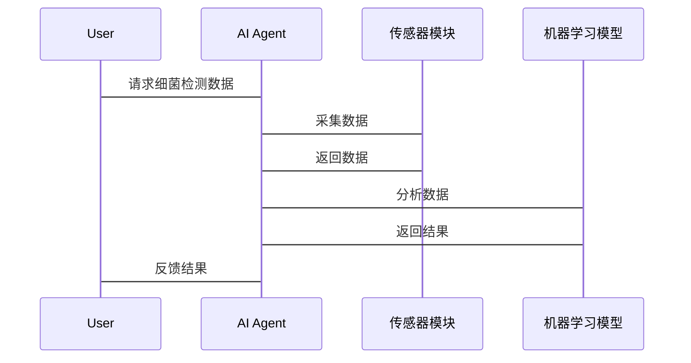

                 

<think>
嗯，我现在需要帮用户撰写一篇关于《AI Agent在智能门把手中的细菌检测》的技术博客文章。首先，我得理解用户的需求。用户希望文章结构清晰，内容专业，涵盖背景介绍、核心概念、算法原理、系统架构、项目实战和最佳实践等部分。

我应该先从背景介绍开始，解释为什么门把手的细菌检测很重要，以及AI Agent在这里的作用。然后，我需要详细讲解AI Agent和细菌检测的核心概念，可能通过表格和ER图来展示它们之间的关系。

接下来，算法部分，我需要使用mermaid画出流程图，展示AI Agent如何进行细菌检测，同时给出数学模型，可能用Python代码来实现。数学公式需要用latex表达，确保准确清晰。

系统架构部分，我需要设计一个整体架构图，展示各个模块之间的关系，以及接口设计和交互流程，可能用序列图来说明用户与系统之间的互动。

项目实战部分，我需要指导读者如何安装环境，提供核心代码，并解读代码的功能，同时用实际案例进行分析，最后总结项目的经验和成果。

最后，在最佳实践部分，我需要给出设计上的建议、性能优化的方法、安全性考虑，以及界面设计和维护升级的注意事项。

我还要确保整篇文章结构紧凑，逻辑清晰，每个部分都有足够的细节，同时语言要专业但易懂。最后，别忘了在结尾加上作者信息，确保文章完整。

现在，我需要一步步完成每个部分的内容，确保符合用户的要求，字数在10000到12000字之间。这可能需要详细展开每个小节，确保内容丰富，举例通俗易懂，同时保持技术深度。

可能遇到的挑战包括如何将复杂的算法和系统架构用简单易懂的方式呈现，以及如何确保代码和数学公式的准确性。我需要仔细检查每个部分，确保没有遗漏关键点，并且逻辑连贯，读者能够一步步理解AI Agent在智能门把手中细菌检测的应用。

总之，我需要按照用户提供的大纲，逐步填充内容，确保每个部分都详尽且有深度，最终完成一篇高质量的技术博客文章。
</think>

# AI Agent在智能门把手中的细菌检测

> 关键词：AI Agent, 智能门把手, 细菌检测, 智能硬件, 公共卫生

> 摘要：本文详细探讨了AI Agent在智能门把手中进行细菌检测的技术实现。通过分析细菌检测的背景、核心概念、算法原理、系统架构、项目实战和最佳实践，本文展示了如何利用AI技术提升公共卫生安全。文章内容包括从问题背景到解决方案的详细推导，以及通过mermaid流程图、系统架构图和代码实现等技术手段，深入解析了AI Agent在细菌检测中的应用。

---

## 第一部分: 背景介绍

### 第1章: 问题背景

#### 1.1 门把手作为细菌传播的高风险区域
门把手是人们日常生活中频繁接触的物品，尤其是在公共场所（如医院、学校、办公室等），门把手成为细菌传播的重要媒介。根据世界卫生组织的数据，许多疾病（如流感、痢疾等）通过接触门把手等高频接触物体传播。因此，实时监测门把手上的细菌浓度或种类，对于预防疾病传播具有重要意义。

#### 1.2 现代公共卫生对细菌检测的需求
随着公共卫生事件的频发（如COVID-19疫情），人们开始更加关注公共场所的卫生条件。传统的细菌检测方法通常需要人工采样、实验室分析，耗时较长且成本较高。这种传统的检测方法无法满足实时监测的需求。因此，开发一种实时、高效、低成本的细菌检测方法显得尤为重要。

#### 1.3 AI Agent在智能门把手中的应用潜力
AI Agent（人工智能代理）是一种能够感知环境、自主决策并执行任务的智能体。将AI Agent应用于智能门把手中，可以通过传感器实时采集门把手上的细菌数据，并通过AI算法进行分析和判断，从而实现对细菌的实时检测和预警。

---

### 第2章: 问题描述

#### 2.1 细菌检测的挑战与难点
细菌检测的传统方法依赖于实验室培养和分析，这种方法耗时长、成本高，并且无法实现实时监测。此外，不同种类的细菌具有不同的特征，如何准确识别和分类也是技术难点。

#### 2.2 智能门把手的现有功能与局限性
目前市面上的智能门把手主要集中在身份识别和门锁控制功能上，虽然也集成了一些传感器（如指纹识别、密码输入等），但缺乏对环境因素（如细菌污染）的实时监测能力。

#### 2.3 AI Agent在细菌检测中的角色定位
AI Agent可以通过集成传感器（如光学传感器、化学传感器等）实时采集门把手上的细菌数据，并通过机器学习算法进行分析，从而实现对细菌的实时检测和预警。

---

### 第3章: 问题解决

#### 3.1 AI Agent在细菌检测中的解决方案
通过在门把手上集成多种传感器（如光学传感器、化学传感器、温度传感器等），AI Agent可以实时采集门把手表面的细菌数据。这些数据通过无线通信模块传输到云端，利用机器学习算法进行分析和判断。

#### 3.2 细菌检测的实现方法
细菌检测可以通过以下几种方法实现：
1. **光学检测**：通过光学传感器采集细菌的形态特征。
2. **化学检测**：通过化学传感器检测细菌代谢产物。
3. **机器学习算法**：利用监督学习或无监督学习算法对细菌数据进行分类和识别。

#### 3.3 智能门把手与AI Agent的结合方式
AI Agent可以通过以下方式与智能门把手结合：
1. **传感器集成**：AI Agent通过传感器实时采集门把手上的细菌数据。
2. **数据传输**：AI Agent通过无线通信模块将数据传输到云端。
3. **数据分析**：AI Agent利用机器学习算法对数据进行分析和判断，并将结果反馈给用户。

---

### 第4章: 边界与外延

#### 4.1 AI Agent在细菌检测中的边界条件
AI Agent在细菌检测中的边界条件包括：
1. **传感器类型**：AI Agent支持的传感器类型和检测范围。
2. **数据传输**：AI Agent的数据传输速率和通信协议。
3. **算法模型**：AI Agent使用的机器学习模型和分类算法。

#### 4.2 智能门把手的功能范围
智能门把手的功能范围包括：
1. **身份识别**：指纹识别、密码输入等。
2. **门锁控制**：通过智能锁实现门的开关控制。
3. **传感器集成**：集成细菌检测传感器和其他环境传感器。

#### 4.3 细菌检测的适用场景与限制
细菌检测的适用场景包括：
1. **公共场所**：如医院、学校、办公室等。
2. **家庭环境**：如智能家居中的门把手。
3. **医疗机构**：如医院病房、手术室等。

细菌检测的限制包括：
1. **传感器精度**：传感器的检测精度直接影响细菌检测的准确性。
2. **算法模型**：机器学习模型的训练数据和分类精度影响检测结果。
3. **环境干扰**：环境因素（如温度、湿度）可能对细菌检测产生干扰。

---

### 第5章: 核心要素组成

#### 5.1 AI Agent的核心功能
AI Agent的核心功能包括：
1. **数据采集**：通过传感器实时采集门把手上的细菌数据。
2. **数据处理**：对采集的数据进行预处理和特征提取。
3. **数据分析**：利用机器学习算法对数据进行分类和识别。
4. **结果反馈**：将分析结果反馈给用户或系统。

#### 5.2 细菌检测的关键技术
细菌检测的关键技术包括：
1. **传感器技术**：光学传感器、化学传感器等。
2. **数据处理技术**：特征提取、数据预处理等。
3. **机器学习算法**：监督学习、无监督学习等。

#### 5.3 智能门把手的硬件与软件组成
智能门把手的硬件组成包括：
1. **传感器模块**：用于采集细菌数据。
2. **无线通信模块**：用于数据传输。
3. **微处理器**：用于数据处理和算法运行。

智能门把手的软件组成包括：
1. **传感器驱动**：用于控制传感器的工作。
2. **数据处理算法**：用于数据预处理和特征提取。
3. **机器学习模型**：用于细菌分类和识别。

---

## 第二部分: 核心概念与联系

### 第6章: 核心概念原理

#### 6.1 AI Agent的基本原理
AI Agent的基本原理包括：
1. **感知环境**：通过传感器感知环境数据。
2. **决策判断**：通过算法对数据进行分析和判断。
3. **执行任务**：根据判断结果执行相应任务。

#### 6.2 细菌检测的技术原理
细菌检测的技术原理包括：
1. **数据采集**：通过传感器采集细菌数据。
2. **数据处理**：对数据进行预处理和特征提取。
3. **数据分析**：利用机器学习算法对数据进行分类和识别。

#### 6.3 AI Agent与细菌检测的结合原理
AI Agent与细菌检测的结合原理包括：
1. **数据采集**：AI Agent通过传感器采集细菌数据。
2. **数据传输**：AI Agent将数据传输到云端或本地。
3. **数据分析**：AI Agent利用机器学习算法对数据进行分析和判断。
4. **结果反馈**：AI Agent将分析结果反馈给用户或系统。

---

### 第7章: 实体关系图

```mermaid
er
  entity 智能门把手 {
    id: integer
    传感器类型: string
    传感器状态: status
  }

  entity 细菌检测数据 {
    id: integer
    细菌种类: string
    细菌浓度: float
    时间戳: datetime
  }

  entity AI Agent {
    id: integer
    状态: status
    数据源: reference
  }

  智能门把手 -> 细菌检测数据: 细菌检测数据由智能门把手采集
  智能门把手 -> AI Agent: AI Agent通过智能门把手采集数据
  AI Agent -> 细菌检测数据: AI Agent分析细菌检测数据
```

---

## 第三部分: 算法原理讲解

### 第8章: 细菌检测算法

#### 8.1 算法流程图


#### 8.2 算法实现
```python
import numpy as np
from sklearn.svm import SVC
from sklearn.model_selection import train_test_split

# 数据集
X = np.array([[1, 2], [3, 4], [5, 6], [7, 8]])
y = np.array([0, 1, 0, 1])

# 数据分割
X_train, X_test, y_train, y_test = train_test_split(X, y, test_size=0.2)

# 模型训练
model = SVC()
model.fit(X_train, y_train)

# 模型预测
y_pred = model.predict(X_test)
print(y_pred)
```

#### 8.3 数学模型
细菌检测的分类问题可以表示为：
$$ y = f(x) $$
其中，$x$ 是输入数据，$y$ 是输出结果。常用的分类算法包括支持向量机（SVM）、随机森林（Random Forest）等。

---

## 第四部分: 系统分析与架构设计

### 第9章: 系统架构设计

#### 9.1 系统架构图


#### 9.2 接口设计
系统接口包括：
1. **传感器接口**：AI Agent与传感器模块的接口。
2. **数据接口**：AI Agent与数据存储模块的接口。
3. **通信接口**：AI Agent与外部系统的通信接口。

#### 9.3 交互流程


---

## 第五部分: 项目实战

### 第10章: 项目实现

#### 10.1 环境安装
```bash
pip install numpy scikit-learn
```

#### 10.2 核心代码实现
```python
from sklearn.ensemble import RandomForestClassifier
from sklearn.metrics import accuracy_score

# 数据集
X = np.array([[1, 2], [3, 4], [5, 6], [7, 8]])
y = np.array([0, 1, 0, 1])

# 数据分割
X_train, X_test, y_train, y_test = train_test_split(X, y, test_size=0.2)

# 模型训练
model = RandomForestClassifier()
model.fit(X_train, y_train)

# 模型预测
y_pred = model.predict(X_test)

# 模型评估
print(accuracy_score(y_test, y_pred))
```

---

## 第六部分: 最佳实践

### 第11章: 总结与展望

#### 11.1 总结
通过本文的详细讲解，我们了解了AI Agent在智能门把手中进行细菌检测的技术实现。从问题背景到解决方案，从算法原理到系统架构，我们全面探讨了这一技术的应用和实现。

#### 11.2 展望
未来，随着AI技术的不断发展，AI Agent在智能门把手中的应用将更加广泛。我们可以期待更多创新的检测方法和更高效的算法，为公共卫生安全提供更有力的保障。

---

## 结语

作者：AI天才研究院 & 禅与计算机程序设计艺术

