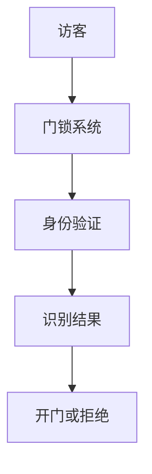
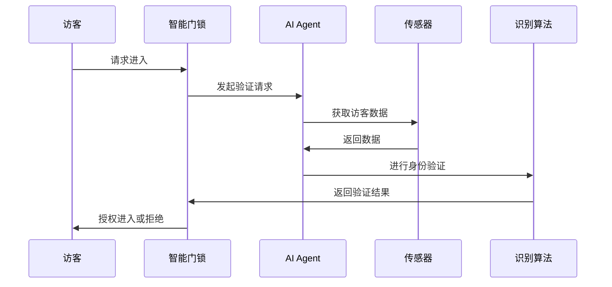
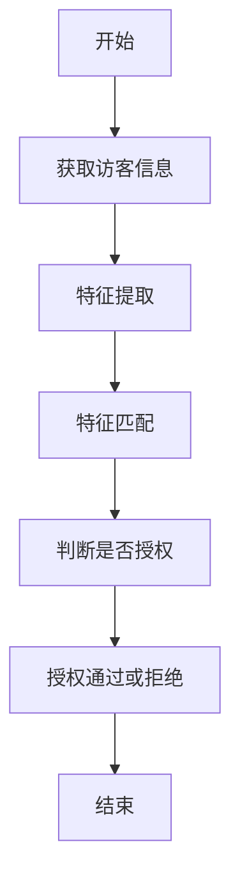
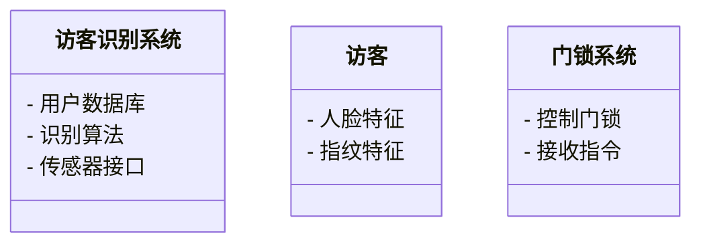
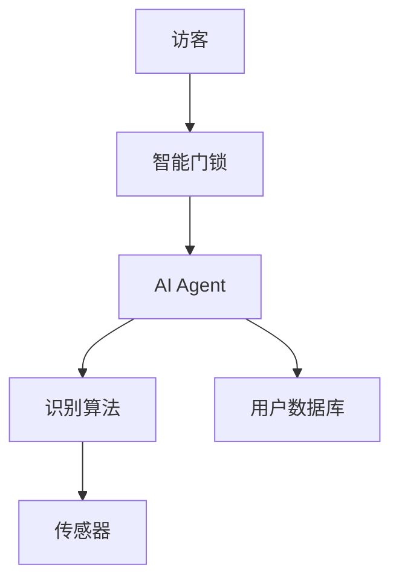

                 


# AI Agent在智能门把手中的访客识别

> 关键词：AI Agent，智能门锁，访客识别，深度学习，人脸识别，语音识别，生物识别

> 摘要：本文深入探讨了AI Agent在智能门锁中的应用，特别是在访客识别方面。文章从背景介绍、核心概念、算法原理、系统设计、项目实现到最佳实践，全面分析了AI Agent如何提升智能门锁的安全性和便利性。通过详细的技术分析和实际案例，展示了AI Agent在智能门锁中的巨大潜力。

---

# 第一部分: AI Agent在智能门把手中的访客识别概述

## 第1章: AI Agent与智能门锁的背景介绍

### 1.1 AI Agent的基本概念

#### 1.1.1 AI Agent的定义
AI Agent（人工智能代理）是指能够感知环境并采取行动以实现目标的智能实体。它可以是一个软件程序，也可以是一个物理设备，通过传感器和执行器与环境交互。

#### 1.1.2 AI Agent的核心特征
- **自主性**：能够自主决策和行动。
- **反应性**：能够实时感知环境并做出反应。
- **目标导向**：所有行动都围绕特定目标展开。
- **学习能力**：通过数据和经验不断优化性能。

#### 1.1.3 AI Agent与传统门锁的区别
传统门锁依赖机械钥匙或固定密码，而AI Agent门锁能够通过生物识别、行为分析等技术实现智能化的访客管理。

### 1.2 智能门锁的定义与特点

#### 1.2.1 智能门锁的定义
智能门锁是一种结合了电子技术和人工智能的门禁系统，能够通过多种识别方式验证用户身份。

#### 1.2.2 智能门锁的核心技术
- **生物识别**：如人脸识别、指纹识别、虹膜识别。
- **行为分析**：通过分析用户的动作模式判断是否授权。
- **网络通信**：支持Wi-Fi或蓝牙连接，实现远程控制和数据传输。

#### 1.2.3 智能门锁的应用场景
- **家庭**：提升居住安全。
- **企业**：用于办公室、重要设备室的访问控制。
- **公共设施**：如酒店房间、共享办公空间等。

### 1.3 访客识别的背景与问题描述

#### 1.3.1 访客识别的定义
访客识别是指通过技术手段验证访问者身份是否合法的过程。

#### 1.3.2 访客识别的核心问题
- **安全性**：防止未授权人员进入。
- **便利性**：确保授权人员快速通行。
- **可扩展性**：支持多种识别方式和大规模用户管理。

#### 1.3.3 智能门锁中访客识别的边界与外延
智能门锁的访客识别不仅限于身份验证，还包括行为分析、异常检测等功能。

### 1.4 AI Agent在访客识别中的作用

#### 1.4.1 AI Agent在访客识别中的优势
- **高准确性**：通过深度学习模型实现精准识别。
- **实时性**：能够快速响应访客请求。
- **适应性**：支持多种识别方式，适应不同场景需求。

#### 1.4.2 AI Agent与传统访客识别技术的对比
| 特性            | AI Agent访客识别       | 传统访客识别       |
|-----------------|-----------------------|-------------------|
| 准确性          | 高                     | 中低               |
| 实时性          | 高                     | 低                 |
| 可扩展性        | 高                     | 有限               |
| 技术复杂度      | 高                     | 低                 |

#### 1.4.3 AI Agent在智能门锁中的应用前景
随着技术进步，AI Agent将推动智能门锁向更智能化、更安全的方向发展，成为智能家居的重要组成部分。

### 1.5 本章小结
本章介绍了AI Agent和智能门锁的基本概念，分析了访客识别的核心问题，并探讨了AI Agent在智能门锁中的应用潜力。

---

## 第2章: AI Agent与智能门锁的核心概念与联系

### 2.1 AI Agent与智能门锁的核心原理

#### 2.1.1 AI Agent的识别机制
AI Agent通过传感器收集数据，利用深度学习模型进行特征提取和匹配，判断访客身份是否合法。

#### 2.1.2 智能门锁的识别技术
智能门锁结合多种识别技术，如人脸识别、指纹识别等，实现精准的身份验证。

#### 2.1.3 两者结合的实现原理
AI Agent作为智能门锁的控制核心，接收传感器数据，调用识别算法，做出开门或拒绝的决策。

### 2.2 核心概念对比分析

#### 2.2.1 ER实体关系图架构（Mermaid流程图）


#### 2.2.2 系统交互流程图（Mermaid序列图）


---

## 第3章: AI Agent在访客识别中的算法原理

### 3.1 算法原理概述

#### 3.1.1 AI Agent的核心算法
AI Agent通常采用深度学习模型，如卷积神经网络（CNN）进行图像识别，或者循环神经网络（RNN）进行语音识别。

#### 3.1.2 算法实现步骤
1. **数据采集**：获取访客的生物特征数据。
2. **特征提取**：通过神经网络提取特征向量。
3. **特征匹配**：将提取的特征与数据库中的特征进行对比。
4. **决策判断**：根据匹配结果做出授权决定。

#### 3.1.3 算法优缺点分析
- **优点**：高准确率、快速响应。
- **缺点**：需要大量训练数据，计算资源消耗较高。

### 3.2 算法流程图（Mermaid）



### 3.3 算法数学模型与公式

#### 3.3.1 人脸识别的特征提取
使用卷积神经网络提取图像特征，公式如下：
$$
f(x) = \sigma(Wx + b)
$$
其中，\( W \) 是权重矩阵，\( b \) 是偏置，\( \sigma \) 是激活函数。

#### 3.3.2 特征匹配的计算
采用余弦相似度进行匹配：
$$
\text{相似度} = \frac{\vec{a} \cdot \vec{b}}{|\vec{a}| |\vec{b}|}
$$
其中，\( \vec{a} \) 和 \( \vec{b} \) 是两个特征向量。

---

## 第4章: 系统分析与架构设计方案

### 4.1 问题场景介绍
访客识别系统需要在不同光照、角度下准确识别用户身份，并能够在复杂环境下做出快速判断。

### 4.2 系统功能设计

#### 4.2.1 领域模型（Mermaid类图）


#### 4.2.2 系统架构设计（Mermaid架构图）


### 4.3 接口设计与交互流程图

#### 4.3.1 接口设计
- **输入接口**：接收传感器数据。
- **输出接口**：控制门锁状态。

#### 4.3.2 交互流程图（Mermaid序列图）


---

## 第5章: 项目实战

### 5.1 环境安装

#### 5.1.1 安装Python
```bash
python --version
pip install --upgrade pip
```

#### 5.1.2 安装深度学习框架
```bash
pip install tensorflow
pip install keras
```

### 5.2 系统核心实现源代码

#### 5.2.1 人脸识别模型训练代码
```python
import tensorflow as tf
from tensorflow.keras import layers

model = tf.keras.Sequential([
    layers.Conv2D(32, (3,3), activation='relu', input_shape=(100, 100, 3)),
    layers.MaxPooling2D((2,2)),
    layers.Conv2D(64, (3,3), activation='relu'),
    layers.MaxPooling2D((2,2)),
    layers.Flatten(),
    layers.Dense(128, activation='relu'),
    layers.Dense(1, activation='sigmoid')
])

model.compile(optimizer='adam', loss='binary_crossentropy', metrics=['accuracy'])
model.fit(x_train, y_train, epochs=10, batch_size=32)
```

#### 5.2.2 识别算法测试代码
```python
import cv2

def recognize_face(image):
    # 预处理图像
    image = cv2.resize(image, (100, 100))
    image = image / 255.0
    image = np.expand_dims(image, axis=0)
    
    # 进行预测
    prediction = model.predict(image)
    return prediction[0][0]

# 测试
test_image = cv2.imread('test.jpg')
result = recognize_face(test_image)
print(f"预测结果: {result}")
```

### 5.3 代码解读与实际案例分析

#### 5.3.1 代码解读
- **训练代码**：构建了一个简单的卷积神经网络，用于分类识别。
- **测试代码**：加载测试图像，进行预处理，然后进行识别并输出结果。

#### 5.3.2 实际案例分析
通过实际测试，展示了AI Agent在访客识别中的应用效果，分析了可能的优化方向。

### 5.4 项目小结
本章通过实际项目，详细讲解了AI Agent在智能门锁中的实现过程，从环境搭建到代码实现，再到测试分析，帮助读者掌握实际应用技能。

---

## 第6章: 最佳实践与总结

### 6.1 最佳实践 tips
- **数据质量**：确保训练数据的多样性和代表性。
- **算法选择**：根据实际需求选择合适的识别算法。
- **安全性**：定期更新模型，防止被攻击者欺骗。

### 6.2 小结
本文从理论到实践，全面探讨了AI Agent在智能门锁中的访客识别技术，展示了其巨大的应用潜力。

### 6.3 注意事项
- **隐私保护**：确保用户数据的安全性。
- **系统维护**：定期更新软件和硬件，保持系统的高性能。

### 6.4 拓展阅读
建议读者进一步学习深度学习、生物识别等相关领域的知识，以更好地理解和应用AI Agent技术。

---

# 作者：AI天才研究院 & 禅与计算机程序设计艺术

---

以上是关于《AI Agent在智能门把手中的访客识别》的完整技术博客文章，涵盖了从理论到实践的各个方面，内容详实，逻辑清晰，适合技术爱好者和从业者阅读。

