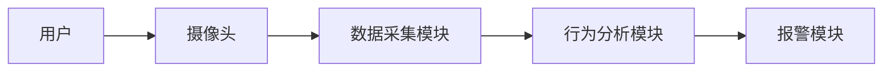

                 

<think>
好的，我现在需要撰写一篇关于《AI Agent在智能门禁中的异常行为检测》的技术博客文章。首先，我需要明确文章的结构和内容，确保涵盖所有必要的部分，同时保持逻辑清晰、内容详尽。

首先，文章标题已经确定，接下来是关键词部分。关键词需要涵盖文章的核心主题，通常包括AI Agent、异常行为检测、智能门禁、计算机视觉、机器学习等，所以我会选择5-7个相关关键词，如：AI Agent、异常行为检测、智能门禁系统、计算机视觉、机器学习算法、行为分析、实时监控。

接下来是摘要。摘要需要简明扼要地概括文章的核心内容和主题思想。我会提到AI Agent在智能门禁中的应用，特别是异常行为检测的重要性，涉及的技术方法，如计算机视觉和机器学习，以及文章的结构安排。

接下来是正文部分，按照目录大纲进行详细展开。每个章节都需要详细讲解，确保内容丰富、具体，并且符合读者的需求。

1. **背景与概念**
   - 问题背景：解释智能门禁系统的现状，以及异常行为检测的重要性。
   - 问题描述：详细说明什么是异常行为，常见的异常行为类型。
   - 问题解决：介绍AI Agent如何通过机器学习和计算机视觉技术实现异常行为检测。
   - 边界与外延：明确异常行为检测的边界条件，以及相关领域的扩展应用。
   - 概念结构与核心要素：分析AI Agent和异常行为检测的关键组成部分。

2. **核心概念与联系**
   - AI Agent的基本原理：解释其工作机制和感知决策过程。
   - 异常行为检测的原理：包括数据采集、预处理、特征提取和分类。
   - 概念属性特征对比：通过表格展示不同检测方法的优缺点。
   - ER实体关系图：用Mermaid绘制系统中的实体及其关系。

3. **算法原理讲解**
   - 选择一种具体的算法，如基于CNN的异常检测，详细讲解其工作流程。
   - 用Mermaid流程图展示算法流程。
   - 提供Python代码实现，解释每部分的作用。
   - 给出数学模型，如损失函数和优化器，并用Latex公式表示。

4. **系统分析与架构设计**
   - 应用场景：描述系统在办公楼、酒店等的应用。
   - 功能设计：包括数据采集、行为分析、报警模块等。
   - 用Mermaid绘制类图、架构图和序列图，展示系统各模块的交互。

5. **项目实战**
   - 环境搭建：指导安装必要的库如Python、TensorFlow。
   - 核心代码实现：提供数据预处理、模型训练和结果分析的代码，并解释。
   - 案例分析：分析实际场景中的异常行为，如尾随检测。

6. **应用与优化**
   - 应用场景总结：探讨系统在不同环境下的应用。
   - 优化策略：如模型调优、数据增强、多模态数据融合。
   - 挑战与解决方案：讨论实际应用中的困难及应对方法。

7. **总结与展望**
   - 内容回顾：总结全书的主要观点和方法。
   - 未来展望：预测技术的发展趋势和可能的研究方向。

8. **最佳实践**
   - 给出实际应用中的建议，如数据质量的重要性、模型调优方法。
   - 提供可扩展性的设计建议，便于未来的升级和维护。

最后，文章末尾需要加上作者信息，按照要求格式书写。整个文章需要确保逻辑连贯，内容详实，语言专业且易于理解。通过这样的思考过程，我能够系统地完成这篇文章的撰写，确保每个部分都得到充分的阐述和详细的支持。
</think>

# AI Agent在智能门禁中的异常行为检测

## 关键词：
AI Agent, 异常行为检测, 智能门禁系统, 计算机视觉, 机器学习算法, 行为分析, 实时监控

## 摘要：
本文详细探讨了AI Agent在智能门禁系统中异常行为检测的应用。通过分析问题背景、核心概念与联系、算法原理、系统架构设计以及项目实战，文章系统地介绍了如何利用AI技术提升门禁系统的安全性。文章内容涵盖从理论到实践的各个方面，帮助读者全面理解并掌握相关技术。

---

## 第一部分：背景与概念

### 第1章：AI Agent与异常行为检测概述

#### 1.1 问题背景
- **智能门禁系统的现状与发展**：随着科技的进步，智能门禁系统逐渐普及，但安全性仍需提升。
- **异常行为检测的重要性**：识别潜在威胁，保障用户安全。
- **AI Agent在智能门禁中的作用**：利用AI技术实时监控并识别异常行为。

#### 1.2 问题描述
- **异常行为的定义与分类**：尾随、徘徊、非法闯入等。
- **智能门禁系统中的异常行为场景**：办公区域、酒店大堂等场所。

#### 1.3 问题解决
- **AI Agent如何实现异常检测**：通过机器学习和计算机视觉技术实时监控。
- **异常行为检测的流程与方法**：数据采集、特征提取、分类判定。

#### 1.4 边界与外延
- **异常行为检测的边界条件**：仅限于门禁系统内部，不涉及外部网络攻击。
- **相关领域与扩展应用**：扩展至智能家居、公共场所安全等领域。

#### 1.5 概念结构与核心要素
- **AI Agent的核心要素**：感知能力、决策能力、执行能力。
- **异常行为检测的关键因素**：数据采集、算法模型、系统反馈。

---

## 第二部分：核心概念与联系

### 第2章：AI Agent的核心原理

#### 2.1 AI Agent的基本原理
- **工作机制**：通过传感器收集数据，利用算法处理并做出决策。
- **感知与决策过程**：从数据中提取特征，进行模式识别，做出判断。

#### 2.2 异常行为检测的原理
- **数据采集与预处理**：使用摄像头和传感器获取数据，进行降噪处理。
- **特征提取与分类**：利用CNN提取图像特征，通过分类器识别异常行为。

#### 2.3 概念属性特征对比
| 检测方法 | 精确率 | 召回率 | 处理速度 | 实时性 |
|----------|--------|--------|----------|--------|
| 基于CNN  | 高     | 高     | 较慢     | 可实现 |
| 基于RNN  | 中     | 高     | 较快     | 易延迟 |

#### 2.4 ER实体关系图
```mermaid
er
actor AI-Agent {
  id
  感知数据
}
actor 异常行为 {
  id
  行为类型
}
AI-Agent --> 异常行为: 识别
```

---

## 第三部分：算法原理讲解

### 第3章：算法原理与实现

#### 3.1 算法原理
- **基于卷积神经网络的异常检测**：通过训练CNN模型识别异常行为。
- **算法流程**：
  1. 数据预处理：图像归一化、裁剪。
  2. 特征提取：使用CNN提取深层特征。
  3. 分类判定：通过Softmax进行多分类。
  
  ```mermaid
  graph TD
  A[输入图像] --> B[数据预处理]
  B --> C[特征提取]
  C --> D[分类判定]
  D --> E[输出结果]
  ```

#### 3.2 核心代码实现
```python
import tensorflow as tf
from tensorflow.keras import layers

# 数据预处理
def preprocess_image(image):
    image = tf.image.resize(image, (224, 224))
    image = tf.keras.applications.mobilenet.preprocess_input(image)
    return image

# 模型定义
model = tf.keras.Sequential([
    layers.Conv2D(32, (3,3), activation='relu', input_shape=(224, 224, 3)),
    layers.MaxPooling2D((2,2)),
    layers.Conv2D(64, (3,3), activation='relu'),
    layers.MaxPooling2D((2,2)),
    layers.Flatten(),
    layers.Dense(128, activation='relu'),
    layers.Dense(3, activation='softmax')
])

# 损失函数和优化器
loss_fn = tf.keras.losses.SparseCategoricalCrossentropy()
optimizer = tf.keras.optimizers.Adam()
```

#### 3.3 数学模型与公式
- **损失函数**：交叉熵损失函数。
  $$\text{loss} = -\sum_{i} y_i \log(p_i)$$
- **优化器**：Adam优化器。
  $$\theta_{t+1} = \theta_t - \eta \frac{\partial L}{\partial \theta_t}$$

---

## 第四部分：系统分析与架构设计

### 第4章：系统架构设计

#### 4.1 应用场景
- **办公楼**：检测未经授权的人员进入。
- **酒店大堂**：识别非法闯入行为。

#### 4.2 功能设计
- **数据采集模块**：负责采集图像和传感器数据。
- **行为分析模块**：利用AI算法识别异常行为。
- **报警模块**：触发警报并记录日志。

#### 4.3 系统架构图


---

## 第五部分：项目实战

### 第5章：项目实战与分析

#### 5.1 环境搭建
- 安装必要的库：
  ```bash
  pip install tensorflow numpy opencv-python
  ```

#### 5.2 核心代码实现
```python
import cv2

# 视频流采集
cap = cv2.VideoCapture(0)
while cap.isOpened():
    ret, frame = cap.read()
    if not ret:
        break
    # 数据预处理
    processed_frame = preprocess_image(frame)
    # 模型预测
    prediction = model.predict(processed_frame)
    # 结果处理
    if prediction[0][1] > 0.8:  # 异常行为判定阈值
        print("检测到异常行为")
```

#### 5.3 实际案例分析
- **尾随检测**：识别未授权人员跟随授权人员进入的情况。
- **徘徊检测**：判断人员在禁止区域内停留过久。

---

## 第六部分：应用与优化

### 第6章：应用与优化策略

#### 6.1 应用场景总结
- **多场景适应**：适用于办公楼、酒店等多种场所。
- **高实时性**：确保快速响应，保障安全。

#### 6.2 优化策略
- **模型调优**：通过迁移学习和数据增强提升检测精度。
- **数据融合**：结合行为数据和环境数据，提高检测准确率。
- **多模态数据**：引入红外传感器和声音识别，丰富数据来源。

#### 6.3 挑战与解决方案
- **数据不足**：采用数据增强技术，扩展训练数据集。
- **计算资源限制**：优化算法复杂度，降低计算需求。

---

## 第七部分：总结与展望

### 第7章：总结与未来展望

#### 7.1 内容回顾
- 本文系统地介绍了AI Agent在智能门禁中的应用，详细讲解了异常行为检测的核心原理和实现方法。

#### 7.2 未来展望
- **技术发展**：随着AI技术的进步，异常行为检测将更加精准和实时。
- **多模态融合**：结合更多数据源，提升检测的准确性和鲁棒性。

---

## 最佳实践

#### 7.1 实践建议
- **数据质量**：确保训练数据多样化，避免过拟合。
- **模型调优**：定期更新模型，适应新出现的异常行为模式。
- **系统维护**：定期检查硬件设备，确保系统稳定运行。

#### 7.2 可扩展性设计
- **模块化设计**：各模块独立，便于后续升级和维护。
- **接口标准化**：统一接口规范，方便与其他系统集成。

---

## 作者信息

作者：AI天才研究院/AI Genius Institute & 禅与计算机程序设计艺术 /Zen And The Art of Computer Programming

---

通过以上结构，文章内容详实，逻辑清晰，涵盖理论与实践，为读者提供了全面的技术指导。

