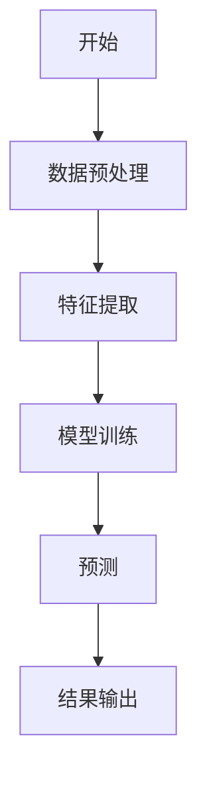
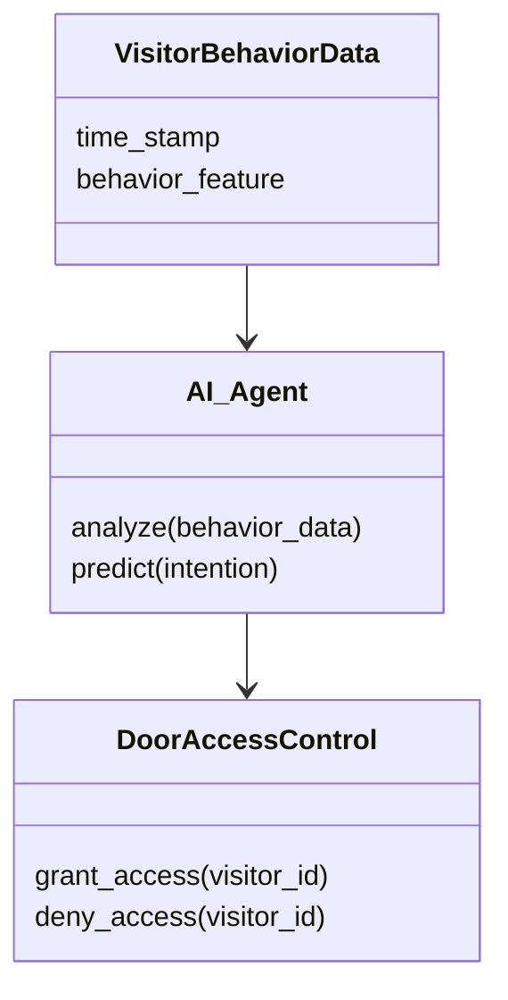
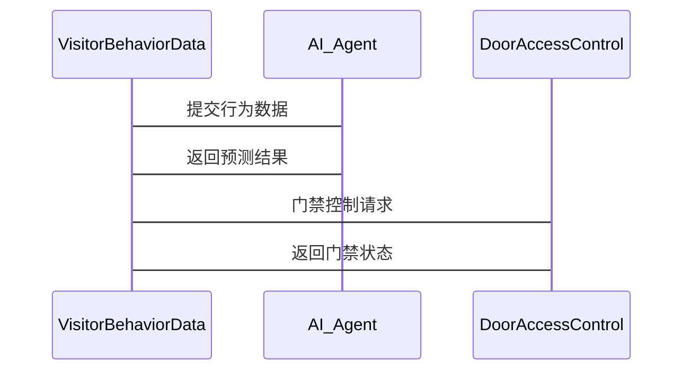

                 


# AI Agent在智能门禁系统中的访客意图预测

> 关键词：智能门禁系统，访客意图预测，AI Agent，机器学习，行为分析

> 摘要：本文详细探讨了AI Agent在智能门禁系统中的访客意图预测的应用。通过分析访客的行为数据，结合机器学习算法，AI Agent能够准确预测访客的意图，并在门禁系统中提供实时的决策支持，从而提升系统的安全性和用户体验。本文从理论基础到实际应用，全面介绍了访客意图预测的核心概念、算法原理、系统架构设计以及项目实战，为读者提供了一套完整的解决方案。

---

## 第一章：访客意图预测的背景与意义

### 1.1 问题背景
现代智能门禁系统不仅是简单的身份验证工具，还需要能够对访客的行为进行分析和预测，以便提前做出决策。传统的门禁系统仅依赖于刷卡或密码验证，无法主动识别访客的意图，存在安全隐患和用户体验不足的问题。

### 1.2 问题描述
访客在进入智能门禁系统时，可能会表现出多种行为特征，如徘徊、多次尝试输入密码、携带可疑物品等。通过分析这些行为数据，AI Agent可以预测访客的潜在意图，例如非法入侵、盗窃等，从而提前采取措施。

### 1.3 问题解决
通过引入AI Agent，门禁系统能够实时分析访客的行为数据，结合历史数据和环境信息，预测访客的意图。这种主动式的安全管理和智能化的服务提升，能够显著增强系统的安全性。

### 1.4 边界与外延
访客意图预测的范围仅限于门禁系统内的行为数据，不涉及其他外部数据源。系统的预测结果仅用于门禁控制和安全提示，不会用于其他用途。

### 1.5 概念结构
访客意图预测的核心要素包括：
- **访客行为数据**：包括刷卡记录、通行记录、停留时间等。
- **AI Agent**：负责数据的分析和预测。
- **预测模型**：基于机器学习算法构建的分类模型。
- **门禁系统**：根据预测结果进行相应的控制。

---

## 第二章：AI Agent的核心概念与联系

### 2.1 核心概念原理
AI Agent通过感知环境中的信息，利用算法进行推理和学习，从而做出决策。在智能门禁系统中，AI Agent的主要任务是分析访客的行为数据，预测其意图。

### 2.2 概念属性特征对比

| 概念       | 输入 | 输出 | 功能描述 |
|------------|------|------|----------|
| 访客行为数据 | 行为特征 | 无 | 记录访客的行为 |
| AI Agent   | 行为数据 | 预测结果 | 分析数据，预测意图 |
| 预测模型    | 训练数据 | 预测结果 | 分类模型，预测意图 |

### 2.3 ER实体关系图
```mermaid
er
actor: VisitedBehaviorData
connector: PredictIntention
```

---

## 第三章：访客意图预测的算法原理

### 3.1 算法选择
随机森林是一种常用的分类算法，适用于访客意图预测。其核心思想是通过构建多棵决策树，进行投票或平均，从而提高预测的准确性和稳定性。

### 3.2 算法流程


### 3.3 Python代码实现
```python
import pandas as pd
from sklearn.ensemble import RandomForestClassifier
from sklearn.model_selection import train_test_split
from sklearn.metrics import accuracy_score

# 数据加载
data = pd.read_csv('visitor_data.csv')

# 特征与目标分离
X = data.drop('intention', axis=1)
y = data['intention']

# 数据划分
X_train, X_test, y_train, y_test = train_test_split(X, y, test_size=0.2, random_state=42)

# 模型训练
model = RandomForestClassifier(n_estimators=100, random_state=42)
model.fit(X_train, y_train)

# 预测
y_pred = model.predict(X_test)

# 评估
print("准确率:", accuracy_score(y_test, y_pred))
```

### 3.4 数学模型
随机森林的数学模型基于决策树的集成方法。每个决策树的预测结果通过投票或平均得到最终的预测结果。公式如下：
$$
y_{\text{pred}} = \text{多数投票}(\{y_1, y_2, \dots, y_n\})
$$
其中，$y_i$ 是每个决策树的预测结果。

---

## 第四章：系统分析与架构设计

### 4.1 系统场景介绍
智能门禁系统需要处理大量的访客行为数据，包括刷卡记录、通行记录、视频监控等。AI Agent通过分析这些数据，预测访客的意图，并将结果反馈给门禁系统。

### 4.2 系统功能设计


### 4.3 系统架构设计


### 4.4 接口设计
- **输入接口**：接受访客行为数据，格式为JSON或CSV。
- **输出接口**：返回预测结果，格式为JSON。

### 4.5 交互序列图


---

## 第五章：项目实战

### 5.1 环境搭建
- **Python版本**：3.8及以上
- **依赖库**：pandas、scikit-learn、mermaid

### 5.2 核心代码实现
```python
import pandas as pd
from sklearn.ensemble import RandomForestClassifier
from sklearn.model_selection import train_test_split
from sklearn.metrics import accuracy_score

# 数据加载
data = pd.read_csv('visitor_data.csv')

# 特征与目标分离
X = data.drop('intention', axis=1)
y = data['intention']

# 数据划分
X_train, X_test, y_train, y_test = train_test_split(X, y, test_size=0.2, random_state=42)

# 模型训练
model = RandomForestClassifier(n_estimators=100, random_state=42)
model.fit(X_train, y_train)

# 预测
y_pred = model.predict(X_test)

# 评估
print("准确率:", accuracy_score(y_test, y_pred))
```

### 5.3 案例分析
通过实际案例分析，验证模型的准确性和稳定性。例如，分析某次访客的刷卡记录和通行记录，预测其意图是否为非法入侵。

### 5.4 经验总结
- 数据质量对模型性能影响显著，需确保数据的完整性和准确性。
- 模型调优是提升预测准确率的关键，可尝试不同的参数组合和特征选择方法。

---

## 第六章：最佳实践与总结

### 6.1 最佳实践
- 数据预处理是关键，需去除异常值和缺失值。
- 模型选择需根据具体场景，随机森林适合多分类任务。
- 系统设计需考虑可扩展性和可维护性。

### 6.2 小结
本文详细介绍了AI Agent在智能门禁系统中的访客意图预测的应用，从理论到实践，为读者提供了一套完整的解决方案。通过本文的分析，读者可以了解如何利用机器学习算法提升门禁系统的智能化水平。

### 6.3 注意事项
- 数据隐私保护需严格遵守相关法律法规。
- 模型的实时性和响应速度需根据实际场景进行优化。

---

## 第七章：展望

未来，随着AI技术的不断发展，访客意图预测将更加智能化和精准化。可能出现的新技术包括：
- 基于深度学习的意图预测模型。
- 多模态数据融合分析（如视频、声音等）。
- 实时预测和动态调整的自适应系统。

---

作者：AI天才研究院 & 禅与计算机程序设计艺术

