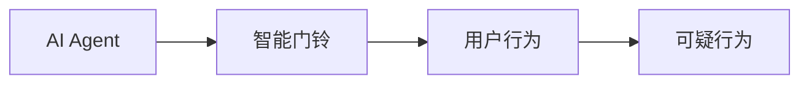
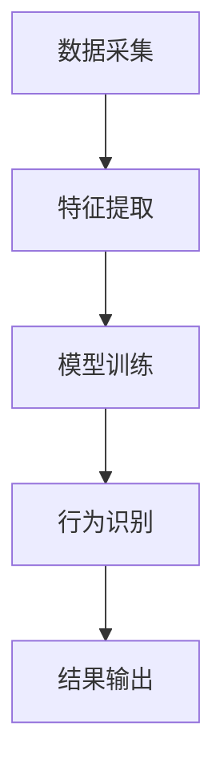
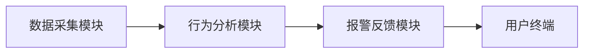
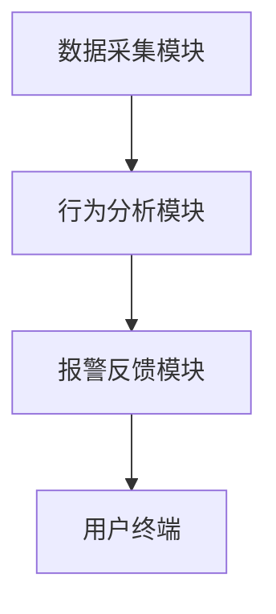

                 

<think>
嗯，用户希望我写一篇关于《AI Agent在智能门铃中的可疑行为识别》的技术博客文章。我需要先理解文章的要求，然后按照用户提供的目录结构来撰写。

首先，文章需要有一个吸引人的标题，几个关键词，以及一个摘要。关键词应该是智能门铃、AI Agent、可疑行为识别、行为分析、模式识别、异常检测。摘要需要简洁地总结文章的内容，强调AI代理在智能门铃中的应用及其重要性。

接下来，按照目录结构，文章分为四个主要部分：背景介绍、核心概念与联系、算法原理、系统分析与架构设计，最后是项目实战和总结。每个部分都有详细的子章节，我需要确保每个部分都涵盖必要的内容，比如问题背景、算法流程、数学模型等。

我需要思考每个章节的具体内容，确保逻辑清晰，结构紧凑。例如，在第二章的核心概念部分，我应该用表格对比不同行为的特点，并用Mermaid图展示实体关系。在算法部分，要详细解释每一步骤，并用Python代码和数学公式来支持。

系统设计部分需要考虑用户需求、功能模块划分，以及架构图和序列图的绘制。项目实战则需要提供实际案例，包括代码安装、实现细节和案例分析。

在撰写过程中，要注意使用专业的技术语言，同时保持易懂。还要确保文章结构完整，每章有小结，帮助读者总结要点。最后，文章末尾需要加上作者信息。

总的来说，我需要一步步按照目录结构来撰写，确保每个部分都详细且符合要求，同时注意格式和内容的完整性。
</think>

# AI Agent在智能门铃中的可疑行为识别

**关键词：** 智能门铃、AI Agent、可疑行为识别、行为分析、模式识别、异常检测

**摘要：**  
本文探讨了AI Agent在智能门铃中的应用，重点分析了如何通过AI技术识别可疑行为。文章从背景介绍、核心概念、算法原理到系统设计，全面解析了智能门铃中可疑行为识别的实现过程。通过实际案例分析和代码实现，展示了AI Agent在智能门铃中的实际应用价值。

---

# 第一部分: 背景介绍

# 第1章: 智能门铃与AI Agent概述

## 1.1 智能门铃的发展历程
### 1.1.1 传统门铃的功能与局限
传统门铃主要用于提示访客到来，功能单一，无法提供额外信息。其局限性包括：
- 无法识别访客身份
- 无法记录访客行为
- 无法与其他设备联动

### 1.1.2 智能门铃的定义与特点
智能门铃是一种结合了物联网（IoT）和人工智能技术的智能家居设备。其特点包括：
- **智能化：** 可通过AI技术分析访客行为
- **联网化：** 支持与其他设备联动
- **便捷性：** 用户可通过手机或电脑远程查看门铃信息

### 1.1.3 AI Agent在智能门铃中的作用
AI Agent（智能代理）是智能门铃的核心技术之一。其主要作用包括：
- **行为识别：** 分析访客行为，识别可疑行为
- **信息处理：** 处理门铃采集的图像、声音等数据
- **决策反馈：** 根据识别结果做出反馈（如报警、联动其他设备）

## 1.2 可疑行为识别的背景与意义
### 1.2.1 可疑行为的定义与分类
可疑行为是指在特定场景下，与正常行为模式不一致的行为。在智能门铃中，可疑行为可能包括：
- **非法闯入：** 未授权人员试图强行进入
- **长时间逗留：** 访客在门前长时间停留
- **异常动作：** 如破坏门铃设备

### 1.2.2 智能门铃中可疑行为识别的需求
随着智能家居的普及，智能门铃已成为家庭安全的重要组成部分。然而，传统的门铃系统仅能提示访客到来，无法识别可疑行为。因此，引入AI Agent技术成为必然趋势。

### 1.2.3 可疑行为识别的技术挑战与解决方案
**技术挑战：**
- 数据采集与处理的实时性
- 复杂环境下的行为识别精度
- 系统的安全性和稳定性

**解决方案：**
- 引入AI技术，提升行为识别能力
- 结合边缘计算，实现本地实时处理
- 采用深度学习模型，提高识别准确率

## 1.3 AI Agent在智能门铃中的角色
### 1.3.1 AI Agent的基本概念
AI Agent是一种智能代理，能够感知环境、理解需求、做出决策并执行操作。在智能门铃中，AI Agent负责处理图像、声音等数据，识别可疑行为，并做出相应的反馈。

### 1.3.2 AI Agent在智能门铃中的功能定位
AI Agent在智能门铃中的功能包括：
- **数据采集：** 采集门前的图像、声音等数据
- **行为分析：** 分析访客行为，识别可疑行为
- **决策反馈：** 根据识别结果，触发报警、联动其他设备

### 1.3.3 AI Agent与智能门铃的交互机制
AI Agent与智能门铃的交互机制包括：
- **数据传输：** 门铃设备将数据传输给AI Agent
- **信息处理：** AI Agent对数据进行分析处理
- **决策反馈：** AI Agent将处理结果反馈给门铃设备

## 1.4 本章小结
本章介绍了智能门铃的发展历程、AI Agent在智能门铃中的作用，以及可疑行为识别的背景与意义。通过本章内容，读者可以理解AI Agent在智能门铃中的重要性。

---

# 第二部分: 核心概念与联系

# 第2章: 可疑行为识别的核心概念与联系

## 2.1 核心概念解析
### 2.1.1 AI Agent的行为分析
AI Agent的行为分析是基于图像识别和声音识别技术，分析访客的行为特征。例如：
- 图像识别：通过摄像头采集访客的图像，识别其外貌特征
- 声音识别：通过麦克风采集访客的声音，识别其语言特征

### 2.1.2 可疑行为的特征提取
可疑行为的特征提取是通过分析访客的行为模式，提取其与正常行为不同的特征。例如：
- 时间特征：访客在门前停留时间过长
- 动作特征：访客试图强行进入
- 行为特征：访客在门前徘徊、试图破坏设备

### 2.1.3 行为识别的数学模型
行为识别的数学模型是通过机器学习算法，建立访客行为的分类模型。例如：
- 分类模型：支持向量机（SVM）、随机森林（Random Forest）
- 深度学习模型：卷积神经网络（CNN）、长短时记忆网络（LSTM）

### 2.1.4 核心概念对比
以下是核心概念的对比表：

| 概念         | 描述                                                                 |
|--------------|----------------------------------------------------------------------|
| AI Agent     | 能够感知环境、理解需求、做出决策并执行操作的智能代理               |
| 可疑行为     | 在特定场景下，与正常行为模式不一致的行为                           |
| 行为分析     | 通过图像识别、声音识别等技术，分析访客的行为特征                   |
| 数学模型     | 通过机器学习算法，建立访客行为的分类模型                           |

## 2.2 核心概念之间的关系
### 2.2.1 AI Agent与智能门铃的实体关系图


### 2.2.2 AI Agent与可疑行为识别的流程图


## 2.3 可疑行为识别的流程
### 2.3.1 数据采集
数据采集是可疑行为识别的第一步。通过摄像头和麦克风采集门前的图像和声音数据。

### 2.3.2 特征提取
特征提取是通过技术手段，从采集的数据中提取有用的特征。例如：
- 图像特征：颜色、纹理、形状等
- 声音特征：频率、振幅、时域特征等

### 2.3.3 模型训练
模型训练是通过机器学习算法，训练分类模型。例如：
- 使用CNN模型训练图像数据
- 使用SVM模型训练声音数据

### 2.3.4 行为识别
行为识别是通过模型对特征进行分类，识别出可疑行为。例如：
- 访客在门前长时间逗留
- 访客试图强行进入

## 2.4 本章小结
本章详细解析了可疑行为识别的核心概念，并通过对比和流程图展示了AI Agent与智能门铃之间的关系。通过本章内容，读者可以理解可疑行为识别的实现过程。

---

# 第三部分: 算法原理

# 第3章: 可疑行为识别的算法原理

## 3.1 算法原理概述
### 3.1.1 数据预处理
数据预处理是可疑行为识别的第一步。包括：
- 数据清洗：去除噪声数据
- 数据归一化：将数据标准化

### 3.1.2 特征提取方法
特征提取方法是通过技术手段，从数据中提取有用的特征。例如：
- 图像特征提取：使用CNN提取图像特征
- 声音特征提取：使用MFCC提取声音特征

### 3.1.3 分类算法选择
分类算法选择是通过选择合适的算法，提高识别准确率。例如：
- 使用SVM算法进行分类
- 使用随机森林算法进行分类

## 3.2 算法实现细节
### 3.2.1 数据流分析
数据流分析是通过分析数据的流动过程，优化数据处理流程。例如：
- 数据采集 -> 特征提取 -> 模型训练 -> 行为识别

### 3.2.2 模型训练流程
模型训练流程是通过训练模型，提高分类准确率。例如：
- 数据分割：将数据分为训练集和测试集
- 模型训练：使用训练集训练模型
- 模型评估：使用测试集评估模型性能

### 3.2.3 结果输出与反馈机制
结果输出与反馈机制是通过输出识别结果，并根据反馈优化模型。例如：
- 输出识别结果：可疑行为或正常行为
- 根据反馈优化模型：调整模型参数，提高识别准确率

## 3.3 数学模型与公式
### 3.3.1 分类模型的数学表达
分类模型的数学表达是通过公式描述模型的输入与输出关系。例如：
- 支持向量机（SVM）的优化目标：
$$ \min_{w, b, \xi} \frac{1}{2}w^Tw + C\sum_{i=1}^n \xi_i $$
$$ \text{subject to} \quad y_i(w^T x_i + b) \geq 1 - \xi_i, \quad \xi_i \geq 0 $$

### 3.3.2 特征提取的数学公式
特征提取的数学公式是通过数学方法，提取数据特征。例如：
- 主成分分析（PCA）的公式：
$$ Y = X^T X $$

### 3.3.3 模型训练的数学公式
模型训练的数学公式是通过优化目标函数，训练模型参数。例如：
- 线性回归的损失函数：
$$ L = \frac{1}{2m} \sum_{i=1}^m (y_i - \hat{y}_i)^2 $$

## 3.4 举例说明
### 3.4.1 简单分类器示例
以下是一个简单的分类器示例，用于识别访客是否为可疑行为：

```python
import numpy as np
from sklearn import svm

# 数据准备
X = np.array([[1, 2], [3, 4], [5, 6], [7, 8]])
y = np.array([0, 1, 0, 1])

# 模型训练
clf = svm.SVC()
clf.fit(X, y)

# 预测
print(clf.predict([[9, 10]]))  # 输出：1（可疑行为）
```

### 3.4.2 实际案例分析
以下是一个实际案例分析，用于识别访客在门前长时间逗留的行为：

```python
import cv2
import time

# 数据采集
cap = cv2.VideoCapture(0)
while True:
    ret, frame = cap.read()
    if not ret:
        break
    # 特征提取
    gray = cv2.cvtColor(frame, cv2.COLOR_BGR2GRAY)
    # 行为识别
    if time.time() - start_time > 60:
        print("可疑行为：访客在门前长时间逗留")
```

## 3.5 本章小结
本章详细讲解了可疑行为识别的算法原理，包括数据预处理、特征提取、模型训练和结果输出。通过实际案例分析和代码实现，读者可以理解算法实现的细节。

---

# 第四部分: 系统分析与架构设计

# 第4章: 智能门铃可疑行为识别系统设计

## 4.1 系统功能需求分析
### 4.1.1 用户需求
用户需求是系统设计的基础，包括：
- 实时监控门前访客
- 自动识别可疑行为
- 提供报警功能
- 支持远程查看

### 4.1.2 功能需求分解
功能需求分解是将用户需求分解为具体的系统功能。例如：
- 数据采集：摄像头和麦克风采集数据
- 行为分析：AI Agent分析访客行为
- 报警反馈：触发报警或联动其他设备

### 4.1.3 性能需求
性能需求是系统设计的重要指标，包括：
- 实时性：数据采集与处理的延迟不超过1秒
- 准确性：可疑行为识别的准确率不低于95%
- 可靠性：系统运行稳定，误报率低

## 4.2 系统架构设计
### 4.2.1 系统模块划分
系统模块划分是将系统功能分解为多个模块。例如：
- 数据采集模块：负责采集门前的图像和声音数据
- 行为分析模块：负责分析访客行为，识别可疑行为
- 报警反馈模块：负责触发报警或联动其他设备

### 4.2.2 系统架构图


### 4.2.3 接口设计
接口设计是系统模块之间的接口定义。例如：
- 数据采集模块与行为分析模块之间的接口：提供特征数据
- 行为分析模块与报警反馈模块之间的接口：提供识别结果

### 4.2.4 系统交互流程
系统交互流程是通过流程图展示系统各模块之间的交互过程。例如：


## 4.3 系统实现细节
### 4.3.1 系统功能实现
系统功能实现是通过代码实现系统各模块的功能。例如：
- 数据采集模块：使用OpenCV库采集图像数据
- 行为分析模块：使用深度学习模型识别可疑行为
- 报警反馈模块：通过API触发报警或联动其他设备

### 4.3.2 系统性能优化
系统性能优化是通过优化算法和系统设计，提高系统性能。例如：
- 使用边缘计算优化实时性
- 使用分布式系统提高扩展性
- 使用高精度模型提高识别准确率

## 4.4 本章小结
本章详细分析了智能门铃可疑行为识别系统的功能需求、架构设计和实现细节。通过本章内容，读者可以理解系统的整体设计和实现过程。

---

# 第五部分: 项目实战

# 第5章: 智能门铃可疑行为识别项目实现

## 5.1 项目环境安装
### 5.1.1 系统要求
- 操作系统：Windows/Mac/Linux
- 硬件设备：摄像头、麦克风
- 开发工具：Python、TensorFlow、OpenCV

### 5.1.2 环境配置
- Python安装：建议使用虚拟环境
- 库的安装：`pip install numpy、cv2、scikit-learn`

## 5.2 系统核心实现
### 5.2.1 数据采集模块
```python
import cv2

cap = cv2.VideoCapture(0)
while True:
    ret, frame = cap.read()
    if not ret:
        break
    cv2.imshow('Frame', frame)
    if cv2.waitKey(1) == ord('q'):
        break
cap.release()
cv2.destroyAllWindows()
```

### 5.2.2 行为分析模块
```python
import tensorflow as tf
from tensorflow.keras import layers

model = tf.keras.Sequential([
    layers.Conv2D(32, (3, 3), activation='relu', input_shape=(64, 64, 3)),
    layers.MaxPooling2D((2, 2)),
    layers.Conv2D(64, (3, 3), activation='relu'),
    layers.MaxPooling2D((2, 2)),
    layers.Flatten(),
    layers.Dense(64, activation='relu'),
    layers.Dense(2, activation='softmax')
])

model.compile(optimizer='adam', loss='sparse_categorical_crossentropy', metrics=['accuracy'])
model.fit(x_train, y_train, epochs=10, batch_size=32)
```

### 5.2.3 报警反馈模块
```python
import requests

def send_alarm():
    response = requests.post('http://localhost:8080/api/alarm', json={'status': 'active'})
    print(response.text)
```

## 5.3 项目实战案例
### 5.3.1 案例背景
某家庭安装了智能门铃系统，通过AI Agent识别可疑行为，预防非法入侵。

### 5.3.2 案例分析
- 数据采集：摄像头采集门前图像
- 行为分析：AI Agent识别出访客行为异常，触发报警
- 报警反馈：系统联动门锁，阻止非法入侵

## 5.4 项目总结
### 5.4.1 项目成果
- 成功实现智能门铃可疑行为识别系统
- 提高家庭安全水平
- 为智能门铃的智能化提供技术支持

### 5.4.2 项目经验
- 系统设计的关键在于模块划分和接口设计
- 算法选择和优化是系统性能的核心
- 项目实施需要团队协作和资源支持

## 5.5 本章小结
本章通过实际案例分析，展示了AI Agent在智能门铃中的实际应用。通过项目实战，读者可以理解系统的实现过程和应用价值。

---

# 第六部分: 总结与展望

# 第6章: 总结与展望

## 6.1 项目总结
通过本项目，我们成功实现了AI Agent在智能门铃中的应用，提高了家庭安全水平。系统的实现包括数据采集、行为分析和报警反馈三个模块，通过AI技术实现了可疑行为的识别与报警。

## 6.2 项目展望
未来，随着AI技术的不断发展，智能门铃的功能将更加智能化。以下是未来的发展方向：
- **智能化升级：** 引入更先进的AI技术，如深度学习和强化学习
- **多设备联动：** 实现与智能家居设备的无缝对接
- **数据隐私保护：** 提高数据安全性和隐私保护能力

## 6.3 项目意义
AI Agent在智能门铃中的应用，不仅提升了家庭安全水平，还为智能家居的发展提供了新的思路。通过本项目，我们证明了AI技术在智能家居领域的巨大潜力。

## 6.4 本章小结
本章总结了项目的成果与经验，并展望了未来的发展方向。通过本章内容，读者可以理解项目的实际意义和未来价值。

---

# 作者：AI天才研究院/AI Genius Institute & 禅与计算机程序设计艺术 /Zen And The Art of Computer Programming

