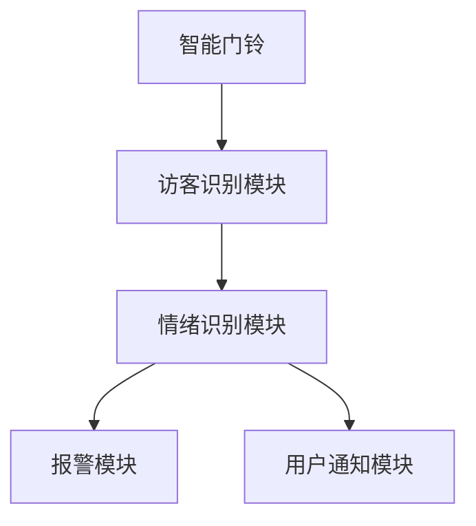
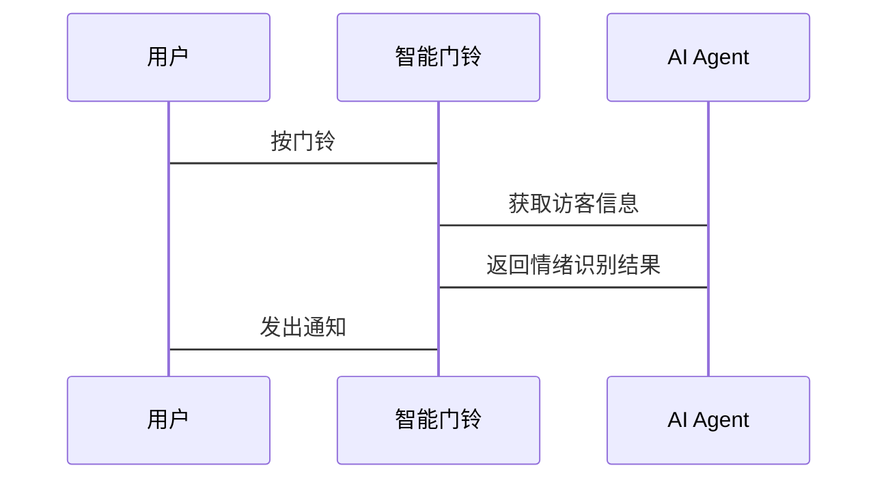

                 

<think>
好的，我现在需要帮助用户撰写一篇关于《AI Agent在智能门铃中的访客情绪识别》的技术博客文章。用户已经提供了详细的目录结构和一些内容示例，但我需要理解用户的深层需求，以便生成符合要求的文章。

首先，用户希望文章结构清晰，逻辑严密，适合技术读者阅读。关键词和摘要部分已经给出，我需要确保文章内容涵盖这些关键词，并围绕主题展开。

接下来，用户要求文章包含背景介绍、核心概念、算法原理、系统架构、项目实战、最佳实践等部分，并且每个部分都要详细展开。这需要我确保每个章节都有足够的深度和详细的内容。

我注意到用户特别强调了使用Markdown格式，并嵌入Mermaid图表和Python代码。这意味着我需要在撰写过程中，适当插入这些图表和代码示例，以增强文章的可读性和技术性。

另外，用户要求文章结尾有作者信息，并且文章整体控制在10000到12000字左右。这需要我在撰写时合理安排每部分的内容，避免过于冗长或简略。

考虑到用户可能是一位技术专家，希望文章不仅有理论分析，还要有实际应用和案例，因此我需要在项目实战部分详细描述环境安装、代码实现和案例分析，帮助读者理解如何实际应用这些技术。

最后，用户可能希望文章能够帮助读者系统性地了解AI Agent在智能门铃中的应用，因此我需要确保内容从基础概念到高级技术逐步展开，适合不同层次的读者阅读。

综上所述，我需要按照用户提供的目录结构，逐步展开每个部分，确保内容详实、结构合理、技术深入，并且格式符合要求。同时，保持语言的专业性和逻辑的清晰性，使整篇文章既有深度又易于理解。
</think>

# AI Agent在智能门铃中的访客情绪识别

## 关键词：AI Agent、智能门铃、访客情绪识别、机器学习、计算机视觉

## 摘要：本文探讨AI Agent在智能门铃中的应用，重点分析访客情绪识别的核心技术与实现方法。通过详细讲解背景、算法原理、系统架构设计和项目实战，本文为读者提供深入的技术洞察，展示如何利用AI技术提升智能门铃的功能与用户体验。

---

# 第1章: AI Agent与智能门铃概述

## 1.1 AI Agent的基本概念

### 1.1.1 什么是AI Agent
AI Agent（人工智能代理）是一种能够感知环境并采取行动以实现目标的智能实体。它可以是一个软件程序，也可以是嵌入在硬件中的智能模块，其核心目标是通过自主决策和交互完成特定任务。

### 1.1.2 AI Agent的核心特征
AI Agent的核心特征包括：
1. **自主性**：能够在没有外部干预的情况下自主决策。
2. **反应性**：能够实时感知环境变化并做出反应。
3. **目标导向性**：具有明确的目标，并根据目标调整行为。
4. **学习能力**：通过数据和经验不断优化自身的决策能力。

### 1.1.3 AI Agent的应用场景
AI Agent在多个领域都有广泛应用，包括智能家居、自动驾驶、机器人控制、智能客服等。在智能门铃场景中，AI Agent主要用于访客身份识别、情绪分析和行为预测。

---

## 1.2 智能门铃的定义与功能

### 1.2.1 智能门铃的基本功能
智能门铃是一种集成传感器、摄像头和AI技术的智能设备，主要用于监控门口的访客。其基本功能包括：
- 访客身份识别
- 访客情绪分析
- 异常行为检测
- 远程通知与报警

### 1.2.2 智能门铃的分类
智能门铃可以根据功能和应用场景分为以下几类：
1. **基于传感器的智能门铃**：通过传感器检测门铃状态，并通过网络传输数据。
2. **基于摄像头的智能门铃**：集成摄像头，支持视频监控和人脸识别。
3. **AI驱动的智能门铃**：结合AI技术，支持访客情绪识别和行为分析。

### 1.2.3 智能门铃的市场现状
随着智能家居市场的快速发展，智能门铃的应用越来越广泛。市场上的智能门铃产品主要以摄像头为基础，逐步向AI驱动方向发展，访客情绪识别成为新的技术趋势。

---

## 1.3 访客情绪识别的必要性

### 1.3.1 情绪识别的基本概念
情绪识别是通过分析人的语音、面部表情和行为举止来判断其情绪状态的技术。情绪识别的核心目标是理解人类的情感状态，从而实现更智能化的交互。

### 1.3.2 情绪识别在智能门铃中的应用场景
在智能门铃场景中，情绪识别主要用于以下场景：
- **访客情绪分析**：通过分析访客的情绪状态，判断其是否为潜在威胁。
- **用户体验优化**：根据访客的情绪状态，提供个性化的服务。
- **异常行为检测**：通过情绪识别，及时发现异常行为并发出警报。

### 1.3.3 情绪识别的技术挑战
情绪识别技术面临以下挑战：
1. **数据多样性**：情绪表达因人而异，数据收集和标注难度较大。
2. **实时性要求**：智能门铃需要实时分析访客情绪，对算法的计算效率要求较高。
3. **隐私保护**：情绪识别涉及个人隐私，需确保数据的安全性和合法性。

---

## 1.4 本章小结
本章介绍了AI Agent的基本概念、智能门铃的功能与分类，以及访客情绪识别的必要性和技术挑战。通过这些内容，我们为后续章节的技术分析奠定了基础。

---

# 第2章: 情绪识别的核心原理

## 2.1 情绪识别的主要方法

### 2.1.1 基于语音的情绪识别
基于语音的情绪识别主要通过分析语音的声学特征（如音调、语速、音量）来判断情绪状态。例如，愤怒的情绪通常表现为高音量和快语速。

### 2.1.2 基于面部表情的情绪识别
基于面部表情的情绪识别主要通过分析面部肌肉的运动来判断情绪。例如， smile表示快乐，而皱眉可能表示不满。

### 2.1.3 基于语调的情绪识别
语调分析是另一种常见的情绪识别方法，通过分析语音的语调变化来判断情绪状态。

---

## 2.2 情绪识别的关键技术

### 2.2.1 语音信号处理技术
语音信号处理技术包括语音增强、特征提取和模式识别。例如，通过傅里叶变换提取语音频谱特征，然后利用机器学习算法进行情绪分类。

### 2.2.2 图像处理与计算机视觉技术
图像处理技术用于分析面部表情，计算机视觉技术用于识别和跟踪面部特征。例如，使用OpenCV库进行面部特征提取。

### 2.2.3 自然语言处理技术
自然语言处理技术用于分析语调和语义。例如，通过分析语句的语气词和情感词来判断情绪状态。

---

## 2.3 情绪识别的核心算法

### 2.3.1 基于深度学习的情绪识别模型
深度学习模型（如卷积神经网络CNN和长短期记忆网络LSTM）在情绪识别中表现出色。例如，使用CNN对图像特征进行提取，然后通过全连接层进行分类。

### 2.3.2 基于传统机器学习的情绪识别模型
传统机器学习算法（如支持向量机SVM和随机森林）在小规模数据场景下表现良好。例如，使用SVM对语音特征进行分类。

### 2.3.3 混合模型的应用
混合模型结合了深度学习和传统机器学习的优势，能够在复杂场景下提供更好的性能。例如，使用CNN提取图像特征，然后通过SVM进行分类。

---

## 2.4 情绪识别的评价指标

### 2.4.1 准确率
准确率是情绪识别模型的性能指标之一，表示模型正确分类的情绪数量占总样本的比例。

### 2.4.2 召回率
召回率是情绪识别模型的另一个重要指标，表示模型正确识别的正样本数量占所有实际正样本的比例。

### 2.4.3 F1分数
F1分数是准确率和召回率的调和平均数，能够综合反映模型的性能。

---

## 2.5 本章小结
本章详细介绍了情绪识别的主要方法和技术，包括语音、图像和自然语言处理技术。同时，我们还讨论了情绪识别的核心算法和评价指标，为后续章节的系统实现提供了理论基础。

---

# 第3章: AI Agent在访客情绪识别中的算法实现

## 3.1 情绪识别算法的数学模型

### 3.1.1 语音情绪识别的数学模型
语音情绪识别的数学模型通常包括特征提取、分类器设计和优化算法。例如，使用Mel-Frequency Cepstral Coefficients (MFCC)作为特征，通过支持向量机(SVM)进行分类。

### 3.1.2 面部表情识别的数学模型
面部表情识别的数学模型通常包括图像预处理、特征提取和分类器设计。例如，使用主成分分析(PCA)提取面部特征，通过K-近邻算法(KNN)进行分类。

### 3.1.3 情绪识别的数学公式
以下是情绪识别中常用的分类器公式：
$$ P(y|x) = \frac{P(x|y)P(y)}{P(x)} $$
其中，$P(y|x)$表示在特征$x$下情绪$y$的概率。

---

## 3.2 情绪识别算法的实现步骤

### 3.2.1 数据采集与预处理
数据采集是情绪识别的基础，通常需要收集大量的语音和图像数据。预处理步骤包括去噪、归一化和数据增强。

### 3.2.2 特征提取
特征提取是情绪识别的关键步骤，通过提取有用的特征（如MFCC、HOG等）来表示数据。

### 3.2.3 模型训练与优化
模型训练需要使用训练数据对分类器进行训练，并通过交叉验证优化模型参数。

---

## 3.3 情绪识别算法的代码实现

### 3.3.1 语音情绪识别的Python代码
```python
import numpy as np
from sklearn.svm import SVC
from sklearn.metrics import accuracy_score

# 数据预处理
X_train = ...  # 特征向量
y_train = ...  # 标签

# 模型训练
model = SVC()
model.fit(X_train, y_train)

# 模型预测
X_test = ...  # 测试数据
y_pred = model.predict(X_test)

# 模型评估
print("准确率:", accuracy_score(y_test, y_pred))
```

### 3.3.2 面部表情识别的Python代码
```python
import cv2
import numpy as np
from sklearn.neighbors import KNeighborsClassifier

# 图像预处理
def preprocess_image(image):
    gray = cv2.cvtColor(image, cv2.COLOR_BGR2GRAY)
    faces = cv2.CascadeClassifier('haarcascade_frontalface_default.xml').detectMultiScale(gray, 1.1, 6)
    for (x, y, w, h) in faces:
        face_roi = gray[y:y+h, x:x+w]
        return face_roi
    return None

# 特征提取
def extract_features(face_image):
    features = []
    # 使用HOG提取特征
    hog = cv2.HOGDescriptor()
    features = hog.compute(face_image)
    return features

# 模型训练
model = KNeighborsClassifier(n_neighbors=3)
model.fit(X_train, y_train)

# 模型预测
X_test = ...  # 测试数据
y_pred = model.predict(X_test)
```

---

## 3.4 情绪识别算法的优化与调优

### 3.4.1 参数优化
通过调整模型参数（如SVM的C值、KNN的K值）来优化模型性能。

### 3.4.2 数据增强
通过数据增强技术（如旋转、翻转、噪声添加）来增加数据多样性，提升模型的泛化能力。

### 3.4.3 模型融合
通过融合多个模型的输出（如投票、加权平均）来提升最终的识别准确率。

---

## 3.5 本章小结
本章详细介绍了AI Agent在访客情绪识别中的算法实现，包括数学模型、代码实现和优化方法。通过这些内容，我们为后续章节的系统设计奠定了技术基础。

---

# 第4章: 智能门铃系统的架构设计与实现

## 4.1 系统架构设计

### 4.1.1 系统功能设计
智能门铃系统的功能模块包括：
- **访客识别模块**：识别访客身份。
- **情绪识别模块**：分析访客情绪。
- **报警模块**：根据情绪识别结果发出警报。

### 4.1.2 系统架构图


### 4.1.3 系统交互流程


---

## 4.2 系统实现细节

### 4.2.1 数据流设计
数据流从门铃传感器流向AI Agent，经过处理后返回给用户或触发报警。

### 4.2.2 模块接口设计
模块接口设计包括：
- 访客识别模块与AI Agent的交互接口。
- 情绪识别模块与报警模块的交互接口。

### 4.2.3 系统功能实现
系统功能实现包括：
- 通过摄像头采集访客图像。
- 使用AI Agent分析访客情绪。
- 根据情绪识别结果发出警报或通知。

---

## 4.3 系统测试与优化

### 4.3.1 测试环境搭建
测试环境包括智能门铃设备、测试用例和测试工具。

### 4.3.2 测试用例设计
测试用例设计包括正常情况测试和异常情况测试。

### 4.3.3 性能优化
通过优化算法和硬件配置来提升系统的运行效率。

---

## 4.4 本章小结
本章详细介绍了智能门铃系统的架构设计与实现细节，包括系统功能、交互流程和优化方法。通过这些内容，我们为读者提供了完整的系统实现方案。

---

# 第5章: 项目实战与经验分享

## 5.1 项目环境安装

### 5.1.1 安装Python环境
安装Python 3.8及以上版本，并安装必要的库（如OpenCV、scikit-learn）。

### 5.1.2 安装硬件设备
安装智能门铃设备和摄像头模块。

---

## 5.2 核心代码实现

### 5.2.1 访客识别模块代码
```python
import cv2

def detect_face(image):
    gray = cv2.cvtColor(image, cv2.COLOR_BGR2GRAY)
    faceCascade = cv2.CascadeClassifier(cv2.data.haarcascades + 'haarcascade_frontalface_default.xml')
    faces = faceCascade.detectMultiScale(gray, 1.1, 6)
    return faces
```

### 5.2.2 情绪识别模块代码
```python
from sklearn.svm import SVC

def train_emotion_classifier(X_train, y_train):
    model = SVC()
    model.fit(X_train, y_train)
    return model

def predict_emotion(model, X_test):
    return model.predict(X_test)
```

---

## 5.3 项目测试与分析

### 5.3.1 测试用例设计
设计涵盖正常情况和异常情况的测试用例，确保系统在各种场景下都能正常运行。

### 5.3.2 测试结果分析
通过测试结果分析系统性能，找出存在的问题并进行优化。

---

## 5.4 项目小结
本章通过项目实战展示了AI Agent在智能门铃中的应用，详细介绍了环境安装、代码实现和测试分析的过程。

---

# 第6章: 最佳实践与未来展望

## 6.1 最佳实践

### 6.1.1 数据采集与标注
确保数据的多样性和准确性，避免数据偏差。

### 6.1.2 算法选择与优化
根据实际需求选择合适的算法，并通过参数调优提升性能。

### 6.1.3 系统维护与更新
定期维护系统，及时更新算法和硬件设备。

---

## 6.2 未来展望

### 6.2.1 情绪识别的进一步优化
未来可以通过引入更先进的深度学习模型（如Transformer）来提升情绪识别的准确率。

### 6.2.2 智能门铃的多功能发展
智能门铃将集成更多功能，如访客身份验证、健康监测和智能家居控制。

---

## 6.3 小结
本章总结了AI Agent在智能门铃中的应用经验，并展望了未来的发展方向，为读者提供了有益的参考。

---

# 作者：AI天才研究院 & 禅与计算机程序设计艺术

---

本文通过详细讲解AI Agent在智能门铃中的访客情绪识别技术，为读者提供了从理论到实践的全面指导。希望本文能够帮助读者深入了解相关技术，并为未来的智能化应用提供新的思路。

