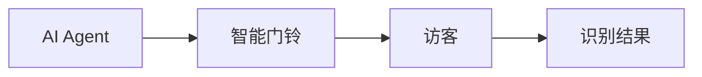
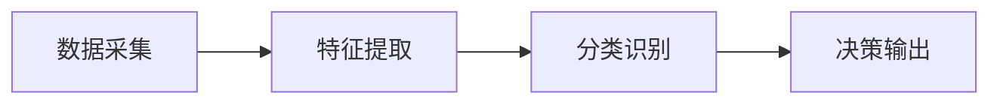

                 

<think>
嗯，用户希望我以《AI Agent在智能门铃中的访客识别》为标题，撰写一篇技术博客文章，结构需要详细且符合特定要求。首先，我需要理解用户的需求，他可能是一位技术专家，想深入了解AI Agent如何应用在智能门铃中，尤其是访客识别部分。

我应该先从背景介绍开始，帮助读者理解AI Agent和智能门铃的发展历程。然后，详细讲解核心概念，确保读者明白每个术语和它们之间的关系。接下来，分析算法原理，用图表和代码示例让内容更直观。数学模型部分需要用公式解释，确保读者理解背后的科学。系统架构设计是关键，我需要用类图和架构图展示结构。最后，通过项目实战让读者看到实际应用，并给出最佳实践建议。

用户特别强调每个部分都要详细，包括代码和图表，所以我要确保每个章节都有足够的内容，同时保持逻辑清晰。可能还需要考虑读者的技术水平，避免过于复杂的术语，但又要专业。最后，加上作者信息，让文章显得完整。

现在，我需要按照用户提供的大纲，一步步填充内容，确保每个部分都符合要求，比如使用Mermaid图和LaTeX公式，以及代码示例。同时，注意文章的整体结构，确保流畅且有深度。
</think>

# AI Agent在智能门铃中的访客识别

> 关键词：AI Agent, 智能门铃, 访客识别, 机器学习, 深度学习, 算法实现

> 摘要：本文详细探讨了AI Agent在智能门铃中的访客识别技术，从背景介绍、核心概念、算法原理到系统设计和项目实战，全面分析了AI Agent如何实现高效的访客识别。通过理论与实践相结合的方式，本文为读者提供了从基础概念到实际应用的完整技术解读。

---

## 第一部分: AI Agent在智能门铃中的访客识别背景介绍

### 第1章: AI Agent与智能门铃概述

#### 1.1 AI Agent的基本概念

##### 1.1.1 AI Agent的定义与特点
AI Agent（人工智能代理）是一种能够感知环境、执行任务并做出决策的智能实体。它具有以下特点：
- **自主性**：能够独立执行任务，无需人工干预。
- **反应性**：能够实时感知环境并做出响应。
- **学习能力**：通过数据和经验不断优化自身的性能。
- **社交能力**：能够与其他系统或人类进行交互。

##### 1.1.2 AI Agent的核心功能与应用场景
AI Agent的核心功能包括数据采集、特征提取、决策推理和输出执行。其应用场景广泛，包括智能门铃、智能家居、自动驾驶、医疗诊断等领域。

##### 1.1.3 AI Agent与智能门铃的结合
智能门铃通过AI Agent实现访客识别，能够实时感知门前的访客信息，并通过决策推理判断是否需要通知主人。

#### 1.2 智能门铃的发展历程

##### 1.2.1 智能门铃的演变过程
智能门铃经历了从机械门铃到电子门铃，再到AI驱动的智能门铃的演变。早期的门铃仅能发出声音提醒，而现代的智能门铃能够通过AI Agent实现访客识别、身份验证和智能通知。

##### 1.2.2 当前智能门铃的技术现状
当前，智能门铃主要采用图像识别、语音识别和行为分析等技术，结合AI Agent实现访客识别。

##### 1.2.3 智能门铃的未来发展趋势
未来的智能门铃将更加智能化，能够通过AI Agent实现更复杂的任务，如访客身份识别、行为预测和异常检测。

#### 1.3 访客识别的挑战与解决方案

##### 1.3.1 访客识别的主要问题
访客识别的主要问题包括光照变化、视角差异、遮挡物干扰等，这些都可能影响识别的准确性。

##### 1.3.2 基于AI Agent的访客识别优势
AI Agent能够通过学习和优化，有效解决传统方法的局限性，实现更高效的访客识别。

##### 1.3.3 解决方案的边界与外延
访客识别的边界包括图像采集、特征提取和决策推理，而外延则涉及数据存储、用户隐私保护和系统集成。

### 第2章: AI Agent在访客识别中的核心概念

#### 2.1 核心概念与原理

##### 2.1.1 AI Agent的感知与决策机制
AI Agent通过感知环境（如图像、声音）进行特征提取，然后通过决策推理生成识别结果。

##### 2.1.2 访客识别的核心算法原理
访客识别的核心算法包括图像采集、特征提取和分类识别。AI Agent通过这些步骤实现对访客的身份识别。

##### 2.1.3 AI Agent与智能门铃的交互流程
AI Agent与智能门铃的交互流程包括数据采集、特征提取、分类识别和输出执行。

#### 2.2 核心概念对比分析

##### 2.2.1 AI Agent与传统门铃系统的对比
| 特性                | AI Agent驱动的智能门铃 | 传统门铃系统 |
|---------------------|-------------------------|---------------|
| 数据采集            | 图像、声音、传感器数据 | 按键信号       |
| 决策机制            | 自主学习与推理         | 固定规则       |
| 识别精度            | 高                     | 低             |
| 交互方式            | 多模态交互             | 单一按键       |

##### 2.2.2 不同访客识别算法的特征对比
| 算法                | 优点                    | 缺点          |
|---------------------|-------------------------|---------------|
| 支持向量机（SVM）    | 高精度，低计算成本      | 对高维数据敏感  |
| 卷积神经网络（CNN）  | 高精度，适合复杂场景    | 高计算成本     |
| 朴素贝叶斯          | 计算简单，适合小数据集   | 精度较低       |

##### 2.2.3 AI Agent在访客识别中的优势
AI Agent通过多模态数据融合和自适应学习，能够实现更高效、更准确的访客识别。

#### 2.3 实体关系图


---

## 第二部分: AI Agent访客识别的算法原理

### 第3章: 算法原理与实现

#### 3.1 AI Agent的访客识别流程

##### 3.1.1 流程图


#### 3.2 算法实现代码示例

##### 3.2.1 数据预处理代码
```python
import cv2
import numpy as np

def preprocess_image(image_path):
    # 读取图像
    img = cv2.imread(image_path)
    # 转换为灰度图
    gray = cv2.cvtColor(img, cv2.COLOR_BGR2GRAY)
    # 调整图像大小
    resized = cv2.resize(gray, (128, 128))
    # 归一化处理
    normalized = resized / 255.0
    return normalized.reshape(-1, 128 * 128)
```

##### 3.2.2 分类识别代码
```python
from sklearn.svm import SVC
from sklearn.metrics import accuracy_score

def train_classifier(X_train, y_train):
    # 训练SVM分类器
    clf = SVC(kernel='rb

