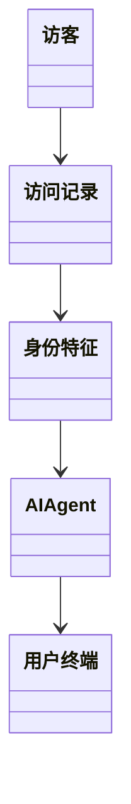
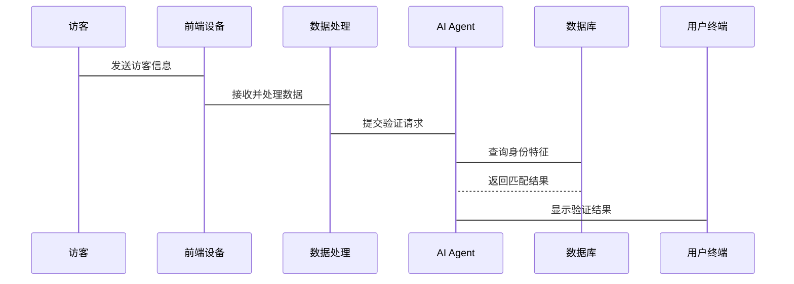

                 


# AI Agent在智能门铃中的访客身份验证

## 关键词：AI Agent, 智能门铃, 访客身份验证, 机器学习, 计算机视觉

## 摘要：
本文深入探讨了AI Agent在智能门铃中的访客身份验证技术，分析了其核心概念、算法原理、系统架构及其实现。通过详细的技术分析和实际案例，展示了AI Agent如何提升智能门铃的安全性和智能化水平，为未来的智能家居系统提供了重要的技术参考。

---

# 第一部分: AI Agent在智能门铃中的访客身份验证基础

## 第1章: 背景介绍

### 1.1 问题背景
#### 1.1.1 智能门铃的发展现状
智能门铃作为智能家居的重要组成部分，经历了从机械门锁到电子门禁，再到智能门锁的演变。传统门铃仅能提示访客到来，不具备身份识别功能。随着AI技术的发展，智能门铃逐渐具备访客识别、身份验证等功能，成为智能家居安全的核心环节。

#### 1.1.2 访客身份验证的必要性
访客身份验证是智能门铃的核心功能之一。通过验证访客身份，智能门铃可以有效防止未经授权的访问，提升家庭安全。传统的访客验证方式（如密码、钥匙）存在易丢失、难管理等问题，而AI Agent的引入，使得访客验证更加智能化、便捷化。

#### 1.1.3 AI Agent在智能门铃中的应用前景
AI Agent（人工智能代理）是一种能够自主决策和执行任务的智能系统。在智能门铃中，AI Agent可以通过分析访客的图像、语音、行为等信息，实现精准的身份验证。随着AI技术的不断进步，AI Agent在智能门铃中的应用前景广阔，将成为未来智能家居的核心技术之一。

### 1.2 问题描述
#### 1.2.1 访客身份验证的核心问题
访客身份验证的核心问题是如何准确识别访客身份，同时保证验证过程的高效性和安全性。这涉及到多模态数据的融合分析，如人脸、声音、行为等。

#### 1.2.2 AI Agent在身份验证中的角色
AI Agent在智能门铃中的角色是负责接收访客信息、分析验证，并做出相应的决策。它需要结合多种验证方式，确保验证结果的准确性。

#### 1.2.3 智能门铃系统的边界与外延
智能门铃系统包括前端设备（如摄像头、麦克风）、后端AI Agent、用户终端等部分。系统需要与智能家居平台（如智能音箱、智能灯）无缝对接，提供完整的访客管理解决方案。

### 1.3 核心概念与联系
#### 1.3.1 AI Agent的定义与特点
AI Agent是一种能够感知环境、自主决策并执行任务的智能系统。其特点包括：
- **自主性**：无需人工干预，自主完成任务。
- **反应性**：能够实时感知环境变化，并做出相应反应。
- **学习能力**：通过机器学习算法不断优化性能。

#### 1.3.2 智能门铃系统的组成与功能
智能门铃系统通常包括：
- **前端设备**：负责采集访客图像、声音等信息。
- **AI Agent**：负责分析数据、验证身份。
- **用户终端**：显示验证结果并通知用户。
- **存储模块**：存储访客信息和验证记录。

#### 1.3.3 访客身份验证的流程与关键点
访客身份验证的流程包括：
1. 采集访客信息（如图像、声音）。
2. AI Agent分析数据，进行特征提取。
3. 对比特征与数据库中的记录，进行身份验证。
4. 输出验证结果，并根据需要触发相应操作（如开门、通知主人）。

### 1.4 本章小结
本章介绍了智能门铃的发展现状、访客身份验证的必要性，以及AI Agent在其中的角色。通过分析系统组成和验证流程，为后续章节的深入探讨奠定了基础。

---

## 第2章: AI Agent的核心概念与原理

### 2.1 AI Agent的原理
#### 2.1.1 机器学习与模式识别
AI Agent通过机器学习算法，从访客数据中提取特征，并进行模式识别。例如，使用卷积神经网络（CNN）对人脸图像进行分类，识别访客身份。

#### 2.1.2 自然语言处理
通过自然语言处理技术，AI Agent可以分析访客的语音信息，识别其意图和身份。例如，通过语音识别和语义分析，判断访客是否为已授权人员。

#### 2.1.3 计算机视觉
计算机视觉技术用于分析访客的图像信息，如人脸检测、姿态识别等。AI Agent可以通过这些信息进行身份验证。

### 2.2 核心概念对比
#### 2.2.1 AI Agent与传统算法的对比
| 对比维度 | AI Agent | 传统算法 |
|----------|-----------|----------|
| 处理能力 | 自主学习、适应性强 | 预定义规则，处理能力有限 |
| 数据需求 | 需要大量标注数据 | 数据需求较少 |
| 适用场景 | 复杂场景，需要实时决策 | 简单场景，规则明确 |

#### 2.2.2 不同身份验证方法的优劣势分析
| 验证方式 | 优点 | 缺点 |
|----------|-------|------|
| 人脸验证 | 非接触式，速度快 | 易受光线、角度影响 |
| 声音验证 | 方便快捷 | 易受环境噪声影响 |
| 行为验证 | 精度高 | 实时性差 |

#### 2.2.3 实体关系图（ER图）展示
```mermaid
erd
  图表标题：访客身份验证系统实体关系图
  访客 --> 访问记录：1:N
  访问记录 --> 身份特征：1:1
  身份特征 --> AI Agent：N:1
```

### 2.3 本章小结
本章详细介绍了AI Agent的核心概念和原理，分析了其与传统算法的区别，并通过对比不同身份验证方法的优劣势，为后续章节的实现提供了理论基础。

---

## 第3章: 算法原理与实现

### 3.1 算法原理
#### 3.1.1 支持向量机（SVM）在身份验证中的应用
支持向量机是一种常用的分类算法，适用于小规模数据集。其原理是通过构建超平面，将数据分为两类。在访客身份验证中，SVM可以用于特征分类。

#### 3.1.2 神经网络模型（如卷积神经网络CNN）的原理
卷积神经网络（CNN）是一种深度学习模型，适用于图像识别任务。其通过卷积层、池化层提取图像特征，并通过全连接层进行分类。

#### 3.1.3 聚类分析与分类算法的选择
根据数据量和场景需求，可以选择聚类分析或分类算法。聚类分析适用于无监督学习场景，而分类算法适用于有监督学习场景。

### 3.2 算法实现
#### 3.2.1 机器学习模型的训练流程
1. 数据预处理：归一化、数据增强。
2. 模型训练：选择合适的算法（如SVM、CNN）。
3. 模型评估：通过准确率、召回率等指标评估模型性能。
4. 模型优化：调整超参数，提升性能。

#### 3.2.2 计算机视觉算法的实现步骤
1. 图像采集：通过摄像头采集访客图像。
2. 图像预处理：去噪、调整亮度。
3. 特征提取：使用CNN提取图像特征。
4. 特征匹配：与数据库中的特征进行对比，验证身份。

#### 3.2.3 自然语言处理算法的实现步骤
1. 语音采集：通过麦克风采集访客语音。
2. 语音预处理：降噪、分割。
3. 语音识别：使用ASR（Automatic Speech Recognition）技术识别语音内容。
4. 语义分析：判断语音内容是否符合授权条件。

### 3.3 本章小结
本章详细介绍了AI Agent在访客身份验证中的算法原理和实现步骤，为后续章节的系统设计提供了技术支持。

---

## 第4章: 数学模型与公式

### 4.1 数学模型
#### 4.1.1 支持向量机（SVM）的数学模型
支持向量机的目标是最小化损失函数：
$$ \text{损失函数} = \sum_{i=1}^{n} \xi_i + \frac{1}{2}\lambda \|w\|^2 $$

其中，$\xi_i$是松弛变量，$\lambda$是正则化参数，$w$是权重向量。

#### 4.1.2 神经网络的数学模型
神经网络的前向传播过程可以用以下公式表示：
$$ y = \sigma(w x + b) $$
其中，$x$是输入，$w$是权重，$b$是偏置，$\sigma$是激活函数。

#### 4.1.3 损失函数与优化
交叉熵损失函数为：
$$ L = -\frac{1}{m}\sum_{i=1}^{m} y_i \log p_i + (1 - y_i)\log(1 - p_i) $$
其中，$m$是样本数量，$y_i$是真实标签，$p_i$是预测概率。

优化过程通常使用梯度下降法：
$$ w = w - \eta \frac{\partial L}{\partial w} $$
其中，$\eta$是学习率。

### 4.2 本章小结
本章通过数学公式详细解释了AI Agent在访客身份验证中的算法原理，为后续章节的系统设计提供了理论依据。

---

## 第5章: 系统分析与架构设计

### 5.1 系统分析
#### 5.1.1 问题场景介绍
智能门铃系统需要实时处理访客信息，快速验证身份，并与智能家居平台联动。系统需要具备高可用性、高安全性，能够适应复杂多变的场景需求。

#### 5.1.2 系统功能设计
系统功能包括：
- 访客信息采集：摄像头、麦克风采集访客图像、语音。
- AI Agent处理：对采集的数据进行特征提取和身份验证。
- 用户交互：显示验证结果，并通知用户。

#### 5.1.3 领域模型类图


### 5.2 系统架构设计
#### 5.2.1 系统架构图
```mermaid
graph TD
  前端设备 --> 数据处理 --> AI Agent
  AI Agent --> 用户终端
  AI Agent --> 智能家居平台
```

#### 5.2.2 系统接口设计
系统接口包括：
- 访客信息接口：接收前端设备的图像、语音数据。
- 验证结果接口：输出验证结果，并通知用户。
- 数据存储接口：与数据库交互，存储访客信息。

#### 5.2.3 系统交互序列图


### 5.3 本章小结
本章详细分析了智能门铃系统的应用场景，设计了系统的功能模块、架构和接口，并通过序列图展示了系统的交互流程。

---

## 第6章: 项目实战

### 6.1 环境安装
项目实战需要以下环境：
- **硬件**：摄像头、麦克风、智能门铃设备。
- **软件**：Python编程语言、深度学习框架（如TensorFlow、PyTorch）。
- **依赖库**：OpenCV、scikit-learn、SpeechRecognition。

### 6.2 系统核心实现
#### 6.2.1 代码实现
```python
import cv2
import numpy as np
from sklearn.svm import SVC

# 1. 数据预处理
def preprocess_image(image):
    # 调整图像大小、归一化等处理
    pass

# 2. 特征提取
def extract_features(image):
    # 使用CNN提取图像特征
    pass

# 3. 模型训练
def train_model(features, labels):
    model = SVC()
    model.fit(features, labels)
    return model

# 4. 验证流程
def verify_guest(image, model):
    features = extract_features(image)
    prediction = model.predict(features)
    return prediction
```

#### 6.2.2 代码解读与分析
- **数据预处理**：调整图像大小、归一化等，确保数据格式一致。
- **特征提取**：使用CNN提取图像特征，通常会提取中间层的特征向量。
- **模型训练**：使用支持向量机（SVM）进行模型训练，训练完成后用于验证。
- **验证流程**：将采集的访客图像通过预处理和特征提取，输入训练好的模型进行验证。

#### 6.2.3 项目案例分析
通过实际案例分析，展示AI Agent在智能门铃中的应用效果。例如，通过训练好的模型，能够准确识别授权访客，并快速响应开门请求。

### 6.3 本章小结
本章通过项目实战，详细讲解了AI Agent在智能门铃中的实现过程，包括环境安装、代码实现和案例分析。

---

## 第7章: 总结与展望

### 7.1 总结
本文详细探讨了AI Agent在智能门铃中的访客身份验证技术，分析了其核心概念、算法原理、系统架构及其实现。通过理论分析和实际案例，展示了AI Agent如何提升智能门铃的安全性和智能化水平。

### 7.2 未来展望
随着AI技术的不断进步，访客身份验证将更加智能化、便捷化。未来的研究方向包括：
- **多模态验证**：结合人脸、声音、行为等多种验证方式，提升验证精度。
- **边缘计算**：将AI Agent部署在门铃设备端，提升响应速度和隐私保护能力。
- **自适应学习**：通过持续学习优化模型性能，适应不同场景需求。

### 7.3 最佳实践 Tips
- 在实际应用中，建议结合多种验证方式，提升系统的安全性。
- 定期更新模型，适应新的数据和场景需求。
- 注意数据隐私保护，确保用户信息的安全。

### 7.4 本章小结
本章总结了全文的主要内容，展望了未来的发展方向，并给出了实际应用中的最佳实践建议。

---

## 作者：AI天才研究院/AI Genius Institute & 禅与计算机程序设计艺术 /Zen And The Art of Computer Programming

---

以上是《AI Agent在智能门铃中的访客身份验证》的技术博客文章的完整目录和内容框架。根据实际需求，可以进一步补充细节，完善各章节内容，确保文章结构清晰、内容详实。

