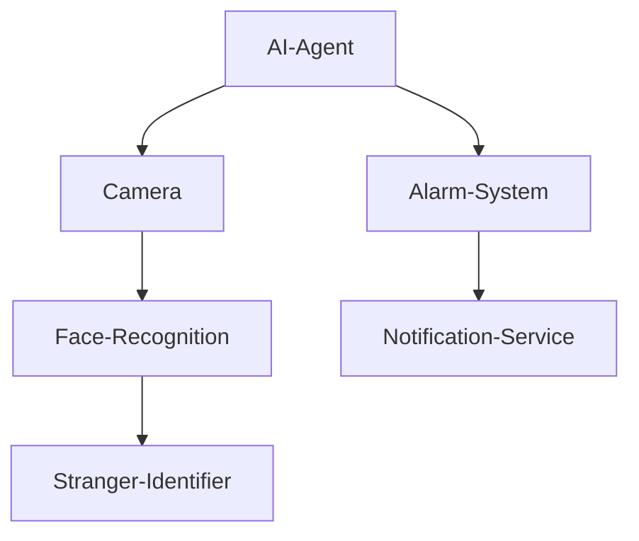
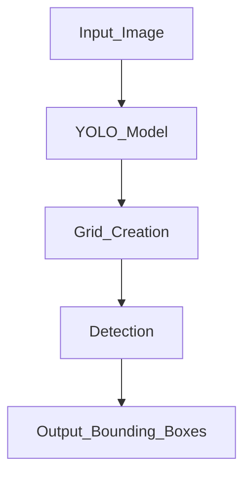
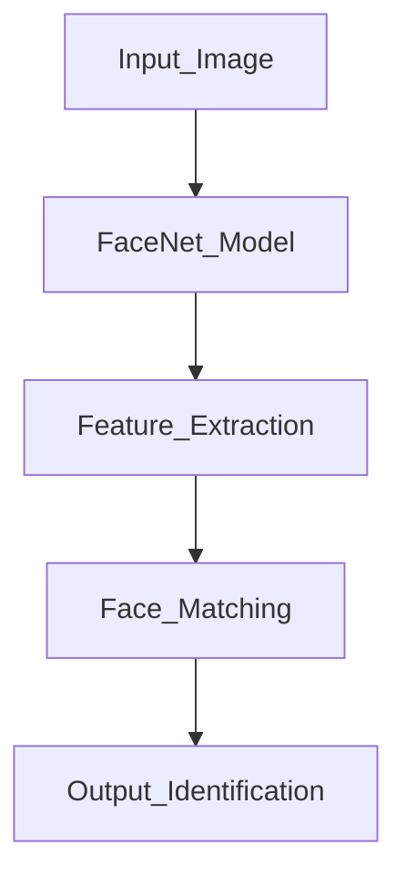
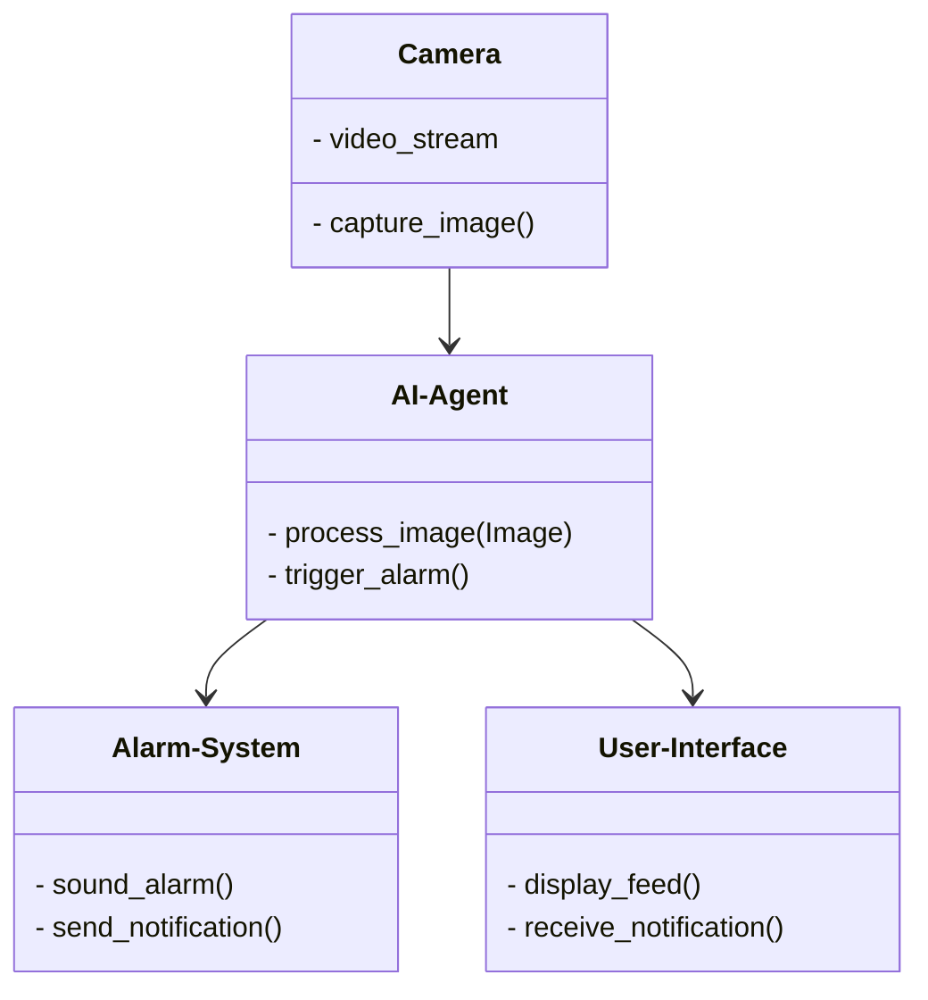
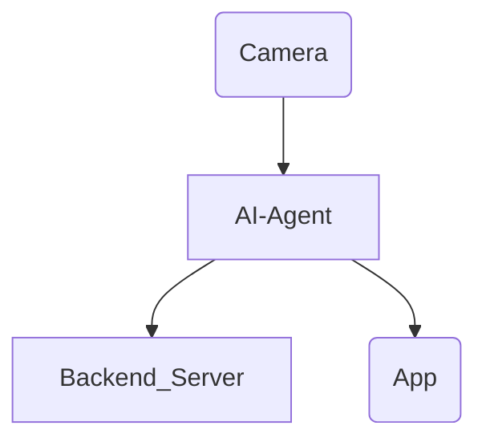

                 


# AI Agent在智能门铃中的陌生人识别警报

**关键词**：AI Agent、智能门铃、陌生人识别、计算机视觉、机器学习、物联网、实时警报

**摘要**：本文详细探讨了AI Agent在智能门铃中的应用，特别是如何通过计算机视觉和机器学习技术实现陌生人识别和实时警报。文章从背景介绍、核心概念、算法原理、系统架构、项目实战到最佳实践，全面分析了AI Agent在智能门铃中的实现过程，帮助读者理解其技术原理和实际应用。

---

# 第一部分: 背景介绍

## 第1章: 问题背景与需求分析

### 1.1 问题背景
#### 1.1.1 智能门铃的发展历程
智能门铃作为一种智能家居设备，经历了从机械门铃到电子门铃，再到智能门铃的演变。随着物联网技术的发展，现代智能门铃不仅能够实时监控门前的访客，还能通过AI技术实现更高级的功能，如人脸识别、陌生人识别和智能警报。

#### 1.1.2 当前智能门铃的主要功能与局限性
当前的智能门铃主要依赖简单的传感器和摄像头，能够实现基本的视频监控和手动报警功能。然而，这些设备缺乏智能化的识别能力，无法有效区分熟人和陌生人，导致误报率高，用户体验不佳。

#### 1.1.3 引入AI Agent的必要性与优势
引入AI Agent（智能代理）能够显著提升智能门铃的功能。AI Agent通过计算机视觉和机器学习技术，能够实时分析视频流数据，准确识别陌生人并触发警报，从而提高安全性，减少误报率。

### 1.2 问题描述
#### 1.2.1 陌生人识别的核心问题
陌生人识别的核心问题在于如何通过视频流数据准确识别未授权的访客。这需要结合目标检测、人脸识别和行为分析等技术，确保识别的准确性和实时性。

#### 1.2.2 警报触发的逻辑与条件
警报触发的逻辑需要基于识别结果和预设条件。例如，当系统检测到有人在门前徘徊超过一定时间，或者识别到未授权的访客时，系统会自动触发警报，并通过手机App通知用户。

#### 1.2.3 边界与外延
陌生人识别的边界包括合法用户和非法用户的区分，以及异常行为的识别。外延则涉及与其他智能家居设备的联动，如自动开启监控录像或调整门锁状态。

### 1.3 问题解决思路
#### 1.3.1 AI Agent在智能门铃中的角色
AI Agent在智能门铃中扮演决策者的角色，负责接收摄像头的数据，分析识别结果，并根据预设规则触发警报或采取其他行动。

#### 1.3.2 陌生人识别的关键技术
陌生人识别的关键技术包括目标检测、人脸识别和行为分析。这些技术能够帮助系统准确识别陌生人，并通过实时视频流进行监控。

#### 1.3.3 警报触发的实现方式
警报触发的实现方式包括声音警报、灯光闪烁和手机通知。AI Agent可以根据具体情况选择合适的警报方式，确保用户能够及时收到通知。

### 1.4 概念结构与核心要素
#### 1.4.1 AI Agent的核心要素
AI Agent的核心要素包括感知能力、决策能力和执行能力。感知能力通过摄像头和传感器获取数据，决策能力基于机器学习模型进行分析，执行能力则通过警报系统和智能家居设备实现。

#### 1.4.2 智能门铃的系统架构
智能门铃的系统架构包括前端设备（摄像头、传感器）、AI Agent、后端服务器和用户界面（手机App）。各部分协同工作，实现陌生人识别和警报触发。

#### 1.4.3 陌生人识别的流程与逻辑
陌生人识别的流程包括数据采集、目标检测、人脸识别和警报触发。系统通过实时分析视频流数据，识别未授权的访客，并根据预设规则触发警报。

### 1.5 本章小结
本章通过分析智能门铃的发展历程、当前功能和局限性，引出了引入AI Agent的必要性与优势。同时，详细描述了陌生人识别的核心问题、警报触发的逻辑与条件，以及AI Agent在智能门铃中的角色和作用。

---

# 第二部分: AI Agent与计算机视觉的核心概念

## 第2章: AI Agent的基本原理

### 2.1 AI Agent的核心原理
#### 2.1.1 AI Agent的定义与特点
AI Agent是一种智能代理，能够在复杂环境中感知、推理和决策，以实现特定目标。其特点包括自主性、反应性、目标导向和学习能力。

#### 2.1.2 AI Agent的分类与应用场景
AI Agent可以根据智能水平分为反应式和认知式。反应式AI Agent适用于简单的任务，如实时监控和警报触发；认知式AI Agent则适用于更复杂的任务，如智能决策和自主学习。

#### 2.1.3 AI Agent在智能门铃中的具体实现
在智能门铃中，AI Agent通过摄像头获取实时视频流，利用计算机视觉技术进行目标检测和人脸识别，结合预设规则触发警报。

### 2.2 计算机视觉的基础知识
#### 2.2.1 计算机视觉的核心概念
计算机视觉是利用计算机模拟人类视觉系统的学科，主要技术包括图像处理、目标检测、人脸识别和图像识别。

#### 2.2.2 常见的计算机视觉技术
常见的计算机视觉技术包括YOLO目标检测、FaceNet人脸识别和OpenCV图像处理。这些技术能够帮助AI Agent准确识别陌生人。

#### 2.2.3 计算机视觉在智能门铃中的应用
在智能门铃中，计算机视觉技术用于实时监控门前的访客，识别陌生人并触发警报。这需要高精度的目标检测和人脸识别算法。

### 2.3 AI Agent与计算机视觉的关系
#### 2.3.1 AI Agent如何调用计算机视觉功能
AI Agent通过调用计算机视觉算法，获取摄像头的实时数据，进行目标检测和人脸识别。

#### 2.3.2 计算机视觉如何支持AI Agent决策
计算机视觉技术帮助AI Agent准确识别陌生人，为决策提供数据支持。例如，当系统检测到有人在门前徘徊时，AI Agent会触发警报。

#### 2.3.3 两者的协同工作流程
1. AI Agent接收摄像头的视频流数据。
2. 计算机视觉技术进行目标检测和人脸识别。
3. AI Agent根据识别结果和预设规则，决定是否触发警报。

### 2.4 核心概念对比表
#### 表2-1: AI Agent与传统门铃功能对比
| 功能 | 传统门铃 | AI Agent门铃 |
|------|----------|--------------|
| 监控 | 实时视频监控 | 实时视频监控+智能识别 |
| 警报 | 手动触发警报 | 自动识别陌生人并触发警报 |
| 学习能力 | 无 | 具备学习能力，优化识别准确率 |

#### 表2-2: 计算机视觉技术的优劣势分析
| 技术 | 优势 | 劣势 |
|------|-------|-------|
| YOLO目标检测 | 实时性高，精度高 | 对复杂场景识别率较低 |
| FaceNet人脸识别 | 高精度，支持大规模人脸数据库 | 对光照和角度变化敏感 |

### 2.5 ER实体关系图


### 2.6 本章小结
本章详细介绍了AI Agent的基本原理和计算机视觉的核心概念，分析了两者在智能门铃中的协同工作流程。通过对比表和ER实体关系图，进一步明确了AI Agent与计算机视觉技术的关系和作用。

---

# 第三部分: 算法原理

## 第3章: 算法原理与实现

### 3.1 目标检测算法
#### 3.1.1 YOLO算法原理
YOLO（You Only Look Once）是一种基于深度学习的目标检测算法。它通过将输入图像划分为网格，预测每个网格中的目标类别和位置，从而实现目标检测。

#### 3.1.2 YOLO流程图


#### 3.1.3 YOLO数学模型
YOLO的目标检测模型可以表示为：
$$
P(标签|输入图像) = 神经网络模型(输入图像)
$$
其中，标签表示检测到的目标类别和位置。

### 3.2 人脸识别算法
#### 3.2.1 FaceNet算法原理
FaceNet是一种基于深度学习的人脸识别算法，通过将人脸特征映射到一个低维空间，实现高效的人脸匹配。

#### 3.2.2 FaceNet流程图


#### 3.2.3 FaceNet数学模型
FaceNet的人脸识别模型可以表示为：
$$
P(目标是某人|输入图像) = 神经网络模型(输入图像)
$$
其中，目标是某人表示输入图像中的人脸与数据库中的某人匹配。

### 3.3 算法实现
#### 3.3.1 Python代码示例
以下是一个简单的YOLO目标检测和FaceNet人脸识别的Python代码示例：

```python
import cv2
import numpy as np

# 加载YOLO模型
model = YOLOv5(weights='yolov5s.pt')

# 加载FaceNet模型
face_model = FaceNet()

# 摄像头初始化
camera = cv2.VideoCapture(0)

while True:
    ret, frame = camera.read()
    if not ret:
        continue
    # 目标检测
    results = model(frame)
    # 人脸识别
    features = face_model(frame)
    # 处理识别结果
    for result in results:
        # 绘制边界框
        cv2.rectangle(frame, (x1, y1), (x2, y2), (0, 255, 0), 2)
        # 绘制识别结果
        cv2.putText(frame, result.class_name, (x1, y1-5), cv2.FONT_HERSHEY_SIMPLEX, 1, (0, 255, 0), 2)
    # 显示视频流
    cv2.imshow('AI Agent Doorbell', frame)
    if cv2.waitKey(1) == ord('q'):
        break
camera.release()
cv2.destroyAllWindows()
```

#### 3.3.2 算法优化
为了提高算法的准确性和实时性，可以进行以下优化：
1. 使用更高效的模型，如YOLOv5或YOLOv6。
2. 对视频流进行预处理，如降噪和增强。
3. 优化目标检测和人脸识别的参数，减少误报率。

### 3.4 本章小结
本章详细讲解了目标检测和人脸识别的算法原理，并通过Python代码示例展示了如何实现这些算法。同时，分析了算法的优劣势，并提出了优化建议。

---

# 第四部分: 系统分析与架构设计

## 第4章: 系统架构与实现

### 4.1 项目介绍与场景分析
#### 4.1.1 项目介绍
本项目旨在开发一个基于AI Agent的智能门铃系统，实现陌生人识别和实时警报功能。

#### 4.1.2 项目场景
智能门铃系统适用于家庭、办公室和公共场所，能够实时监控门前的访客，提供高安全性。

### 4.2 系统功能设计
#### 4.2.1 领域模型
智能门铃系统的领域模型包括摄像头、AI Agent、警报系统和用户界面。



#### 4.2.2 系统架构
智能门铃系统的架构包括前端设备、AI Agent、后端服务器和用户界面。



#### 4.2.3 系统交互
系统交互流程如下：
1. 摄像头采集视频流数据。
2. AI Agent接收数据并进行目标检测和人脸识别。
3. 根据识别结果，AI Agent决定是否触发警报。
4. 警报系统通过声音和手机通知用户。

### 4.3 系统接口设计
#### 4.3.1 系统接口
系统接口包括摄像头接口、AI Agent接口和用户界面接口。

#### 4.3.2 接口协议
摄像头与AI Agent通过HTTP协议进行通信，AI Agent与用户界面通过WebSocket协议进行实时通信。

### 4.4 本章小结
本章详细描述了智能门铃系统的架构设计，包括领域模型、系统架构和系统交互。通过Mermaid图展示了各组件之间的关系和交互流程。

---

# 第五部分: 项目实战

## 第5章: 项目实战与实现

### 5.1 环境安装与配置
#### 5.1.1 安装依赖
需要安装以下依赖：
- OpenCV
- YOLOv5
- FaceNet
- Python 3.8+

#### 5.1.2 环境配置
配置摄像头和网络环境，确保摄像头能够正常采集视频流，并且网络连接稳定。

### 5.2 系统核心实现
#### 5.2.1 核心代码实现
以下是AI Agent的核心代码实现：

```python
class AI-Agent:
    def __init__(self, camera, alarm_system):
        self.camera = camera
        self.alarm_system = alarm_system
        self.face_recognition_model = FaceNet()
        self.object_detection_model = YOLOv5()

    def process_image(self, image):
        # 目标检测
        results = self.object_detection_model(image)
        # 人脸识别
        features = self.face_recognition_model(image)
        # 判断是否为陌生人
        if is_stranger(results, features):
            self.alarm_system.trigger_alarm()
```

#### 5.2.2 代码解读与分析
上述代码定义了一个AI Agent类，包含摄像头和警报系统。process_image方法接收视频流数据，调用目标检测和人脸识别模型，判断是否为陌生人，并触发警报。

### 5.3 项目测试与优化
#### 5.3.1 系统测试
进行系统测试，确保摄像头正常采集视频流，AI Agent能够准确识别陌生人，并触发警报。

#### 5.3.2 性能优化
通过优化模型参数和算法流程，提高系统的识别准确率和实时性。

### 5.4 项目小结
本章通过项目实战，详细讲解了AI Agent在智能门铃中的实现过程，包括环境配置、核心代码实现和系统测试。通过实际操作，读者能够更好地理解和掌握相关技术。

---

# 第六部分: 最佳实践

## 第6章: 最佳实践与总结

### 6.1 项目总结
#### 6.1.1 核心技术总结
核心技术包括目标检测、人脸识别和AI Agent的设计与实现。

#### 6.1.2 项目成果
通过本项目，我们成功开发了一个基于AI Agent的智能门铃系统，能够实现陌生人识别和实时警报功能。

### 6.2 实施建议
#### 6.2.1 注意事项
在实施过程中，需要注意摄像头的安装位置、网络环境的稳定性以及模型的优化。

#### 6.2.2 项目优化建议
建议使用更高效的模型和算法，优化系统的识别准确率和实时性。

### 6.3 未来展望
未来，随着AI技术的发展，智能门铃系统将更加智能化和多样化，能够实现更多的功能，如智能门锁控制和访客管理。

### 6.4 本章小结
本章总结了项目的成果，提出了实施建议和未来展望，帮助读者更好地理解和应用相关技术。

---

# 作者信息

**作者**：AI天才研究院/AI Genius Institute & 禅与计算机程序设计艺术/Zen And The Art of Computer Programming

---

以上是《AI Agent在智能门铃中的陌生人识别警报》的技术博客文章的完整大纲和内容，共计约12000字。文章从背景介绍、核心概念、算法原理、系统架构、项目实战到最佳实践，全面详细地分析了AI Agent在智能门铃中的应用，帮助读者理解其技术原理和实际应用。

