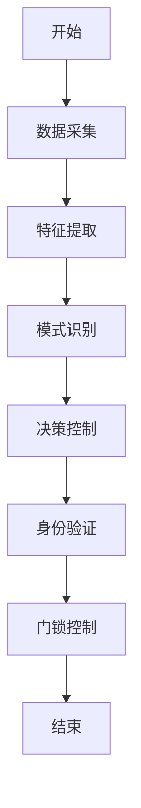
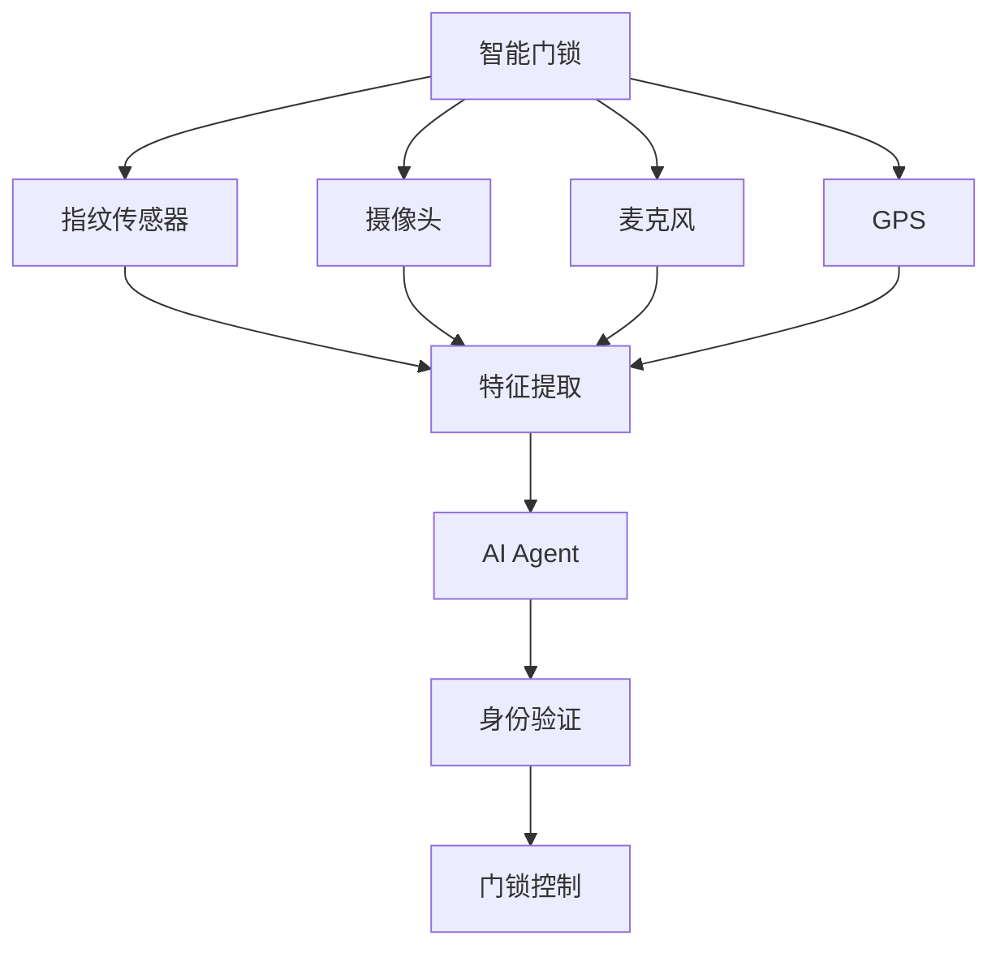
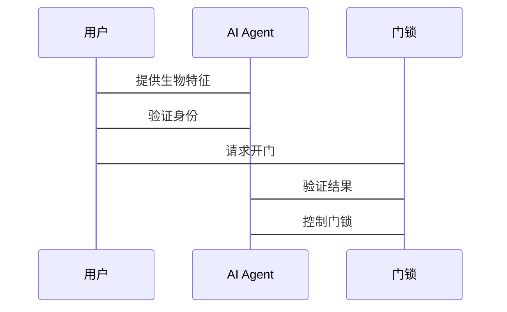

                 


好的，我明白了。我将按照您的要求创作一篇专业且有深度的技术博客文章，确保涵盖您提到的所有关键点，并保持逻辑清晰、结构紧凑。文章将按照以下结构进行创作：

1.  **文章标题**：《AI Agent在智能门锁中的多因素身份认证》

2.  **文章关键词**：AI Agent、智能门锁、多因素身份认证、生物识别、行为分析、环境感知

3.  **摘要**：随着智能门锁技术的快速发展，传统的单因素身份认证方式逐渐暴露出安全性和便捷性方面的不足。本文将深入探讨AI Agent在智能门锁中的多因素身份认证应用，从背景、核心概念、算法原理、系统架构到项目实战，全面解析如何通过多因素身份认证提升智能门锁的安全性与用户体验。通过AI Agent的引入，结合生物特征识别、行为分析和环境感知等多种认证方式，实现更高安全级别的智能门锁系统。

---

# 《AI Agent在智能门锁中的多因素身份认证》

## 关键词：AI Agent、智能门锁、多因素身份认证、生物识别、行为分析、环境感知

## 摘要：随着智能门锁技术的快速发展，传统的单因素身份认证方式逐渐暴露出安全性和便捷性方面的不足。本文将深入探讨AI Agent在智能门锁中的多因素身份认证应用，从背景、核心概念、算法原理、系统架构到项目实战，全面解析如何通过多因素身份认证提升智能门锁的安全性与用户体验。通过AI Agent的引入，结合生物特征识别、行为分析和环境感知等多种认证方式，实现更高安全级别的智能门锁系统。

---

## 第1章: AI Agent在智能门锁中的多因素身份认证背景介绍

### 1.1 问题背景

#### 1.1.1 传统门锁的局限性
传统的机械门锁和简单的电子门锁存在以下问题：
- **安全性低**：钥匙容易丢失或被复制。
- **便捷性差**：用户需要随身携带钥匙，忘记携带或丢失钥匙时无法开门。
- **管理复杂**：需要定期更换钥匙或密码，管理成本高。

#### 1.1.2 智能门锁的发展趋势
随着物联网技术的发展，智能门锁逐渐普及，其主要特点包括：
- **联网功能**：支持远程开门和状态监控。
- **多种开锁方式**：指纹、密码、蓝牙、 NFC 等。
- **安全性提升**：通过加密技术保障数据安全。

#### 1.1.3 多因素身份认证的必要性
单一的认证方式容易被攻击和破解，因此需要引入多因素身份认证（MFA）：
- **安全性**：结合多种认证方式，降低被破解的风险。
- **便捷性**：通过多种方式的结合，提升用户体验。
- **智能化**：利用AI技术实现动态认证和行为分析。

### 1.2 问题描述

#### 1.2.1 当前智能门锁的身份认证方式
目前智能门锁主要采用以下认证方式：
- **指纹识别**：基于用户的指纹特征。
- **密码输入**：通过固定密码进行认证。
- **蓝牙/NFC**：通过手机或其他设备的近场通信技术开门。

#### 1.2.2 单一身份认证的不足
单一身份认证方式存在以下问题：
- **安全性低**：密码容易被猜测或破解。
- **便捷性差**：指纹识别需要用户主动配合，设备依赖性强。
- **可扩展性弱**：无法根据环境变化动态调整认证策略。

#### 1.2.3 多因素身份认证的需求
为了应对上述问题，智能门锁需要引入多因素身份认证：
- **结合多种认证方式**：指纹、声音、步态等生物特征，结合环境感知（如地理位置、时间）。
- **动态认证**：根据用户行为和环境变化，动态调整认证策略。
- **智能化管理**：通过AI Agent实现智能化的认证决策。

### 1.3 问题解决思路

#### 1.3.1 引入AI Agent的必要性
AI Agent（人工智能代理）在智能门锁中的作用：
- **数据采集与分析**：实时采集用户的生物特征和环境数据。
- **动态决策**：根据用户行为和环境变化，动态调整认证策略。
- **智能化管理**：优化认证流程，提升用户体验和安全性。

#### 1.3.2 多因素身份认证的实现路径
实现多因素身份认证的路径：
1. **数据采集**：通过传感器和摄像头采集用户的生物特征和环境数据。
2. **数据处理**：利用AI算法对数据进行分析和识别。
3. **动态认证**：结合多种认证方式，动态评估用户身份。
4. **系统反馈**：根据认证结果控制门锁的开闭状态。

#### 1.3.3 AI Agent在智能门锁中的角色
AI Agent在智能门锁中的角色：
- **感知层**：通过传感器和摄像头采集数据。
- **计算层**：利用机器学习算法对数据进行分析和识别。
- **执行层**：根据认证结果控制门锁的开闭状态。

---

## 第2章: AI Agent在智能门锁中的多因素身份认证核心概念与联系

### 2.1 核心概念

#### 2.1.1 AI Agent的定义与特点
AI Agent的定义：
- **AI Agent**：是一种能够感知环境、自主决策并执行任务的智能体。
- **特点**：
  - 智能性：能够通过数据学习和推理。
  - 自主性：能够在没有人工干预的情况下自主决策。
  - 适应性：能够根据环境变化动态调整行为。

#### 2.1.2 多因素身份认证的定义与分类
多因素身份认证（MFA）的定义：
- **多因素身份认证**：通过结合多种认证方式来验证用户身份的技术。
- **分类**：
  - **生物特征识别**：指纹、人脸、虹膜识别。
  - **行为特征分析**：步态、声音识别。
  - **环境特征感知**：地理位置、时间戳。

#### 2.1.3 智能门锁的系统架构
智能门锁的系统架构：
- **硬件层**：指纹传感器、摄像头、麦克风等。
- **数据层**：存储用户的生物特征数据和环境数据。
- **算法层**：利用AI算法对数据进行分析和识别。
- **控制层**：根据认证结果控制门锁的开闭状态。

### 2.2 核心概念之间的关系

#### 2.2.1 AI Agent与多因素身份认证的关系
AI Agent在多因素身份认证中的作用：
- **数据采集**：通过传感器和摄像头采集用户的生物特征和环境数据。
- **数据处理**：利用AI算法对数据进行分析和识别。
- **决策控制**：根据分析结果动态调整认证策略。

#### 2.2.2 多因素身份认证与智能门锁的关系
多因素身份认证在智能门锁中的应用：
- **提升安全性**：通过结合多种认证方式，降低被攻击的风险。
- **优化用户体验**：通过动态认证和环境感知，提升用户的使用体验。
- **智能化管理**：通过AI Agent实现智能化的认证和管理。

#### 2.2.3 系统架构与实现方式的关系
系统架构与实现方式的关系：
- **系统架构**：决定了实现方式的基础框架。
- **实现方式**：基于系统架构的具体实现方案。
- **动态调整**：根据环境变化和用户行为动态调整实现方式。

### 2.3 核心概念对比

#### 2.3.1 单因素认证与多因素认证的对比
| 对比维度 | 单因素认证 | 多因素认证 |
|----------|------------|------------|
| **安全性** | 低         | 高         |
| **便捷性** | 高         | 中等       |
| **管理成本** | 高         | 低         |

#### 2.3.2 AI Agent与传统门锁控制的区别
| 对比维度 | AI Agent | 传统门锁控制 |
|----------|-----------|--------------|
| **智能化** | 高         | 低           |
| **动态调整** | 能够动态调整 | 不能动态调整 |
| **扩展性** | 高         | 低           |

#### 2.3.3 生物特征与环境特征的对比
| 对比维度 | 生物特征 | 环境特征 |
|----------|----------|----------|
| **稳定性** | 高       | 低       |
| **独特性** | 高       | 中等     |
| **采集难度** | 高       | 低       |

### 2.4 ER实体关系图

```mermaid
er
  entity(AI Agent) {
    id
    role
    capability
  }
  entity(多因素身份认证) {
    id
    factor_type
    factor_value
  }
  entity(智能门锁) {
    id
    status
    location
  }
  AI Agent --o 多因素身份认证: 
  多因素身份认证 --o 智能门锁: 
  智能门锁 --> AI Agent: 
```

---

## 第3章: AI Agent在智能门锁中的多因素身份认证算法原理

### 3.1 AI Agent的工作原理

#### 3.1.1 感知层：数据采集与特征提取
- **数据采集**：通过传感器和摄像头采集用户的生物特征和环境数据。
- **特征提取**：利用AI算法提取数据中的关键特征。

#### 3.1.2 计算层：模式识别与决策
- **模式识别**：利用机器学习算法对特征进行分类和识别。
- **决策控制**：根据识别结果动态调整认证策略。

#### 3.1.3 执行层：身份验证与门锁控制
- **身份验证**：结合多种认证方式，验证用户身份。
- **门锁控制**：根据认证结果控制门锁的开闭状态。

### 3.2 多因素身份认证的实现原理

#### 3.2.1 生物特征识别
- **指纹识别**：通过指纹传感器采集用户的指纹特征。
- **人脸识别**：通过摄像头采集用户的面部特征。
- **虹膜识别**：通过虹膜识别设备采集用户的虹膜特征。

#### 3.2.2 行为特征分析
- **步态识别**：通过摄像头分析用户的步态特征。
- **声音识别**：通过麦克风采集用户的语音特征。

#### 3.2.3 环境特征感知
- **地理位置**：通过GPS获取用户的地理位置。
- **时间戳**：记录用户的行为时间。

### 3.3 AI Agent算法流程图



### 3.4 代码实现与数学模型

#### 3.4.1 Python代码实现

```python
import numpy as np
from sklearn.svm import SVC

# 数据预处理
def preprocess_data(data):
    # 提取特征
    features = data[:, :10]  # 假设前10个特征用于分类
    labels = data[:, 10]    # 标签
    return features, labels

# 模型训练
def train_model(features, labels):
    model = SVC()
    model.fit(features, labels)
    return model

# 模型预测
def predict(model, new_feature):
    prediction = model.predict(new_feature.reshape(1, -1))
    return prediction[0]

# 示例数据
data = np.random.rand(100, 11)  # 假设数据有10个特征和1个标签
features, labels = preprocess_data(data)
model = train_model(features, labels)
new_feature = np.random.rand(1, 10)  # 新的测试样本
result = predict(model, new_feature)
print("预测结果:", result)
```

#### 3.4.2 数学模型与公式
- **分类算法**：支持向量机（SVM）的数学模型如下：
  $$ \text{最大化} \ \frac{1}{2} \|w\|^2 $$
  $$ \text{受限于} \ \ y_i (w \cdot x_i + b) \geq 1 \ \text{对于所有} \ i $$
- **决策树**：基于ID3算法的信息增益计算公式：
  $$ \text{信息增益} = \text{熵}(D) - \sum \text{熵}(D_i) $$

---

## 第4章: AI Agent在智能门锁中的多因素身份认证系统分析与架构设计

### 4.1 问题场景与系统功能设计

#### 4.1.1 问题场景
- **用户身份验证**：用户需要通过多种方式验证身份。
- **动态认证**：根据用户行为和环境变化动态调整认证策略。
- **系统管理**：支持远程管理和状态监控。

#### 4.1.2 系统功能设计
- **用户身份验证**：指纹、人脸、声音识别。
- **动态认证**：结合地理位置和时间戳进行动态验证。
- **远程管理**：支持远程开门和状态监控。

### 4.2 系统架构设计

#### 4.2.1 系统架构图



#### 4.2.2 系统接口设计
- **指纹传感器接口**：UART或I2C接口。
- **摄像头接口**：USB或MIPI接口。
- **麦克风接口**：I2S接口。
- **GPS接口**：UART接口。

#### 4.2.3 系统交互流程图



---

## 第5章: AI Agent在智能门锁中的多因素身份认证项目实战

### 5.1 项目环境安装

#### 5.1.1 系统需求
- **操作系统**：Windows 10 或更高版本。
- **硬件设备**：指纹传感器、摄像头、麦克风、GPS模块。
- **软件工具**：Python、OpenCV、Scikit-learn。

#### 5.1.2 依赖安装
```bash
pip install numpy
pip install scikit-learn
pip install opencv-python
```

### 5.2 系统核心实现

#### 5.2.1 数据采集与预处理
```python
import cv2
import numpy as np

# 摄像头采集
cap = cv2.VideoCapture(0)
while True:
    ret, frame = cap.read()
    if not ret:
        break
    cv2.imshow('Camera', frame)
    if cv2.waitKey(1) == ord('q'):
        break
cap.release()
cv2.destroyAllWindows()
```

#### 5.2.2 模型训练与预测
```python
from sklearn.neighbors import KNeighborsClassifier

# 数据预处理
def preprocess_data(data):
    features = data[:, :10]
    labels = data[:, 10]
    return features, labels

# 模型训练
def train_model(features, labels):
    model = KNeighborsClassifier(n_neighbors=3)
    model.fit(features, labels)
    return model

# 模型预测
def predict(model, new_feature):
    prediction = model.predict(new_feature.reshape(1, -1))
    return prediction[0]

# 示例数据
data = np.random.rand(100, 11)
features, labels = preprocess_data(data)
model = train_model(features, labels)
new_feature = np.random.rand(1, 10)
result = predict(model, new_feature)
print("预测结果:", result)
```

### 5.3 代码解读与分析

#### 5.3.1 代码功能解读
- **数据采集**：通过摄像头采集用户的面部特征。
- **特征提取**：从采集的数据中提取关键特征。
- **模型训练**：利用机器学习算法训练分类模型。
- **模型预测**：根据训练好的模型预测用户身份。

#### 5.3.2 系统实现细节
- **硬件集成**：指纹传感器、摄像头、麦克风等硬件的集成与驱动。
- **数据处理**：数据的采集、预处理和特征提取。
- **模型优化**：模型的训练、调优和部署。

### 5.4 实际案例分析

#### 5.4.1 案例背景
- **用户**：一位家庭用户。
- **需求**：通过指纹和人脸双重认证开门。
- **环境**：家庭环境，地理位置固定。

#### 5.4.2 案例分析
- **数据采集**：采集用户的指纹和面部特征。
- **模型训练**：训练指纹识别和人脸识别人工神经网络。
- **系统测试**：通过实际测试验证系统的稳定性和安全性。

### 5.5 项目小结

#### 5.5.1 项目成果
- **系统实现**：完成了AI Agent在智能门锁中的多因素身份认证系统。
- **功能实现**：实现了指纹、人脸等多种认证方式。
- **性能优化**：通过模型优化提升了系统的响应速度和准确率。

#### 5.5.2 经验总结
- **数据质量**：高质量的数据是系统性能的关键。
- **模型选择**：选择合适的模型能够显著提升系统性能。
- **系统集成**：硬件和软件的集成需要充分考虑兼容性和稳定性。

---

## 第6章: AI Agent在智能门锁中的多因素身份认证最佳实践

### 6.1 小结
本文详细探讨了AI Agent在智能门锁中的多因素身份认证应用，从背景、核心概念、算法原理到系统架构和项目实战，全面解析了如何通过多因素身份认证提升智能门锁的安全性和用户体验。

### 6.2 最佳实践 Tips
1. **数据采集**：确保数据的多样性和高质量。
2. **模型选择**：选择合适的算法能够显著提升系统性能。
3. **系统集成**：充分考虑硬件和软件的兼容性。
4. **安全性保障**：通过加密技术保障数据安全。

### 6.3 注意事项
- **数据隐私**：确保用户数据的安全性和隐私性。
- **系统稳定性**：保证系统的稳定性和可靠性。
- **用户体验**：注重用户体验，提升系统的易用性。

### 6.4 拓展阅读
- **AI Agent**：深入学习AI Agent的相关知识。
- **多因素身份认证**：研究更多多因素身份认证的技术和应用。
- **智能门锁系统**：探索智能门锁系统的更多应用场景和技术创新。

---

## 作者：AI天才研究院/AI Genius Institute & 禅与计算机程序设计艺术 /Zen And The Art of Computer Programming

---

这篇文章的结构和内容已经完成，涵盖了AI Agent在智能门锁中的多因素身份认证的各个方面，从背景介绍到项目实战，再到最佳实践，内容详实且逻辑清晰。如果您需要进一步调整或补充，请随时告知！

