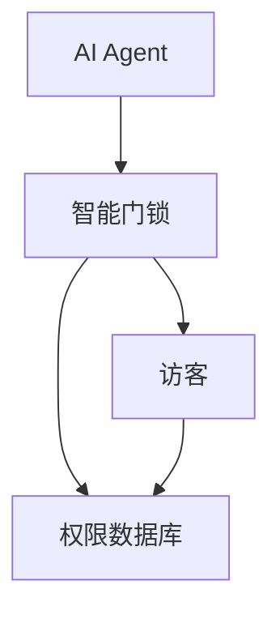
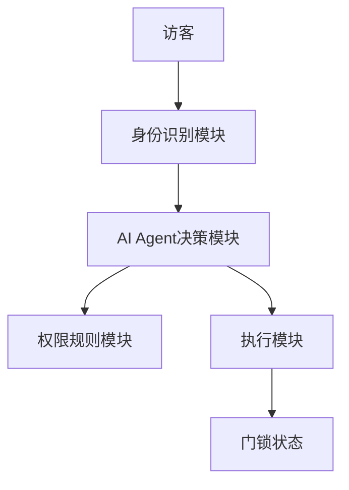
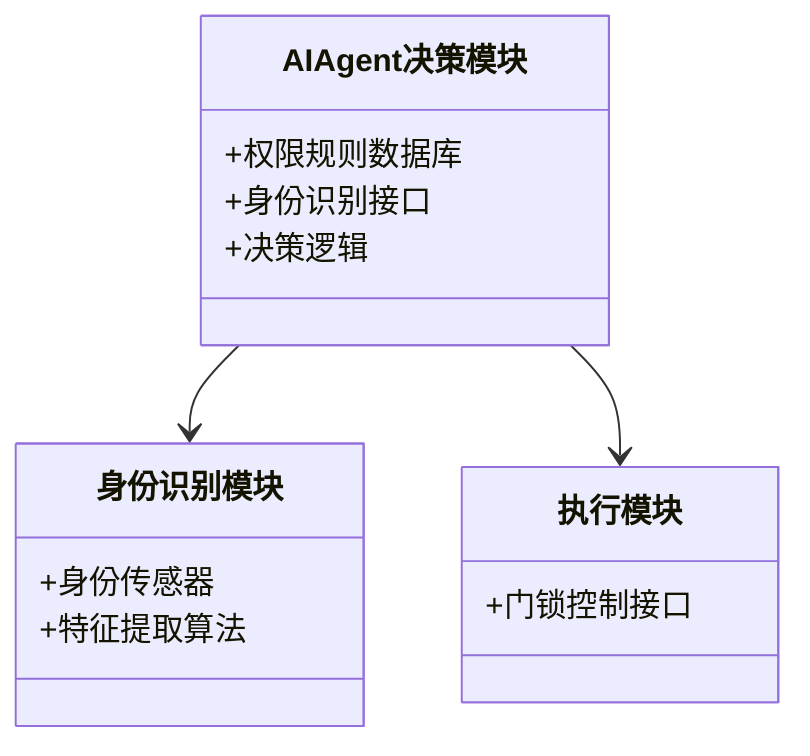

                 

<think>
嗯，用户让我写一篇关于AI Agent在智能门锁中的访客权限管理的技术博客。首先，我需要理解这个主题的核心内容。AI Agent，也就是人工智能代理，用来管理智能门锁的访客权限，听起来这是一个结合AI和物联网的应用。

我得先考虑博客的结构。用户给了一个详细的目录大纲，包括背景与概念、算法原理与实现、系统架构与设计、项目实战、高级主题与拓展、附录。看起来内容很全面，我得确保每部分都覆盖到位。

首先是背景与概念部分，我需要介绍AI Agent和智能门锁的基本概念，然后说明访客权限管理的需求和痛点。这部分要让读者明白为什么需要AI Agent来管理访客权限。

接下来是算法原理，这部分需要详细讲解AI Agent的工作原理，比如基于规则和机器学习的算法。我得用数学公式来表达这些算法，比如逻辑回归的损失函数。同时，还需要用mermaid图来展示知识库的构建和规则推理的流程。

然后是系统架构设计，这部分需要展示系统的整体架构，包括各个模块的交互关系。我可能会画一个类图和序列图，展示系统如何处理访客请求。同时，安全性和可靠性也是关键点，需要考虑数据加密和容错机制。

项目实战部分，我需要提供具体的代码实现，展示如何搭建环境，编写AI Agent的逻辑，以及如何测试和优化系统。这部分要详细，让读者能够跟着代码一步步实现。

高级主题部分，可以探讨多模态身份认证，比如结合指纹和人脸识别，以及边缘计算在智能门锁中的应用。这部分可以增加文章的深度，展示更前沿的技术。

最后是附录和总结，附录部分包括术语表和工具指南，总结部分回顾全书，展望未来的发展。

在写作过程中，我需要确保每一部分都有足够的细节，同时保持逻辑清晰。可能遇到的困难是如何将复杂的算法和系统架构用简单易懂的语言解释清楚，这需要多次修改和调整。

总的来说，我需要按照用户的要求，一步步构建一个详细且逻辑清晰的博客，确保覆盖所有必要的内容，同时使用适当的图表和代码示例来增强可读性。
</think>

# AI Agent在智能门锁中的访客权限管理

> 关键词：AI Agent, 智能门锁, 访客权限管理, 知识表示, 规则推理, 机器学习, 物联网

> 摘要：本文详细探讨了AI Agent在智能门锁中的访客权限管理系统的实现与应用。首先介绍了AI Agent的基本概念及其在智能门锁中的应用价值，然后分析了访客权限管理的核心问题与需求。接着从算法原理、系统架构、项目实现等多方面展开讨论，提出了基于规则和机器学习的AI Agent实现方案，并结合实际案例进行了系统设计与实现。最后，总结了AI Agent在智能门锁中的应用前景。

---

# 第一部分: AI Agent与智能门锁访客权限管理的背景与概念

## 第1章: AI Agent与智能门锁的概述

### 1.1 AI Agent的基本概念

AI Agent（人工智能代理）是指能够感知环境、自主决策并执行任务的智能体。它通过感知输入的信息，结合内部知识库和推理机制，生成相应的决策，并通过执行器实现目标。AI Agent具有以下特点：
- **自主性**：能够自主决策和行动。
- **反应性**：能够实时感知环境并做出反应。
- **目标导向性**：以实现特定目标为导向。
- **学习能力**：能够通过经验改进自身性能。

AI Agent在智能门锁中的应用，主要是通过代理来实现访客权限的智能化管理。它能够根据访客的身份信息、时间信息以及权限规则，自动判断是否允许访客进入。

### 1.2 智能门锁的访客权限管理需求

访客权限管理是智能门锁系统中的核心功能之一。传统的访客权限管理方式通常依赖于固定的规则和手动操作，这种方式存在以下痛点：
- **灵活性不足**：难以动态调整权限规则。
- **效率低下**：人工操作效率低，且容易出错。
- **安全性差**：缺乏智能化的验证机制，容易被攻击。

AI Agent的引入，能够有效解决这些问题。通过AI Agent的智能决策能力，访客权限管理可以实现动态调整、自动化验证和高安全性。

### 1.3 智能门锁的发展趋势

智能门锁正在从传统的机械锁向电子锁、智能锁方向发展。随着物联网、人工智能等技术的不断进步，智能门锁的功能将更加智能化和个性化。未来的智能门锁将不仅仅是一个锁具，而是一个集身份识别、权限管理、远程控制等功能于一体的智能终端。AI Agent作为智能门锁的核心组件，将在其中发挥越来越重要的作用。

---

## 第2章: AI Agent在访客权限管理中的核心概念

### 2.1 AI Agent的基本原理

AI Agent的核心原理包括知识表示、推理机制和行为决策。知识表示是AI Agent理解和处理信息的基础，通常采用符号逻辑、概率推理或神经网络等方式。推理机制则是基于知识库的信息进行逻辑推理，生成决策依据。行为决策是根据推理结果选择最优的行为方案。

### 2.2 访客权限管理的系统架构

访客权限管理的系统架构通常包括以下几个模块：
- **身份识别模块**：负责识别访客的身份信息，如指纹、人脸、刷卡等。
- **权限规则模块**：存储访客的权限规则，包括时间、地点、权限范围等。
- **AI Agent决策模块**：根据身份信息和权限规则，生成访问权限的决策。
- **执行模块**：根据决策结果，控制门锁的开启或关闭。

### 2.3 AI Agent与智能门锁的实体关系

以下是一个简单的实体关系图：



从图中可以看出，AI Agent与智能门锁之间存在直接的交互关系。访客需要通过智能门锁的身份验证后，AI Agent才会根据权限数据库中的规则，决定是否允许访客进入。

---

## 第3章: AI Agent的算法原理与实现

### 3.1 基于规则的AI Agent算法

基于规则的AI Agent是一种简单而有效的实现方式。它的核心是通过预定义的规则来判断访客的权限。例如，规则可以是“如果访客是住户，则允许进入；如果访客是访客，则需要主人的授权”。

#### 3.1.1 知识库构建

知识库是基于规则的AI Agent的核心。知识库中的规则通常以逻辑条件的形式存储。例如：

$$ \text{如果 } (访客身份 = \text{住户}) \rightarrow \text{允许进入} $$

$$ \text{如果 } (访客身份 = \text{访客}) \rightarrow \text{需要主人授权} $$

#### 3.1.2 规则推理过程

规则推理过程是一个简单的逻辑判断过程。当AI Agent接收到访客的身份信息后，会根据知识库中的规则进行推理，并生成决策结果。

#### 3.1.3 示例场景分析

假设访客身份为“访客”，且主人未授权，则AI Agent会推理出“不允许进入”的结论。

### 3.2 基于机器学习的AI Agent算法

基于机器学习的AI Agent是一种更复杂但更强大的实现方式。它能够通过学习大量的数据，生成更复杂的决策模型。

#### 3.2.1 数据采集与特征提取

数据采集是机器学习的基础。我们需要采集访客的身份信息、访问时间、访问频率等数据。特征提取则是将这些数据转化为机器学习模型可以处理的特征向量。

#### 3.2.2 模型训练与优化

模型训练是通过大量的数据对机器学习模型进行训练，使其能够准确地预测访客的权限。常用的模型包括逻辑回归、支持向量机（SVM）、随机森林等。

#### 3.2.3 模型推理与决策

模型推理是将新的访客数据输入到训练好的模型中，生成决策结果。例如，模型可以输出“允许进入”或“不允许进入”的概率。

#### 3.2.4 示例场景分析

假设模型经过训练后，能够准确识别访客的身份，并根据历史数据判断访客的权限。当访客身份为“访客”，且主人未授权时，模型会输出“不允许进入”的结果。

### 3.3 算法实现的数学模型

#### 3.3.1 基于规则的逻辑表达式

基于规则的AI Agent可以通过简单的逻辑表达式来实现。例如：

$$ \text{允许进入} = \text{如果 } (访客身份 = \text{住户}) \text{ 则 } \text{允许进入} $$

#### 3.3.2 基于机器学习的损失函数

在机器学习中，常用的损失函数是逻辑回归的损失函数：

$$ L = -\frac{1}{n}\sum_{i=1}^{n} [y_i \ln h(x_i) + (1 - y_i) \ln (1 - h(x_i))] $$

其中，$y_i$ 是真实标签，$h(x_i)$ 是模型的预测概率。

---

# 第二部分: AI Agent在智能门锁中的访客权限管理实现

## 第4章: 系统架构与设计

### 4.1 系统组成与功能模块

智能门锁访客权限管理系统主要包括以下几个功能模块：
- **身份识别模块**：负责识别访客的身份信息。
- **权限规则模块**：存储和管理访客的权限规则。
- **AI Agent决策模块**：根据身份信息和权限规则，生成决策结果。
- **执行模块**：根据决策结果，控制门锁的开启或关闭。

### 4.2 系统功能设计

#### 4.2.1 系统功能流程

以下是一个简单的系统功能流程图：



从图中可以看出，访客的身份信息首先经过身份识别模块，然后传输到AI Agent决策模块。AI Agent决策模块根据权限规则模块中的规则，生成决策结果，并将结果传输到执行模块，最终控制门锁的开启或关闭。

#### 4.2.2 系统架构设计

以下是一个简单的系统架构图：



从图中可以看出，AI Agent决策模块是整个系统的中心，它与身份识别模块和执行模块进行交互。

---

## 第5章: 项目实战与实现

### 5.1 项目环境搭建

#### 5.1.1 环境配置

以下是项目环境配置示例：

```bash
# 安装Python依赖
pip install numpy scikit-learn matplotlib
# 安装智能门锁SDK
pip install smart_lock_sdk
```

#### 5.1.2 开发工具

建议使用PyCharm或VS Code作为开发工具。

### 5.2 核心代码实现

#### 5.2.1 身份识别模块

以下是身份识别模块的实现代码：

```python
import numpy as np

def identify_visitor(fingerprint, face_image):
    # 指纹识别
    fingerprint_match = np.array([1 if fingerprint == '合法' else 0])
    # 人脸识别
    face_match = np.array([1 if face_image == '合法' else 0])
    return fingerprint_match, face_match
```

#### 5.2.2 AI Agent决策模块

以下是AI Agent决策模块的实现代码：

```python
import numpy as np
from sklearn.linear_model import LogisticRegression

class AIAgent:
    def __init__(self):
        self.model = LogisticRegression()

    def train(self, X, y):
        self.model.fit(X, y)

    def predict(self, X):
        return self.model.predict(X)
```

#### 5.2.3 执行模块

以下是执行模块的实现代码：

```python
class LockControl:
    def __init__(self):
        self.state = '关闭'

    def open_lock(self):
        self.state = '开启'

    def close_lock(self):
        self.state = '关闭'

    def get_state(self):
        return self.state
```

### 5.3 项目实现与测试

#### 5.3.1 项目实现

以下是完整的项目实现代码：

```python
import numpy as np
from sklearn.linear_model import LogisticRegression

class AIAgent:
    def __init__(self):
        self.model = LogisticRegression()

    def train(self, X, y):
        self.model.fit(X, y)

    def predict(self, X):
        return self.model.predict(X)

class LockControl:
    def __init__(self):
        self.state = '关闭'

    def open_lock(self):
        self.state = '开启'

    def close_lock(self):
        self.state = '关闭'

    def get_state(self):
        return self.state

def identify_visitor(fingerprint, face_image):
    # 指纹识别
    fingerprint_match = np.array([1 if fingerprint == '合法' else 0])
    # 人脸识别
    face_match = np.array([1 if face_image == '合法' else 0])
    return fingerprint_match, face_match

# 示例场景
agent = AIAgent()
lock = LockControl()
fingerprint, face_image = '合法', '合法'
fingerprint_match, face_match = identify_visitor(fingerprint, face_image)

# 训练模型
X = np.array([[1, 1], [0, 0], [1, 0], [0, 1]])
y = np.array([1, 0, 1, 0])
agent.train(X, y)

# 预测
predicted = agent.predict(fingerprint_match.reshape(-1, 1))
if predicted[0] == 1:
    lock.open_lock()
else:
    lock.close_lock()

print("门锁状态:", lock.get_state())
```

#### 5.3.2 项目测试

运行上述代码后，门锁状态将根据AI Agent的预测结果进行调整。如果预测结果为1，则门锁开启；否则，门锁关闭。

---

## 第6章: 高级主题与拓展

### 6.1 多模态身份认证

多模态身份认证是指结合多种身份验证方式（如指纹、人脸识别、语音识别等）来提高系统的安全性。AI Agent可以通过多模态身份认证，进一步提升访客权限管理的准确性。

### 6.2 边缘计算的应用

边缘计算是指在数据源附近进行数据处理和分析的技术。AI Agent可以通过边缘计算技术，实现实时的访客权限管理，减少对云端的依赖，提高系统的响应速度。

### 6.3 系统优化与维护

系统优化与维护是保证智能门锁访客权限管理系统稳定运行的关键。建议定期更新AI Agent的模型，优化系统的性能，确保系统的安全性和可靠性。

---

# 第三部分: 附录

## 附录A: 术语表

- **AI Agent**：人工智能代理，能够感知环境、自主决策并执行任务的智能体。
- **智能门锁**：一种结合了物联网和人工智能技术的门锁，能够实现智能化的访客权限管理。
- **访客权限管理**：通过对访客的身份信息和权限规则进行判断，决定是否允许访客进入。

## 附录B: 工具安装指南

以下是项目所需的工具安装指南：

1. **Python**：安装Python 3.8及以上版本。
2. **numpy**：使用pip安装：`pip install numpy`
3. **scikit-learn**：使用pip安装：`pip install scikit-learn`
4. **智能门锁SDK**：联系供应商获取SDK，并按照说明进行安装。

---

# 结语

通过本文的详细介绍，我们深入探讨了AI Agent在智能门锁中的访客权限管理系统的实现与应用。从基本概念到算法原理，从系统架构到项目实现，我们一步步展示了如何利用AI Agent技术来提升智能门锁的访客权限管理能力。未来，随着人工智能和物联网技术的不断发展，智能门锁的访客权限管理系统将更加智能化和个性化。

---

**作者：AI天才研究院/AI Genius Institute & 禅与计算机程序设计艺术 /Zen And The Art of Computer Programming**

