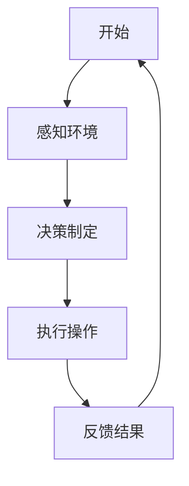
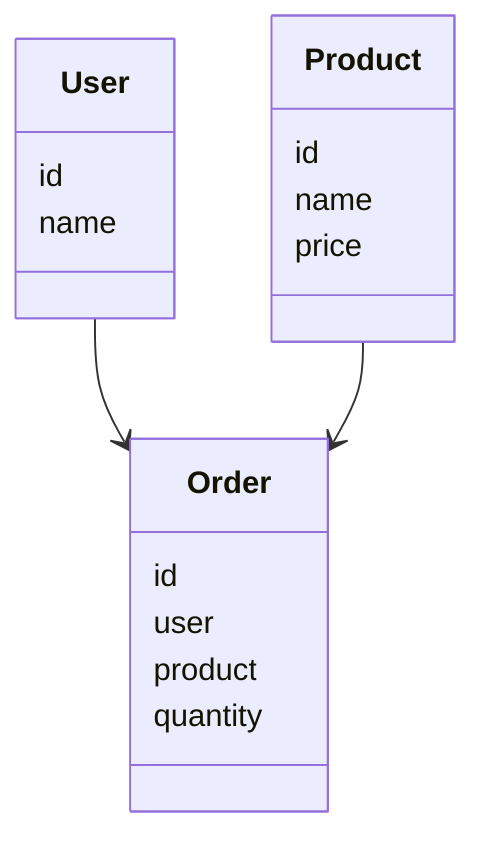
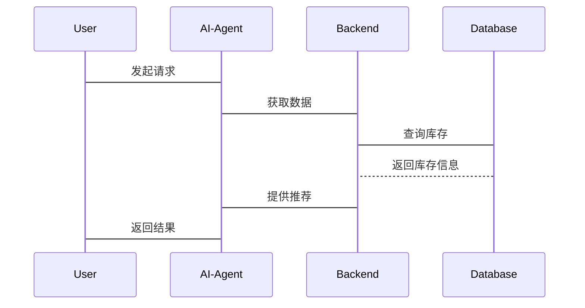

                 


# AI Agent在智能零售中的应用实践

## 关键词
AI Agent, 智能零售, 算法原理, 数学模型, 系统架构, 项目实战

## 摘要
本文系统地探讨了AI Agent在智能零售中的应用，从概念、算法、数学模型到系统架构和项目实战，详细分析了AI Agent如何提升零售业的客户体验和运营效率。文章结合理论与实践，为读者提供了全面的指导。

---

# 第一部分: AI Agent在智能零售中的应用背景

## 第1章: AI Agent与智能零售概述

### 1.1 AI Agent的基本概念
#### 1.1.1 AI Agent的定义与特点
AI Agent是一种智能体，能够感知环境、自主决策并执行任务。其特点包括自主性、反应性、目标导向和学习能力。

#### 1.1.2 AI Agent的核心功能与优势
- **感知环境**：通过传感器或数据输入获取信息。
- **决策制定**：基于数据进行分析和判断。
- **执行任务**：通过执行机构或软件接口完成操作。

#### 1.1.3 AI Agent在零售中的潜力
AI Agent可以优化库存管理、提升客户体验和提高销售效率。

### 1.2 智能零售的定义与发展趋势
#### 1.2.1 智能零售的定义
智能零售是通过人工智能、大数据等技术实现零售过程的智能化。

#### 1.2.2 智能零售的核心特征
- 数据驱动
- 智能决策
- 个性化服务

#### 1.2.3 智能零售的发展趋势
随着技术进步，智能零售将更加普及，AI Agent的作用也将越来越重要。

### 1.3 AI Agent在智能零售中的作用
#### 1.3.1 提升客户体验
通过个性化推荐和实时互动提升客户满意度。

#### 1.3.2 优化运营效率
AI Agent可以自动处理订单、库存管理和物流协调。

#### 1.3.3 数据驱动的决策支持
通过分析销售数据和客户行为，提供精准的决策支持。

### 1.4 本章小结
AI Agent在智能零售中扮演着重要角色，能够显著提升效率和客户体验。

---

# 第二部分: AI Agent的核心概念与技术原理

## 第2章: AI Agent的核心概念与体系结构

### 2.1 AI Agent的核心概念
#### 2.1.1 感知模块
AI Agent通过感知模块获取环境信息，如客户行为和库存数据。

#### 2.1.2 决策模块
基于感知信息，决策模块制定最优策略。

#### 2.1.3 执行模块
通过执行模块将决策转化为具体行动。

### 2.2 AI Agent的体系结构
#### 2.2.1 分层架构
分层架构将系统分为感知层、决策层和执行层。

#### 2.2.2 集成架构
集成架构将不同模块无缝结合，形成统一的系统。

#### 2.2.3 模块化架构
模块化架构便于系统扩展和维护。

### 2.3 AI Agent的属性特征对比
| 属性   | 传统零售 | AI Agent |
|--------|----------|-----------|
| 决策方式 | 人工决策 | 自主决策   |
| 反应速度 | 较慢     | 实时反应   |
| 数据处理 | 简单     | 大数据处理 |

### 2.4 AI Agent的ER实体关系图
```mermaid
erd
actor: 用户
agent: AI Agent
inventory: 库存
order: 订单
product: 商品
location: 位置
actor --> agent: 与AI Agent互动
agent --> inventory: 监控库存
agent --> order: 处理订单
agent --> product: 推荐商品
agent --> location: 管理位置信息
```

### 2.5 本章小结
AI Agent的核心概念和体系结构为后续分析奠定了基础。

---

# 第三部分: AI Agent的算法原理与数学模型

## 第3章: AI Agent的算法原理

### 3.1 AI Agent的主要算法
#### 3.1.1 强化学习算法
强化学习通过奖励机制优化决策。

#### 3.1.2 监督学习算法
监督学习基于标记数据进行分类和预测。

#### 3.1.3 无监督学习算法
无监督学习发现数据中的潜在模式。

### 3.2 AI Agent算法的流程图


### 3.3 AI Agent算法的Python实现
```python
import numpy as np
class AIAgent:
    def __init__(self):
        self.data = []
    
    def perceive(self, environment):
        self.data = environment.sensors()
    
    def decide(self):
        # 使用强化学习算法
        action = np.argmax(self.data)
        return action
    
    def execute(self, action):
        # 执行操作
        pass
```

### 3.4 本章小结
AI Agent的算法原理是实现智能零售的关键，强化学习是主要应用。

---

## 第4章: AI Agent的数学模型

### 4.1 状态转移矩阵
状态转移矩阵描述状态间的变化概率：
$$ P = [p_{ij}] $$

### 4.2 损失函数
损失函数衡量预测值与真实值的差异：
$$ L = \frac{1}{n}\sum_{i=1}^{n} (y_i - \hat{y}_i)^2 $$

### 4.3 激励机制
激励机制通过奖励推动决策优化：
$$ R = \sum \alpha r_t $$

### 4.4 本章小结
数学模型为AI Agent的算法提供了理论支持。

---

# 第四部分: 系统分析与架构设计

## 第5章: 系统分析与架构设计

### 5.1 问题场景介绍
智能零售系统需要处理客户互动、库存管理和订单处理。

### 5.2 系统功能设计
#### 5.2.1 领域模型类图


### 5.3 系统架构设计


### 5.4 系统接口设计
- API接口：用户请求处理
- 数据接口：库存和订单管理

### 5.5 系统交互序列图


### 5.6 本章小结
系统架构设计为智能零售提供了技术实现的基础。

---

## 第五部分: 项目实战

## 第6章: 项目实战

### 6.1 环境安装
安装必要的库：
```bash
pip install numpy scikit-learn matplotlib
```

### 6.2 核心实现
```python
from sklearn import tree
import numpy as np

class AIAssistant:
    def __init__(self):
        selfclf = tree.DecisionTreeClassifier()
    
    def train(self, X, y):
        selfclf.fit(X, y)
    
    def predict(self, X_new):
        return selfclf.predict(X_new)
```

### 6.3 案例分析
案例分析展示了AI Agent如何优化库存管理和客户推荐。

### 6.4 项目小结
项目实战验证了AI Agent在智能零售中的实际应用。

---

## 第六部分: 总结与展望

### 7.1 总结
AI Agent在智能零售中的应用前景广阔，能够显著提升效率和客户体验。

### 7.2 展望
未来，AI Agent将更加智能化，应用范围也将进一步扩大。

---

## 作者
作者：AI天才研究院  
地址：https://github.com/ai天才研究院

