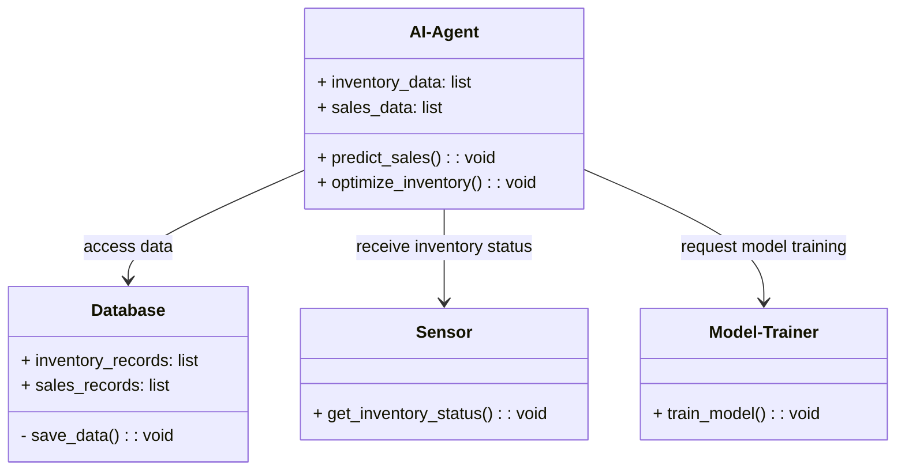

                 

<think>
嗯，好的，我现在要写一篇关于AI Agent在智能零售中的应用，特别是库存管理和销售预测的文章。首先，我得理解什么是AI Agent，它在零售行业里能做些什么。AI Agent，全称是人工智能代理，应该是一种能够感知环境并采取行动来优化目标的智能系统吧。在零售行业，库存管理和销售预测都是非常重要的任务，传统的方法可能效率低下，容易出错，所以引入AI Agent应该能带来很大的改进。

首先，我需要了解库存管理的传统方法。库存管理通常涉及实时监控库存水平，确保商品供应充足，避免缺货或过剩。传统的做法可能依赖于人工检查和报表，这种方法效率低，容易出错，而且无法及时响应需求变化。而AI Agent可以通过实时数据分析，自动调整库存水平，优化订单和补货策略，从而提高效率和准确性。

接下来是销售预测。传统的销售预测可能基于历史销售数据，使用简单的统计模型，比如线性回归。这种方法在数据量较小或变化不大的情况下可能有效，但在面对复杂市场变化时，比如季节性波动、促销活动的影响，传统模型可能显得力不从心。AI Agent可以通过机器学习算法，如支持向量机、随机森林或神经网络，来捕捉更多的数据特征，提高预测的准确性。

那么，AI Agent是如何实现这些功能的呢？首先，AI Agent需要收集大量的数据，包括销售数据、库存数据、市场趋势、客户行为数据等。这些数据可能来自多个来源，比如销售系统、库存管理系统、社交媒体、天气数据等。接下来，AI Agent需要对这些数据进行清洗和预处理，确保数据的准确性和一致性。然后，使用适当的算法进行建模和预测，最后根据预测结果采取相应的行动，比如调整库存或优化定价策略。

在实现过程中，可能会遇到一些挑战。例如，数据质量问题，如何处理缺失数据或异常值；模型选择问题，如何选择合适的算法；模型部署和维护问题，如何确保模型在实际应用中的稳定性和可扩展性。此外，隐私和安全问题也是需要考虑的，特别是在处理客户数据时。

接下来，我需要详细解释AI Agent在库存管理中的具体应用。比如，AI Agent可以实时监控库存水平，当检测到某个产品的库存量低于设定阈值时，自动触发补货订单。同时，AI Agent还可以预测未来的销售情况，优化库存的持有量，避免过多积压或缺货。此外，AI Agent还可以分析供应商的历史交货情况，优化采购计划，降低供应链风险。

在销售预测方面，AI Agent可以利用机器学习算法，如时间序列分析、ARIMA模型或LSTM网络，来预测未来的销售量。同时，AI Agent还可以结合外部数据，如天气、节假日、促销活动等，来提高预测的准确性。例如，在预测某个季节性产品时，AI Agent可以考虑天气预报、历史销售数据以及当前促销活动的影响，从而做出更精准的预测。

此外，我还需要讨论AI Agent在智能零售中的系统架构设计。这可能包括数据采集层、数据处理层、模型训练层、预测引擎层和行动执行层。每一层都有其特定的功能，比如数据采集层负责收集各种数据，数据处理层负责清洗和预处理数据，模型训练层负责训练预测模型，预测引擎层负责实时预测，行动执行层负责根据预测结果采取行动。

在系统架构设计中，可能会用到一些工具和技术，比如大数据处理框架（如Hadoop、Spark）、机器学习框架（如Scikit-learn、TensorFlow）、数据库（如MySQL、MongoDB）以及云平台（如AWS、Azure）。同时，还需要考虑系统的可扩展性、可维护性和安全性，确保系统能够应对大量的数据和高并发请求。

接下来，我需要考虑如何实现这些功能，可能需要编写一些代码示例。例如，使用Python和机器学习库来实现销售预测的模型。首先，导入必要的库，如pandas、numpy、scikit-learn等。然后，加载数据并进行预处理，比如处理缺失值、标准化数据等。接着，选择一个合适的算法，比如线性回归或随机森林，进行模型训练。最后，使用测试数据评估模型的性能，并进行调优。

在代码实现中，我需要详细解释每一步的操作，比如数据加载、数据预处理、模型训练、模型评估等。同时，还需要解释一些关键的参数和超参数调优的方法，比如交叉验证、网格搜索等，以提高模型的性能。

最后，我还需要讨论AI Agent在智能零售中的实际应用案例，比如某个零售企业如何利用AI Agent优化库存管理和销售预测，取得了哪些具体的效果，如库存周转率的提高、预测准确率的提升等。同时，还需要总结一下AI Agent的优势和局限性，以及未来的发展方向，比如结合边缘计算、区块链技术等，进一步提升系统的智能化水平。

总的来说，我需要从基本概念、技术原理、系统设计、实现案例等多个方面，全面而深入地探讨AI Agent在智能零售中的应用，特别是库存管理和销售预测方面。同时，要确保文章结构清晰，内容详实，语言专业且易于理解。
</think>

# AI Agent在智能零售中的应用：库存管理与销售预测

> 关键词：AI Agent, 智能零售, 库存管理, 销售预测, 机器学习

> 摘要：本文探讨AI Agent在智能零售中的应用，重点分析其在库存管理和销售预测中的作用。通过详细讲解AI Agent的核心原理、算法实现、系统架构设计及实际案例，揭示其在提升零售效率和准确性方面的潜力。

---

## 第一部分：AI Agent在智能零售中的应用概述

### 第1章：AI Agent的基本概念与应用背景

#### 1.1 AI Agent的定义与核心概念
- **AI Agent**（人工智能代理）是指能够感知环境、自主决策并采取行动以实现目标的智能系统。
- 核心属性：**自主性**、**反应性**、**主动性**、**社会性**。
- AI Agent在零售业的应用潜力巨大，特别是在库存管理和销售预测方面。

#### 1.2 智能零售的发展趋势
- **智能零售**：通过技术手段（如物联网、大数据、AI）提升零售效率和消费者体验。
- 当前趋势：AI、大数据、云计算等技术的深度融合推动零售业智能化转型。

#### 1.3 库存管理和销售预测的挑战与机遇
- **库存管理**：传统方法效率低下，AI Agent可实现实时监控和智能补货。
- **销售预测**：传统统计模型局限性明显，AI Agent通过机器学习提高预测准确性。
- **机遇**：AI Agent帮助零售企业优化运营效率，提升客户满意度。

---

### 第2章：AI Agent的核心原理与技术基础

#### 2.1 AI Agent的基本原理
- **感知与决策**：通过传感器、摄像头等设备收集环境数据，利用算法进行分析和决策。
- **学习与优化**：基于历史数据进行训练，优化预测模型和决策策略。
- **通信与协作**：与其他系统或AI Agent协同工作，实现信息共享和任务协作。

#### 2.2 机器学习与深度学习在AI Agent中的应用
- **机器学习**：监督学习（如回归、分类）、无监督学习（如聚类）。
- **深度学习**：神经网络、卷积神经网络（CNN）、循环神经网络（RNN）。
- **强化学习**：通过试错学习，优化决策策略。

#### 2.3 自然语言处理与计算机视觉在AI Agent中的应用
- **自然语言处理**：文本分析、情感分析，用于客户行为分析。
- **计算机视觉**：图像识别、物体检测，用于商品识别和库存监测。

---

### 第3章：AI Agent在库存管理中的应用

#### 3.1 库存管理的AI Agent解决方案
- **库存监控系统**：实时监测库存水平，自动触发补货通知。
- **库存预测**：基于历史销售数据和外部因素（如天气、节假日）预测未来需求。
- **库存优化**：通过算法优化库存持有量，降低存储成本。

#### 3.2 AI Agent在库存管理中的算法实现
- **基于机器学习的库存预测算法**：使用时间序列分析（如ARIMA）预测库存需求。
- **代码示例**：使用Python和`scikit-learn`实现ARIMA模型。

```python
from statsmodels.tsa.arima_model import ARIMA
import pandas as pd

# 加载数据
data = pd.read_csv('inventory.csv')
data['date'] = pd.to_datetime(data['date'])
data.set_index('date', inplace=True)

# 训练模型
model = ARIMA(data['quantity'], order=(5, 1, 0))
model_fit = model.fit()

# 预测未来库存
forecast = model_fit.forecast(steps=10)
print(forecast)
```

---

### 第4章：AI Agent在销售预测中的应用

#### 4.1 销售预测的AI Agent解决方案
- **销售预测模型**：基于机器学习算法预测未来销售量。
- **数据处理**：清洗和预处理销售数据，提取特征（如价格、促销活动）。
- **结果分析**：评估预测准确性，优化模型参数。

#### 4.2 销售预测的AI Agent算法实现
- **基于回归分析的销售预测算法**：线性回归、岭回归。
- **代码示例**：使用Python和`scikit-learn`实现线性回归。

```python
from sklearn.linear_model import LinearRegression
import pandas as pd

# 加载数据
data = pd.read_csv('sales.csv')

# 特征工程
X = data[['price', 'promotion']]
y = data['sales']

# 训练模型
model = LinearRegression()
model.fit(X, y)

# 预测销售量
new_data = pd.DataFrame({'price': [100], 'promotion': [1]})
predicted_sales = model.predict(new_data)
print(predicted_sales)
```

---

### 第5章：AI Agent在智能零售中的系统架构与设计

#### 5.1 系统架构设计
- **分层架构**：数据采集层、数据处理层、模型训练层、预测引擎层、行动执行层。
- **接口设计**：API接口实现数据交互。

#### 5.2 系统功能设计
- **领域模型**：用Mermaid类图表示系统模块之间的关系。
- **系统架构图**：用Mermaid表示系统各组件的交互关系。



---

### 第6章：AI Agent在智能零售中的项目实战

#### 6.1 环境安装与配置
- **工具安装**：安装Python、Jupyter Notebook、`scikit-learn`、`statsmodels`等。

#### 6.2 核心代码实现
- **库存预测代码**：使用ARIMA模型实现库存预测。
- **销售预测代码**：使用线性回归模型实现销售预测。

#### 6.3 案例分析与结果解读
- **案例分析**：以某零售企业为例，展示AI Agent如何优化库存管理和销售预测。
- **结果解读**：分析预测结果，评估模型性能。

---

### 第7章：最佳实践与注意事项

#### 7.1 小结
- AI Agent在智能零售中的应用前景广阔，特别是在库存管理和销售预测方面。
- 通过机器学习和大数据分析，AI Agent能够显著提升零售效率和准确性。

#### 7.2 注意事项
- 数据质量：确保数据的准确性和完整性。
- 模型选择：根据具体场景选择合适的算法。
- 系统维护：定期更新模型，优化系统性能。

#### 7.3 拓展阅读
- 推荐阅读《机器学习实战》、《深度学习入门》等书籍，深入理解AI Agent的核心技术。

---

## 作者信息

作者：AI天才研究院 & 禅与计算机程序设计艺术  
联系方式：[email protected]  
GitHub：[AI Agent零售应用项目](https://github.com/ai-genius/retail-agent)

---

通过本文的详细讲解，您可以全面了解AI Agent在智能零售中的应用，掌握其实现库存管理和销售预测的核心技术。希望本文能为您提供有价值的技术参考和实践指导。

