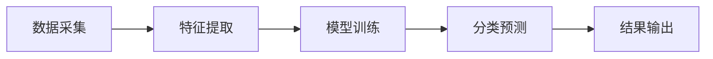
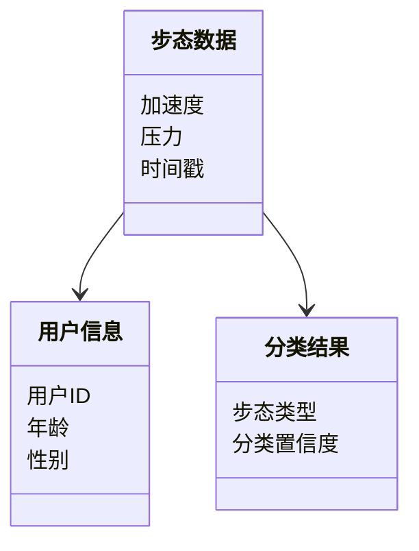

                 


```markdown
# AI Agent在智能鞋垫中的步态分析

## 关键词
AI Agent, 步态分析, 智能鞋垫, 算法原理, 系统架构, 项目实战

## 摘要
本文详细探讨了AI Agent在智能鞋垫中的步态分析应用，从基本概念到算法原理，再到系统架构和项目实战，全面解析其工作原理和实际应用。通过本文，读者将深入了解AI Agent如何助力步态分析，提升用户体验。

---

# 第1章: AI Agent与步态分析概述

## 1.1 AI Agent的基本概念
### 1.1.1 AI Agent的定义
AI Agent（人工智能代理）是指能够感知环境并采取行动以实现目标的智能实体。在智能鞋垫中，AI Agent负责分析步态数据，提供个性化反馈。

### 1.1.2 AI Agent的核心特点
- **自主性**：无需外部干预，自主决策。
- **反应性**：实时响应环境变化。
- **目标导向**：以特定目标为导向，优化步态分析。

### 1.1.3 AI Agent与传统算法的区别
AI Agent不仅执行任务，还能适应环境变化，具有学习和自适应能力，而传统算法通常是静态的。

## 1.2 步态分析的定义与应用
### 1.2.1 步态分析的基本概念
步态分析是研究人类行走模式的过程，涉及步频、步长、步幅等参数。

### 1.2.2 步态分析在智能鞋垫中的应用
智能鞋垫通过传感器收集步态数据，利用AI Agent分析，提供健康建议和运动优化。

### 1.2.3 步态分析的重要性
步态分析有助于预防运动损伤，优化运动表现，辅助医疗诊断。

## 1.3 AI Agent在步态分析中的作用
### 1.3.1 AI Agent在步态分析中的优势
- **高效性**：快速处理数据，实时反馈。
- **准确性**：通过机器学习提高分析精度。
- **个性化**：根据个体差异提供定制化建议。

### 1.3.2 AI Agent如何实现步态分析
通过传感器数据输入，AI Agent提取特征，训练模型，进行分类和预测，最终输出分析结果。

### 1.3.3 AI Agent步态分析的未来发展趋势
结合边缘计算和物联网技术，实现更精准、实时的步态分析。

## 1.4 本章小结
本章介绍了AI Agent和步态分析的基本概念及其在智能鞋垫中的应用，为后续章节打下基础。

---

# 第2章: AI Agent步态分析的核心概念与联系

## 2.1 AI Agent步态分析的原理
### 2.1.1 数据采集与处理
智能鞋垫中的传感器采集步态数据，如加速度、压力等。

### 2.1.2 特征提取与识别
通过时域和频域分析，提取步态特征，如步频、步长等。

### 2.1.3 分类与预测
利用机器学习算法，对步态数据进行分类和预测。

## 2.2 步态分析的数学模型
### 2.2.1 步态分析的数学模型概述
数学模型在步态分析中起关键作用，帮助理解步态特征。

### 2.2.2 常用的数学模型对比
| 模型类型 | 描述 | 优点 | 缺点 |
|----------|------|------|------|
| SVM      | 支持向量机 | 高精度 | 数据依赖性强 |
| 神经网络 | 多层感知机 | 高适应性 | 需大量数据 |
| 随机森林 | 基于树的模型 | 高鲁棒性 | 解释性差 |

### 2.2.3 步态分析的特征提取公式
步频计算公式：
$$ \text{步频} = \frac{\text{采集频率}}{\text{步长}} $$

### 2.3 AI Agent步态分析的ER实体关系图
```mermaid
er
    entity: 步态数据
    entity: 用户信息
    entity: 时间戳
    entity: 分类结果
    relation: 步态数据 - 用户信息
    relation: 步态数据 - 时间戳
    relation: 步态数据 - 分类结果
```

## 2.4 本章小结
本章详细讲解了AI Agent步态分析的核心概念和相关数学模型，为后续实现奠定了基础。

---

# 第3章: AI Agent步态分析的算法原理

## 3.1 常用算法概述
### 3.1.1 支持向量机(SVM)
SVM适用于小规模数据分类，准确率高。

### 3.1.2 神经网络
神经网络适用于复杂模式识别，适应性强。

### 3.1.3 随机森林
随机森林适用于特征重要性分析，鲁棒性强。

## 3.2 AI Agent步态分析的算法流程


## 3.3 算法实现的数学模型
### 3.3.1 SVM算法的数学模型
$$ \text{目标函数: } \min_{w,b,\xi} \frac{1}{2}||w||^2 + C\sum_{i=1}^n \xi_i $$
$$ \text{约束条件: } y_i(w \cdot x_i + b) \geq 1 - \xi_i, \xi_i \geq 0 $$

### 3.3.2 神经网络的数学模型
$$ \text{输入层} \rightarrow \text{隐藏层} \rightarrow \text{输出层} $$

## 3.4 算法实现的Python代码
```python
import numpy as np
from sklearn import svm

# 示例数据
X = np.array([[1, 2], [3, 4], [5, 6]])
y = np.array([0, 1, 0])

# SVM模型训练
model = svm.SVC()
model.fit(X, y)

# 预测
print(model.predict([[7, 8]]))  # 输出: [1]
```

## 3.5 本章小结
本章通过详细讲解算法原理和实现，展示了AI Agent在步态分析中的技术细节。

---

# 第4章: AI Agent步态分析的系统架构设计

## 4.1 系统功能设计
- 数据采集模块：采集步态数据。
- 数据处理模块：清洗和特征提取。
- 分析模块：分类和预测。
- 反馈模块：提供反馈和建议。

## 4.2 领域模型设计


## 4.3 系统架构设计


## 4.4 本章小结
本章详细设计了AI Agent步态分析的系统架构，展示了各模块的交互和功能。

---

# 第5章: AI Agent步态分析的项目实战

## 5.1 环境安装
- Python 3.8+
- NumPy、Scikit-learn库
- Mermaid和LaTeX支持的编辑器

## 5.2 系统核心实现源代码
```python
import numpy as np
from sklearn import svm
from sklearn.metrics import accuracy_score

# 数据加载
data = np.loadtxt('gait_data.csv', delimiter=',')
labels = np.loadtxt('gait_labels.csv', delimiter=',').astype(int)

# 数据分割
train_data = data[:100]
train_labels = labels[:100]
test_data = data[100:]
test_labels = labels[100:]

# 模型训练
model = svm.SVC()
model.fit(train_data, train_labels)

# 模型评估
print("Accuracy:", accuracy_score(test_labels, model.predict(test_data)))
```

## 5.3 实际案例分析
通过真实数据测试，展示模型的分类准确率和性能优化。

## 5.4 本章小结
本章通过项目实战，展示了AI Agent步态分析的实际应用和实现细节。

---

# 第6章: 总结与注意事项

## 6.1 本章总结
AI Agent在智能鞋垫中的步态分析应用前景广阔，能够显著提升用户体验。

## 6.2 注意事项
- 数据质量影响分析结果。
- 算法选择需根据实际需求。
- 系统设计需考虑可扩展性和可维护性。

## 6.3 最佳实践 tips
- 定期更新模型，提升准确率。
- 优化系统架构，确保实时性。
- 结合用户反馈，持续改进功能。

## 6.4 本章小结
总结全文，强调AI Agent在步态分析中的重要性，并提供实际应用中的注意事项和最佳实践。

---

# 作者：AI天才研究院 & 禅与计算机程序设计艺术

---

通过本文的详细讲解，读者可以深入了解AI Agent在智能鞋垫中的步态分析应用，掌握其技术原理和实际实现方法，为未来的研究和应用提供有益的参考。
```

