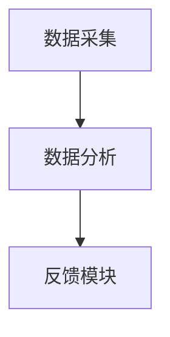

                 


# AI Agent在智能鞋垫中的运动强度分析

> 关键词：AI Agent, 智能鞋垫, 运动强度分析, 算法原理, 系统设计

> 摘要：本文探讨了AI Agent在智能鞋垫中的应用，特别是在运动强度分析方面。通过详细分析AI Agent的核心概念、算法原理、系统设计以及实际项目中的应用，本文为读者提供了从理论到实践的全面指导。

---

# 第1章: AI Agent与运动强度分析的背景介绍

## 1.1 AI Agent的基本概念

### 1.1.1 AI Agent的定义与特点
- **定义**：AI Agent（人工智能代理）是指能够感知环境、执行任务并做出决策的智能实体。
- **特点**：
  - 智能性：能够理解和响应环境中的输入。
  - 自主性：无需外部干预即可执行任务。
  - 反应性：能够实时感知并调整行为。
  - 学习能力：通过数据和经验优化决策过程。

### 1.1.2 AI Agent在智能鞋垫中的应用场景
- AI Agent可以实时分析用户的运动数据，如步频、步幅、加速度等，提供个性化的运动强度建议。

## 1.2 运动强度分析的背景与意义

### 1.2.1 运动强度的基本概念
- 运动强度通常指运动过程中身体所承受的负荷，包括心率、能量消耗等指标。

### 1.2.2 AI Agent在运动强度分析中的作用
- AI Agent可以通过机器学习算法分析用户的运动数据，实时调整运动计划，避免过度训练或不足。

### 1.2.3 智能鞋垫的运动强度分析需求
- 智能鞋垫需要实时采集用户的运动数据，并通过AI Agent进行分析，为用户提供科学的运动建议。

## 1.3 本章小结
本章介绍了AI Agent的基本概念及其在智能鞋垫中的应用场景，为后续的运动强度分析奠定了基础。

---

# 第2章: AI Agent的核心概念与运动强度分析的关系

## 2.1 AI Agent的核心概念

### 2.1.1 AI Agent的行为模型
- **感知层**：通过传感器采集数据。
- **决策层**：基于数据进行分析和决策。
- **执行层**：根据决策结果执行动作。

### 2.1.2 AI Agent的决策机制
- 基于规则的决策：预定义规则进行判断。
- 基于机器学习的决策：通过训练模型进行预测。

## 2.2 运动强度分析的核心概念

### 2.2.1 数据采集
- 传感器类型：加速度计、陀螺仪、心率传感器等。
- 数据特征：步频、步幅、加速度峰值、能量消耗等。

### 2.2.2 数据分析方法
- 统计分析：均值、标准差等指标。
- 机器学习：分类、回归等算法。

## 2.3 AI Agent与运动强度分析的关联

### 2.3.1 数据流
- 传感器数据 -> 数据预处理 -> AI Agent分析 -> 决策输出。

### 2.3.2 决策优化
- AI Agent通过历史数据优化运动强度分析的准确性。

## 2.4 本章小结
本章详细探讨了AI Agent的核心概念及其在运动强度分析中的应用，强调了数据流和决策优化的重要性。

---

# 第3章: 运动强度分析的数学模型与算法原理

## 3.1 运动强度分析的数学模型

### 3.1.1 基于能量代谢的模型
- **公式**：能量消耗 = m * g * d * k，其中m为质量，g为重力加速度，d为距离，k为能量消耗系数。
- **解释**：该模型用于计算运动过程中的能量消耗，从而评估运动强度。

### 3.1.2 基于机器学习的模型
- **算法**：随机森林、支持向量机等。
- **流程**：数据预处理 -> 特征提取 -> 模型训练 -> 预测。

## 3.2 算法实现

### 3.2.1 数据预处理
- **步骤**：
  1. 采集原始数据。
  2. 去噪处理。
  3. 标准化处理。

### 3.2.2 特征提取
- **方法**：主成分分析（PCA）。

### 3.2.3 模型训练
- **代码示例**：
  ```python
  from sklearn.ensemble import RandomForestClassifier
  model = RandomForestClassifier()
  model.fit(X_train, y_train)
  ```

## 3.3 本章小结
本章通过数学模型和算法原理，详细介绍了运动强度分析的实现过程。

---

# 第4章: AI Agent在智能鞋垫中的系统设计

## 4.1 系统架构设计

### 4.1.1 功能模块划分
- **数据采集模块**：采集用户的运动数据。
- **数据分析模块**：分析数据并输出运动强度建议。
- **反馈模块**：将建议反馈给用户。

### 4.1.2 系统架构图


## 4.2 系统实现

### 4.2.1 数据采集
- 使用加速度计采集用户的运动数据。

### 4.2.2 数据分析
- 使用机器学习算法分析数据，输出运动强度建议。

## 4.3 本章小结
本章通过系统设计，详细介绍了AI Agent在智能鞋垫中的实现过程。

---

# 第5章: 项目实战

## 5.1 环境搭建

### 5.1.1 工具安装
- 安装Python和相关库（如scikit-learn）。

## 5.2 核心代码实现

### 5.2.1 数据预处理
- 代码示例：
  ```python
  import pandas as pd
  data = pd.read_csv('data.csv')
  ```

### 5.2.2 模型训练
- 代码示例：
  ```python
  from sklearn.model_selection import train_test_split
  X_train, X_test, y_train, y_test = train_test_split(X, y, test_size=0.2)
  model.fit(X_train, y_train)
  ```

## 5.3 案例分析
- 分析用户的运动数据，输出运动强度建议。

## 5.4 本章小结
本章通过项目实战，详细展示了AI Agent在智能鞋垫中的具体应用。

---

# 第6章: 总结与展望

## 6.1 总结
- AI Agent在智能鞋垫中的运动强度分析具有重要意义。

## 6.2 展望
- 进一步优化算法，提高分析精度。

## 6.3 最佳实践
- 定期更新模型，保持数据的准确性。

---

# 作者

作者：AI天才研究院/AI Genius Institute & 禅与计算机程序设计艺术 /Zen And The Art of Computer Programming

---

# 结束语

感谢您的阅读，希望本文能为AI Agent在智能鞋垫中的应用提供有价值的参考。

