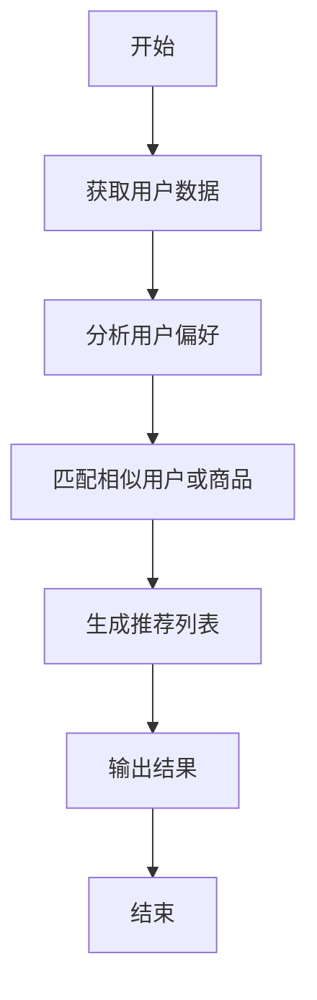
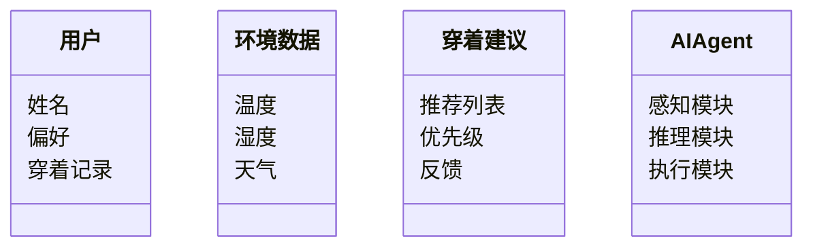
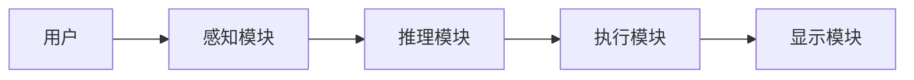
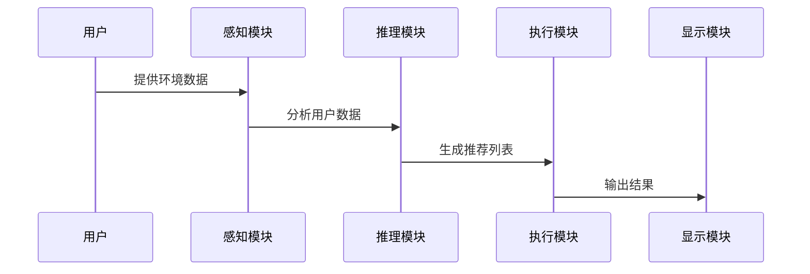

                 

<think>
嗯，好的，我现在需要帮用户撰写一篇关于AI Agent在智能鞋柜中提供穿着建议的技术博客文章。用户已经给出了一个详细的目录结构，包括各个章节和子章节。我需要按照这个结构来展开思考和撰写。

首先，我需要理解整个主题。AI Agent是一个人工智能代理，用于智能鞋柜中，帮助用户做出穿着建议。这意味着我需要探讨如何将AI技术应用到鞋柜中，使其能够根据用户的习惯、天气情况以及衣物的搭配建议来推荐合适的穿着方案。

接下来，我要看看目录结构，确保每一部分都涵盖到。用户已经提供了从背景介绍到项目实战，再到总结的最佳实践的章节。我需要逐章分析，思考每一章应该涵盖的内容。

第一部分是背景与概念。我需要先介绍AI Agent和智能鞋柜的基本概念，说明为什么将两者结合起来是有必要的。这部分可能需要从问题背景开始，描述用户在选择衣物时可能遇到的困难，以及AI Agent如何帮助解决这些问题。

第二部分是核心概念与联系。这里需要详细讲解AI Agent和智能鞋柜的工作原理，并通过对比分析突出它们的区别和联系。可能需要使用ER实体关系图来展示系统中的各个实体及其关系。

第三部分是算法原理。这部分比较关键，我需要选择适合的推荐算法，比如协同过滤、内容推荐等，并通过流程图展示算法的执行步骤。同时，给出具体的Python代码示例，解释如何实现这些算法。数学模型和公式需要用Latex表示，确保准确性和可读性。

第四部分是系统分析与架构设计。这部分需要介绍智能鞋柜系统的场景，设计系统功能，绘制领域模型类图和系统架构图。系统接口设计和交互序列图也需要详细描述，展示系统各部分之间的协作。

第五部分是项目实战。这里需要指导读者如何安装开发环境，编写代码，并通过实际案例展示系统的运行。这部分需要具体的代码示例和详细的分析，帮助读者理解如何实现整个系统。

最后是总结与展望。需要总结项目的主要内容，提出使用中的注意事项，并展望未来的发展方向。同时，推荐一些拓展阅读的资料，供读者进一步学习。

在撰写过程中，我需要确保每一部分都详细且具体，使用吸引人的标题和清晰的结构。同时，语言要专业但不失易懂，确保读者能够一步步理解AI Agent在智能鞋柜中的应用。

现在，我需要开始按照目录结构，逐步撰写每一章的内容，确保涵盖所有关键点，并满足用户的要求。
</think>

# AI Agent在智能鞋柜中的穿着建议

## 关键词：
- AI Agent
- 智能鞋柜
- 穿着建议
- 推荐算法
- 系统架构

## 摘要：
本文探讨了AI Agent在智能鞋柜中的应用，详细分析了其如何通过推荐算法和系统架构为用户提供个性化的穿着建议。文章从背景介绍、核心概念、算法原理到系统架构和项目实战，全面阐述了AI Agent在智能鞋柜中的实现过程和实际应用。

---

# 第一部分: AI Agent与智能鞋柜的背景与概念

## 第1章: AI Agent与智能鞋柜的背景介绍

### 1.1 问题背景与描述
#### 1.1.1 穿着建议的智能化需求
现代生活中，用户每天在选择衣物时面临诸多挑战，如天气变化、个人风格、场合需求等。传统鞋柜无法根据这些因素提供实时建议，导致用户在搭配衣物时效率低下，甚至出现不合理的搭配。

#### 1.1.2 智能鞋柜的应用场景
智能鞋柜通过物联网技术，能够实时感知环境数据（如温度、湿度）和用户行为数据，结合AI技术，为用户提供智能化的衣物存储和推荐服务。

#### 1.1.3 AI Agent在鞋柜中的作用
AI Agent作为智能鞋柜的核心，能够实时分析用户数据和环境数据，生成个性化的穿着建议，帮助用户快速选择合适的衣物。

### 1.2 问题解决与边界
#### 1.2.1 AI Agent如何解决穿着建议问题
AI Agent通过收集用户的历史数据、偏好数据和实时数据，利用机器学习算法生成推荐列表，解决用户在搭配衣物时的困惑。

#### 1.2.2 智能鞋柜的功能边界
智能鞋柜的功能包括衣物存储、环境监测、数据采集和推荐服务，但不涉及衣物的物理操作，如洗涤或折叠。

#### 1.2.3 穿着建议的实现路径
AI Agent通过分析用户数据和环境数据，生成推荐列表，用户根据建议选择衣物，鞋柜则根据推荐结果优化存储结构。

### 1.3 核心概念与结构
#### 1.3.1 AI Agent的核心要素
AI Agent由感知模块、推理模块和执行模块组成，分别负责数据采集、数据分析和结果输出。

#### 1.3.2 智能鞋柜的系统架构
智能鞋柜由硬件部分（传感器、存储模块）和软件部分（数据处理、推荐算法）组成，通过物联网技术实现数据的实时传输和处理。

#### 1.3.3 穿着建议的实现模型
实现模型包括数据采集、数据分析、推荐生成和结果输出四个阶段，每个阶段都有对应的算法和模块支持。

---

## 第2章: AI Agent与智能鞋柜的核心概念与联系

### 2.1 核心概念原理
#### 2.1.1 AI Agent的基本原理
AI Agent通过感知环境、分析数据、推理决策和执行操作，帮助用户完成特定任务。在智能鞋柜中，AI Agent的核心任务是生成穿着建议。

#### 2.1.2 智能鞋柜的功能原理
智能鞋柜通过传感器采集环境数据，通过AI Agent分析用户数据和环境数据，生成推荐列表，并通过显示界面反馈给用户。

#### 2.1.3 穿着建议的实现机制
穿着建议的实现机制包括数据采集、数据分析、推荐生成和结果输出。AI Agent通过协同过滤和内容推荐算法，为用户提供个性化的推荐结果。

### 2.2 核心概念对比分析
#### 2.2.1 AI Agent与传统算法的对比
AI Agent具有动态适应性和自我学习能力，而传统算法则依赖于固定的规则和数据。

#### 2.2.2 智能鞋柜与传统鞋柜的对比
智能鞋柜具有智能化管理和推荐功能，而传统鞋柜仅具备存储功能。

#### 2.2.3 穿着建议系统与传统推荐系统的对比
穿着建议系统结合了环境数据和用户数据，而传统推荐系统主要依赖用户行为数据。

### 2.3 ER实体关系图
```mermaid
er
actor: 用户
agent: AI Agent
system: 智能鞋柜
attribute: 穿着建议
action: 提供建议
```

---

## 第3章: AI Agent在智能鞋柜中的算法原理

### 3.1 算法原理概述
#### 3.1.1 基于协同过滤的推荐算法
协同过滤算法通过分析用户的相似性，推荐与用户偏好相似的衣物。常用的协同过滤算法包括基于用户的协同过滤和基于物品的协同过滤。

#### 3.1.2 基于内容推荐的算法
内容推荐算法通过分析衣物的属性（如颜色、材质、款式）和用户的偏好，生成推荐结果。

#### 3.1.3 混合推荐算法
混合推荐算法结合了协同过滤和内容推荐的优势，通过集成两种算法的结果，提高推荐的准确性和多样性。

### 3.2 算法流程图


### 3.3 算法实现
#### 3.3.1 协同过滤算法的实现
协同过滤算法的实现步骤包括数据预处理、相似度计算、推荐生成和结果输出。通过Python代码实现基于用户的协同过滤算法。

#### 3.3.2 内容推荐算法的实现
内容推荐算法的实现步骤包括数据预处理、特征提取、相似度计算和推荐生成。通过Python代码实现基于物品的内容推荐算法。

#### 3.3.3 混合推荐算法的实现
混合推荐算法的实现步骤包括数据预处理、协同过滤和内容推荐结果的集成、推荐结果的优化和输出。通过Python代码实现混合推荐算法。

---

## 第4章: AI Agent在智能鞋柜中的系统分析与架构设计

### 4.1 系统分析
#### 4.1.1 问题场景介绍
智能鞋柜需要实时感知环境数据和用户数据，结合AI Agent生成穿着建议，并通过显示界面反馈给用户。

#### 4.1.2 项目介绍
本项目旨在通过AI Agent和智能鞋柜的结合，为用户提供个性化的穿着建议，提升用户的穿衣效率和满意度。

### 4.2 系统功能设计
#### 4.2.1 领域模型类图


#### 4.2.2 系统架构图


#### 4.2.3 系统接口设计
系统接口包括数据采集接口、数据处理接口和结果输出接口。通过RESTful API实现系统各部分的交互。

#### 4.2.4 系统交互序列图


---

## 第5章: AI Agent在智能鞋柜中的项目实战

### 5.1 环境安装
#### 5.1.1 开发环境
安装Python、Jupyter Notebook、Scikit-learn和Flask框架。

#### 5.1.2 数据库安装
安装MySQL或MongoDB，用于存储用户数据和环境数据。

### 5.2 系统核心实现源代码
#### 5.2.1 协同过滤算法实现
```python
from sklearn.metrics.pairwise import cosine_similarity

# 数据预处理
def preprocess_data(data):
    pass

# 计算相似度
def compute_similarity(data):
    pass

# 生成推荐列表
def generate_recommendations(user_id, data):
    pass
```

#### 5.2.2 内容推荐算法实现
```python
from sklearn.feature_extraction.text import TfidfVectorizer

# 特征提取
def extract_features(data):
    pass

# 计算相似度
def compute_similarity(features):
    pass

# 生成推荐列表
def generate_recommendations(user_id, features):
    pass
```

#### 5.2.3 混合推荐算法实现
```python
from sklearn.metrics.pairwise import cosine_similarity
from sklearn.feature_extraction.text import TfidfVectorizer

# 数据预处理
def preprocess_data(data):
    pass

# 协同过滤推荐
def collaborative_filtering_recommendations(user_id, data):
    pass

# 内容推荐
def content_based_recommendations(user_id, features):
    pass

# 综合推荐
def hybrid_recommendations(user_id, data, features):
    pass
```

### 5.3 代码应用解读与分析
#### 5.3.1 协同过滤算法解读
协同过滤算法通过分析用户的相似性，推荐与用户偏好相似的衣物。代码实现包括数据预处理、相似度计算和推荐生成。

#### 5.3.2 内容推荐算法解读
内容推荐算法通过分析衣物的属性和用户的偏好，生成推荐结果。代码实现包括特征提取、相似度计算和推荐生成。

#### 5.3.3 混合推荐算法解读
混合推荐算法结合了协同过滤和内容推荐的优势，通过集成两种算法的结果，提高推荐的准确性和多样性。代码实现包括数据预处理、协同过滤和内容推荐结果的集成、推荐结果的优化和输出。

### 5.4 实际案例分析和详细讲解剖析
#### 5.4.1 实际案例分析
以用户A为例，假设用户A的偏好是休闲风格，喜欢深色系，AI Agent会根据环境数据和用户数据，推荐适合的衣物搭配。

#### 5.4.2 详细讲解剖析
通过分析用户A的数据，AI Agent会生成多个推荐方案，并根据用户的反馈优化推荐结果。

### 5.5 项目小结
通过项目实战，我们验证了AI Agent在智能鞋柜中的应用可行性，为用户提供个性化的穿着建议，提升了用户的穿衣效率和满意度。

---

## 第6章: 总结与展望

### 6.1 总结
本文详细探讨了AI Agent在智能鞋柜中的应用，分析了其核心概念、算法原理和系统架构，并通过项目实战验证了其可行性。

### 6.2 注意事项
在实际应用中，需要考虑数据隐私、系统稳定性和用户体验等问题，确保系统安全可靠。

### 6.3 未来展望
未来，随着AI技术和物联网技术的不断发展，AI Agent在智能鞋柜中的应用将更加广泛和深入，为用户提供更加智能化和个性化的服务。

---

## 结语

AI Agent在智能鞋柜中的应用为用户提供了智能化的穿着建议，提升了用户的穿衣效率和满意度。通过本文的分析和实践，我们相信AI Agent在智能鞋柜中的应用前景广阔，值得进一步研究和探索。

---

## 作者

作者：AI天才研究院/AI Genius Institute & 禅与计算机程序设计艺术 /Zen And The Art of Computer Programming

