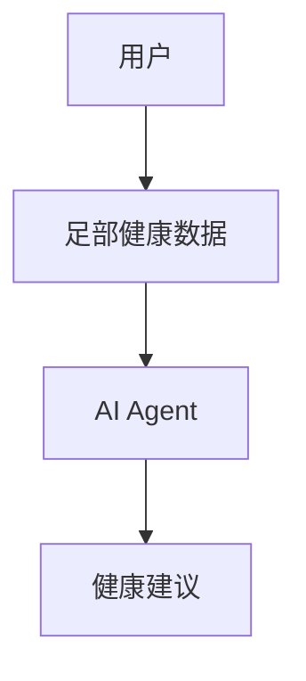

                 

<think>
好的，我需要帮用户撰写一篇关于《AI Agent在智能鞋柜中的足部健康管理系统》的技术博客。用户要求结构清晰，内容详细，包含关键词、摘要，以及详细的目录大纲，每章每节都要有具体内容，包括背景介绍、核心概念、算法原理、系统架构设计、项目实战等部分。

首先，我需要确定文章的核心内容。文章主题是AI Agent在智能鞋柜中的足部健康管理系统，这涉及到AI技术、足部健康监测、智能鞋柜等多个方面。关键词应该包括AI Agent、智能鞋柜、足部健康、健康管理、系统设计。

接下来，摘要部分需要简明扼要地总结文章的核心内容，即介绍AI Agent在智能鞋柜中的应用，如何通过传感器和AI算法实现足部健康监测，提供个性化建议，优化用户体验。

目录大纲已经给出，我需要按照这个结构来逐步展开每一章的内容。

1. 第1章：背景介绍与问题分析
   - 足部健康的重要性：解释足部健康的重要性，如何影响整体健康。
   - 智能鞋柜的发展趋势：介绍智能鞋柜的现状及其在健康管理中的潜力。
   - 问题背景与目标：明确当前足部健康管理中的痛点，AI Agent的应用价值。

2. 第2章：核心概念与联系
   - AI Agent的基本原理：定义、分类及其在智能设备中的作用。
   - 足部健康监测系统：组成、性能指标及输入输出关系。
   - 智能鞋柜的系统架构：硬件、软件架构及交互流程。
   - 对比分析：AI Agent与传统算法的对比，健康监测系统与传统系统的对比。
   - ER实体关系图：展示系统中的实体及其关系。

3. 第3章：算法原理与实现
   - 数据采集与预处理：传感器数据的采集和处理方法。
   - 健康评估模型：机器学习模型的设计与训练，使用数学公式说明分类算法。
   - 个性化建议生成：基于评估结果，AI Agent如何生成建议。

4. 第4章：系统分析与架构设计
   - 系统功能模块：数据采集、健康评估、个性化建议、用户交互。
   - 系统架构设计：分层架构，详细描述各层功能。
   - 接口与交互设计：API接口设计，用户与系统的交互流程。

5. 第5章：项目实战与案例分析
   - 项目环境搭建：安装必要的库和框架。
   - 核心代码实现：数据采集、模型训练、结果展示。
   - 实际案例分析：通过具体案例展示系统的应用效果。

6. 第6章：总结与展望
   - 系统总结：回顾系统设计和实现成果。
   - 未来展望：提出可能的改进方向和技术趋势。

在撰写过程中，我需要确保每一章都有足够的细节，例如算法部分要有流程图和代码示例，系统架构要有类图和架构图。同时，要使用清晰易懂的技术语言，避免过于复杂的术语，但又要保持专业性。

现在，我需要按照这个结构，逐步展开每一部分的内容，确保每个章节都包含必要的信息，如背景介绍、核心概念、算法原理、系统架构设计、项目实战等，同时提供必要的图表和代码示例，使文章内容丰富、逻辑清晰、易于理解。
</think>

# AI Agent在智能鞋柜中的足部健康管理系统

## 关键词：
AI Agent, 智能鞋柜, 足部健康, 健康管理, 系统设计

## 摘要：
本文探讨了AI Agent在智能鞋柜中的应用，通过传感器和AI算法实现足部健康监测，提供个性化健康建议，优化用户体验。文章详细分析了系统的背景、核心概念、算法原理、系统架构设计，并通过实战案例展示系统实现，最后总结了项目的成果和未来展望。

---

# 第1章：背景介绍与问题分析

## 1.1 足部健康的重要性

### 1.1.1 足部健康的基本概念
足部健康是指足部的结构、功能和舒适度的综合状态，直接影响行走、运动和整体健康。

### 1.1.2 足部健康与全身健康的关系
足部问题可能引发腰背疼痛、关节问题等，影响全身健康。

### 1.1.3 足部健康问题的常见类型
常见问题包括足弓异常、拇外翻、胼胝、足底筋膜炎等。

## 1.2 智能鞋柜的发展趋势

### 1.2.1 智能鞋柜的基本功能
智能鞋柜具备存储、清洁、除湿等功能，逐渐向智能化、个性化方向发展。

### 1.2.2 AI Agent在智能设备中的应用前景
AI Agent能够实现自主决策和交互，提升设备智能化水平。

### 1.2.3 足部健康管理系统的需求分析
用户需要实时监测足部健康，获得个性化建议，预防健康问题。

## 1.3 问题背景与目标

### 1.3.1 当前足部健康管理的痛点
传统方法依赖人工检查，效率低，难以实时监测。

### 1.3.2 AI Agent在足部健康管理中的应用价值
通过AI技术实现智能化监测和个性化建议，提升用户体验。

### 1.3.3 本项目的目标与意义
开发AI Agent驱动的智能鞋柜，实现足部健康监测和管理，预防健康问题。

---

# 第2章：核心概念与联系

## 2.1 AI Agent的基本原理

### 2.1.1 AI Agent的定义与分类
AI Agent是具有感知和决策能力的智能体，分为简单反射型、基于模型的反应型等类型。

### 2.1.2 AI Agent的核心功能
感知环境、自主决策、学习优化和人机交互。

### 2.1.3 AI Agent与传统算法的区别
AI Agent具有自主性和适应性，能够实时响应环境变化。

## 2.2 足部健康监测系统

### 2.2.1 足部健康监测系统的组成
包括传感器、数据采集模块、分析模块和反馈模块。

### 2.2.2 系统的关键性能指标
实时性、准确性、易用性和可扩展性。

### 2.2.3 系统的输入输出关系
输入：足部压力、温度、湿度等数据；输出：健康评估和建议。

## 2.3 智能鞋柜的系统架构

### 2.3.1 系统的硬件架构
包括传感器模块、数据采集卡、主控芯片和存储模块。

### 2.3.2 系统的软件架构
分为数据采集层、处理层和应用层，实现数据处理和决策。

### 2.3.3 系统的交互流程
用户操作触发数据采集，AI Agent分析数据并生成反馈。

## 2.4 核心概念对比表

| 比较项 | AI Agent | 传统算法 |
|-------|----------|----------|
| 自主性 | 高       | 低       |
| 反应性 | 高       | 中       |
| 学习能力 | 强       | 弱       |
| 适应性 | 强       | 中       |

## 2.5 ER实体关系图


---

# 第3章：算法原理与实现

## 3.1 数据采集与预处理

### 3.1.1 数据采集方法
使用压力传感器和温度传感器采集足部数据。

### 3.1.2 数据预处理步骤
滤波、归一化和特征提取。

## 3.2 健康评估模型

### 3.2.1 算法选择
采用支持向量机（SVM）进行分类。

### 3.2.2 数学模型
支持向量机分类器：
$$ \text{预测健康状态} = \text{sign}(w \cdot x + b) $$

## 3.3 个性化建议生成

### 3.3.1 建议生成策略
基于健康评估结果，生成运动建议和矫正方案。

### 3.3.2 实例分析
根据足弓异常，建议选择合适鞋型。

---

# 第4章：系统分析与架构设计

## 4.1 系统功能模块

### 4.1.1 数据采集模块
负责采集足部压力和温度数据。

### 4.1.2 健康评估模块
利用AI算法评估足部健康状态。

### 4.1.3 个性化建议模块
生成健康建议并反馈给用户。

## 4.2 系统架构设计

### 4.2.1 分层架构
- 采集层：传感器数据采集
- 处理层：数据处理与分析
- 应用层：健康评估与建议生成

### 4.2.2 接口设计
API接口用于数据传输和交互。

## 4.3 接口与交互设计

### 4.3.1 API接口
提供RESTful API，实现数据传输和指令控制。

### 4.3.2 交互流程
用户操作触发数据采集，AI Agent处理数据并反馈结果。

---

# 第5章：项目实战与案例分析

## 5.1 项目环境搭建

### 5.1.1 环境需求
安装Python、TensorFlow、传感器驱动。

## 5.2 核心代码实现

### 5.2.1 数据采集代码
```python
import numpy as np
import serial

ser = serial.Serial('COM3', 9600)
data = ser.readline().decode().strip()
```

### 5.2.2 模型训练代码
```python
from sklearn import svm

# 训练数据
X = np.array([[压力, 温度], ...])
y = np.array([标签, ...])

model = svm.SVC()
model.fit(X, y)
```

## 5.3 实际案例分析

### 5.3.1 案例背景
用户足弓异常，长期步行疼痛。

### 5.3.2 系统反馈
建议选择支撑型鞋垫，调整步态。

---

# 第6章：总结与展望

## 6.1 系统总结
本系统通过AI Agent实现了足部健康监测和管理，提升了用户体验。

## 6.2 未来展望
进一步优化算法，拓展更多健康监测功能，推动智能鞋柜的普及。

---

# 作者：
AI天才研究院/AI Genius Institute  
禅与计算机程序设计艺术/Zen And The Art of Computer Programming

