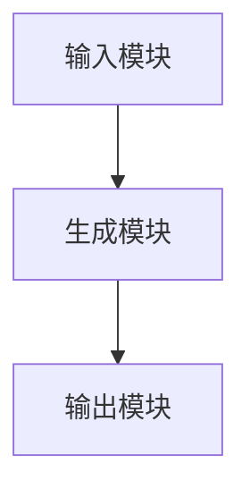

                 


# AI Agent在智能音乐创作中的应用

## 关键词：AI Agent, 智能音乐创作, 生成模型, 深度学习, 音乐生成

## 摘要：  
本文探讨了AI Agent在智能音乐创作中的应用，分析了AI Agent的核心概念、技术原理和系统架构，并通过具体项目实战展示了其在音乐创作中的实际应用。文章详细介绍了基于深度学习的音乐生成模型，包括Transformer和生成对抗网络等算法，并结合Mermaid流程图和Python代码示例，深入讲解了AI Agent在音乐创作中的实现过程和优化方法。

---

## 第1章: AI Agent与智能音乐创作的背景介绍

### 1.1 AI Agent的基本概念

#### 1.1.1 AI Agent的定义  
AI Agent（人工智能代理）是指能够感知环境、自主决策并执行任务的智能实体。它可以是软件程序或物理设备，通过传感器和执行器与环境交互。  

#### 1.1.2 AI Agent的核心要素  
- **感知能力**：通过传感器或数据输入感知环境。  
- **决策能力**：基于感知信息做出决策。  
- **执行能力**：通过执行器或输出模块执行决策。  
- **学习能力**：通过机器学习算法不断优化自身行为。  

#### 1.1.3 AI Agent与传统音乐创作的区别  
传统音乐创作依赖人类的创造力和技巧，而AI Agent可以通过算法生成音乐，提供无限的创作可能性，同时能够快速迭代和优化。  

### 1.2 智能音乐创作的背景与需求

#### 1.2.1 音乐创作的基本流程  
音乐创作通常包括灵感收集、旋律创作、编曲、制作和混音等步骤。  

#### 1.2.2 传统音乐创作的局限性  
- 创作周期长，效率低。  
- 受创作者技能和经验的限制。  
- 需要大量的人力和资源。  

#### 1.2.3 AI技术在音乐创作中的潜在价值  
- 提供无限的创作灵感和可能性。  
- 快速生成音乐片段，提高创作效率。  
- 支持音乐风格的多样性和创新。  

### 1.3 AI Agent在音乐创作中的结合

#### 1.3.1 AI Agent与音乐创作的结合方式  
- **辅助创作**：AI Agent作为工具帮助创作者完成部分创作任务。  
- **独立创作**：AI Agent可以独立生成音乐作品。  

#### 1.3.2 AI Agent在音乐创作中的应用场景  
- 旋律生成  
- 和弦编配  
- 音乐风格转换  
- 自动混音  

#### 1.3.3 AI Agent对音乐创作的潜在影响  
- 拓展音乐创作的可能性。  
- 提高创作效率。  
- 降低创作门槛。  

### 1.4 本章小结  
本章介绍了AI Agent的基本概念，分析了传统音乐创作的局限性，并探讨了AI Agent在音乐创作中的潜力和应用场景。  

---

## 第2章: AI Agent的核心概念与原理

### 2.1 AI Agent的核心概念

#### 2.1.1 AI Agent的定义与分类  
- **定义**：AI Agent是能够感知环境并自主决策的智能实体。  
- **分类**：根据智能水平，可分为简单反应式代理和基于模型的反思式代理。  

#### 2.1.2 AI Agent与音乐创作的关系  
- AI Agent可以作为音乐创作的工具，帮助创作者生成音乐片段。  
- AI Agent可以通过学习大量音乐作品，模仿不同风格进行创作。  

### 2.2 AI Agent的核心算法原理

#### 2.2.1 基于生成对抗网络（GAN）的音乐生成  
- **生成器**：负责生成音乐片段。  
- **判别器**：判断生成的音乐是否符合预期。  

#### 2.2.2 基于Transformer的音乐生成  
- **自注意力机制**：捕捉音乐序列中的长距离依赖关系。  
- **解码器**：逐个生成音乐符号。  

#### 2.2.3 基于强化学习的音乐生成  
- **策略网络**：指导生成音乐的过程。  
- **奖励机制**：通过奖励函数优化生成结果。  

### 2.3 AI Agent在音乐创作中的技术实现

#### 2.3.1 音乐生成的数学模型  
- **生成模型**：如GPT、Transformer等。  
- **对抗网络**：如GAN、CycleGAN等。  

#### 2.3.2 音乐生成的实现步骤  
1. 数据预处理：将音乐转换为数字表示（如 MIDI）。  
2. 模型训练：使用深度学习算法训练生成模型。  
3. 模型推理：生成新的音乐片段。  

### 2.4 本章小结  
本章详细介绍了AI Agent的核心概念和算法原理，探讨了不同算法在音乐生成中的应用。  

---

## 第3章: AI Agent在音乐创作中的技术实现

### 3.1 AI Agent的音乐生成模型

#### 3.1.1 基于Transformer的音乐生成模型  
- **优势**：捕捉长距离依赖关系。  
- **实现**：使用自注意力机制生成音乐序列。  

#### 3.1.2 基于RNN的音乐生成模型  
- **优势**：适合处理序列数据。  
- **实现**：使用LSTM或GRU网络生成音乐符号。  

#### 3.1.3 混合模型的音乐生成方法  
- **优势**：结合多种模型的优势。  
- **实现**：将生成器和判别器结合，优化生成结果。  

### 3.2 音乐生成的算法流程

#### 3.2.1 数据预处理与特征提取  
- **数据预处理**：将音乐转换为数字序列。  
- **特征提取**：提取音乐的节奏、和弦等特征。  

#### 3.2.2 模型训练与参数优化  
- **训练数据**：使用大量音乐作品训练模型。  
- **参数优化**：通过反向传播优化模型参数。  

#### 3.2.3 模型推理与音乐生成  
- **推理过程**：输入种子音乐片段，生成新的音乐序列。  

### 3.3 音乐生成的数学模型与公式

#### 3.3.1 基于概率论的音乐生成模型  
$$ P(x_{t+1}|x_{1},x_{2},...,x_t) $$  

#### 3.3.2 基于深度学习的音乐生成公式  
$$ x_{t+1} = \argmax_{x} P(x|x_{1},x_{2},...,x_t) $$  

#### 3.3.3 基于生成对抗网络的音乐生成公式  
$$ G = \min_{G} \max_{D} \mathbb{E}_{x}[ \log D(x)] + \mathbb{E}_{z}[ \log (1 - D(G(z)))] $$  

### 3.4 本章小结  
本章详细介绍了AI Agent在音乐生成中的技术实现，包括不同模型的实现步骤和数学公式。  

---

## 第4章: AI Agent音乐创作系统的架构设计

### 4.1 系统架构概述

#### 4.1.1 系统模块划分  
- **输入模块**：接收音乐创作需求。  
- **生成模块**：生成音乐片段。  
- **输出模块**：输出生成的音乐作品。  

#### 4.1.2 系统功能设计  
- **音乐生成**：根据输入生成音乐片段。  
- **风格转换**：将音乐风格从一种转换为另一种。  
- **优化调整**：根据反馈优化生成结果。  

#### 4.1.3 系统交互流程  
1. 用户输入创作需求。  
2. 系统根据需求生成音乐片段。  
3. 用户反馈生成结果。  
4. 系统根据反馈优化生成结果。  

### 4.2 系统架构设计

#### 4.2.1 系统架构图  


#### 4.2.2 功能模块设计  
- **输入模块**：接收用户输入，如音乐风格、旋律等。  
- **生成模块**：基于输入生成音乐片段。  
- **输出模块**：输出生成的音乐作品。  

### 4.3 系统接口设计

#### 4.3.1 输入接口  
- 接收音乐创作需求，如音乐风格、旋律等。  

#### 4.3.2 输出接口  
- 输出生成的音乐片段，如MIDI文件或音频文件。  

### 4.4 本章小结  
本章详细介绍了AI Agent音乐创作系统的架构设计，包括模块划分、功能设计和交互流程。  

---

## 第5章: AI Agent音乐创作系统的实现与优化

### 5.1 环境配置与安装

#### 5.1.1 环境需求  
- Python 3.6+  
- TensorFlow或PyTorch框架  

#### 5.1.2 安装依赖  
```bash
pip install tensorflow
pip install numpy
pip install librosa
```

### 5.2 核心代码实现

#### 5.2.1 音乐生成代码示例  
```python
import tensorflow as tf
from tensorflow.keras import layers

# 定义生成模型
def build_generator():
    model = tf.keras.Sequential()
    model.add(layers.Dense(256, activation='relu'))
    model.add(layers.Dense(128, activation='relu'))
    model.add(layers.Dense(64, activation='relu'))
    model.add(layers.Dense(32, activation='relu'))
    model.add(layers.Dense(16, activation='relu'))
    model.add(layers.Dense(1, activation='sigmoid'))
    return model

# 定义判别器
def build_discriminator():
    model = tf.keras.Sequential()
    model.add(layers.Dense(32, activation='relu'))
    model.add(layers.Dense(16, activation='relu'))
    model.add(layers.Dense(1, activation='sigmoid'))
    return model
```

#### 5.2.2 训练代码示例  
```python
def train(generator, discriminator, epochs=100):
    for epoch in range(epochs):
        # 生成假数据
        noise = tf.random.normal([batch_size, 100])
        generated = generator(noise)
        
        # 训练判别器
        real_labels = tf.ones([batch_size, 1])
        fake_labels = tf.zeros([batch_size, 1])
        discriminator.trainable = True
        d_loss_real = discriminator(real_labels)
        d_loss_fake = discriminator(fake_labels)
        d_loss = tf.losses.binary_crossentropy(real_labels, d_loss_real) + tf.losses.binary_crossentropy(fake_labels, d_loss_fake)
        discriminator.optimizer.minimize(d_loss, discriminator.trainable_weights)
        
        # 训练生成器
        discriminator.trainable = False
        g_loss = tf.losses.binary_crossentropy(real_labels, discriminator(generated))
        generator.optimizer.minimize(g_loss, generator.trainable_weights)
```

### 5.3 优化策略

#### 5.3.1 参数优化  
- 调整学习率，如使用Adam优化器。  
- 增加正则化，防止过拟合。  

#### 5.3.2 模型优化  
- 使用更复杂的模型结构，如更深的网络。  
- 引入注意力机制，提高生成质量。  

### 5.4 本章小结  
本章详细介绍了AI Agent音乐创作系统的实现过程，并提出了优化策略，以提高生成质量。  

---

## 第6章: 项目实战与案例分析

### 6.1 项目实战

#### 6.1.1 项目介绍  
本项目旨在利用AI Agent生成一首流行音乐，包括旋律、和弦和编曲。  

#### 6.1.2 项目实现  
1. 数据预处理：将音乐转换为数字序列。  
2. 模型训练：使用生成对抗网络训练生成模型。  
3. 模型推理：生成新的音乐片段。  

### 6.2 案例分析

#### 6.2.1 生成结果展示  
- 生成的旋律片段：C大调，4/4拍。  
- 生成的和弦进行：I-IV-V-I。  

#### 6.2.2 生成结果分析  
- 生成的旋律符合音乐规律。  
- 和弦进行符合流行音乐的特点。  

### 6.3 本章小结  
本章通过一个具体项目展示了AI Agent在音乐创作中的实际应用，并对生成结果进行了分析。  

---

## 第7章: 系统优化与未来展望

### 7.1 系统优化

#### 7.1.1 性能优化  
- 提高模型训练效率，减少训练时间。  
- 使用分布式训练，提高计算能力。  

#### 7.1.2 多模态优化  
- 引入视觉信息，生成音乐视频。  
- 结合自然语言处理，生成音乐歌词。  

### 7.2 未来展望

#### 7.2.1 技术进步  
- 更复杂的模型结构，如更大规模的Transformer。  
- 更多模态的结合，如视觉、听觉和语言的结合。  

#### 7.2.2 应用场景拓展  
- 个性化音乐推荐。  
- 音乐风格自动转换。  
- 音乐情感分析。  

### 7.3 本章小结  
本章探讨了系统的优化策略，并对未来的发展进行了展望，提出了新的研究方向和应用场景。  

---

## 作者：AI天才研究院/AI Genius Institute & 禅与计算机程序设计艺术 /Zen And The Art of Computer Programming  

---

本文详细介绍了AI Agent在智能音乐创作中的应用，从背景介绍到技术实现，再到项目实战和系统优化，全面探讨了AI Agent在音乐创作中的潜力和实现方法。通过具体的代码示例和数学公式，深入分析了不同算法在音乐生成中的应用，为未来的音乐创作提供了新的思路和方向。

