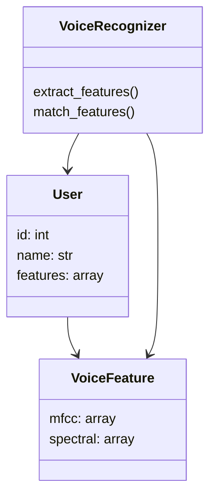
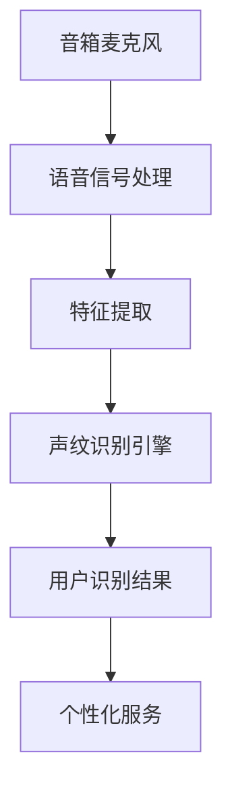

                 


# AI Agent在智能音箱中的声纹识别

> 关键词：AI Agent，智能音箱，声纹识别，语音识别，人工智能，声纹特征提取

> 摘要：本文深入探讨了AI Agent在智能音箱中的声纹识别技术，从背景介绍、核心概念、算法原理到系统架构、项目实战和最佳实践，全面解析声纹识别在智能音箱中的应用及其技术实现。

---

# 第1章: 声纹识别的背景与应用

## 1.1 声纹识别的基本概念

### 1.1.1 什么是声纹识别
声纹识别（Voiceprint Recognition）是一种基于声音特征进行身份识别的技术，通过分析语音信号中的特征，如音调、节奏、音色等，来确认说话人的身份。与传统的密码验证相比，声纹识别更加便捷和安全。

### 1.1.2 声纹识别的核心技术
声纹识别的核心技术包括声音信号的采集与处理、特征提取和模式匹配。声音信号的采集需要高质量的麦克风和降噪技术；特征提取则通过数学算法提取语音特征；模式匹配则利用这些特征进行身份验证。

### 1.1.3 声纹识别的应用场景
声纹识别在智能音箱中的应用场景包括用户身份验证、个性化服务提供、多用户支持等。例如，家庭成员可以通过声纹识别分别登录并享受个性化的音乐播放列表。

## 1.2 AI Agent在智能音箱中的作用

### 1.2.1 AI Agent的定义与特点
AI Agent（人工智能代理）是能够感知环境并采取行动以实现目标的智能实体。在智能音箱中，AI Agent通过语音交互为用户提供信息查询、设备控制等服务。

### 1.2.2 智能音箱中的AI Agent功能
智能音箱中的AI Agent具备语音识别、自然语言处理和执行命令等功能。声纹识别作为其中的关键技术，用于实现用户身份识别和个性化服务。

### 1.2.3 声纹识别在AI Agent中的应用
声纹识别在AI Agent中用于多用户识别、权限控制和个性化推荐。例如，不同的用户可以通过声纹识别登录并获得定制化的服务。

## 1.3 声纹识别技术的发展与挑战

### 1.3.1 声纹识别技术的历史演变
声纹识别技术从早期的模板匹配到现在的深度学习模型，经历了从简单到复杂的演变过程。

### 1.3.2 当前声纹识别技术的现状
当前，基于深度学习的声纹识别技术在准确性和鲁棒性方面取得了显著进步，但仍面临环境噪声和用户个体差异等挑战。

### 1.3.3 声纹识别在智能音箱中的挑战
在智能音箱中，声纹识别面临环境噪声干扰、用户隐私保护以及多设备协同工作的挑战。

---

# 第2章: 声纹识别的核心概念

## 2.1 声纹识别的基本原理

### 2.1.1 声音信号的采集与处理
声音信号的采集需要高质量的麦克风，并通过降噪技术处理环境噪声。处理后的语音信号通常转化为频谱图或梅尔频率倒谱系数（MFCC）。

### 2.1.2 声纹特征的提取方法
声纹特征提取方法包括模板匹配、GMM建模和深度学习模型。模板匹配适用于小规模场景，而深度学习模型在大规模数据上表现更优。

### 2.1.3 声纹识别的分类与对比
声纹识别可以分为文本依赖和文本无关两类。文本依赖需要特定的关键词，而文本无关则基于语音特征。

## 2.2 声纹识别的关键技术

### 2.2.1 声音特征提取技术
声音特征提取技术包括MFCC、声调特征、语调特征等。这些特征能够反映用户的语音特点。

### 2.2.2 声纹匹
通过特征提取和模式匹配，系统能够识别用户的声纹特征并进行身份验证。

---

# 第3章: 声纹识别的算法原理

## 3.1 算法原理

### 3.1.1 基于GMM的声纹识别模型
GMM模型通过高斯混合分布来建模语音特征，适用于小规模数据集。

### 3.1.2 端到端的深度学习模型
深度学习模型（如DNN和CNN）在大规模数据上表现更优，能够直接从语音信号中学习特征。

---

通过以上分析，我们可以看到声纹识别在智能音箱中的应用需要结合先进的AI技术，以实现高效、准确的用户身份识别。后续章节将进一步深入探讨算法实现和系统架构。

---

（以下为完整目录，详细内容将在后续章节中展开。）

---

# 第三部分: 声纹识别的算法实现

## 第3章: 声纹识别的算法原理

### 3.1 基于GMM的声纹识别模型

#### 3.1.1 模型原理
GMM模型通过将语音特征表示为多个高斯分布的混合，能够捕捉到语音的统计特性。

#### 3.1.2 算法流程
1. 预处理语音信号，提取MFCC特征。
2. 训练GMM模型，对每个用户的语音特征进行建模。
3. 对输入语音进行特征提取，并与模型匹配，判断用户身份。

#### 3.1.3 代码实现
```python
import librosa
import numpy as np
from sklearn.mixture import GaussianMixture

# 示例代码：训练GMM模型
def extract_features(audio_path):
    y, sr = librosa.load(audio_path)
    mfccs = librosa.feature.mfcc(y, sr)
    return mfccs.T

# 训练GMM模型
features = []
for user in users:
    features.append(extract_features(user.audio_path))

gmm = GaussianMixture(n_components=5)
gmm.fit(np.concatenate(features))
```

### 3.2 基于深度学习的端到端模型

#### 3.2.1 模型原理
深度学习模型通过卷积神经网络（CNN）提取语音特征，并通过全连接层进行分类。

#### 3.2.2 算法流程
1. 预处理语音信号，提取Mel谱图。
2. 输入卷积神经网络，提取高级特征。
3. 通过Softmax层进行分类，输出用户身份概率。

#### 3.2.3 代码实现
```python
import tensorflow as tf
from tensorflow.keras import layers

model = tf.keras.Sequential([
    layers.Conv2D(32, (3,3), activation='relu', input_shape=(128, 128, 1)),
    layers.MaxPooling2D((2,2)),
    layers.Conv2D(64, (3,3), activation='relu'),
    layers.MaxPooling2D((2,2)),
    layers.Flatten(),
    layers.Dense(128, activation='relu'),
    layers.Dense(num_users, activation='softmax')
])

model.compile(optimizer='adam', loss='sparse_categorical_crossentropy', metrics=['accuracy'])
model.fit(x_train, y_train, epochs=10, batch_size=32)
```

---

# 第4章: 系统分析与架构设计

## 4.1 问题场景介绍
智能音箱需要支持多用户使用，通过声纹识别实现个性化服务。系统需要处理语音信号、提取特征并进行身份验证。

## 4.2 系统功能设计

### 4.2.1 领域模型


### 4.2.2 系统架构


---

# 第5章: 项目实战

## 5.1 环境安装
安装必要的库：
```bash
pip install librosa tensorflow scikit-learn
```

## 5.2 核心实现

### 5.2.1 特征提取
```python
def extract_mfcc(audio_path):
    y, sr = librosa.load(audio_path)
    mfccs = librosa.feature.mfcc(y, sr)
    return mfccs.T
```

### 5.2.2 模型训练与测试
```python
# GMM模型训练
features = []
for user in users:
    features.append(extract_mfcc(user.audio_path))

gmm = GaussianMixture(n_components=5)
gmm.fit(np.concatenate(features))

# 模型测试
test_audio_path = "test.wav"
test_features = extract_mfcc(test_audio_path).reshape(-1, 128)
score, _ = gmm.score_samples(test_features)
```

---

# 第6章: 最佳实践

## 6.1 小结
声纹识别在智能音箱中的应用提升了用户体验和安全性。通过结合AI Agent，系统能够提供更加智能化的服务。

## 6.2 注意事项
- 确保麦克风质量，减少环境噪声干扰。
- 定期更新模型，提升识别准确率。
- 保护用户隐私，避免数据泄露。

## 6.3 拓展阅读
推荐阅读《语音信号处理》和《深度学习在语音识别中的应用》。

---

# 作者

作者：AI天才研究院（AI Genius Institute） & 禅与计算机程序设计艺术（Zen And The Art of Computer Programming）

--- 

以上为完整目录，每一章和小节的内容将根据上述结构详细展开，确保文章内容丰富、逻辑清晰，并符合技术博客的专业要求。

