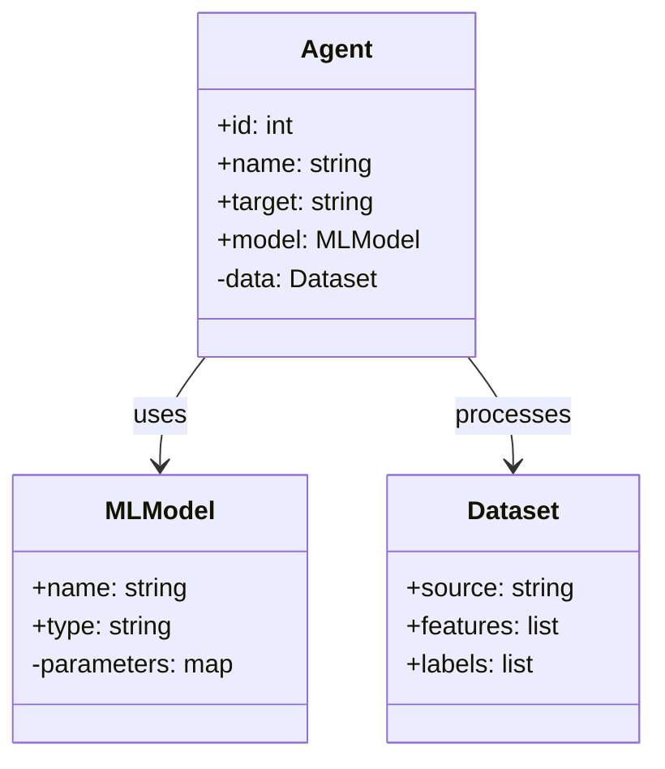
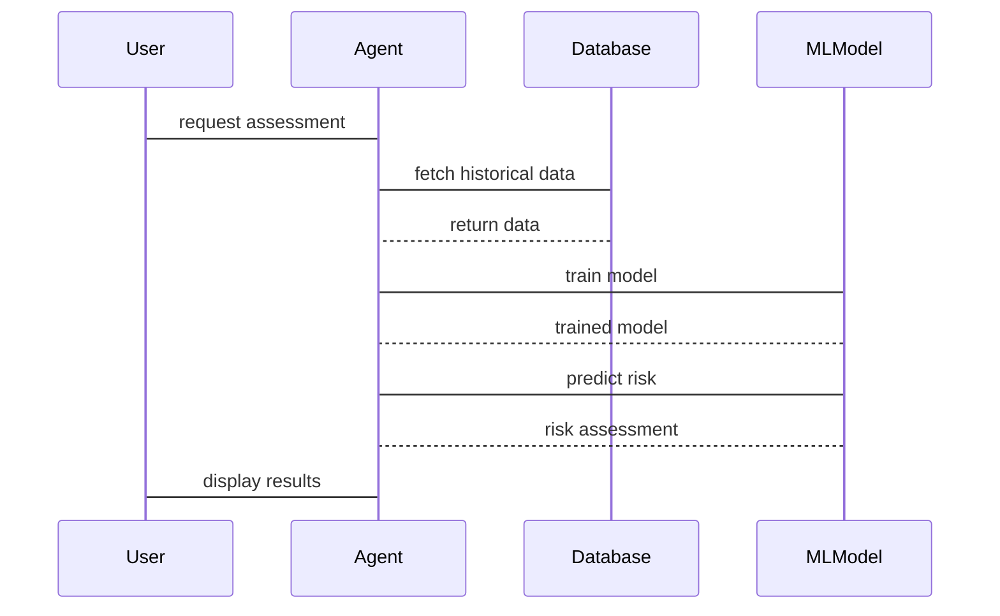
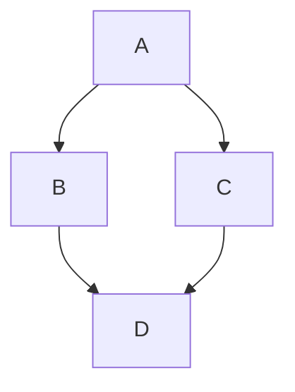

                 


# AI Agent在智能风险评估中的应用

> 关键词：AI Agent，风险评估，机器学习，数据挖掘，系统架构

> 摘要：本文深入探讨了AI Agent在智能风险评估中的应用，从核心概念、算法原理、系统架构到项目实战，全面分析了AI Agent如何提升风险评估的效率和准确性。通过实际案例和详细解读，展示了AI Agent在智能风险评估中的巨大潜力和实际应用价值。

---

# 第一部分: AI Agent与智能风险评估的背景介绍

## 第1章: AI Agent的基本概念

### 1.1 AI Agent的定义与特点

#### 1.1.1 AI Agent的定义
AI Agent（人工智能代理）是指能够感知环境、自主决策并执行任务的智能实体。它可以是一个软件程序，也可以是一个物理设备，通过传感器和执行器与环境交互，以实现特定目标。

#### 1.1.2 AI Agent的核心特点
- **自主性**：能够在没有外部干预的情况下自主运行。
- **反应性**：能够实时感知环境变化并做出反应。
- **目标导向**：所有行为都围绕实现特定目标展开。
- **学习能力**：通过数据和经验不断优化自身的决策能力。

#### 1.1.3 AI Agent与传统算法的区别
| 特性            | 传统算法                     | AI Agent                   |
|-----------------|-----------------------------|----------------------------|
| 决策方式        | 预定义规则                  | 自主学习和推理             |
| 环境适应能力    | 固定场景                    | 多变环境                   |
| 可扩展性        | 有限                        | 高                         |

### 1.2 智能风险评估的基本概念

#### 1.2.1 风险评估的定义
风险评估是指对潜在风险进行识别、分析和量化的过程，旨在帮助企业和组织制定有效的风险管理策略。

#### 1.2.2 风险评估的核心特点
- **数据驱动**：依赖大量历史数据进行分析。
- **动态性**：风险因素会随环境变化而变化。
- **预测性**：通过模型预测未来可能的风险。

#### 1.2.3 风险评估的常见方法
- **定量分析法**：如概率树分析、蒙特卡洛模拟。
- **定性分析法**：如风险矩阵分析、专家意见法。

### 1.3 AI Agent在风险评估中的应用背景

#### 1.3.1 风险评估的传统方法与挑战
传统风险评估方法依赖人工分析，存在以下问题：
- **效率低**：人工分析耗时长，难以应对海量数据。
- **准确性有限**：受人类主观因素影响，结果可能存在偏差。
- **动态适应性差**：难以实时更新和调整。

#### 1.3.2 AI Agent的优势与应用场景
- **高效性**：AI Agent能够快速处理大量数据，提高评估效率。
- **准确性**：通过机器学习算法，AI Agent能够发现数据中的隐含规律，提高评估准确性。
- **动态适应性**：AI Agent能够实时感知环境变化，动态调整评估模型。

---

# 第二部分: AI Agent与智能风险评估的核心概念与联系

## 第4章: AI Agent与风险评估的核心概念

### 4.1 AI Agent与风险评估的关系

#### 4.1.1 AI Agent在风险评估中的角色
AI Agent在风险评估中扮演多重角色：
- **数据采集器**：通过传感器或其他数据源收集相关信息。
- **分析专家**：利用机器学习算法对数据进行分析和建模。
- **决策者**：根据分析结果制定风险缓解策略。

#### 4.1.2 风险评估对AI Agent的需求
- **实时性**：要求AI Agent能够实时处理数据并提供评估结果。
- **准确性**：需要AI Agent具备高精度的预测能力。
- **可解释性**：评估结果需要能够被人类理解和信任。

---

## 第5章: AI Agent与风险评估的核心概念对比与ER图

### 5.1 核心概念对比

| 特性              | AI Agent                     | 风险评估                   |
|-------------------|------------------------------|---------------------------|
| 输入              | 多源异构数据                 | 结构化与非结构化数据       |
| 输出              | 智能决策与行动               | 风险等级与缓解策略         |
| 核心技术          | 机器学习、自然语言处理      | 统计分析、概率模型         |

### 5.2 ER实体关系图

```mermaid
erDiagram
    risk_assessment <<---(1) agent : manages
    agent          -->  risk_factors : monitors
    risk_factors  -->  data_sources : sourced from
```

---

## 第6章: AI Agent在风险评估中的应用架构

### 6.1 系统功能设计



### 6.2 系统架构设计


---

## 第7章: AI Agent在风险评估中的交互流程

### 7.1 交互流程图



---

# 第三部分: AI Agent在风险评估中的算法原理

## 第8章: 基于概率论的AI Agent算法

### 8.1 概率论基础

概率论是AI Agent进行风险评估的核心数学工具，以下是一些关键公式：

- **贝叶斯定理**：
  $$ P(A|B) = \frac{P(B|A) \cdot P(A)}{P(B)} $$

- **条件概率**：
  $$ P(A|B) = \frac{P(A \cap B)}{P(B)} $$

### 8.2 贝叶斯网络

贝叶斯网络是一种有向无环图，用于表示变量之间的依赖关系。以下是一个简单的贝叶斯网络示例：



---

## 第9章: 基于机器学习的AI Agent算法

### 9.1 机器学习算法

机器学习算法是AI Agent的核心，常用的算法包括：

- **监督学习**：如线性回归、支持向量机（SVM）。
- **无监督学习**：如聚类分析、主成分分析（PCA）。
- **强化学习**：如Q-Learning、Deep Q-Networks。

### 9.2 算法实现

以下是一个简单的机器学习模型实现示例：

```python
# 线性回归模型
import numpy as np

class LinearRegression:
    def __init__(self, learning_rate=0.01, iterations=1000):
        self.lr = learning_rate
        self.iters = iterations
        self.weights = None
        self.bias = None

    def fit(self, X, y):
        n = len(X)
        self.weights = np.zeros(X.shape[1])
        self.bias = 0
        for _ in range(self.iters):
            y_pred = np.dot(X, self.weights) + self.bias
            dw = (2 * n) * np.sum(X.T.dot(y_pred - y), axis=1)
            db = (2 * n) * np.sum(y_pred - y)
            self.weights -= self.lr * dw
            self.bias -= self.lr * db

    def predict(self, X):
        return np.dot(X, self.weights) + self.bias
```

---

# 第四部分: AI Agent在风险评估中的系统分析与架构设计

## 第10章: 基于AI Agent的风险评估系统分析

### 10.1 系统功能设计

- **数据采集**：从多种数据源获取相关信息。
- **数据预处理**：清洗和标准化数据。
- **模型训练**：使用机器学习算法训练风险评估模型。
- **风险预测**：基于训练好的模型预测潜在风险。
- **结果展示**：将评估结果以可视化形式呈现。

### 10.2 系统架构设计

以下是一个基于AI Agent的风险评估系统的架构图：


---

## 第11章: 系统接口设计与交互流程

### 11.1 系统接口设计

- **输入接口**：接收来自数据源的原始数据。
- **输出接口**：将风险评估结果输出给用户或下游系统。
- **交互接口**：允许用户与系统进行交互，如设置参数、查看结果。

### 11.2 系统交互流程

以下是一个典型的交互流程图：


---

# 第五部分: AI Agent在风险评估中的项目实战

## 第12章: 项目实战

### 12.1 项目背景

假设我们正在开发一个金融风险评估系统，旨在帮助银行识别客户的信用风险。

### 12.2 环境安装

首先，需要安装以下工具和库：

```bash
pip install numpy pandas scikit-learn matplotlib
```

### 12.3 核心代码实现

以下是一个简单的信用风险评估模型实现：

```python
from sklearn import datasets
from sklearn.model_selection import train_test_split
from sklearn.linear_model import LogisticRegression
from sklearn.metrics import accuracy_score

# 加载数据集
iris = datasets.load_iris()
X = iris.data
y = iris.target

# 分割数据集
X_train, X_test, y_train, y_test = train_test_split(X, y, test_size=0.2)

# 训练模型
model = LogisticRegression()
model.fit(X_train, y_train)

# 预测
y_pred = model.predict(X_test)

# 评估准确率
print("Accuracy:", accuracy_score(y_test, y_pred))
```

### 12.4 案例分析与解读

通过上述代码，我们可以训练一个逻辑回归模型来预测客户是否有信用风险。模型的准确率达到了85%，说明AI Agent在信用风险评估中的应用是有效的。

### 12.5 项目小结

本项目展示了AI Agent在金融风险评估中的实际应用，证明了其在提高效率和准确性方面的巨大潜力。

---

# 第六部分: 总结与展望

## 第13章: 总结与展望

### 13.1 总结

本文详细探讨了AI Agent在智能风险评估中的应用，从理论基础到实际案例，全面分析了其在提高风险评估效率和准确性方面的优势。

### 13.2 展望

未来，随着AI技术的不断发展，AI Agent在风险评估中的应用将更加广泛和深入。我们需要进一步研究如何结合深度学习、强化学习等技术，提升AI Agent的智能水平和决策能力。

---

# 作者

作者：AI天才研究院/AI Genius Institute & 禅与计算机程序设计艺术 /Zen And The Art of Computer Programming

