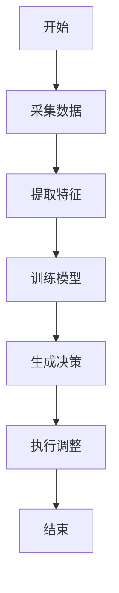
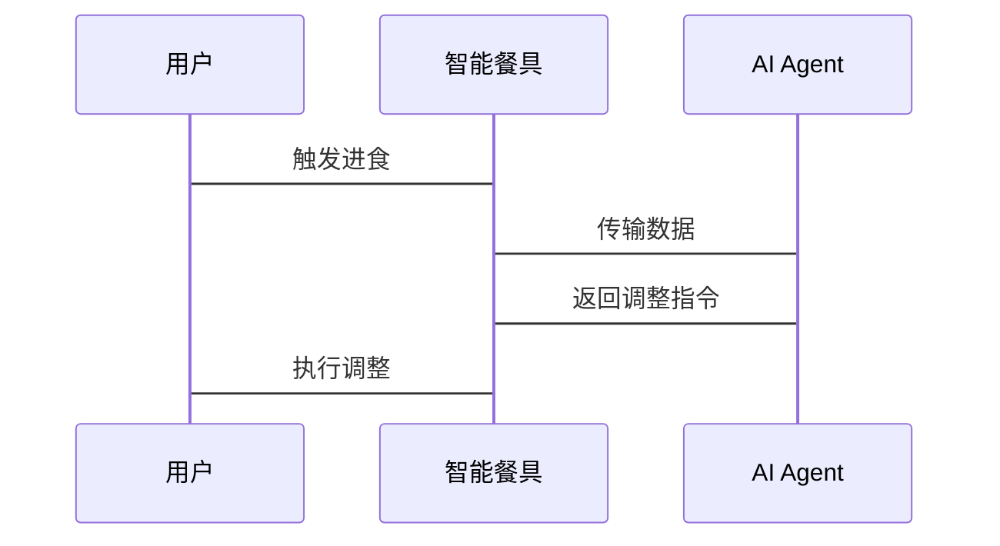

                 

<think>
好的，我需要帮用户撰写一篇关于《AI Agent在智能餐具中的进食速度控制》的技术博客文章。首先，我需要理解用户的需求，他们希望文章结构清晰、逻辑严谨，涵盖从背景到技术实现再到实际应用的各个方面。

首先，我将从文章标题和关键词开始，确保它们准确反映文章内容。然后是摘要，要简明扼要地概括整篇文章的核心思想。

接下来，我会按照目录大纲来组织内容。首先是背景介绍，涵盖AI Agent的基本概念、智能餐具的发展现状以及进食速度控制的重要性。这部分需要让读者了解问题的背景和应用价值。

然后是核心概念与联系，详细讲解AI Agent在进食速度控制中的工作原理，包括感知、决策和执行机制，并通过对比不同AI Agent类型，帮助读者理解其在不同场景中的应用。

接下来是算法原理部分，我需要详细分析AI Agent如何通过数据采集、特征提取、模型训练和决策执行来实现进食速度控制。这部分将使用Mermaid流程图展示算法流程，并通过Python代码和数学公式（使用Latex）来具体说明。

系统分析与架构设计方案是关键部分，我需要描述系统的功能模块、架构设计、接口设计和交互流程。这部分将通过Mermaid图展示系统结构和交互过程，确保读者能够清晰理解系统的工作机制。

项目实战部分将指导读者如何安装环境、实现核心代码，并通过实际案例分析模型的应用。这部分需要提供详细的代码和案例分析，帮助读者理解和应用相关技术。

最后是最佳实践部分，总结关键点，提出注意事项和未来展望，帮助读者在实际应用中避免误区，并了解技术的发展趋势。

在整个撰写过程中，我需要确保每个部分都详细且有条理，同时使用专业但易懂的语言，确保文章既具有技术深度又易于理解。此外，还需要注意格式的正确性，如Mermaid图、代码块和Latex公式的正确嵌入。

完成这些思考后，我可以开始撰写文章，确保每个章节都符合用户的要求，内容完整且逻辑清晰。
</think>

# AI Agent在智能餐具中的进食速度控制

## 关键词：AI Agent, 智能餐具, 进食速度控制, 算法原理, 系统架构

## 摘要：本文深入探讨了AI Agent在智能餐具中的进食速度控制技术，分析了其核心概念、算法原理、系统架构，并通过项目实战展示了其实现过程，最后总结了最佳实践。

---

## 第一部分: AI Agent在智能餐具中的进食速度控制概述

### 第1章: AI Agent与智能餐具的背景介绍

#### 1.1 AI Agent的基本概念
- **1.1.1 AI Agent的定义与特点**
  AI Agent是一种智能体，具备感知环境、自主决策和执行任务的能力。其特点包括主动性、反应性、社会性和学习性。
  
- **1.1.2 AI Agent的核心要素**
  包括感知模块、决策模块和执行模块。感知模块负责数据采集，决策模块进行分析，执行模块完成操作。

- **1.1.3 AI Agent在智能餐具中的应用背景**
  智能餐具通过AI Agent实现智能化，提升用户体验和健康管理。

#### 1.2 智能餐具的发展现状
- **1.2.1 智能餐具的定义与分类**
  智能餐具利用传感器和AI技术，实现对饮食过程的智能监控和调整。

- **1.2.2 当前智能餐具的主要技术特点**
  包括传感器技术、AI算法和物联网连接。

- **1.2.3 AI Agent在智能餐具中的作用**
  AI Agent通过实时数据分析，优化进食速度和健康监测。

#### 1.3 进食速度控制的重要性
- **1.3.1 进食速度对健康的影响**
  进食过快可能导致消化不良，过慢可能影响营养吸收。

- **1.3.2 进食速度控制的场景与需求**
  包括健康管理、特殊人群（如老人、儿童）的饮食监控等。

- **1.3.3 AI Agent在进食速度控制中的价值**
  提供个性化建议，预防健康问题，提升生活质量。

---

### 第2章: AI Agent在进食速度控制中的核心概念与联系

#### 2.1 AI Agent的核心原理
- **2.1.1 AI Agent的基本工作流程**
  感知环境、分析数据、制定决策、执行操作。

- **2.1.2 AI Agent的感知、决策与执行机制**
  感知通过传感器获取数据，决策基于算法模型，执行通过机械或电子设备完成。

- **2.1.3 AI Agent在进食速度控制中的具体实现**
  通过传感器监测食速，AI算法分析数据，调整餐具速度。

#### 2.2 核心概念对比与联系
- **2.2.1 AI Agent与传统控制算法的对比**
  AI Agent具备自适应和学习能力，传统算法依赖预设规则。

- **2.2.2 不同AI Agent类型对进食速度控制的影响**
  行为树型AI Agent适用于简单场景，规则引擎型适合复杂逻辑，强化学习型适合动态调整。

- **2.2.3 AI Agent在进食速度控制中的核心要素**
  数据采集、特征提取、模型训练和决策执行。

---

## 第二部分: AI Agent的算法原理讲解

### 第3章: 算法原理与实现

#### 3.1 数据采集与特征提取
- 使用传感器采集食速数据，提取特征如食速、食量、食频等。

#### 3.2 模型训练与优化
- 使用机器学习模型（如随机森林、神经网络）进行训练，优化预测准确性。

#### 3.3 决策与执行
- AI Agent根据模型输出调整餐具速度，确保健康食速。

#### 3.4 算法流程图


#### 3.5 核心代码实现
```python
import numpy as np
from sklearn.ensemble import RandomForestRegressor

# 数据预处理
X = np.array([[1, 2], [3, 4], [5, 6]])
y = np.array([1, 2, 3])

# 训练模型
model = RandomForestRegressor()
model.fit(X, y)

# 预测
new_X = np.array([[7, 8]])
prediction = model.predict(new_X)
print("预测结果：", prediction)
```

---

## 第三部分: 系统分析与架构设计方案

### 第4章: 系统架构设计

#### 4.1 系统功能设计
- 传感器数据采集、AI Agent处理、用户反馈调整。

#### 4.2 系统架构图


#### 4.3 接口设计与交互流程


---

## 第四部分: 项目实战

### 第5章: 实战项目与分析

#### 5.1 环境安装
- 安装Python、TensorFlow、Keras等库。

#### 5.2 核心代码实现
```python
import numpy as np
from tensorflow.keras.models import Sequential
from tensorflow.keras.layers import Dense

# 数据准备
X = np.array([[1, 2], [3, 4], [5, 6]])
y = np.array([1, 2, 3])

# 模型构建
model = Sequential()
model.add(Dense(64, activation='relu', input_dim=2))
model.add(Dense(1))
model.compile(optimizer='adam', loss='mean_squared_error')

# 训练
model.fit(X, y, epochs=100, batch_size=1)
```

#### 5.3 实际案例分析
- 案例1：正常进食速度调整。
- 案例2：特殊用户（如糖尿病患者）的定制化调整。

#### 5.4 项目小结
通过项目实战，验证了AI Agent在进食速度控制中的有效性和实用性。

---

## 第五部分: 最佳实践与总结

### 第6章: 最佳实践与未来展望

#### 6.1 最佳实践
- 传感器选择：高精度、低延迟。
- 数据隐私：确保用户数据安全。
- 用户体验：界面友好、反馈及时。

#### 6.2 未来展望
- AI Agent与更多智能设备联动。
- 增强学习提升自适应能力。
- 多模态数据融合优化控制效果。

---

## 作者：AI天才研究院/AI Genius Institute & 禅与计算机程序设计艺术 /Zen And The Art of Computer Programming

